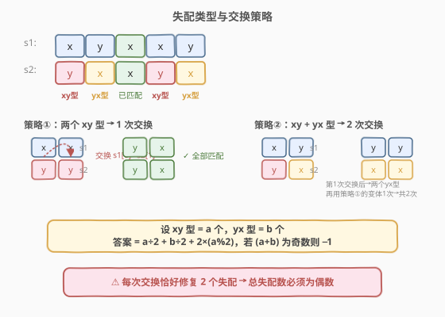
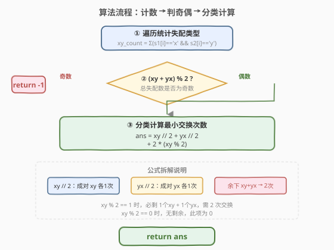
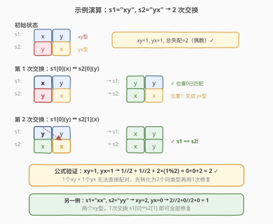

# 交换字符使得字符串相同

- **题目名称**：交换字符使得字符串相同
- **链接**：[1247. 交换字符使得字符串相同](https://leetcode.cn/problems/minimum-swaps-to-make-strings-equal/)
- **难度**：中等
- **标签**：贪心、数学、字符串

## 1. 题目概述

有两个长度相同的字符串 `s1` 和 `s2`，且它们**只含有**字符 `"x"` 和 `"y"`。你需要通过「交换字符」的方式使这两个字符串相同。

每次交换可以在两个字符串中**各选一个字符**进行交换，即交换 `s1[i]` 和 `s2[j]`，但**不能**交换同一字符串内部的两个字符。

返回使 `s1` 和 `s2` 相同的**最小交换次数**，如果无法做到则返回 `-1`。

**示例 1**：

```text
输入：s1 = "xx", s2 = "yy"
输出：1
解释：交换 s1[0] 和 s2[1]，得到 s1 = "yx"，s2 = "yx"。
```

**示例 2**：

```text
输入：s1 = "xy", s2 = "yx"
输出：2
解释：
交换 s1[0] 和 s2[0]，得到 s1 = "yy"，s2 = "xx"。
交换 s1[0] 和 s2[1]，得到 s1 = "xy"，s2 = "xy"。
```

**示例 3**：

```text
输入：s1 = "xx", s2 = "xy"
输出：-1
```

**约束条件**：

- `1 <= s1.length, s2.length <= 1000`
- `s1.length == s2.length`
- `s1, s2` 只包含 `'x'` 或 `'y'`

> 💡 **只关心失配位置**：对每个位置 `i`，若 `s1[i] == s2[i]` 则已匹配，无需处理。失配位置只有两种类型：`s1[i]='x', s2[i]='y'`（记为 **xy 型**）或 `s1[i]='y', s2[i]='x'`（记为 **yx 型**）。问题的关键在于如何用最少的跨串交换消除所有失配。

---

## 2. 解题思路

### 2.1 暴力思路

枚举所有可能的交换方案（BFS/DFS 搜索），每次尝试交换任意 `s1[i]` 和 `s2[j]`，直到 `s1 == s2`。状态空间巨大（字符串长度达 1000），完全不可行。

### 2.2 核心观察：失配分类 + 贪心配对



**关键观察**：每次跨串交换恰好影响两个位置的匹配状态。因此可以将失配位置按类型分组，再贪心地配对消除。

**失配类型**：

- **xy 型**：`s1[i] = 'x'`, `s2[i] = 'y'`，设共 `a` 个
- **yx 型**：`s1[i] = 'y'`, `s2[i] = 'x'`，设共 `b` 个

**三种交换策略**：

| 场景 | 操作 | 消耗交换数 | 说明 |
|------|------|-----------|------|
| 两个 xy 型 | 交换 `s1[i]`(x) ↔ `s2[j]`(y) | 1 | 交换后两位置都变为匹配 |
| 两个 yx 型 | 交换 `s1[i]`(y) ↔ `s2[j]`(x) | 1 | 同理，1 次修复两个 |
| 一个 xy + 一个 yx | 先交换使其变为两个同类型，再修复 | 2 | 第 1 次转化为同类型，第 2 次修复 |

> 💡 **为什么 xy + yx 需要 2 次？** 直接交换 xy 型的 `s1[i]`(x) 和 yx 型的 `s2[j]`(x) 没有意义（两者都是 x）。必须先做一次「转化交换」把 `{xy, yx}` 变成 `{yx, yx}`（或 `{xy, xy}`），再用 1 次同类型配对修复。

**奇偶性判定**：每次交换恰好修复 2 个失配，所以**总失配数 `a + b` 必须为偶数**，否则返回 `-1`。又因为 `a + b` 为偶数等价于 `a % 2 == b % 2`，所以剩余的 xy 型和 yx 型要么都配对完，要么各剩 1 个。

### 2.3 算法流程图



1. 遍历统计 `xy_count` 和 `yx_count`
2. 若 `(xy_count + yx_count) % 2 != 0`，返回 `-1`
3. 否则返回 `xy_count / 2 + yx_count / 2 + 2 * (xy_count % 2)`

### 2.4 示例演算

以 `s1 = "xy", s2 = "yx"` 为例（示例 2）：



| 步骤 | 操作 | s1 | s2 | 说明 |
|------|------|-----|-----|------|
| 初始 | — | "xy" | "yx" | xy=1, yx=1, 总失配=2（偶数）✓ |
| 第 1 次 | s1[0](x) ↔ s2[0](y) | "yy" | "xx" | 位置0匹配，位置1变成两个 yx 型 |
| 第 2 次 | s1[0](y) ↔ s2[1](x) | "xy" | "xy" | 两个 yx 型，1 次修复 ✓ |

公式验证：`xy=1, yx=1 → 1/2 + 1/2 + 2×(1%2) = 0 + 0 + 2 = 2` ✓

---

## 3. 参考代码

### C++

```cpp
class Solution {
public:
    int minimumSwap(string s1, string s2) {
        int xy = 0, yx = 0;
        for (int i = 0; i < s1.size(); i++) {
            if (s1[i] == s2[i]) continue;
            if (s1[i] == 'x') xy++;
            else yx++;
        }
        if ((xy + yx) % 2 != 0) return -1;
        return xy / 2 + yx / 2 + 2 * (xy % 2);
    }
};
```

### Python

```python
class Solution:
    def minimumSwap(self, s1: str, s2: str) -> int:
        xy = yx = 0
        for c1, c2 in zip(s1, s2):
            if c1 == c2:
                continue
            if c1 == 'x':
                xy += 1
            else:
                yx += 1
        if (xy + yx) % 2 != 0:
            return -1
        return xy // 2 + yx // 2 + 2 * (xy % 2)
```

---

## 4. 复杂度分析

| 维度 | 复杂度 | 说明 |
|------|--------|------|
| 时间复杂度 | `O(n)` | 一次遍历统计失配类型，`n` 为字符串长度 |
| 空间复杂度 | `O(1)` | 仅用两个计数变量 `xy` 和 `yx` |

---

## 5. 扩展：公式推导的严谨性

**为什么 `2 * (xy % 2)` 覆盖了所有剩余情况？**

当 `(xy + yx)` 为偶数时，`xy % 2 == yx % 2`：

- **两者都为偶数**：`xy % 2 = 0`，所有失配都成对配对完，无剩余，额外项为 0。
- **两者都为奇数**：`xy % 2 = 1`，各剩 1 个 xy 型和 1 个 yx 型，需 2 次交换，额外项为 `2 × 1 = 2`。

因此公式 `xy / 2 + yx / 2 + 2 * (xy % 2)` 在两种情况下都正确。

> ⚠️ **不能用 `yx % 2` 替代 `xy % 2` 吗？** 实际上可以——当奇偶性条件满足时 `xy % 2 == yx % 2`，两者等价。用哪个都行。

---

## 6. 面试要点

1. **为什么总失配数必须为偶数？**

   - 每次跨串交换恰好改变两个位置的匹配状态（可能修复 2 个、破坏 2 个、或修复 1 个破坏 1 个）。要从全失配到全匹配，净修复数必须等于总失配数，而每次交换的净修复数是偶数（−2, 0, +2），所以总失配数必须为偶数。

2. **两个 xy 型为什么 1 次交换就能修复？**

   - 设位置 `i` 和 `j` 都是 xy 型（`s1[i]=s1[j]='x'`, `s2[i]=s2[j]='y'`）。交换 `s1[i]`(x) 和 `s2[j]`(y) 后：`s1[i]` 变为 y（与 `s2[i]=y` 匹配），`s2[j]` 变为 x（与 `s1[j]=x` 匹配）。1 次修复 2 个。

3. **xy + yx 为什么不能 1 次修复？**

   - xy 型的 `s1` 是 x、yx 型的 `s2` 也是 x，交换两个 x 无变化。必须先做一次「转化交换」把异类型变为同类型，再配对修复，共 2 次。

4. **如果不限制字符只有 x 和 y 会怎样？**

   - 失配类型会增多（如 xa、bx 等），无法简单分为两类配对。需要更通用的图论方法（如将失配视为图中节点，交换视为边，求最小边覆盖）。

5. **能否用 BFS 搜索最少交换次数？**

   - 理论上可以，但状态空间为 `2^n`（每个位置的 x/y 组合），`n=1000` 时完全不可行。贪心分类配对是唯一可行解法。

---

## 7. 同类练习题

- [1202. 交换字符串中的元素](https://leetcode.cn/problems/smallest-string-with-swaps/)（[题解](../1201-1300/1202_交换字符串中的元素.md)）：同为字符串交换问题，但交换发生在任意位置（并查集连通分量内排序），对比本题只能跨串交换
- [1657. 确定两个字符串是否接近](https://leetcode.cn/problems/determine-if-two-strings-are-close/)：字符串字符重排与替换问题，贪心判定可行性
- [859. 亲密字符串](https://leetcode.cn/problems/buddy-strings/)：两字符串能否通过恰好一次交换相等，同样是失配位置分析
- [1790. 仅执行一次字符串交换能否使两个字符串相等](https://leetcode.cn/problems/check-if-one-string-swap-can-make-strings-equal/)：判定恰好一次交换是否足够，失配数必须为 0 或 2
- [1248. 统计「优美子数组」](https://leetcode.cn/problems/count-number-of-nice-subarrays/)（[题解](../1201-1300/1248_统计优美子数组.md)）：同区间题号相邻，同为贪心/数学思维题
