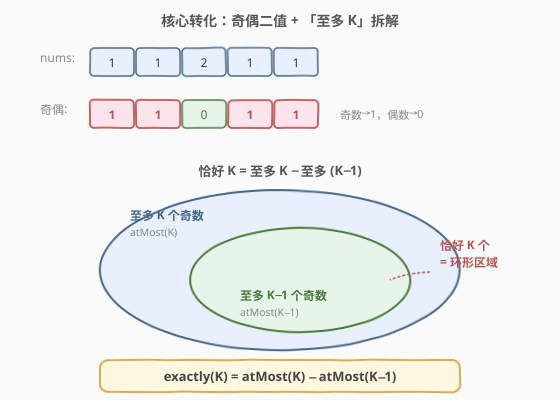
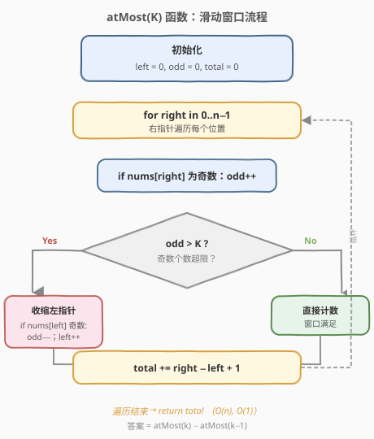
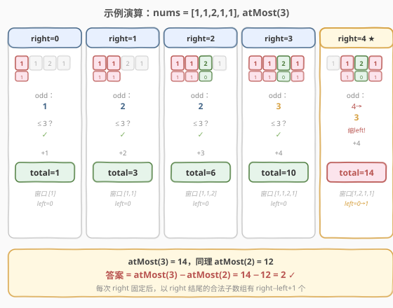

# 统计「优美子数组」

- **题目名称**：统计「优美子数组」
- **链接**：[1248. 统计「优美子数组」](https://leetcode.cn/problems/count-number-of-nice-subarrays/)
- **难度**：中等
- **标签**：数组、滑动窗口、前缀和、哈希表

## 1. 题目概述

给你一个整数数组 `nums` 和一个整数 `k`。如果某个**连续子数组**中恰好有 `k` 个奇数，则称该子数组为「优美子数组」。请返回优美子数组的**数目**。

**示例 1**：

```text
输入：nums = [1,1,2,1,1], k = 3
输出：2
解释：优美子数组为 [1,1,2,1]（下标 0-3）和 [1,2,1,1]（下标 1-4），各含 3 个奇数。
```

**示例 2**：

```text
输入：nums = [2,2,2,1,2,2,1,2,2,2], k = 2
输出：16
解释：两个奇数分别在下标 3 和 6，包含两者的子数组共 4×4=16 个。
```

**约束条件**：

- `1 <= nums.length <= 50000`
- `1 <= nums[i] <= 10^5`
- `1 <= k <= nums.length`

> 💡 **只关心奇偶性**：题目只问奇数的**个数**，不关心具体数值。可先把数组转为 0/1 序列（奇数→1，偶数→0），问题等价于「统计和恰好为 `k` 的连续子数组数」。

---

## 2. 解题思路

### 2.1 暴力思路

枚举所有子数组 `[i, j]`，逐个统计奇数个数判断是否等于 `k`。两重循环 + 计数共 `O(n²)`，在 `n = 50000` 时超时。

### 2.2 核心观察：「至多 K」转化



本题有两类经典解法，核心观察各不相同：

**方法一：前缀和 + 哈希**（与 [560. 和为 K 的子数组](../0501-0600/560_和为K的子数组.md) 同构）

将数组转为 0/1 序列后，定义前缀和 `prefix[i]` 为 `nums[0..i-1]` 中的奇数个数。子数组 `nums[i..j]` 的奇数个数为 `prefix[j+1] - prefix[i]`，要其等于 `k`，即：

$$
\text{prefix}[i] = \text{prefix}[j+1] - k
$$

对每个结束位置 `j`，用哈希表查询之前有多少个起点的 `prefix` 恰好等于 `当前前缀和 - k`。

**方法二：滑动窗口「至多 K」技巧**（本题重点）

> 💡 **关键转化**：直接用滑动窗口求「恰好 K 个」很难——窗口内奇数恰好为 K 时，既不能确定该扩还是该缩。但「**至多 K 个**」可以用标准滑窗轻松求出，于是：

$$
\text{exactly}(K) = \text{atMost}(K) - \text{atMost}(K-1)
$$

`atMost(K)` 统计奇数个数 **≤ K** 的子数组数：用双指针维护窗口，对每个 `right`，当窗口内奇数 `> K` 时收缩 `left`，然后累加 `right - left + 1`（以 `right` 结尾的合法子数组数）。

### 2.3 算法流程图



`atMost(K)` 的流程：

1. 初始化 `left = 0, odd = 0, total = 0`
2. 遍历 `right` 从 `0` 到 `n-1`：
   - 若 `nums[right]` 为奇数，`odd++`
   - **当** `odd > K`：若 `nums[left]` 为奇数则 `odd--`，`left++`
   - `total += right - left + 1`
3. 返回 `total`

最终答案为 `atMost(k) - atMost(k - 1)`。

> ⚠️ **`right - left + 1` 的含义**：当窗口 `[left, right]` 内奇数 ≤ K 时，以 `right` 结尾的合法子数组有 `right - left + 1` 个（起点可取 `left` 到 `right` 的任意位置）。这一步是 `O(1)` 计数的关键。

### 2.4 示例演算

以 `nums = [1,1,2,1,1], k = 3` 为例，展示 `atMost(3)` 的过程：



| right | nums[right] | odd | left | 窗口 | += right−left+1 | total |
|-------|-------------|-----|------|------|-----------------|-------|
| 0 | 1（奇） | 1 | 0 | [1] | 1 | 1 |
| 1 | 1（奇） | 2 | 0 | [1,1] | 2 | 3 |
| 2 | 2（偶） | 2 | 0 | [1,1,2] | 3 | 6 |
| 3 | 1（奇） | 3 | 0 | [1,1,2,1] | 4 | 10 |
| 4 | 1（奇） | 4→3 | 0→1 | [1,2,1,1] | 4 | 14 |

> 💡 第 5 步 `right=4` 时，加入第二个 `1` 后 `odd=4 > 3`，需收缩：`left=0` 处是奇数，`odd` 减到 3，`left` 移到 1。此时窗口 `[1,2,1,1]` 恰好 3 个奇数，累加 `4-1+1=4`。

同理计算 `atMost(2) = 12`，最终答案：

$$
\text{ans} = \text{atMost}(3) - \text{atMost}(2) = 14 - 12 = 2 \quad \checkmark
$$

---

## 3. 参考代码

### 方法一：前缀和 + 哈希

#### C++

```cpp
class Solution {
  public:
    int numberOfSubarrays(vector<int>& nums, int k) {
        unordered_map<int, int> count;
        count[0] = 1;
        int ans = 0, prefix = 0;
        for (int x : nums) {
            prefix += x & 1;
            if (count.count(prefix - k))
                ans += count[prefix - k];
            count[prefix]++;
        }
        return ans;
    }
};
```

#### Python

```python
class Solution:
    def numberOfSubarrays(self, nums: List[int], k: int) -> int:
        count = {0: 1}
        ans = prefix = 0
        for x in nums:
            prefix += x & 1
            ans += count.get(prefix - k, 0)
            count[prefix] = count.get(prefix, 0) + 1
        return ans
```

### 方法二：滑动窗口「至多 K」

#### C++

```cpp
class Solution {
  public:
    int numberOfSubarrays(vector<int>& nums, int k) {
        return atMost(nums, k) - atMost(nums, k - 1);
    }
  private:
    int atMost(vector<int>& nums, int K) {
        if (K < 0) return 0;
        int left = 0, odd = 0, total = 0;
        for (int right = 0; right < nums.size(); right++) {
            if (nums[right] & 1) odd++;
            while (odd > K) {
                if (nums[left] & 1) odd--;
                left++;
            }
            total += right - left + 1;
        }
        return total;
    }
};
```

#### Python

```python
class Solution:
    def numberOfSubarrays(self, nums: List[int], k: int) -> int:
        def atMost(K: int) -> int:
            if K < 0:
                return 0
            left = odd = total = 0
            for right in range(len(nums)):
                if nums[right] & 1:
                    odd += 1
                while odd > K:
                    if nums[left] & 1:
                        odd -= 1
                    left += 1
                total += right - left + 1
            return total
        return atMost(k) - atMost(k - 1)
```

---

## 4. 复杂度分析

| 方法 | 时间复杂度 | 空间复杂度 | 说明 |
|------|-----------|-----------|------|
| 前缀和 + 哈希 | `O(n)` | `O(n)` | 一次遍历，哈希表最坏存 n+1 个键 |
| 滑动窗口「至多 K」 | `O(n)` | `O(1)` | 调用两次 `atMost`，`left`/`right` 各遍历一次；无需额外空间 |

> 💡 两种方法时间同为 `O(n)`，但滑动窗口法空间仅需 `O(1)`，且代码更简洁、不依赖哈希表。面试中推荐先写滑动窗口法，再提前缀和法作为补充。

---

## 5. 扩展：两种方法的对比与适用场景

| 维度 | 前缀和 + 哈希 | 滑动窗口「至多 K」 |
|------|--------------|-------------------|
| **适用条件** | 通用，元素可有负数 | 需窗口量具有单调性（本题 0/1 序列天然单调） |
| **空间** | `O(n)`（哈希表） | `O(1)` |
| **可读性** | 与 560 模板一致，迁移性强 | 「至多 K」转化需解释，但代码极简 |
| **迁移范围** | 任意「恰好 K」计数 | 限于非负场景的「恰好/至多 K」计数 |

> ⚠️ **滑动窗口的单调性前提**：`atMost` 之所以有效，是因为加入元素只会让奇数个数**不减少**（0 或 +1），收缩只会让奇数个数**不增加**（0 或 −1）。若元素可负（如 [560](../0501-0600/560_和为K的子数组.md) 中 `nums[i]` 可为负），单调性被破坏，滑动窗口失效，只能用前缀和 + 哈希。

---

## 6. 面试要点

1. **为什么不能直接用滑动窗口求「恰好 K」？**

   - 滑动窗口的核心是「不满足时扩张，满足时记录并尝试收缩」。但「恰好 K」时收缩可能丢失合法解（收缩后仍恰好 K），扩张也可能越过合法解（变成 K+1）。窗口无法确定移动方向，因此转化为「至多 K」之差。

2. **`right - left + 1` 为什么就是以 `right` 结尾的合法子数组数？**

   - 当窗口 `[left, right]` 内奇数 ≤ K 时，以 `right` 为右端点、起点取 `left, left+1, ..., right` 的所有子数组都满足条件（因为去掉窗口左端元素不会增加奇数个数）。共 `right - left + 1` 个，`O(1)` 搞定。

3. **`atMost(K - 1)` 当 `K = 0` 时怎么办？**

   - `atMost(-1)` 应返回 0（奇数个数不可能 ≤ −1）。代码中加 `if (K < 0) return 0` 特判即可。

4. **前缀和法中 `x & 1` 的作用？**

   - `x & 1` 取 `x` 的最低位：奇数为 1，偶数为 0。等价于 `x % 2`，但位运算更快。这样直接把前缀和的增量设为 0/1，无需显式转换数组。

5. **本题与 [560. 和为 K 的子数组](../0501-0600/560_和为K的子数组.md) 的关系？**

   - 560 是通用版（元素可为负，只能前缀和 + 哈希）；1248 是 0/1 特化版（只统计奇偶），额外解锁了 `O(1)` 空间的滑动窗口解法。两者前缀和模板完全一致。

---

## 7. 同类练习题

- [560. 和为 K 的子数组](https://leetcode.cn/problems/subarray-sum-equals-k/)（[题解](../0501-0600/560_和为K的子数组.md)）：前缀和 + 哈希的母题，1248 方法一与其完全同构
- [930. 和相同的二元子数组](https://leetcode.cn/problems/binary-subarrays-with-sum/)：0/1 数组版「和为 goal 的子数组数」，两种方法均适用
- [992. K 个不同整数的子数组](https://leetcode.cn/problems/subarrays-with-k-different-integers/)：「至多 K」技巧的另一经典应用，把奇数换成「不同整数个数」
- [1358. 包含所有三种字符的子字符串数目](https://leetcode.cn/problems/number-of-substrings-containing-all-three-characters/)：变体——求「至少含 3 种字符」，可用类似转化
- [713. 乘积小于 K 的子数组](https://leetcode.cn/problems/subarray-product-less-than-k/)（[题解](../0701-0800/713_乘积小于K的子数组.md)）：同为「至多」类滑窗计数，对比 `right-left+1` 技巧
