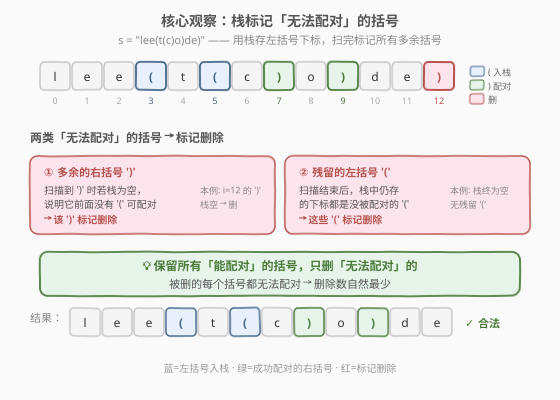
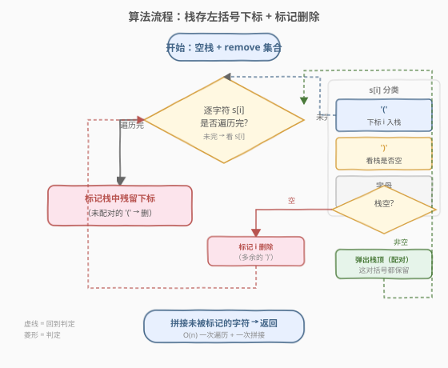
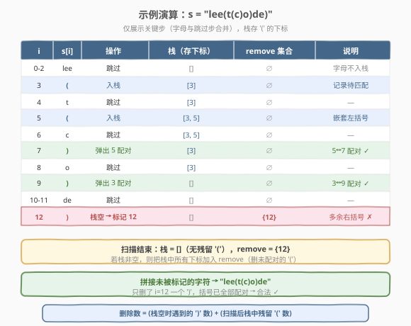

# LeetCode 移除无效的括号 题解

## 1. 题目概述

- **标题 / 题号**：移除无效的括号（#1249，medium）
- **链接**：https://leetcode.cn/problems/minimum-remove-to-make-valid-parentheses/
- **难度**：中等
- **标签**：栈、字符串

**题意**：给你一个由 `'('`、`')'` 和小写英文字母组成的字符串 `s`。你需要从中移除**最少数量的括号**，使得剩下的括号字符串**有效**（任意一个有效结果均可），返回该结果字符串。

> **有效括号串的定义**：空串和纯字母串视为有效；每个 `'('` 都有对应的 `')'` 闭合且顺序正确；左右括号数量相等。

**示例 1**：

```text
输入：s = "lee(t(c)o)de)"
输出："lee(t(c)o)de"
解释：移除下标 12 的 ')'，其余括号已全部配对。("lee(t(c)o)de" 也是一个合法答案)
```

**示例 2**：

```text
输入：s = "a)b(c)d"
输出："ab(c)d"
解释：移除下标 1 的多余 ')'。下标 3 的 '(' 有下标 4 的 ')' 配对，保留。
```

**示例 3**：

```text
输入：s = "))(("
输出：""
解释：所有括号都无法配对，全部移除，返回空串（空串合法）。
```

**约束**：

- `1 <= s.length <= 10^5`
- `s[i]` 是 `'('`、`')'` 或小写英文字母

> 💡 **从「判定」到「修复」**：[20. 有效的括号](../0001-0100/20_有效括号.md) 用栈**判定**串是否合法；本题把判定栈升级为「标记栈」——找出所有无法配对的括号并删掉，把不合法的串**修复**成合法的。核心匹配逻辑完全一致。

## 2. 解题思路

### 2.1 暴力思路

反复扫描字符串，每次找到一个多余的括号就删除，直到串合法。每轮判定 `O(n)`，最坏 `O(n)` 轮，总计 `O(n²)`，且实现复杂。`n = 10^5` 时明显超时。

### 2.2 核心观察：栈标记「无法配对」的括号



括号匹配的本质是**后进先出（LIFO）**——最后打开的 `'('` 必须最先被 `')'` 关闭，这正是栈的语义。一个括号「无效」只有两种成因：

| 无效类型 | 触发时机 | 处理 |
|---------|---------|------|
| **多余的 `')'`** | 扫描到 `')'` 时栈为空（前面没有 `'('` 可配对） | 标记该 `')'` 删除 |
| **多余的 `'('`** | 扫描结束后栈中仍有残留（没有 `')'` 与之配对） | 标记这些 `'('` 删除 |

**算法骨架**：用栈存**待匹配 `'('` 的下标**（存下标而非字符，是为了能精确定位删除），扫描时按上表分类标记，扫描完再把栈中残留的下标一并标记，最后拼接未被标记的字符。

> 💡 **为什么这样删是最少的？** 每个被标记的括号都「无法配对」——多余的 `')'` 找不到左括号，残留的 `'('` 找不到右括号。保留所有**能配对**的括号，只删无法配对的，删除数自然最少。任何合法结果都必须删掉这些无法配对的括号，因此删除数唯一且最小。

### 2.3 算法流程图



1. 初始化空栈 `st`（存下标）和删除标记集合 `remove`（布尔数组或 `set`）
2. 逐下标 `i` 遍历 `s`：
   - `s[i] == '('`：下标 `i` 入栈（记录待匹配）
   - `s[i] == ')'`：栈空 → 标记 `i` 删除（多余的右括号）；栈非空 → 弹出栈顶（配对成功，两者都保留）
   - 字母：跳过
3. 扫描结束：栈中剩余下标全部标记删除（未配对的左括号）
4. 拼接未被标记的字符，返回结果

> ⚠️ **栈里存下标而不是字符**：判定合法时存字符即可（[20](../0001-0100/20_有效括号.md)）；但本题要**删除**，必须知道哪些 `'('` 没配对。存下标才能在扫描结束后精确标记这些位置。

### 2.4 示例演算

以 `s = "lee(t(c)o)de)"` 为例（示例 1）：



| i | s[i] | 操作 | 栈 | remove | 说明 |
|---|------|------|----|--------|------|
| 0-2 | lee | 跳过 | `[]` | `∅` | 字母不入栈 |
| 3 | `(` | 入栈 | `[3]` | `∅` | 记录待匹配 |
| 4 | t | 跳过 | `[3]` | `∅` | — |
| 5 | `(` | 入栈 | `[3,5]` | `∅` | 嵌套左括号 |
| 6 | c | 跳过 | `[3,5]` | `∅` | — |
| 7 | `)` | 弹出 5 | `[3]` | `∅` | 5↔7 配对 ✓ |
| 8 | o | 跳过 | `[3]` | `∅` | — |
| 9 | `)` | 弹出 3 | `[]` | `∅` | 3↔9 配对 ✓ |
| 10-11 | de | 跳过 | `[]` | `∅` | — |
| 12 | `)` | 栈空→标记 12 | `[]` | `{12}` | 多余右括号 ✗ |

扫描结束：栈为空（无残留 `'('`），`remove = {12}`。拼接跳过下标 12 的字符 → `"lee(t(c)o)de"` ✓

## 3. 参考代码

### 方法一：栈 + 标记集合

#### C++

```cpp
class Solution {
public:
    string minRemoveToMakeValid(string s) {
        int n = s.size();
        stack<int> st;
        vector<char> remove(n, false);
        for (int i = 0; i < n; i++) {
            if (s[i] == '(') {
                st.push(i);
            } else if (s[i] == ')') {
                if (st.empty()) {
                    remove[i] = true;   // 多余的右括号
                } else {
                    st.pop();           // 配对成功
                }
            }
        }
        while (!st.empty()) {           // 残留的左括号
            remove[st.top()] = true;
            st.pop();
        }
        string ans;
        for (int i = 0; i < n; i++) {
            if (!remove[i]) ans += s[i];
        }
        return ans;
    }
};
```

#### Python

```python
class Solution:
    def minRemoveToMakeValid(self, s: str) -> str:
        remove = set()
        stack = []
        for i, c in enumerate(s):
            if c == '(':
                stack.append(i)
            elif c == ')':
                if not stack:
                    remove.add(i)        # 多余的右括号
                else:
                    stack.pop()          # 配对成功
        remove.update(stack)             # 残留的左括号
        return ''.join(c for i, c in enumerate(s) if i not in remove)
```

### 方法二：两次遍历计数法（无栈/无标记数组）

> 💡 **思路**：括号合法性只取决于「平衡值」——`'('` +1、`')'` −1，过程中不能为负，结束时必须为 0。据此分两趟删除多余括号。

- **第一趟（左→右）删多余 `')'`**：维护 `balance`，遇 `'('` 则 `balance++` 保留；遇 `')'` 若 `balance > 0` 则 `balance--` 保留，否则跳过（多余的右括号）。这趟结束后 `balance` = 多余的 `'('` 数。
- **第二趟（右→左）删多余 `'('`**：从右向左扫描第一趟结果，遇到 `'('` 且还需删 `excess > 0` 时跳过，其余保留。

#### C++

```cpp
class Solution {
public:
    string minRemoveToMakeValid(string s) {
        string first;
        int balance = 0;
        for (char c : s) {
            if (c == '(') {
                balance++;
                first += c;
            } else if (c == ')') {
                if (balance > 0) {
                    balance--;
                    first += c;
                }
            } else {
                first += c;
            }
        }
        int excess = balance;
        string ans;
        for (int i = first.size() - 1; i >= 0; i--) {
            if (first[i] == '(' && excess > 0) {
                excess--;
            } else {
                ans += first[i];
            }
        }
        reverse(ans.begin(), ans.end());
        return ans;
    }
};
```

#### Python

```python
class Solution:
    def minRemoveToMakeValid(self, s: str) -> str:
        first = []
        balance = 0
        for c in s:
            if c == '(':
                balance += 1
                first.append(c)
            elif c == ')':
                if balance > 0:
                    balance -= 1
                    first.append(c)
            else:
                first.append(c)
        excess = balance
        ans = []
        for c in reversed(first):
            if c == '(' and excess > 0:
                excess -= 1
            else:
                ans.append(c)
        return ''.join(reversed(ans))
```

## 4. 复杂度分析

| 方法 | 时间复杂度 | 空间复杂度 | 说明 |
|------|-----------|-----------|------|
| 栈 + 标记集合 | `O(n)` | `O(n)` | 一次遍历 + 一次拼接；栈和标记集合最坏存 `n` 个元素（全为 `'('`） |
| 两次遍历计数 | `O(n)` | `O(n)` | 两趟线性扫描；空间用于结果串本身，无需栈/下标数组 |

> 💡 两种方法时间均为 `O(n)`。栈法逻辑最直白、与 [20](../0001-0100/20_有效括号.md) 的匹配语义一脉相承，面试首选；计数法省去了栈和额外标记结构，代码更紧凑，适合追求极简实现时给出。

## 5. 扩展：与 20 / 32 的对比

| 维度 | [20. 有效的括号](../0001-0100/20_有效括号.md) | 1249. 移除无效的括号 | [32. 最长有效括号](../0001-0100/32_最长有效括号.md) |
|------|------|------|------|
| **任务** | 判定整串是否合法 | 删除最少括号使整串合法 | 求最长合法**子串**长度 |
| **输出** | 布尔值 | 字符串 | 整数 |
| **栈存内容** | 字符 | **下标**（需定位删除） | 下标（需算区间长度） |
| **核心动作** | 入栈 / 匹配弹出 | 入栈 / 弹出 / **标记删除** | 入栈 / 弹出 / **用下标差算长度** |
| **关系** | 判定基础 | 20 的「修复版」 | 20 的「统计版」 |

> ⚠️ **1249 与 32 的关键区别**：1249 **删除字符**让**整个串**合法（不改变剩余字符相对顺序）；32 **不删除字符**，只找一个**子串**使其合法并最大化长度。两者都用栈存下标，但目的不同——前者为标记删除，后者为计算合法区间长度。

## 6. 面试要点

1. **为什么删除数是最少的？**

   - 被标记的每个括号都「无法配对」：多余的 `')'` 找不到左侧 `'('`，残留的 `'('` 找不到右侧 `')'`。保留所有能配对的、只删无法配对的，删除数自然最小。任何合法结果都必须删掉这些括号，因此最小删除数唯一。

2. **栈里为什么存下标而不是存字符？**

   - 判定合法（[20](../0001-0100/20_有效括号.md)）存字符即可，因为只需知道栈顶类型。但本题要删除，必须精确定位「哪些 `'('` 没配对」。存下标才能在扫描结束后把这些位置加入删除集合。

3. **能否不用栈？**

   - 可以，用「两次遍历计数法」：第一趟左→右按平衡值删多余 `')'`，第二趟右→左删多余 `'('`。省去了栈和下标数组，但需要两次扫描；栈法一次扫描即可确定所有删除位置。

4. **题目允许任意合法结果，栈法返回的是哪一个？**

   - 栈法返回「保留每个 `'('` 能配对的最早 `')'`」的一类结果：遇到 `')'` 时总是弹出最近的 `'('`（LIFO），即按嵌套从内到外配对。不同实现配对顺序可能不同，但删除集合相同（都是无法配对的那些），结果都合法。

5. **遇到 `")(("` 这类全无效的输入会怎样？**

   - 第一个 `')'` 栈空→标记删除；后面两个 `'('` 入栈后无 `')'` 弹出，扫描结束被标记删除。最终 `remove = {0,1,2}`，返回空串（空串合法）。

## 同类练习题

| # | 题目 | 与本题的关联 |
|---|------|-------------|
| 20 | [有效的括号](https://leetcode.cn/problems/valid-parentheses/)（[题解](../0001-0100/20_有效括号.md)） | 用栈判定合法性，是 1249 的判定基础与匹配逻辑母题 |
| 32 | [最长有效括号](https://leetcode.cn/problems/longest-valid-parentheses/)（[题解](../0001-0100/32_最长有效括号.md)） | 同样用栈存下标，但目标是求最长合法子串长度，对比「删除字符」与「找子串」 |
| 22 | [括号生成](https://leetcode.cn/problems/generate-parentheses/)（[题解](../0001-0100/22_括号生成.md)） | 回溯构造所有合法括号组合，从另一方向理解「合法」的定义 |
| 678 | [有效的括号字符串](https://leetcode.cn/problems/valid-parenthesis-string/)（[题解](../0601-0700/678_有效的括号字符串.md)） | 含通配符 `'*'`（可当左/右/空）的括号匹配，栈/贪心双解 |
| 2116 | [判断一个括号字符串是否有效](https://leetcode.cn/problems/check-if-a-parentheses-string-can-be-valid/) | 带「锁定位置」的括号匹配变体，可改写的位置有限制 |
