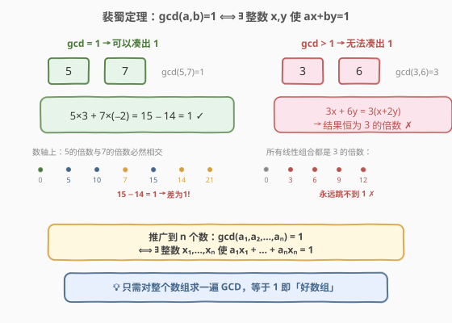
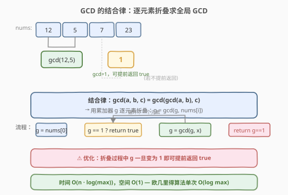
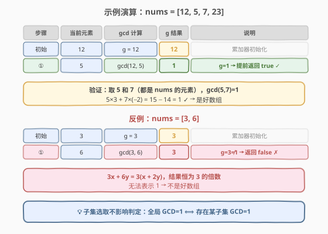

# LeetCode 检查「好数组」 题解

## 1. 题目概述

- **标题 / 题号**：检查「好数组」（#1250，hard）
- **链接**：https://leetcode.cn/problems/check-if-it-is-a-good-array/
- **难度**：困难
- **标签**：数学、数论、最大公约数

**题意**：给你一个正整数数组 `nums`，你需要从中任选一些**子集**，然后将子集中每一个数乘以一个**任意整数**（可为负、可为零），并求出它们的和。

假如该和结果为 `1`，那么原数组就是一个「**好数组**」，返回 `True`；否则返回 `False`。

**示例 1**：

```text
输入：nums = [12, 5, 7, 23]
输出：true
解释：挑选数字 5 和 7。
5×3 + 7×(-2) = 15 - 14 = 1
```

**示例 2**：

```text
输入：nums = [29, 6, 10]
输出：true
解释：挑选数字 29, 6 和 10。
29×1 + 6×(-3) + 10×(-1) = 29 - 18 - 10 = 1
```

**示例 3**：

```text
输入：nums = [3, 6]
输出：false
解释：无论怎么选，3x + 6y = 3(x + 2y) 恒为 3 的倍数，不可能等于 1。
```

**约束**：

- `1 <= nums.length <= 10^5`
- `1 <= nums[i] <= 10^9`

> 💡 **翻译成数学语言**：是否存在一个子集 $S \subseteq \text{nums}$ 和一组整数系数 $\{c_i\}$，使得 $\sum_{i \in S} c_i \cdot \text{nums}[i] = 1$？这正是**裴蜀定理（Bézout's Identity）**的典型场景。

## 2. 解题思路

### 2.1 暴力思路

枚举所有 $2^n$ 个子集，对每个子集尝试搜索整数系数使加权和为 1。这不仅在子集枚举上指数爆炸（$n = 10^5$），而且「判定一组数的整数线性组合能否等于 1」本身也需要数论工具，暴力搜索完全不可行。

### 2.2 核心观察：裴蜀定理



**裴蜀定理（Bézout's Identity）**：对于整数 $a_1, a_2, \dots, a_n$，存在整数 $x_1, x_2, \dots, x_n$ 使得

$$
a_1 x_1 + a_2 x_2 + \cdots + a_n x_n = 1
$$

**当且仅当** $\gcd(a_1, a_2, \dots, a_n) = 1$。

> 💡 **直观理解**：两个数 $a, b$ 的所有整数线性组合 $\{ax + by \mid x, y \in \mathbb{Z}\}$ 恰好等于 $\gcd(a, b)$ 的所有整数倍。所以能凑出 1 $\iff$ $\gcd$ 能整除 1 $\iff$ $\gcd = 1$。这一结论自然推广到 $n$ 个数。

**为什么「子集选取」不影响判定？**

GCD 具有**单调性**：向集合中添加元素，GCD 只会不变或减小。因此：

- 若**整个数组**的 $\gcd = 1$，则数组本身就满足条件（全集即一个合法子集），返回 `true`。
- 若**整个数组**的 $\gcd = g > 1$，则任何子集的 $\gcd$ 都是 $g$ 的倍数（$\geq g > 1$），没有任何子集能凑出 1，返回 `false`。

所以只需对**整个数组**求一次 GCD 即可，无需枚举子集。

### 2.3 算法流程图



GCD 满足**结合律**：$\gcd(a, b, c) = \gcd(\gcd(a, b), c)$，因此可以用一个累加器 $g$ 逐元素折叠：

1. 初始化 $g = \text{nums}[0]$
2. 遍历 `nums[1:]`，逐个更新 $g = \gcd(g, \text{nums}[i])$
3. **提前终止**：若中途 $g$ 变为 1，直接返回 `true`
4. 遍历结束，返回 $g == 1$

### 2.4 示例演算

以 `nums = [12, 5, 7, 23]` 和 `nums = [3, 6]` 为例：



**示例 1**：`nums = [12, 5, 7, 23]`

| 步骤 | 当前元素 | gcd 计算 | g 结果 | 说明 |
|------|----------|----------|--------|------|
| 初始 | 12 | g = 12 | 12 | 累加器初始化 |
| ① | 5 | gcd(12, 5) | **1** | g=1 → 提前返回 true ✓ |

验证：取 5 和 7，$\gcd(5, 7) = 1$，$5 \times 3 + 7 \times (-2) = 1$ ✓

**示例 3**：`nums = [3, 6]`

| 步骤 | 当前元素 | gcd 计算 | g 结果 | 说明 |
|------|----------|----------|--------|------|
| 初始 | 3 | g = 3 | 3 | 累加器初始化 |
| ① | 6 | gcd(3, 6) | **3** | g=3≠1 → 返回 false ✗ |

$3x + 6y = 3(x + 2y)$，结果恒为 3 的倍数，无法表示 1。

## 3. 参考代码

### C++

```cpp
class Solution {
public:
    bool isGoodArray(vector<int>& nums) {
        int g = nums[0];
        for (int i = 1; i < nums.size(); i++) {
            g = gcd(g, nums[i]);
            if (g == 1) return true;
        }
        return g == 1;
    }
};
```

### Python

```python
import math

class Solution:
    def isGoodArray(self, nums: List[int]) -> bool:
        g = nums[0]
        for x in nums[1:]:
            g = math.gcd(g, x)
            if g == 1:
                return True
        return g == 1
```

> ⚠️ **`functools.reduce` 一行写法**：`return reduce(math.gcd, nums) == 1` 也可，但无法提前终止，在 $n = 10^5$ 时会多算一些无谓的 GCD（$g=1$ 后 $\gcd(1, x)$ 恒为 1）。显式循环 + 提前返回更优。

## 4. 复杂度分析

| 维度 | 复杂度 | 说明 |
|------|--------|------|
| 时间复杂度 | $O(n \cdot \log M)$ | $n$ 次欧几里得 GCD，每次 $O(\log M)$，$M = \max(\text{nums}[i]) \leq 10^9$；提前终止使实际更优 |
| 空间复杂度 | $O(1)$ | 仅用一个累加器 $g$ |

> 💡 欧几里得算法的时间复杂度为 $O(\log \min(a, b))$，因为每一步余数至少减半。对 $10^9$ 以内的数，单次 GCD 不超过约 30 次迭代。

## 5. 扩展：裴蜀定理的证明与推广

### 5.1 两数情形的证明

**必要性**（$\gcd = 1 \Rightarrow$ 凑得出 1）：

使用**扩展欧几里得算法**。对 $\gcd(a, b)$ 的递归过程回溯，可以构造出整数 $u, v$ 使 $ua + vb = \gcd(a, b)$。当 $\gcd(a, b) = 1$ 时即得 $ua + vb = 1$。

构造方法：$\gcd(a, b) = \gcd(b, a \bmod b)$，递归到底层 $a' = \gcd, b' = 0$ 时 $u=1, v=0$，回溯时：

$$
u_{\text{上一层}} = v_{\text{下一层}}, \quad v_{\text{上一层}} = u_{\text{下一层}} - \left\lfloor a/b \right\rfloor \cdot v_{\text{下一层}}
$$

**充分性**（凑得出 1 $\Rightarrow$ $\gcd = 1$）：

若 $a_1 x_1 + \cdots + a_n x_n = 1$，则 $\gcd(a_1, \dots, a_n)$ 整除左端每一项，故整除 1，所以 $\gcd = 1$。

### 5.2 从两数到 n 数的推广

由 GCD 的结合律：

$$
\gcd(a_1, a_2, \dots, a_n) = \gcd(\gcd(a_1, a_2), a_3, \dots, a_n)
$$

归纳即可：两数裴蜀定理保证 $\gcd(a_1, a_2) = u a_1 + v a_2$，再与 $a_3$ 套用两数裴蜀定理，逐层展开即得 $n$ 个数的线性组合等于 $\gcd(a_1, \dots, a_n)$。

## 6. 面试要点

1. **如何快速识别这道题考的是裴蜀定理？**

   - 关键词是「**任选子集**」「**乘以任意整数**」「**和为 1**」。「任意整数系数 + 求和 = 1」直接对应裴蜀定理的表述——整数线性组合能否等于 1。看到这三个条件就应想到 GCD。

2. **为什么不需要枚举子集？**

   - GCD 具有单调性：添加元素只会让 GCD 不变或减小。若整个数组的 $\gcd = g$，则任何子集的 $\gcd$ 都是 $g$ 的倍数。所以「存在子集 GCD=1」$\iff$「整个数组 GCD=1」，只需算一次。

3. **如果题目改成「和为任意指定目标 $t$」呢？**

   - 由裴蜀定理，能凑出 $t$ $\iff$ $\gcd(\text{nums}) \mid t$。本题 $t = 1$，只有 $\gcd = 1$ 才满足。这与 [365. 水壶问题](../0301-0400/365_水壶问题.md) 的判定逻辑一致。

4. **提前终止的优化有效吗？**

   - 有效。一旦 $g = 1$，后续 $\gcd(1, x) = 1$ 恒成立，可以直接返回。在随机数据下，数组前几个元素的 GCD 就很可能降到 1，平均只需检查极少数元素。

5. **C++ 中 `gcd` 函数的注意事项？**

   - C++17 起标准库 `<numeric>` 提供 `std::gcd`，支持任意整数类型。C++14 及以下需手写欧几里得函数。Python 用 `math.gcd`（Python 3.5+），注意 `math.gcd` 只接受两个参数，多参数需 `reduce` 或循环。

## 同类练习题

| # | 题目 | 与本题的关联 |
|---|------|-------------|
| 365 | [水壶问题](https://leetcode.cn/problems/water-and-jug-problem/)（[题解](../0301-0400/365_水壶问题.md)） | 裴蜀定理的直接应用——两壶倒水能否凑出目标水量 $\iff$ $\gcd(x, y) \mid t$，与本题「凑 1 $\iff$ $\gcd = 1$」完全同构 |
| 914 | [卡牌分组](https://leetcode.cn/problems/x-of-a-kind-in-a-deck-of-cards/)（[题解](../0901-1000/914_卡牌分组.md)） | 对各组牌数量求 GCD，判断是否 $\geq 2$，GCD 的另一经典计数场景 |
| 1071 | [字符串的最大公因子](https://leetcode.cn/problems/greatest-common-divisor-of-strings/)（[题解](../1001-1100/1071_字符串的最大公因子.md)） | 将 GCD 概念推广到字符串——两字符串有公因子 $\iff$ 拼接相等，再对长度求 GCD |
| 149 | [直线上最多的点数](https://leetcode.cn/problems/max-points-on-a-line/)（[题解](../0001-0100/149_直线上最多的点数.md)） | 用 GCD 化简分数表示斜率，避免浮点误差，数论工具在几何判定中的典型应用 |
| 780 | [到达终点](https://leetcode.cn/problems/reaching-points/) | 从终点倒推取模，本质是辗转相减法的变体，与 GCD 的计算过程同源 |
