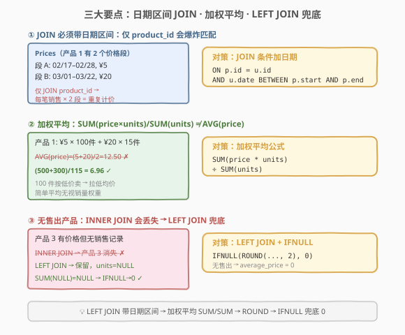
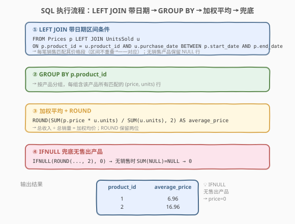
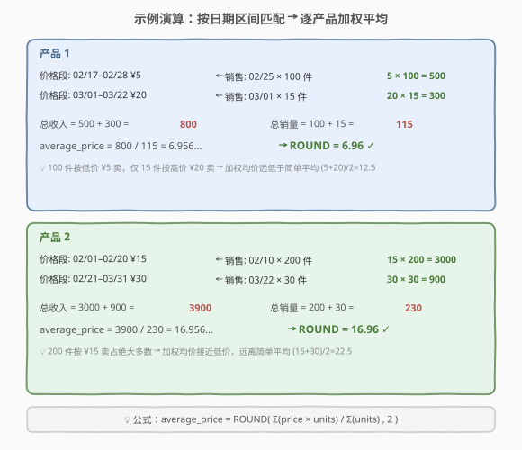

# LeetCode 平均售价 题解

## 1. 题目概述

- **标题 / 题号**：平均售价（#1251，easy）
- **链接**：https://leetcode.cn/problems/average-selling-price/
- **难度**：简单
- **标签**：SQL、LEFT JOIN、非等值连接、加权平均、GROUP BY、IFNULL、ROUND

**题意**：给定两张表：`Prices` 记录每个产品在**一段时期**内的售价（时间段不重叠），`UnitsSold` 记录每笔销售的日期与数量。要求计算**每种产品的平均售价**，即「总收入 ÷ 总销量」的加权平均，四舍五入到两位小数。若产品没有任何售出，则平均售价记为 0。

**表结构**：

```text
Table: Prices
+---------------+---------+
| Column Name   | Type    |
+---------------+---------+
| product_id    | int     |
| start_date    | date    |
| end_date      | date    |
| price         | int     |
+---------------+---------+
(product_id, start_date, end_date) 是主键。
每个产品的时间段不会重叠（同一产品价格段不交叉）。

Table: UnitsSold
+---------------+---------+
| Column Name   | Type    |
+---------------+---------+
| product_id    | int     |
| purchase_date | date    |
| units         | int     |
+---------------+---------+
可能包含重复行。
```

> ⚠️ 本题有三个关键点：① JOIN 条件**不止 product_id**，还需判断 `purchase_date` 落在 `[start_date, end_date]` 区间内（**非等值连接**）；② 平均售价是**加权平均** `SUM(price × units) / SUM(units)`，而非简单平均 `AVG(price)`；③ 无售出产品需用 `LEFT JOIN` 保留并经 `IFNULL` 兜底为 0。

**示例 1**：

```text
输入：
Prices 表:
+------------+------------+------------+--------+
| product_id | start_date | end_date   | price  |
+------------+------------+------------+--------+
| 1          | 2019-02-17 | 2019-02-28 | 5      |
| 1          | 2019-03-01 | 2019-03-22 | 20     |
| 2          | 2019-02-01 | 2019-02-20 | 15     |
| 2          | 2019-02-21 | 2019-03-31 | 30     |
+------------+------------+------------+--------+
UnitsSold 表:
+------------+---------------+-------+
| product_id | purchase_date | units |
+------------+---------------+-------+
| 1          | 2019-02-25    | 100   |
| 1          | 2019-03-01    | 15    |
| 2          | 2019-02-10    | 200   |
| 2          | 2019-03-22    | 30    |
+------------+---------------+-------+

输出：
+------------+---------------+
| product_id | average_price |
+------------+---------------+
| 1          | 6.96          |
| 2          | 16.96         |
+------------+---------------+
```

**解释**：

| product_id | 匹配过程 | 计算 | 结果 |
|------------|---------|------|------|
| 1 | 02/25 在 02/17–02/28 内 → 5×100；03/01 在 03/01–03/22 内 → 20×15 | $(500+300)/(100+15) = 6.96$ | **6.96** |
| 2 | 02/10 在 02/01–02/20 内 → 15×200；03/22 在 02/21–03/31 内 → 30×30 | $(3000+900)/(200+30) = 16.96$ | **16.96** |

**约束**：

- `Prices` 表主键为 `(product_id, start_date, end_date)`，同一产品的价格时间段不重叠
- `UnitsSold` 表可能包含重复行
- `average_price` 四舍五入到两位小数
- 产品无任何售出时 `average_price` 为 0
- 结果无顺序要求

## 2. 解题思路

### 2.1 暴力思路：逐产品逐笔匹配

最直觉的过程式思路：遍历每个产品，对该产品的每笔销售，找到 `purchase_date` 落在哪个价格段内，取对应 `price`，累加 `price × units` 与 `units`；最后做除法并取整。伪代码如下：

```text
for each product_id:
    total_revenue = 0
    total_units = 0
    for each sale in UnitsSold where product_id matches:
        for each price_row in Prices where product_id matches:
            if sale.purchase_date between price_row.start_date and price_row.end_date:
                total_revenue += price_row.price * sale.units
                total_units += sale.units
                break          # 区间不重叠，最多匹配一个价格段
    average_price = round(total_revenue / total_units, 2) if total_units > 0 else 0
    output(product_id, average_price)
```

但**纯 SQL 没有显式逐行循环**——「匹配 + 累加」需换成集合式表达：`JOIN`（含日期区间条件）一步完成匹配，`GROUP BY` + `SUM` 一步完成聚合。

### 2.2 核心观察：非等值 JOIN + 加权平均



本题的核心在于理解三个要点，缺一不可：

**要点①：JOIN 条件必须包含日期区间（非等值连接）**

若仅在 `product_id` 上 JOIN，每笔销售会与该产品的**所有**价格段做笛卡尔积——产品 1 有 2 个价格段、2 笔销售，会产生 4 行，每笔销售被重复计价。正确做法是在 JOIN 条件中**同时**判断 `purchase_date BETWEEN start_date AND end_date`：

$$
\text{JOIN 条件} = \underbrace{p.\text{product\_id} = u.\text{product\_id}}_{\text{等值}} \;\wedge\; \underbrace{u.\text{purchase\_date} \in [p.\text{start\_date},\; p.\text{end\_date}]}_{\text{非等值（区间判断）}}
$$

> 💡 **非等值连接**：常规 JOIN 多为等值连接（`a.id = b.id`），但本题的匹配条件含 `BETWEEN`（区间判断），属于**非等值连接**。由于题目保证同一产品的价格段不重叠，每笔销售**至多匹配一个**价格段——非等值条件不会产生一对多膨胀。

**要点②：加权平均，而非简单平均**

平均售价的定义是「总收入 ÷ 总销量」，即按销量加权的平均价格：

$$
\text{average\_price} = \text{ROUND}\Bigg(\frac{\displaystyle\sum_{i} \text{price}_i \times \text{units}_i}{\displaystyle\sum_{i} \text{units}_i},\; 2\Bigg)
$$

⚠️ 不能用 `AVG(price)`！以产品 1 为例：

| 方法 | 计算 | 结果 | 是否正确 |
|------|------|------|---------|
| `AVG(price)`（简单平均） | $(5 + 20) / 2$ | 12.50 | ✗ 无视销量权重 |
| `SUM(price×units)/SUM(units)`（加权平均） | $(5\times100 + 20\times15) / (100+15)$ | 6.96 | ✓ |

100 件按低价 ¥5 卖、仅 15 件按高价 ¥20 卖，加权均价 6.96 远低于简单平均 12.50——简单平均把两个价格段等权对待，完全忽略了「大部分销量发生在低价段」这一事实。

**要点③：LEFT JOIN + IFNULL 兜底无售出产品**

题目要求「无售出产品平均售价为 0」。若用 `INNER JOIN`，无销售记录的产品会从结果中消失。用 `LEFT JOIN` 保留这些产品，其 `units` 为 NULL，导致 `SUM(price × NULL) = NULL`、`SUM(NULL) = NULL`、`NULL / NULL = NULL`。外层 `IFNULL(..., 0)` 将 NULL 转为 0。

> 💡 **LEFT JOIN 的兜底链**：无匹配 → `units = NULL` → `price × NULL = NULL` → `SUM = NULL` → `NULL / NULL = NULL` → `ROUND(NULL, 2) = NULL` → `IFNULL(NULL, 0) = 0`。整条链从 NULL 一路传递到最终的 0，这正是 `IFNULL` 外层兜底的价值。

### 2.3 算法流程图



**逻辑执行步骤**：

| 步骤 | SQL 子句 | 作用 |
|------|----------|------|
| ① | `FROM Prices p LEFT JOIN UnitsSold u ON ... AND ... BETWEEN ...` | 按产品 + 日期区间匹配销售记录到价格段；无销售产品保留 NULL 行 |
| ② | `GROUP BY p.product_id` | 按产品分组 |
| ③ | `SUM(p.price * u.units) / SUM(u.units)` | 每组算总收入 ÷ 总销量 = 加权均价 |
| ④ | `ROUND(..., 2)` + `IFNULL(..., 0)` | 四舍五入到两位；无销售时兜底为 0 |

> 💡 **SQL 子句执行顺序**：`FROM`（含 `JOIN`）→ `WHERE` → `GROUP BY` → `HAVING` → `SELECT`（含 `SUM`）→ `ORDER BY`。`JOIN` 的 `ON` 条件在 `FROM` 阶段执行，先完成「价格段 ←→ 销售」的匹配，再由 `GROUP BY` 分组、`SUM` 聚合。

> ⚠️ **ON 条件 vs WHERE 条件**：`LEFT JOIN` 的日期区间判断必须放在 `ON` 子句中，而非 `WHERE`。若放 `WHERE`，无销售产品的 NULL 行会被 `WHERE purchase_date BETWEEN ...` 过滤掉（NULL 与任何值比较都为 false），导致 `LEFT JOIN` 退化为 `INNER JOIN`，无售出产品再次丢失。

### 2.4 示例演算

以示例 1 数据为例，逐步跟踪两个产品的匹配与计算过程：



**步骤 ①：LEFT JOIN 匹配**

每笔销售按 `product_id` + 日期区间匹配到唯一价格段（区间不重叠保证一一对应）：

| 产品 | 价格段 | 售价 | 匹配的销售 | 销量 | price × units |
|------|--------|------|-----------|------|---------------|
| 1 | 02/17–02/28 | 5 | 02/25 ✓ | 100 | 500 |
| 1 | 03/01–03/22 | 20 | 03/01 ✓ | 15 | 300 |
| 2 | 02/01–02/20 | 15 | 02/10 ✓ | 200 | 3000 |
| 2 | 02/21–03/31 | 30 | 03/22 ✓ | 30 | 900 |

**步骤 ②：GROUP BY + 加权平均**

| 产品 | Σ(price × units) | Σ(units) | 加权均价 | ROUND → average_price |
|------|------------------|----------|---------|----------------------|
| 1 | 500 + 300 = **800** | 100 + 15 = **115** | 800 / 115 = 6.956... | **6.96** |
| 2 | 3000 + 900 = **3900** | 200 + 30 = **230** | 3900 / 230 = 16.956... | **16.96** |

> 💡 若产品 3 有价格段但无销售：LEFT JOIN 保留其行（units=NULL）→ SUM=NULL → IFNULL → **0**。

## 3. 参考代码

### SQL（解法 A：LEFT JOIN + IFNULL，MySQL 推荐）

```sql
SELECT p.product_id,
       IFNULL(ROUND(SUM(p.price * u.units) / SUM(u.units), 2), 0) AS average_price
FROM Prices p
LEFT JOIN UnitsSold u
    ON p.product_id = u.product_id
    AND u.purchase_date BETWEEN p.start_date AND p.end_date
GROUP BY p.product_id;
```

> 💡 **写法要点**：
> - **`LEFT JOIN`**：以 `Prices` 为左表，保证无销售的产品也出现在结果中（右侧为 NULL，经 `IFNULL` 兜底为 0）。若用 `INNER JOIN`，无销售产品会丢失。
> - **`ON` 条件含 `BETWEEN`**：日期区间判断必须放在 `ON` 子句（而非 `WHERE`），否则 LEFT JOIN 的 NULL 行会被过滤掉。`p.product_id = u.product_id` 是等值连接，`u.purchase_date BETWEEN p.start_date AND p.end_date` 是非等值连接——两者用 `AND` 组合。
> - **`SUM(p.price * u.units) / SUM(u.units)`**：加权平均，先逐行算 `price × units`（单笔收入），再求和做除法。不能用 `AVG(price)`（简单平均，无视销量权重）。
> - **`ROUND(..., 2)`**：四舍五入到两位小数，包在 `SUM/SUM` 外层。
> - **`IFNULL(..., 0)`**：无销售时整条计算链产生 NULL，外层兜底为 0。
> - **`GROUP BY p.product_id`**：按产品分组，每组输出一行。

### SQL（解法 B：COALESCE 跨数据库兼容）

```sql
SELECT p.product_id,
       COALESCE(ROUND(SUM(p.price * u.units) / NULLIF(SUM(u.units), 0), 2), 0) AS average_price
FROM Prices p
LEFT JOIN UnitsSold u
    ON p.product_id = u.product_id
    AND u.purchase_date >= p.start_date
    AND u.purchase_date <= p.end_date
GROUP BY p.product_id;
```

> 💡 **写法要点**：
> - **`COALESCE`** 替代 `IFNULL`：`COALESCE` 是 ANSI SQL 标准函数（接受多个参数，返回首个非 NULL 值），在 PostgreSQL、SQL Server、SQLite 等均支持；`IFNULL` 是 MySQL 专有（仅两参数）。
> - **`NULLIF(SUM(u.units), 0)`**：显式处理除零——若 `SUM(units) = 0` 则转为 NULL，避免除零报错（部分数据库如 PostgreSQL 会抛 `division_by_zero` 异常，MySQL 则返回 NULL）。配合 `COALESCE` 兜底为 0。
> - **`>= AND <=`** 替代 `BETWEEN`：两者等价，`BETWEEN` 含两端边界。部分场景下 `>= AND <=` 可读性更佳且避免 `BETWEEN` 的边界歧义。

### Python（pandas）

```python
import pandas as pd

def average_selling_price(prices: pd.DataFrame, units_sold: pd.DataFrame) -> pd.DataFrame:
    merged = prices.merge(units_sold, on='product_id', how='left')
    matched = merged[
        merged['units'].isna() |
        ((merged['purchase_date'] >= merged['start_date']) &
         (merged['purchase_date'] <= merged['end_date']))
    ].copy()
    matched['revenue'] = matched['price'] * matched['units']
    agg = matched.groupby('product_id').agg(
        total_revenue=('revenue', 'sum'),
        total_units=('units', 'sum')
    ).reset_index()
    agg['average_price'] = (agg['total_revenue'] / agg['total_units']).fillna(0).round(2)
    return agg[['product_id', 'average_price']]
```

> 💡 **pandas 对照**：
> - `prices.merge(units_sold, on='product_id', how='left')` 对应 SQL 的 `LEFT JOIN ON product_id`。`how='left'` 保留全部 `Prices` 行。
> - `merged['units'].isna() | (...)` 对应 `ON` 条件中的日期区间判断。`units.isna()` 保留无销售行（对应 LEFT JOIN 的 NULL 行），日期比较对应 `BETWEEN`。ISO 格式日期字符串可直接用 `>=` / `<=` 比较（字典序 = 时间序）。
> - `matched['revenue'] = matched['price'] * matched['units']` 逐行算 `price × units`，对应 SQL 的 `SUM(p.price * u.units)` 中表达式部分。
> - `groupby('product_id').agg(...)` 对应 `GROUP BY product_id` + 两个 `SUM`。
> - `(total_revenue / total_units).fillna(0)` 对应 `IFNULL(..., 0)`——无销售时 `total_revenue` 和 `total_units` 均为 0 或 NaN，除法得 NaN，`fillna(0)` 兜底。
> - `.round(2)` 对应 `ROUND(..., 2)`。

## 4. 复杂度分析

| 维度 | 解法 A（IFNULL） | 解法 B（COALESCE） | pandas |
|------|------------------|--------------------|--------|
| **时间** | $O(n + m)$ | $O(n + m)$ | $O(n \cdot m_{\max})$ |
| **空间** | $O(k)$ | $O(k)$ | $O(n \cdot m_{\max})$ |
| **可移植性** | ✗ MySQL 专有 IFNULL | ✓ ANSI 标准 | ✓ pandas 环境 |
| **推荐度** | ✓ **MySQL 首选** | ✓ 跨数据库 | ✓ pandas 环境 |

> - $n$ = `Prices` 表行数，$m$ = `UnitsSold` 表行数，$k$ = 不同产品数，$m_{\max}$ = 单产品最大销售笔数
> - SQL 解法：JOIN 通过哈希连接或嵌套循环 + 索引实现。若在 `product_id` 上建索引，匹配复杂度接近 $O(n + m)$；无索引时嵌套循环为 $O(n \cdot m)$，但同一产品的价格段不重叠且数量少，实际接近线性
> - pandas：`merge` 产生按 `product_id` 的笛卡尔积，单产品展开为「价格段数 × 销售笔数」行，空间 $O(n \cdot m_{\max})$；对于本题数据规模（价格段少）完全可接受
> - **索引优化**：在 `UnitsSold(product_id, purchase_date)` 上建复合索引可显著加速 JOIN 匹配

## 5. 扩展：加权平均 vs 简单平均与除零处理

### 5.1 为什么不能用 AVG(price)

`AVG(price)` 计算的是「各价格段的算术平均」，把每个价格段**等权**对待。而本题的「平均售价」是按**销量加权**的平均——卖得多的价格段权重更大。

以产品 1 为例对比：

| 方法 | 公式 | 计算 | 结果 | 问题 |
|------|------|------|------|------|
| 简单平均 | `AVG(price)` | $(5+20)/2$ | 12.50 | 两个价格段等权，无视 100 vs 15 的销量差异 |
| 加权平均 | `SUM(price×units)/SUM(units)` | $(5\times100+20\times15)/115$ | 6.96 | 100 件低价拉低均价 ✓ |

> 💡 **判定准则**：当需要「按另一列加权的平均」时，永远用 `SUM(A × B) / SUM(B)` 而非 `AVG(A)`。`AVG(A)` 仅当所有行的权重（`B`）相同时才与加权平均等价。

### 5.2 IFNULL vs COALESCE vs NULLIF

| 函数 | 标准性 | 参数 | 用途 | 示例 |
|------|--------|------|------|------|
| `IFNULL(a, b)` | MySQL 专有 | 2 个 | a 为 NULL 则返回 b | `IFNULL(x, 0)` |
| `COALESCE(a, b, ...)` | ANSI 标准 | ≥ 2 个 | 返回首个非 NULL 值 | `COALESCE(x, y, 0)` |
| `NULLIF(a, b)` | ANSI 标准 | 2 个 | a = b 则返回 NULL | `NULLIF(sum, 0)` |

> 💡 **最佳实践**：MySQL 环境用 `IFNULL`（简洁）；跨数据库用 `COALESCE`（标准）。处理除零时，`NULLIF(分母, 0)` 将零分母转 NULL，再配合 `COALESCE` 兜底——这是最安全的写法，可避免 PostgreSQL 的 `division_by_zero` 异常。

### 5.3 日期区间匹配的其他写法

```sql
-- 写法 1：BETWEEN（含两端边界，最简洁）
ON u.purchase_date BETWEEN p.start_date AND p.end_date

-- 写法 2：>= AND <=（等价，更显式）
ON u.purchase_date >= p.start_date AND u.purchase_date <= p.end_date

-- 写法 3：DATEDIFF 判断（天数非负且在范围内）
ON DATEDIFF(u.purchase_date, p.start_date) >= 0
   AND DATEDIFF(p.end_date, u.purchase_date) >= 0
```

> ⚠️ `BETWEEN` 在 MySQL 中含两端边界（`>= start AND <= end`）。在需要**严格不含右端**的场景下应使用 `>= AND <`。

## 6. 面试要点

1. **为什么 JOIN 条件要加日期区间判断？**

   > 若仅 `JOIN ON product_id`，每笔销售会与该产品所有价格段做笛卡尔积——产品有 2 个价格段、2 笔销售就产生 4 行，每笔销售被重复计价。加上 `purchase_date BETWEEN start_date AND end_date` 后，每笔销售只匹配其所属的唯一价格段（题目保证区间不重叠），实现一一对应。

2. **为什么不能用 `AVG(price)` 而要用 `SUM(price×units)/SUM(units)`？**

   > `AVG(price)` 是简单平均，把各价格段等权对待。本题的「平均售价」是按销量加权的平均——100 件按 ¥5 卖、15 件按 ¥20 卖，加权均价 6.96 远低于简单平均 12.50。只有当各价格段销量相同时两者才等价。判定准则：需要按另一列加权时，永远用 `SUM(A×B)/SUM(B)`。

3. **日期区间判断为什么必须放 `ON` 而非 `WHERE`？**

   > `LEFT JOIN` 的 `ON` 条件在匹配阶段执行——无销售产品的行右侧为 NULL，但仍保留。若把日期判断放 `WHERE`，NULL 行的 `purchase_date BETWEEN ...` 为 false（NULL 与任何值比较均为 false），无销售产品会被过滤掉，`LEFT JOIN` 退化为 `INNER JOIN`，无售出产品再次丢失。`ON` 条件只影响匹配，不影响左表行的保留。

4. **`IFNULL(ROUND(SUM(...)/SUM(...), 2), 0)` 中 NULL 是怎么产生的？**

   > 无销售产品经 LEFT JOIN 后，`units` 为 NULL。`price × NULL = NULL`，`SUM(NULL) = NULL`，`NULL / NULL = NULL`，`ROUND(NULL, 2) = NULL`。NULL 一路传递到最外层，`IFNULL(NULL, 0)` 将其转为 0。这条 NULL 传递链是 `IFNULL` 外层兜底的基础。

5. **`COALESCE` 和 `IFNULL` 有什么区别？**

   > `IFNULL(a, b)` 是 MySQL 专有函数，只接受两个参数。`COALESCE(a, b, c, ...)` 是 ANSI SQL 标准，接受多个参数，返回首个非 NULL 值。跨数据库（PostgreSQL、SQL Server 等）应使用 `COALESCE`。此外，配合 `NULLIF(分母, 0)` 可安全处理除零，避免部分数据库抛异常。

> 💡 **一句话总结**：1251 是 SQL **"非等值 JOIN + 加权平均"招牌题**——核心就一句：`LEFT JOIN` 带 `purchase_date BETWEEN start_date AND end_date` 条件匹配价格段，`GROUP BY product_id` 后 `SUM(price×units)/SUM(units)` 算加权均价，`ROUND` 取两位，`IFNULL` 外层兜底无售出产品为 0。记住「日期区间放 ON 不放 WHERE」和「加权平均不是 AVG」，所有「区间匹配 + 加权统计」的 SQL 题都能套用。

## 同类练习题

| # | 题目 | 与本题的关联 |
|---|------|-------------|
| 1211 | [查询结果的质量和占比](https://leetcode.cn/problems/queries-quality-and-percentage/)（[站内题解](1211_查询结果的质量和占比.md)） | `GROUP BY` + `AVG(表达式)` + `ROUND`，同为「分组后聚合统计」SQL 基础题，对比理解 `AVG(表达式)` 与 `SUM/SUM` 加权平均的差异 |
| 1205 | [每月交易 II](https://leetcode.cn/problems/monthly-transactions-ii/)（[站内题解](1205_每月交易II.md)） | `GROUP BY` + 多指标聚合 + `UNION` 拼接，共享「分组后求和统计」模式 |
| 1241 | [每个帖子的评论数](https://leetcode.cn/problems/number-of-comments-per-post/)（[站内题解](1241_每个帖子的评论数.md)） | `LEFT JOIN` 保留无匹配主体 + `GROUP BY` 聚合计数，对照理解「LEFT JOIN 兜底」的通用范式 |
| 1068 | [产品销售分析 I](https://leetcode.cn/problems/product-sales-analysis-i/) | `JOIN` 两表 + 简单投影，对比理解「等值连接」与本题「非等值连接（含区间判断）」的差异 |
| 1174 | [即时食物配送 II](https://leetcode.cn/problems/immediate-food-delivery-ii/) | `GROUP BY` + `AVG(布尔)` 算比例，对照 `SUM/SUM` 加权平均与 `AVG(布尔)` 比例统计两种聚合范式 |
