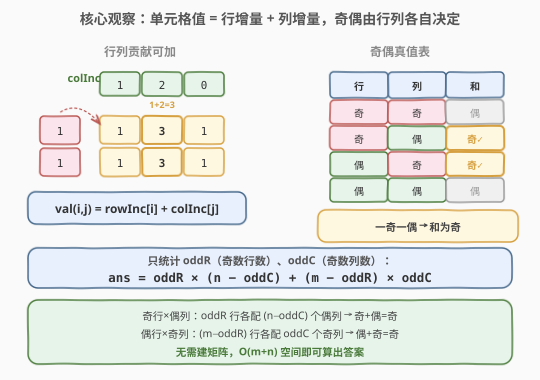
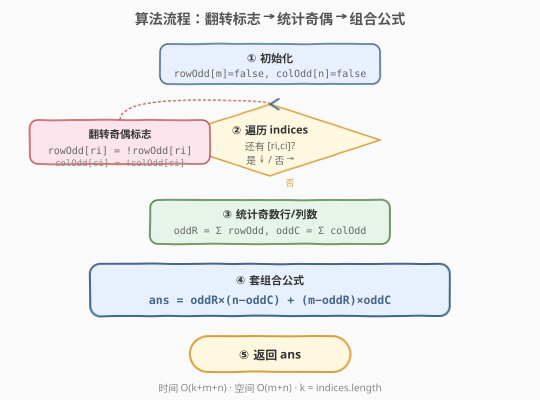
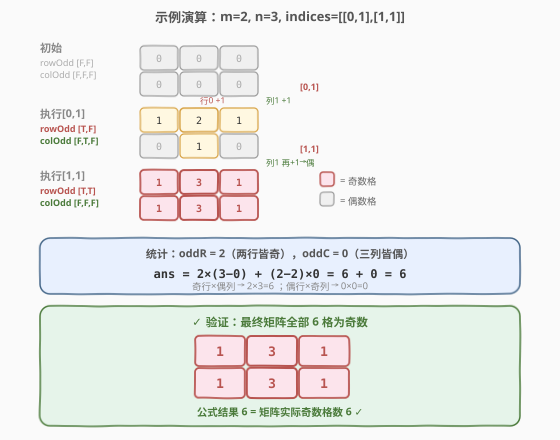

# 奇数值单元格的数目

- **题目名称**：奇数值单元格的数目
- **链接**：[1252. 奇数值单元格的数目](https://leetcode.cn/problems/cells-with-odd-values-in-a-matrix/)
- **难度**：简单
- **标签**：数组、数学、模拟

## 1. 题目概述

给定一个 $m \times n$ 的矩阵，初始时所有单元格的值为 $0$。再给定一个下标数组 `indices`，其中 `indices[i] = [ri, ci]`。对每个 `indices[i]`，执行以下操作：

- 将第 `ri` 行的**所有单元格**值加 $1$
- 将第 `ci` 列的**所有单元格**值加 $1$

注意：行列交叉处的单元格会被加 $2$（行加一次、列加一次）。全部操作执行完后，返回矩阵中**值为奇数**的单元格数目。

**示例 1**：

```text
输入：m = 2, n = 3, indices = [[0,1],[1,1]]
输出：6
解释：初始矩阵
  [0, 0, 0]
  [0, 0, 0]
执行 [0,1]：行 0 全体 +1，列 1 全体 +1
  [1, 2, 1]
  [0, 1, 0]
执行 [1,1]：行 1 全体 +1，列 1 全体 +1
  [1, 3, 1]
  [1, 3, 1]
奇数单元格共 6 个。
```

**示例 2**：

```text
输入：m = 2, n = 2, indices = [[1,1],[0,0]]
输出：0
解释：
执行 [1,1] → [0,1] / [1,2]
执行 [0,0] → [2,2] / [2,2]
全部为偶数，奇数单元格为 0。
```

**约束条件**：

- $1 \le m, n \le 50$
- $1 \le \text{indices.length} \le 100$
- $0 \le r_i < m$，$0 \le c_i < n$

> 💡 **关键信号**：$m, n \le 50$，`indices` 长度 $\le 100$，直接模拟矩阵完全可行（$O(k \times (m+n))$）。但题目只问**奇数单元格的数量**，不需要具体值——这正是用**奇偶性**做数学优化的信号。

---

## 2. 解题思路

### 2.1 暴力思路：直接模拟矩阵

最直观的做法：开一个 $m \times n$ 的矩阵，逐个执行 `indices` 中的行列增量操作，最后遍历统计奇数单元格。

- 每次 `[ri, ci]` 操作：行 $r_i$ 全体 $+1$（$n$ 次），列 $c_i$ 全体 $+1$（$m$ 次），共 $O(m + n)$
- $k$ 次操作后遍历矩阵 $O(m \times n)$
- 总时间 $O(k(m+n) + mn)$，空间 $O(mn)$

数据规模小，完全能过。但开辟整个矩阵只为了数奇偶，浪费空间。

### 2.2 核心观察：行列独立 + 奇偶性



关键洞察分两步：

**第一步：单元格值 = 行增量 + 列增量。**

每个操作 `[ri, ci]` 给第 $r_i$ 行所有格子 $+1$，给第 $c_i$ 列所有格子 $+1$。因此对任意格 $(i, j)$，它的最终值只取决于：

$$\text{val}(i, j) = \text{rowInc}[i] + \text{colInc}[j]$$

其中 $\text{rowInc}[i]$ 是第 $i$ 行被增量的总次数，$\text{colInc}[j]$ 是第 $j$ 列被增量的总次数。**行列贡献独立可加**。

> 💡 **为何可加？** 行操作和列操作互不干扰——行 $+1$ 只影响该行格子，列 $+1$ 只影响该列格子，交叉处恰好被加两次（一次行一次列），等于两者之和。这正是「贡献拆解」思想。

**第二步：奇偶性只看行、列各自的奇偶。**

$\text{val}(i,j)$ 为奇数，当且仅当 $\text{rowInc}[i]$ 与 $\text{colInc}[j]$ **一奇一偶**（奇 + 偶 = 奇，奇 + 奇 = 偶，偶 + 偶 = 偶）。

因此只需求：

- $\text{oddR}$ = 行增量次数为奇数的行数
- $\text{oddC}$ = 列增量次数为奇数的列数

则奇数单元格数为：

$$\text{ans} = \text{oddR} \times (n - \text{oddC}) + (m - \text{oddR}) \times \text{oddC}$$

> 第 1 项：奇数行（$\text{oddR}$ 行）× 偶数列（$n - \text{oddC}$ 列）= 奇+偶=奇
> 第 2 项：偶数行（$m - \text{oddR}$ 行）× 奇数列（$\text{oddC}$ 列）= 偶+奇=奇

**甚至不需要存增量次数**——只需用奇偶标志位，每次操作翻转对应行/列的奇偶即可。

### 2.3 算法流程图



流程说明：

1. 初始化两个布尔数组 `rowOdd[m]`、`colOdd[n]`（`false` = 偶次增量）
2. 遍历每个 `[ri, ci]`：翻转 `rowOdd[ri]` 和 `colOdd[ci]`（奇偶切换）
3. 统计 `oddR` = `rowOdd` 中 `true` 的个数，`oddC` = `colOdd` 中 `true` 的个数
4. 套公式返回 $\text{oddR} \times (n - \text{oddC}) + (m - \text{oddR}) \times \text{oddC}$

> ⚠️ **为何翻转而非累加？** 我们只关心增量次数的奇偶，不关心具体数值。$+1$ 使奇偶翻转一次，所以布尔翻转等价于计数 $+1$ 后取模 $2$，但更省空间（1 bit vs 整数）。

### 2.4 示例演算



以 `m=2, n=3, indices=[[0,1],[1,1]]` 为例：

| 步骤 | 操作 | rowOdd | colOdd | 说明 |
|------|------|--------|--------|------|
| 初始 | — | `[F, F]` | `[F, F, F]` | 全偶 |
| 1 | `[0,1]` | `[T, F]` | `[F, T, F]` | 行0翻转、列1翻转 |
| 2 | `[1,1]` | `[T, T]` | `[F, F, F]` | 行1翻转、列1再翻转回偶 |

统计：$\text{oddR} = 2$，$\text{oddC} = 0$

$$\text{ans} = 2 \times (3 - 0) + (2 - 2) \times 0 = 6 + 0 = 6 \checkmark$$

验证：最终矩阵

$$\begin{bmatrix} 1 & 3 & 1 \\ 1 & 3 & 1 \end{bmatrix}$$

全部 $6$ 个格子都是奇数，与公式结果一致。

---

## 3. 参考代码

### 方法一：奇偶标志数组（推荐，$O(m+n)$ 空间）

### C++

```cpp
class Solution {
  public:
    int oddCells(int m, int n, vector<vector<int>>& indices) {
        vector<bool> rowOdd(m, false), colOdd(n, false);
        for (auto& idx : indices) {
            rowOdd[idx[0]] = !rowOdd[idx[0]];
            colOdd[idx[1]] = !colOdd[idx[1]];
        }
        int oddR = 0, oddC = 0;
        for (bool b : rowOdd) oddR += b;
        for (bool b : colOdd) oddC += b;
        return oddR * (n - oddC) + (m - oddR) * oddC;
    }
};
```

### Python

```python
class Solution:
    def oddCells(self, m: int, n: int, indices: List[List[int]]) -> int:
        row_odd = [False] * m
        col_odd = [False] * n
        for r, c in indices:
            row_odd[r] = not row_odd[r]
            col_odd[c] = not col_odd[c]
        odd_r = sum(row_odd)
        odd_c = sum(col_odd)
        return odd_r * (n - odd_c) + (m - odd_r) * odd_c
```

> 💡 **核心要点**：不建矩阵，只维护行列奇偶标志。翻转代替累加取模，最后套组合公式一次算出答案。

### 方法二：直接模拟（直观，适合讲解对照）

### C++

```cpp
class Solution {
  public:
    int oddCells(int m, int n, vector<vector<int>>& indices) {
        vector<vector<int>> mat(m, vector<int>(n, 0));
        for (auto& idx : indices) {
            for (int j = 0; j < n; ++j) mat[idx[0]][j]++;
            for (int i = 0; i < m; ++i) mat[i][idx[1]]++;
        }
        int ans = 0;
        for (int i = 0; i < m; ++i)
            for (int j = 0; j < n; ++j)
                ans += mat[i][j] & 1;
        return ans;
    }
};
```

### Python

```python
class Solution:
    def oddCells(self, m: int, n: int, indices: List[List[int]]) -> int:
        mat = [[0] * n for _ in range(m)]
        for r, c in indices:
            for j in range(n):
                mat[r][j] += 1
            for i in range(m):
                mat[i][c] += 1
        return sum(mat[i][j] & 1 for i in range(m) for j in range(n))
```

---

## 4. 复杂度分析

| 维度 | 方法一（奇偶标志） | 方法二（直接模拟） |
|------|---------------------|---------------------|
| 时间复杂度 | $O(k + m + n)$ | $O(k(m+n) + mn)$ |
| 空间复杂度 | $O(m + n)$ | $O(mn)$ |

其中 $k = \text{indices.length}$。

- **方法一**：遍历 `indices` $O(k)$ 翻转标志，统计奇偶 $O(m+n)$，公式 $O(1)$。空间仅需两个标志数组。
- **方法二**：每次操作 $O(m+n)$，$k$ 次共 $O(k(m+n))$，最后遍历 $O(mn)$。空间需整个矩阵。

> 💡 本题 $m, n \le 50$，$k \le 100$，两种方法都毫秒级通过。面试中**先讲方法二建立直觉，再优化到方法一**展示奇偶性思维。

---

## 5. 扩展：$O(1)$ 额外空间

方法一用两个布尔数组，已是最优的 $O(m+n)$ 空间。若要追求**额外空间 $O(1)$**（不计输入输出），可以用一个整数的位来压缩行/列奇偶标志——但本题 $m, n \le 50$，一个 $64$ 位整数恰好能装下一行或一列的标志：

- `rowBits`：第 $i$ 位为 $1$ 表示第 $i$ 行奇
- `colBits`：第 $j$ 位为 $1$ 表示第 $j$ 列奇
- 翻转：`rowBits ^= (1ULL << ri)`
- 统计奇数行数：`__builtin_popcountll(rowBits)`

```cpp
class Solution {
  public:
    int oddCells(int m, int n, vector<vector<int>>& indices) {
        unsigned long long rowBits = 0, colBits = 0;
        for (auto& idx : indices) {
            rowBits ^= (1ULL << idx[0]);
            colBits ^= (1ULL << idx[1]);
        }
        int oddR = __builtin_popcountll(rowBits);
        int oddC = __builtin_popcountll(colBits);
        return oddR * (n - oddC) + (m - oddR) * oddC;
    }
};
```

> ⚠️ 此法依赖 $m, n \le 64$，本题恰好满足。若 $m$ 或 $n$ 超过 $64$ 则需回退到布尔数组。

---

## 6. 面试要点

1. **为什么可以不建矩阵就能数出奇数单元格？**

   每个格子的值等于「该行被增量次数 + 该列被增量次数」。值为奇当且仅当行、列增量一奇一偶。因此只需统计奇数行数 $\text{oddR}$ 和奇数列数 $\text{oddC}$，奇数格 = 奇行×偶列 + 偶行×奇列 = $\text{oddR}(n-\text{oddC}) + (m-\text{oddR})\text{oddC}$。

2. **为什么用翻转（toggle）而不是累加取模？**

   我们只关心增量次数的奇偶性。每次 $+1$ 使奇偶翻转一次，所以布尔翻转 `!flag` 等价于 `count++` 后 `count % 2`，但省去了整数存储和取模运算，更简洁高效。

3. **行列交叉处的格子被加两次，公式正确吗？**

   正确。交叉处 $(r_i, c_i)$ 在一次 `[ri, ci]` 操作中被行 $+1$ 和列 $+1$ 共加 $2$。在贡献拆解下，它的值仍是 $\text{rowInc}[i] + \text{colInc}[j]$——行增量包含这次 $+1$，列增量也包含这次 $+1$，加起来正好 $+2$，与直接模拟一致。

4. **方法一和方法二分别适合什么场景？**

   方法二（直接模拟）适合 $m \times n$ 较小、需要看到具体矩阵值的场景（如调试或题目要求输出矩阵）。方法一（奇偶标志）适合只问奇偶数量、$m \times n$ 很大的场景——如 $m, n = 10^9$ 时方法二爆内存，方法一仅需 $O(m+n)$ 仍可行（若 $m, n$ 也巨大则用哈希表存非零行列）。

5. **如果 $m, n$ 很大（如 $10^9$）但 `indices` 很少，怎么做？**

   行/列增量次数只有 `indices` 涉及的那些才非零。用哈希表记录被操作过的行列及其奇偶，未被操作的行/列增量次数为 $0$（偶）。奇数行只在哈希表中奇值为真的项，偶数行 = $m - \text{oddR}$（包括未被操作的大量全偶行）。公式不变，空间 $O(k)$。

---

## 7. 同类练习题

- [1252. 奇数值单元格的数目](https://leetcode.cn/problems/cells-with-odd-values-in-a-matrix/)：本题，行列贡献独立 + 奇偶性组合计数
- [73. 矩阵置零](https://leetcode.cn/problems/set-matrix-zeroes/)（[站内题解](../0001-0100/73_矩阵置零.md)）：同样用行列标志数组替代完整矩阵，$O(m+n)$ 空间记录零行列
- [289. 生命游戏](https://leetcode.cn/problems/game-of-life/)：矩阵上基于行列邻居的同步更新，关注状态变化而非存储整个矩阵
- [242. 有效的字母异位词](https://leetcode.cn/problems/valid-anagram/)：用计数数组/标志替代完整存储，关注统计量而非逐元素比较
