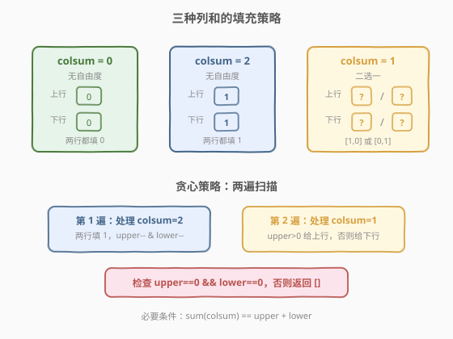
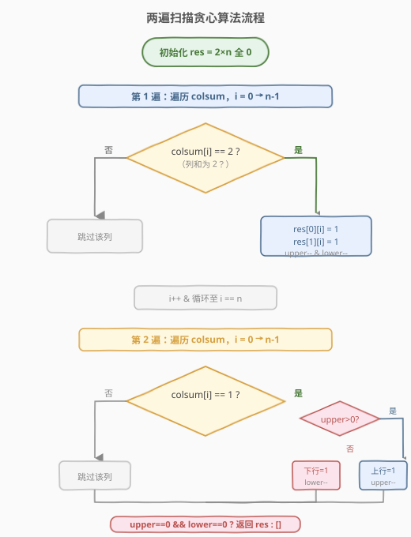
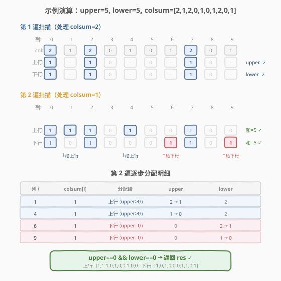

# LeetCode 重构 2 行二进制矩阵 题解

## 1. 题目概述

- **标题 / 题号**：重构 2 行二进制矩阵（#1253，medium）
- **链接**：https://leetcode.cn/problems/reconstruct-a-2-row-binary-matrix/
- **难度**：中等
- **标签**：贪心、数组、矩阵

**题意**：给你一个 **2 行 n 列**的二进制矩阵，其中每个元素为 `0` 或 `1`。已知：

- 第 0 行（上行）元素之和为 `upper`。
- 第 1 行（下行）元素之和为 `lower`。
- 第 `i` 列的元素之和为 `colsum[i]`（`colsum` 是长度为 `n` 的整数数组）。

请根据 `upper`、`lower` 和 `colsum` 重构出该矩阵。若有多种答案返回任意一个即可；若不存在合法答案返回空数组 `[]`。

**示例 1**：

```text
输入：upper = 2, lower = 1, colsum = [1,1,1]
输出：[[1,1,0],[0,0,1]]
解释：[[1,0,1],[0,1,0]] 和 [[0,1,1],[1,0,0]] 也是正确答案。
```

**示例 2**：

```text
输入：upper = 2, lower = 3, colsum = [2,2,1,1]
输出：[]
```

**示例 3**：

```text
输入：upper = 5, lower = 5, colsum = [2,1,2,0,1,0,1,2,0,1]
输出：[[1,1,1,0,1,0,0,1,0,0],[1,0,1,0,0,0,1,1,0,1]]
```

**约束**：

- `1 <= colsum.length <= 10^5`
- `0 <= upper, lower <= colsum.length`
- `0 <= colsum[i] <= 2`

> 💡 **列和只有三种取值**：`colsum[i]` 取值为 `0`、`1`、`2`。这是本题的关键切入点——每种取值对应的列内填充方式是确定的或半确定的。

## 2. 解题思路

### 2.1 暴力思路

枚举每一列的所有可能填充（`colsum[i] == 1` 时有 `[1,0]` 和 `[0,1]` 两种选择），用回溯搜索所有组合，检查是否满足行和约束。最坏情况 `2^n` 种组合，`n` 最大 `10^5`，显然不可行。

### 2.2 核心观察：按列和分类贪心



关键观察是 `colsum[i]` 只有 `0`、`1`、`2` 三种值，每种值的填充方式：

| `colsum[i]` | 上行 | 下行 | 自由度 |
|-------------|------|------|--------|
| `0` | `0` | `0` | **确定**——两行都填 0 |
| `2` | `1` | `1` | **确定**——两行都填 1 |
| `1` | `?` | `?` | **二选一**——恰有一行填 1 |

- `colsum[i] == 0` 和 `colsum[i] == 2` 的列**没有选择余地**，必须照填。
- `colsum[i] == 1` 的列需要决定把唯一的 `1` 分给上行还是下行。

> 💡 **贪心策略**：先处理所有 `colsum == 2` 的列（消耗 `upper` 和 `lower` 各一个配额），再处理 `colsum == 1` 的列——此时将 `1` 分给**剩余配额更多**的那一行（这里选上行优先即可，因为总配额恰好匹配时不会出错）。

**正确性论证**：

1. **必要条件**：`sum(colsum) == upper + lower`。否则无解，直接返回 `[]`。
2. **`colsum == 2` 的列**强制消耗上行和下行各 `count2` 个配额。若 `upper < count2` 或 `lower < count2`，无解。
3. **`colsum == 1` 的列**共 `count1` 个，需要分配 `count1` 个 `1`。此时上行剩余 `upper' = upper - count2`，下行剩余 `lower' = lower - count2`，且 `upper' + lower' == count1`。
4. 贪心分配：每个 `colsum == 1` 的列，若 `upper' > 0` 则给上行（`upper'--`），否则给下行（`lower'--`）。因为 `upper' + lower' == count1`，所以不会出现两者都为 0 却还有 `colsum == 1` 未处理的情况。

### 2.3 算法流程图



算法步骤：

1. 初始化 `res` 为 `2 × n` 的全 0 矩阵。
2. **第一遍扫描**：遍历 `colsum`，遇到 `colsum[i] == 2` 时令 `res[0][i] = res[1][i] = 1`，同时 `upper--`、`lower--`。
3. **第二遍扫描**：遍历 `colsum`，遇到 `colsum[i] == 1` 时：
   - 若 `upper > 0`：`res[0][i] = 1`，`upper--`
   - 否则：`res[1][i] = 1`，`lower--`
4. **合法性检查**：若 `upper != 0 || lower != 0`，返回 `[]`；否则返回 `res`。

> ⚠️ **为什么先处理 `colsum == 2`？** 因为 `colsum == 2` 的列没有选择余地，必须消耗上下行各一个配额。先处理它们可以准确算出剩余配额，再据此贪心分配 `colsum == 1` 的列。

### 2.4 示例演算

以 `upper = 5, lower = 5, colsum = [2,1,2,0,1,0,1,2,0,1]` 为例：



**第一遍扫描（处理 `colsum == 2`）**：

| 列 i | colsum[i] | 上行 | 下行 | upper | lower |
|------|-----------|------|------|-------|-------|
| 0 | 2 | 1 | 1 | 5→4 | 5→4 |
| 2 | 2 | 1 | 1 | 4→3 | 4→3 |
| 7 | 2 | 1 | 1 | 3→2 | 3→2 |

**第二遍扫描（处理 `colsum == 1`）**：

| 列 i | colsum[i] | 分配给 | 上行 | 下行 | upper | lower |
|------|-----------|--------|------|------|-------|-------|
| 1 | 1 | 上行（upper>0） | 1 | 0 | 2→1 | 2 |
| 4 | 1 | 上行（upper>0） | 1 | 0 | 1→0 | 2 |
| 6 | 1 | 下行（upper=0） | 0 | 1 | 0 | 2→1 |
| 9 | 1 | 下行（upper=0） | 0 | 1 | 0 | 1→0 |

**最终结果**：

```text
上行：[1, 1, 1, 0, 1, 0, 0, 1, 0, 0]   求和 = 5 ✓
下行：[1, 0, 1, 0, 0, 0, 1, 1, 0, 1]   求和 = 5 ✓
```

`upper == 0 && lower == 0`，校验通过。

## 3. 参考代码

### C++

```cpp
class Solution {
  public:
    vector<vector<int>> reconstructMatrix(int upper, int lower,
                                          vector<int>& colsum) {
        int n = colsum.size();
        vector<vector<int>> res(2, vector<int>(n, 0));

        for (int i = 0; i < n; i++) {
            if (colsum[i] == 2) {
                res[0][i] = 1;
                res[1][i] = 1;
                upper--;
                lower--;
            }
        }

        for (int i = 0; i < n; i++) {
            if (colsum[i] == 1) {
                if (upper > 0) {
                    res[0][i] = 1;
                    upper--;
                } else {
                    res[1][i] = 1;
                    lower--;
                }
            }
        }

        if (upper != 0 || lower != 0) return {};
        return res;
    }
};
```

### Python

```python
class Solution:
    def reconstructMatrix(self, upper: int, lower: int,
                          colsum: List[int]) -> List[List[int]]:
        n = len(colsum)
        res = [[0] * n for _ in range(2)]

        for i in range(n):
            if colsum[i] == 2:
                res[0][i] = 1
                res[1][i] = 1
                upper -= 1
                lower -= 1

        for i in range(n):
            if colsum[i] == 1:
                if upper > 0:
                    res[0][i] = 1
                    upper -= 1
                else:
                    res[1][i] = 1
                    lower -= 1

        if upper != 0 or lower != 0:
            return []
        return res
```

## 4. 复杂度分析

| 维度 | 复杂度 | 说明 |
|------|--------|------|
| 时间复杂度 | $O(n)$ | 两遍线性扫描，每列 $O(1)$ 处理 |
| 空间复杂度 | $O(n)$ | 存储结果矩阵 `2 × n`（不计输出则为 $O(1)$） |

> 💡 两遍扫描可以合并为一遍（先处理 `colsum == 2` 再处理 `colsum == 1` 的顺序在同一循环中用 `if/else` 即可保证），但拆成两遍逻辑更清晰，且时间复杂度不变。

## 5. 扩展：提前剪枝优化

在实际工程中，可在正式填充前加两个 $O(n)$ 的预检查，避免无意义填充：

1. **总和校验**：若 $\sum \text{colsum}[i] \neq \text{upper} + \text{lower}$，直接返回 `[]`。
2. **配额下界校验**：统计 `colsum == 2` 的列数 `count2`，若 `upper < count2 || lower < count2`，直接返回 `[]`。

```cpp
int total = accumulate(colsum.begin(), colsum.end(), 0);
if (total != upper + lower) return {};
int count2 = count(colsum.begin(), colsum.end(), 2);
if (upper < count2 || lower < count2) return {};
```

这两个检查虽不改变最坏复杂度，但在无解场景下可提前返回，避免无用的矩阵填充。

## 6. 面试要点

1. **为什么贪心分配 `colsum == 1` 的列时先给上行就行？**

   - 因为在 `upper' + lower' == count1` 成立的前提下，给上行分配 `min(upper', count1)` 个、给下行分配剩下的，最终两者都恰好归零。先给谁不影响正确性，只要保证不超配即可。选上行优先只是实现简洁。

2. **为什么必须先处理 `colsum == 2`？**

   - `colsum == 2` 的列强制两行都填 1，是不可协商的约束。若先处理 `colsum == 1` 并随意分配，可能把上行配额耗尽，导致后续 `colsum == 2` 无法满足。先处理强制约束，再贪心自由约束，是贪心设计的通用原则。

3. **`sum(colsum) != upper + lower` 时一定无解吗？**

   - 是的。每列的和累加就是整个矩阵所有元素之和，它必须等于 `upper + lower`（两行之和）。这是必要条件，违反则无解。

4. **本题与 [1605. 给定行和列求可行矩阵](https://leetcode.cn/problems/find-valid-matrix-given-row-and-column-sums/) 的区别？**

   - 1605 是 `m × n` 的一般矩阵，行列和为任意非负整数，用贪心逐格填充（每格取 `min(剩余行和, 剩余列和)`）。1253 是 2 行特化版且元素限为 0/1，列和只有 0/1/2，利用这一约束可以更直接地分类处理。

5. **能否用网络流建模？**

   - 可以：上行/下行为两个节点（容量为 `upper`/`lower`），每列为一个中间节点，列和约束转化为边容量。但这会引入 $O(n \cdot \text{maxflow})$ 的复杂度，远不如贪心 $O(n)$ 高效。对于 2 行特化场景，贪心是最优选择。

## 同类练习题

| # | 题目 | 与本题的关联 |
|---|------|-------------|
| 1605 | [给定行和列求可行矩阵](https://leetcode.cn/problems/find-valid-matrix-given-row-and-column-sums/) | 一般 `m × n` 矩阵的行列和重构，贪心取 `min(行和, 列和)` 逐格填充 |
| 1252 | [奇数值单元格的数目](https://leetcode.cn/problems/cells-with-odd-values-in-a-rectangular-matrix/) | 矩阵行列增量模拟，关注行列和的奇偶性 |
| 867 | [转置矩阵](https://leetcode.cn/problems/transpose-matrix/) | 矩阵行列变换的基础操作 |
| 73 | [矩阵置零](https://leetcode.cn/problems/set-matrix-zeroes/) | 利用行列标记的矩阵原地修改 |
| 54 | [螺旋矩阵](https://leetcode.cn/problems/spiral-matrix/) | 矩阵遍历的经典模式，与矩阵重构互为对照 |
