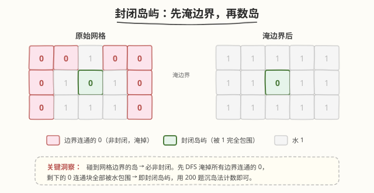
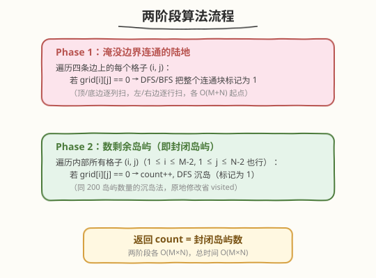
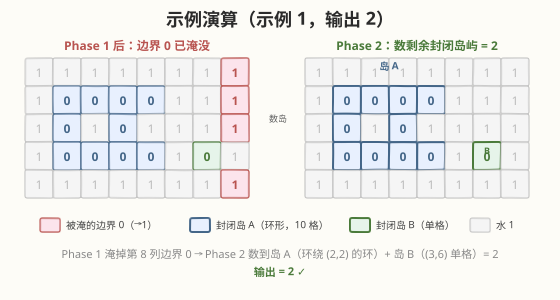

# 统计封闭岛屿的数目

- **题目名称**：统计封闭岛屿的数目
- **链接**：[1254. 统计封闭岛屿的数目](https://leetcode.cn/problems/number-of-closed-islands/)
- **难度**：中等
- **标签**：图、DFS、BFS、连通分量、矩阵

## 1. 题目概述

二维矩阵 `grid` 由 `0`（土地）和 `1`（水）组成。岛是由最大的 4 方向连通的 `0` 组成的群，**封闭岛**是一个**完全**由 `1` 包围（左、上、右、下）的岛。请返回封闭岛屿的数目。

> ⚠️ **关键区别**：与 [200. 岛屿数量](../0101-0200/200_岛屿数量.md) 不同，这里 `0` 是土地、`1` 是水（200 题相反）。更重要的是——**触碰网格边界的岛不算封闭岛**，因为边界外侧没有水包围。

**示例 1**：

```text
输入：grid = [
  [1,1,1,1,1,1,1,0],
  [1,0,0,0,0,1,1,0],
  [1,0,1,0,1,1,1,0],
  [1,0,0,0,0,1,0,1],
  [1,1,1,1,1,1,1,0]
]
输出：2
解释：灰色区域的岛屿是封闭岛屿（被 1 完全包围）。
```

**示例 2**：

```text
输入：grid = [
  [0,0,1,0,0],
  [0,1,0,1,0],
  [0,1,1,1,0]
]
输出：1
```

**示例 3**：

```text
输入：grid = [
  [1,1,1,1,1,1,1],
  [1,0,0,0,0,0,1],
  [1,0,1,1,1,0,1],
  [1,0,1,0,1,0,1],
  [1,0,1,1,1,0,1],
  [1,0,0,0,0,0,1],
  [1,1,1,1,1,1,1]
]
输出：2
```

**约束条件**：

- `1 <= grid.length, grid[0].length <= 100`
- `0 <= grid[i][j] <= 1`

---

## 2. 解题思路

### 2.1 暴力思路

对每个 `0` 连通块，遍历其中所有格子检查是否触碰边界。时间 `O(M × N)` 但需要额外 `visited` 矩阵和连通块分组，实现繁琐。

### 2.2 核心观察：先淹边界，再数岛



关键洞察：**触碰网格边界的岛一定不是封闭岛**（边界外没有水包围）。反之，不触碰边界的岛四周一定被 `1` 包围——即为封闭岛。

> 💡 **转化思路**：先把所有**与边界连通的 `0`** 淹没（DFS 标记为 `1`），这样剩下的 `0` 连通块**全部**是封闭岛。此时直接套用 [200. 岛屿数量](../0101-0200/200_岛屿数量.md) 的沉岛法计数即可。

这与 [130. 被围绕的区域](https://leetcode.cn/problems/surrounded-regions/) 思路完全一致——都是从边界出发做"反向标记"。

### 2.3 算法流程图



**Phase 1：淹没边界连通的陆地**

1. 遍历四条边（顶/底边逐列，左/右边逐行）上的每个格子
2. 若 `grid[i][j] == 0`，从该格出发 DFS，把整个连通块标记为 `1`

**Phase 2：数剩余岛屿（即封闭岛屿）**

3. 遍历所有格子，若 `grid[i][j] == 0`：`count++`，DFS 沉岛（标记为 `1`）
4. 返回 `count`

### 2.4 示例演算

以示例 1 为例，展示两阶段过程：



| 阶段 | 操作 | 结果 |
|------|------|------|
| Phase 1 | 从第 8 列（右边界）的 `0` 出发 DFS 淹没：`(0,7),(1,7),(2,7)` 连通 + `(4,7)` | 边界连通的 0 全部变 1 |
| Phase 2 ① | 遍历到 `(1,1)=0` → `count=1`，DFS 沉掉环形岛 A（10 格，环绕 `(2,2)` 的水） | count = 1 |
| Phase 2 ② | 遍历到 `(3,6)=0` → `count=2`，DFS 沉掉单格岛 B | count = 2 |

> 💡 岛 A 是一个"环形"连通块——`(1,1)→(1,2)→(1,3)→(1,4)` 顶部、`(3,1)→(3,2)→(3,3)→(3,4)` 底部、`(2,1)` 左侧、`(2,3)` 右侧绕过中心的水 `(2,2)`，四方向连通成环。岛 B 是被四格水包围的单格 `(3,6)`。两者都不触碰边界 → 均为封闭岛。

最终输出 `2`。

---

## 3. 参考代码

### 方法一：两阶段 DFS（先淹边界，再数岛）

#### C++

```cpp
class Solution {
    int m, n;
    int dx[4] = {0, 0, 1, -1};
    int dy[4] = {1, -1, 0, 0};

    void dfs(vector<vector<int>>& grid, int i, int j) {
        if (i < 0 || i >= m || j < 0 || j >= n || grid[i][j] != 0)
            return;
        grid[i][j] = 1; // 淹没，兼做 visited
        for (int d = 0; d < 4; d++)
            dfs(grid, i + dx[d], j + dy[d]);
    }

  public:
    int closedIsland(vector<vector<int>>& grid) {
        m = grid.size();
        n = grid[0].size();

        // Phase 1：淹没四条边连通的 0
        for (int j = 0; j < n; j++) {
            if (grid[0][j] == 0) dfs(grid, 0, j);
            if (grid[m - 1][j] == 0) dfs(grid, m - 1, j);
        }
        for (int i = 0; i < m; i++) {
            if (grid[i][0] == 0) dfs(grid, i, 0);
            if (grid[i][n - 1] == 0) dfs(grid, i, n - 1);
        }

        // Phase 2：数剩余封闭岛
        int count = 0;
        for (int i = 0; i < m; i++)
            for (int j = 0; j < n; j++)
                if (grid[i][j] == 0) {
                    count++;
                    dfs(grid, i, j);
                }
        return count;
    }
};
```

#### Python

```python
class Solution:
    def closedIsland(self, grid: List[List[int]]) -> int:
        m, n = len(grid), len(grid[0])
        dirs = [(0, 1), (0, -1), (1, 0), (-1, 0)]

        def dfs(i, j):
            if i < 0 or i >= m or j < 0 or j >= n or grid[i][j] != 0:
                return
            grid[i][j] = 1  # 淹没
            for di, dj in dirs:
                dfs(i + di, j + dj)

        # Phase 1：淹没四条边连通的 0
        for j in range(n):
            if grid[0][j] == 0:
                dfs(0, j)
            if grid[m - 1][j] == 0:
                dfs(m - 1, j)
        for i in range(m):
            if grid[i][0] == 0:
                dfs(i, 0)
            if grid[i][n - 1] == 0:
                dfs(i, n - 1)

        # Phase 2：数剩余封闭岛
        count = 0
        for i in range(m):
            for j in range(n):
                if grid[i][j] == 0:
                    count += 1
                    dfs(i, j)
        return count
```

---

## 4. 复杂度分析

| 维度 | 复杂度 | 说明 |
|------|--------|------|
| 时间复杂度 | `O(M × N)` | Phase 1 和 Phase 2 各遍历一次，每个格子最多被 DFS 访问一次（淹没后不再访问） |
| 空间复杂度 | `O(M × N)` | DFS 递归栈最坏深度 `M × N`（全是土地的极端情况）；BFS 则为队列空间 |

> 💡 两阶段合计仍是 `O(M × N)`——每个格子在整个过程中最多被访问两次（Phase 1 可能淹一次，Phase 2 可能沉一次），但淹没后 Phase 2 不会再访问，实际均摊 `O(1)`。

---

## 5. 扩展：单次 DFS 判定法

除了"先淹边界再数岛"的两阶段法，还有一种**单次遍历**的写法：DFS 返回当前连通块是否触碰边界，若不触碰则计数 +1。

```cpp
class Solution {
    int m, n;
    int dx[4] = {0, 0, 1, -1};
    int dy[4] = {1, -1, 0, 0};

    // 返回 true 表示该连通块是封闭岛（未触碰边界）
    bool dfs(vector<vector<int>>& grid, int i, int j) {
        if (i < 0 || i >= m || j < 0 || j >= n)
            return false; // 触碰边界 → 非封闭
        if (grid[i][j] != 0)
            return true;  // 水或已访问，不影响封闭性
        grid[i][j] = 1;   // 标记已访问
        bool closed = true;
        for (int d = 0; d < 4; d++)
            closed &= dfs(grid, i + dx[d], j + dy[d]);
        return closed;
    }

  public:
    int closedIsland(vector<vector<int>>& grid) {
        m = grid.size();
        n = grid[0].size();
        int count = 0;
        for (int i = 0; i < m; i++)
            for (int j = 0; j < n; j++)
                if (grid[i][j] == 0)
                    if (dfs(grid, i, j))
                        count++;
        return count;
    }
};
```

> ⚠️ **注意 `closed &= dfs(...)` 的短路陷阱**：这里**不能用** `&&`（短路求值会跳过后续 DFS 调用，导致连通块未被完整标记），必须用 `&`（按位与，非短路）确保四个方向都递归到。

两种方法对比：

| 维度 | 两阶段法 | 单次 DFS 判定法 |
|------|---------|----------------|
| 代码清晰度 | 两步分工明确，易读 | 一个 DFS 兼顾标记与判定，紧凑 |
| 边界处理 | 显式淹边界，逻辑直白 | DFS 内部越界返回 false，隐式 |
| 易错点 | 无 | `&` vs `&&` 短路问题 |
| 推荐 | 面试首选 | 进阶写法 |

---

## 6. 面试要点

1. **这题和 200 岛屿数量有什么区别？**

   - 200 题数**所有**岛屿（`1` 为陆地），1254 数**封闭**岛屿（`0` 为土地，且必须被 `1` 完全包围）。核心差异：触碰边界的岛不算封闭岛。

2. **为什么要"先淹边界"？**

   - 封闭岛的否定条件是"触碰边界"。先把所有边界连通的 `0` 淹掉，剩下的 `0` 连通块天然满足"不触碰边界" → 必为封闭岛。这样 Phase 2 就退化成标准的 200 题。

3. **单次 DFS 判定法中 `&` 和 `&&` 的区别？**

   - `&&` 是短路求值：若某方向已返回 `false`，后续方向不会递归 → 连通块未被完整标记，后续遍历会重复访问。`&` 是非短路，保证四个方向都递归完，连通块被完整淹没。

4. **能否用 BFS 替代 DFS？**

   - 可以。把递归换成队列 BFS 即可，逻辑完全一致。Python 大网格下 BFS 更安全（避免递归栈溢出），但本题 `M, N ≤ 100`，DFS 不会超限。

5. **如果不允许修改原 grid 怎么办？**

   - 需要额外的 `visited` 矩阵（`O(M × N)` 空间），用 `visited[i][j]` 替代 `grid[i][j] = 1` 的原地标记。或者 DFS 后恢复 grid 值（先存后还原）。

---

## 7. 同类练习题

- [200. 岛屿数量](https://leetcode.cn/problems/number-of-islands/)（[题解](../0101-0200/200_岛屿数量.md)）：沉岛法母题，1254 的 Phase 2 与其完全一致
- [130. 被围绕的区域](https://leetcode.cn/problems/surrounded-regions/)：同样的"从边界反向标记"思路，把边界连通的 `'O'` 保护起来
- [695. 岛屿的最大面积](https://leetcode.cn/problems/max-area-of-island/)：DFS 求连通块面积，沉岛法变体
- [1020. 飞地的数量](https://leetcode.cn/problems/number-of-enclaves/)：与 1254 互为镜像——统计**不能**走到边界的陆地格数（而非岛屿数）
- [1905. 统计子岛屿](https://leetcode.cn/problems/count-sub-islands/)：双 grid 下的岛屿包含关系判定，承接 1254 的边界淹没思想
