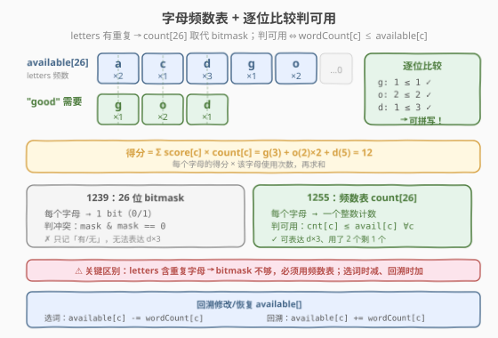
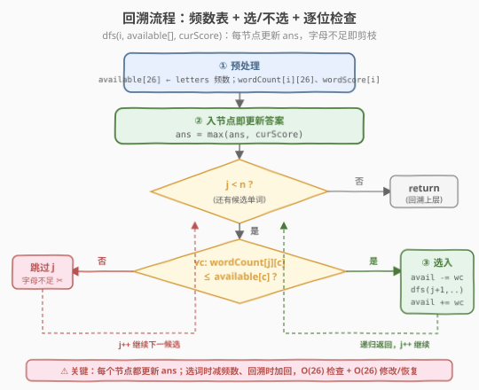
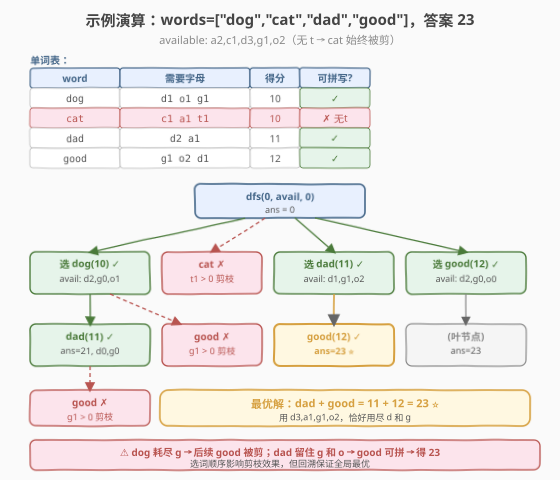

# LeetCode 得分最高的单词集合 题解

## 1. 题目概述

- **标题 / 题号**：得分最高的单词集合（#1255，hard）
- **链接**：https://leetcode.cn/problems/maximum-score-words-formed-by-letters/
- **难度**：困难
- **标签**：数组、字符串、回溯、位运算

**题意**：给定一份单词表 `words`、一个字母表 `letters`（可能含重复字母）以及每个字母对应的得分表 `score`（`score[0]` 对应 `'a'`，…，`score[25]` 对应 `'z'`）。求从 `words` 中选出**任意子集**，使得该子集中所有单词包含的字母总数不超过 `letters` 提供的字母数量（每个字母最多被使用一次），在此约束下最大化所有字母得分之和。

**示例 1**：

```text
输入：words = ["dog","cat","dad","good"], letters = ["a","a","c","d","d","d","g","o","o"],
     score = [1,0,9,5,0,0,3,0,0,0,0,0,0,0,2,0,0,0,0,0,0,0,0,0,0,0]
输出：23
解释：字母得分为 a=1, c=9, d=5, g=3, o=2。
     选 "dad"(5+1+5=11) + "good"(3+2+2+5=12) = 23。
     "dad"+"dog" 仅得 21。
```

**示例 2**：

```text
输入：words = ["xxxz","ax","bx","cx"], letters = ["z","a","b","c","x","x","x"],
     score = [4,4,4,0,0,0,0,0,0,0,0,0,0,0,0,0,0,0,0,0,0,0,0,5,0,10]
输出：27
解释：选 "ax"(4+5) + "bx"(4+5) + "cx"(4+5) = 27。"xxxz" 仅得 25。
```

**示例 3**：

```text
输入：words = ["leetcode"], letters = ["l","e","t","c","o","d"],
     score = [0,0,1,1,1,0,0,0,0,0,0,1,0,0,1,0,0,0,0,1,0,0,0,0,0,0]
输出：0
解释："leetcode" 需要 3 个 'e'，但 letters 中只有 1 个 'e'，无法拼写。
```

**约束**：

- $1 \le \text{words.length} \le 14$
- $1 \le \text{words[i].length} \le 15$
- $1 \le \text{letters.length} \le 100$
- `score.length == 26`
- $0 \le \text{score[i]} \le 10$
- `words[i]` 和 `letters[i]` 只包含小写英文字母

> 💡 **关键信号**：$\text{words.length} \le 14$ 是子集枚举/回溯的甜区——$2^{14} = 16384$，完全可接受。但与 [1239. 串联字符串的最大长度](1239_串联字符串的最大长度.md) 不同，本题的 `letters` **含重复字母**（如示例 1 有三个 `d`），26 位 bitmask 只能记录「有/无」而无法表达「3 个 d 用了 2 个还剩 1 个」，因此必须改用**字母频数表** `count[26]`。

## 2. 解题思路

### 2.1 暴力思路：枚举所有子集逐个验证

最直白的做法：枚举 `words` 的所有 $2^n$ 个子集，对每个子集把所有单词的字母用量加起来，检查是否超过 `letters` 提供的数量，若合法则计算得分并更新最大值。

能过，但有两个浪费：

1. **无剪枝**：即便当前已超用某字母，仍会继续尝试后续所有组合。
2. **重复计算**：每次从零开始统计子集的字母总用量，而非增量维护。

> ⚠️ 暴力法的瓶颈在于「无增量、无剪枝」。把字母用量从「每次重算」升级为「回溯中增量修改/恢复」，并在字母不足时直接剪枝，就是本题的最优解形态。

### 2.2 核心观察：字母频数表 + 逐位比较

关键直觉有三层。

**第一层：letters 有重复 → 用频数表 count[26] 而非 bitmask。** [1239](1239_串联字符串的最大长度.md) 中每个字母最多出现一次，26 位 bitmask 足以表达「用了/没用」。但本题 `letters` 可含重复字母（如 `["d","d","d"]`）， bitmask 的单比特 0/1 无法表达「3 个 d 用了 2 个剩 1 个」。必须改用**整数频数表** `available[26]`，每个槽位存该字母的剩余数量。



**第二层：单词可拼写 ⇔ 逐位比较 wordCount[c] ≤ available[c]。** 预处理每个单词的字母频数 `wordCount[i][26]` 后，判断单词 `i` 是否可拼写只需遍历 26 个字母位，确认每个字母的需求量不超过剩余量。全部满足才能选入；任一字母不足即剪枝。

**第三层：选词时减、回溯时加。** 与 1239 用标量 `curMask` 传递（无需恢复）不同，本题的 `available[]` 是**共享数组状态**：选入单词 `j` 时执行 `available[c] -= wordCount[j][c]`，递归返回后必须执行 `available[c] += wordCount[j][c]` 恢复，否则影响同层其他分支的判定。

> 💡 **频数表是「带容量的集合」**：1239 的 bitmask 是集合运算（并 `|`、交 `&`、判空 `== 0`），O(1) 搞定；1255 的频数表是带容量的多重集，判可用退化为 O(26) 的逐位比较，修改/恢复也是 O(26)。常数仍极小，$26 \times 2^{14} \approx 400K$ 次操作，毫秒级完成。

### 2.3 算法流程图

把「选/不选」回溯套上字母频数表：每层决策第 `j` 个单词，维护共享的 `available[]` 与累计得分 `curScore`。



完整步骤：

1. **预处理**：统计 `letters` 频数 → `available[26]`；统计每个单词的字母频数 → `wordCount[i][26]`，同时计算单词得分 → `wordScore[i]`。
2. **回溯** `dfs(i, curScore)`（`available[]` 为共享状态）：
   - **入节点即更新答案**：`ans = max(ans, curScore)`（每个节点都是一种合法方案，包括空集）。
   - 从 `j = i` 到 `n-1` 枚举下一个要选的单词：
     - 检查 `∀c: wordCount[j][c] ≤ available[c]`。
     - 若通过：`available[c] -= wordCount[j][c]`，递归 `dfs(j+1, curScore + wordScore[j])`，然后 `available[c] += wordCount[j][c]` 恢复。
     - 否则跳过 `j`（剪枝：字母不足）。
3. 返回 `ans`。

> ⚠️ **为什么 `available[]` 必须手动恢复？** 与 1239 的 `curMask`（按值传递，每层独立副本）不同，本题 `available[]` 是引用共享的数组。如果选入单词后不恢复，同层后续单词的判定会基于「已被扣减」的错误余量，导致漏选或误选。这是频数表回溯的核心易错点。

### 2.4 示例演算

以示例 1 为例：`words = ["dog","cat","dad","good"]`，`letters = ["a","a","c","d","d","d","g","o","o"]`。

预处理后各单词的字母需求与得分：

| 单词 | 需要字母 | 得分 | 可拼写? |
|------|----------|------|---------|
| `dog` | d1, o1, g1 | 5+2+3=10 | ✓ |
| `cat` | c1, a1, t1 | 9+1+0=10 | ✗（无 t） |
| `dad` | d2, a1 | 5+1+5=11 | ✓ |
| `good` | g1, o2, d1 | 3+2+2+5=12 | ✓ |

> ⚠️ **`cat` 始终被剪**：`letters` 中没有 `t`，`available['t'] = 0`，`cat` 需要 1 个 `t`，逐位比较时 `1 > 0` 立即剪枝。这个单词永远不会进入任何合法子集。



DFS 关键路径（`available` 简写为剩余字母）：

| 步骤 | 调用 | 决策 | available 变化 | curScore | ans | 说明 |
|------|------|------|---------------|----------|-----|------|
| 0 | dfs(0, 0) | 入节点 | a2,c1,d3,g1,o2 | 0 | 0 | 空方案 |
| 1 | dfs(1, 10) | 选 dog | a2,c1,**d2,g0**,o1 | 10 | 10 | dog 耗尽 g |
| 2 | dfs(3, 21) | 再选 dad | a1,c1,**d0**,g0,o1 | 21 | 21 | dad+dad=21 |
| 3 | — | 试 good | g1 > 0 ✗ | — | 21 | **g 已耗尽，剪枝** |
| 4 | dfs(3, 11) | 选 dad | a1,c1,**d1,g1**,o2 | 11 | 21 | 回到根选 dad |
| 5 | dfs(4, 23) | 再选 good | a1,c1,**d0,g0,o0** | 23 | **23** ⭐ | dad+good=23 |
| 6 | dfs(4, 12) | 选 good | a2,c1,**d2,g0**,o0 | 12 | 23 | 回到根选 good |

> 💡 **关键对比**：选 `dog` 后 `g` 被耗尽（`g: 0`），后续 `good` 无法选入（步骤 3 剪枝）；而选 `dad` 后 `g` 仍有余量（`g: 1`），`good` 可以选入（步骤 5），得到全局最优 23。这说明**选词顺序影响剪枝效果**，但回溯遍历所有分支保证了全局最优不会被遗漏。

## 3. 参考代码

### 方法一：回溯 + 字母频数表（推荐）

### C++

```cpp
// 得分最高的单词集合.cpp —— 回溯 + 字母频数表
// 编译: g++ -O2 -std=c++17 得分最高的单词集合.cpp -o maxscore
#include <functional>
#include <string>
#include <vector>
using namespace std;

class Solution {
  public:
    int maxScoreWords(vector<string>& words, vector<char>& letters, vector<int>& score) {
        int available[26] = {};
        for (char c : letters) available[c - 'a']++;

        int n = (int)words.size();
        int wc[14][26] = {};
        int ws[14] = {};
        for (int i = 0; i < n; i++) {
            for (char c : words[i]) {
                wc[i][c - 'a']++;
                ws[i] += score[c - 'a'];
            }
        }

        int ans = 0;
        function<void(int, int)> dfs = [&](int i, int curScore) {
            ans = max(ans, curScore);
            for (int j = i; j < n; j++) {
                bool ok = true;
                for (int c = 0; c < 26; c++)
                    if (wc[j][c] > available[c]) { ok = false; break; }
                if (!ok) continue;
                for (int c = 0; c < 26; c++) available[c] -= wc[j][c];
                dfs(j + 1, curScore + ws[j]);
                for (int c = 0; c < 26; c++) available[c] += wc[j][c];
            }
        };
        dfs(0, 0);
        return ans;
    }
};
```

### Python

```python
class Solution:
    def maxScoreWords(self, words: List[str], letters: List[str], score: List[int]) -> int:
        available = [0] * 26
        for c in letters:
            available[ord(c) - 97] += 1

        n = len(words)
        wc = []
        ws = []
        for w in words:
            cnt = [0] * 26
            s = 0
            for c in w:
                idx = ord(c) - 97
                cnt[idx] += 1
                s += score[idx]
            wc.append(cnt)
            ws.append(s)

        ans = 0

        def dfs(i: int, cur_score: int) -> None:
            nonlocal ans
            ans = max(ans, cur_score)
            for j in range(i, n):
                if all(wc[j][c] <= available[c] for c in range(26)):
                    for c in range(26):
                        available[c] -= wc[j][c]
                    dfs(j + 1, cur_score + ws[j])
                    for c in range(26):
                        available[c] += wc[j][c]

        dfs(0, 0)
        return ans
```

> 💡 **为什么 `available[]` 不作为参数传递？** 若将 `available[]` 作为函数参数按值传递，每次递归都要拷贝 26 个 `int`，空间从 $O(26)$ 升为 $O(n \times 26)$，且拷贝本身有常数开销。改为共享数组 + 手动恢复，空间仅 $O(26)$，修改/恢复各 $O(26)$，更高效。这是回溯法中「共享状态 + 修改/恢复」的经典范式。

### 方法二：位掩码枚举

不用递归，直接枚举所有 $2^n$ 个子集（用整数 `mask` 的每一位表示选/不选），对每个子集统计字母总用量并检查合法性。

### Python

```python
class Solution:
    def maxScoreWords(self, words: List[str], letters: List[str], score: List[int]) -> int:
        available = [0] * 26
        for c in letters:
            available[ord(c) - 97] += 1

        n = len(words)
        wc = []
        ws = []
        for w in words:
            cnt = [0] * 26
            s = 0
            for c in w:
                idx = ord(c) - 97
                cnt[idx] += 1
                s += score[idx]
            wc.append(cnt)
            ws.append(s)

        ans = 0
        for mask in range(1 << n):
            total = [0] * 26
            for i in range(n):
                if mask & (1 << i):
                    for c in range(26):
                        total[c] += wc[i][c]
            if all(total[c] <= available[c] for c in range(26)):
                sc = sum(ws[i] for i in range(n) if mask & (1 << i))
                ans = max(ans, sc)
        return ans
```

> ⚠️ **位掩码枚举与回溯的对比**：位掩码法枚举所有 $2^n$ 个子集，无法在「字母不足」时剪枝后续分支——每个 `mask` 独立验证。回溯法则在选入单词时即时检查字母余量，不足即跳过整棵子树。两者最坏时间相同，但回溯法有剪枝优势，实际运行更快。面试中推荐回溯法，位掩码法作为思路对照。

## 4. 复杂度分析

| 维度 | 方法一：回溯 + 频数表 | 方法二：位掩码枚举 |
|------|----------------------|------------------|
| **时间复杂度** | $O(2^n \cdot n \cdot 26)$ | $O(2^n \cdot n \cdot 26)$ |
| **空间复杂度** | $O(n + 26)$（递归栈 + available） | $O(26)$（total 数组） |
| **能否剪枝** | ✅ 字母不足即跳过子树 | ❌ 全量枚举 |
| **常数** | 小（增量修改/恢复） | 较大（每个 mask 从零统计） |

> ⚠️ 设 $n$ 为单词数（$\le 14$）。时间 $O(2^n \cdot n \cdot 26)$ 的来源：最坏情况下遍历 $2^n$ 个子集，每个子集需检查 $n$ 个单词的 26 个字母位。$n = 14$ 时 $2^{14} \times 14 \times 26 \approx 6\text{M}$，毫秒级完成。回溯法在字母不足时即时剪枝，实际节点数远小于 $2^n$。

## 5. 扩展：与 1239 的对比

本题与 [1239. 串联字符串的最大长度](1239_串联字符串的最大长度.md) 是「子集枚举 + 字母约束」家族的姐妹题，核心差异在于字母是否可重复：

| 维度 | 1239（串联字符串最大长度） | 1255（得分最高的单词集合） |
|------|--------------------------|--------------------------|
| **字母特性** | 每个字母唯一 | 字母可重复（如 d×3） |
| **状态表示** | 26 位 bitmask（0/1） | 频数表 count[26]（整数） |
| **判可用** | `mask & mask == 0`（$O(1)$） | `cnt[c] ≤ avail[c] ∀c`（$O(26)$） |
| **修改/恢复** | `curMask |= m`（标量，无需恢复） | `avail -= wc` / `avail += wc`（数组，需恢复） |
| **优化目标** | 最大长度（每字母权重 1） | 最大得分（字母有权重 score[]） |
| **自身重复** | 丢弃自身重复串（如 "aa"） | 不丢弃（"dad" 合法，只需字母够） |
| **n 上界** | 16 | 14 |

> 💡 **一句话总结**：1239 是「集合运算」题（并/交/判空，位运算 $O(1)$），1255 是「带容量多重集」题（比较/增减，数组 $O(26)$）。两者的回溯框架完全一致——start 索引循环 + 每节点更新答案，区别仅在状态表示与判定方式。

## 6. 面试要点

1. **为什么用频数表而不是 bitmask？**

   - `letters` 可含重复字母（如示例 1 有三个 `d`）。26 位 bitmask 的每个比特只能表示「有/无」，无法表达「3 个 d 用了 2 个剩 1 个」。频数表 `count[26]` 用整数记录每个字母的剩余数量，支持增减操作，是处理重复字母约束的标准做法。

2. **为什么每个节点都更新 `ans`，而不是只在叶子？**

   - 空集（不选任何单词，得分 0）和选任意子集都是合法方案。回溯树的每个节点对应一种已做出的选择组合（从根到该节点的路径），因此每个节点都应更新答案。若只在叶子更新，会遗漏中间合法方案（如只选一个单词就得到较高得分的情况）。

3. **`available[]` 为什么要手动恢复？**

   - `available[]` 是所有递归层共享的数组（引用传递）。选入单词时扣减字母数量，递归返回后必须加回，否则同层后续分支的判定会基于错误的余量。这与 1239 中 `curMask` 按值传递（每层独立副本）不同——标量按值传递天然隔离，数组按引用传递需手动恢复。

4. **与 1239 的核心区别是什么？**

   - 1239 的字母唯一，用 26 位 bitmask 表示字符集，判互斥用按位与 $O(1)$，并集用按位或，且 `curMask` 是标量无需恢复。1255 的字母可重复，用频数表 `count[26]` 表示字母余量，判可用需逐位比较 $O(26)$，修改/恢复也各 $O(26)$。两者回溯框架相同，差异在状态表示与操作复杂度。

5. **时间复杂度为什么是 $O(2^n \cdot n \cdot 26)$？**

   - 最坏情况遍历 $2^n$ 个子集。回溯法在每个节点枚举至多 $n$ 个候选单词，每个候选做 $O(26)$ 的逐位检查。$n \le 14$ 时 $2^{14} \times 14 \times 26 \approx 6\text{M}$，远在时限内。剪枝使实际节点数远小于理论值。

> 💡 **一句话总结**：$n \le 14$ + 字母有重复 → 频数表 `count[26]` + 回溯枚举子集，逐位比较判可用 $O(26)$，选词时减/回溯时加。时间 $O(2^n \cdot n \cdot 26)$、空间 $O(n + 26)$，是「小规模子集枚举 + 带容量约束」的招牌模板。

## 同类练习题

| # | 题目 | 与本题的关联 |
|---|------|-------------|
| 1239 | [串联字符串的最大长度](https://leetcode.cn/problems/maximum-length-of-a-concatenated-string-with-unique-characters/)（[站内题解](../1201-1300/1239_串联字符串的最大长度.md)） | 姐妹题，字母唯一用 bitmask，对照「集合运算」与「频数表」的不同范式 |
| 78 | [子集](https://leetcode.cn/problems/subsets/)（[站内题解](../0001-0100/78_子集.md)） | 回溯枚举子集的母题，start 索引循环模板的本题直接来源 |
| 474 | [一和零](https://leetcode.cn/problems/ones-and-zeroes/)（[站内题解](../0401-0500/474_一和零.md)） | 字符串 + 二维容量约束的背包问题，与本题的字母频数约束思路对照 |
| 1160 | [拼写单词](https://leetcode.cn/problems/find-words-that-can-be-formed-by-characters/) | 本题的简化版——只逐个检查单词能否拼写（不做子集优化），适合作为热身 |
| 39 | [组合总和](https://leetcode.cn/problems/combination-sum/) | 回溯 + 剪枝的招牌题，约束剪枝范式同源 |
