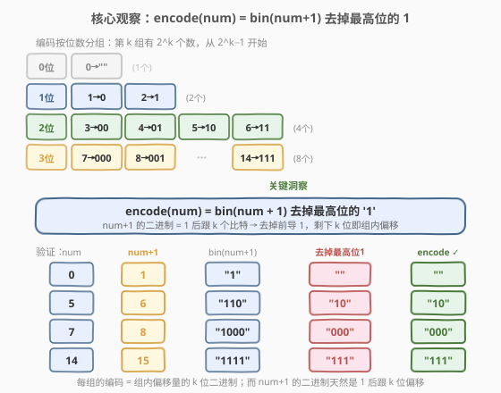
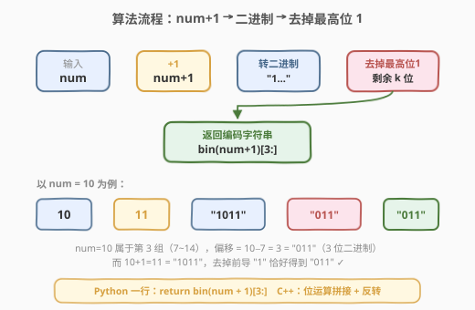
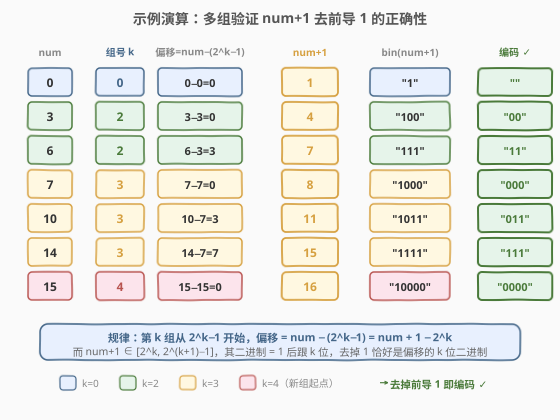

# 加密数字

- **题目名称**：加密数字
- **链接**：[1256. 加密数字](https://leetcode.cn/problems/encode-number/)
- **难度**：中等
- **标签**：数学、位运算、二进制

## 1. 题目概述

给定一个非负整数 `num`，返回它的**编码字符串**。编码规则如下表所示——每个非负整数被映射到一个由 `0`/`1` 组成的字符串，且字符串长度随 `num` 的增大而**逐组翻倍**：

| num | 编码 | num | 编码 | num | 编码 |
|-----|------|-----|------|-----|------|
| 0   | `""` | 5   | `"10"` | 10  | `"011"` |
| 1   | `"0"` | 6   | `"11"` | 11  | `"100"` |
| 2   | `"1"` | 7   | `"000"` | 12  | `"101"` |
| 3   | `"00"` | 8   | `"001"` | 13  | `"110"` |
| 4   | `"01"` | 9   | `"010"` | 14  | `"111"` |

**示例 1**：

```text
输入：num = 23
输出："1000"
```

**示例 2**：

```text
输入：num = 107
输出："101100"
```

**约束条件**：

- $0 \le \text{num} \le 10^8$

> 💡 **观察编码表的结构**：编码按**位数**分组——0 位 1 个数、1 位 2 个数、2 位 4 个数、3 位 8 个数……第 $k$ 组恰好有 $2^k$ 个数。这种「按位分组 + 组内顺序排列」的模式暗示着编码与**二进制**有深层联系。

---

## 2. 解题思路

### 2.1 暴力思路：分组模拟

观察编码表，编码按位数分组：

| 组号 $k$ | 位数 | $num$ 范围 | 组内编码 |
|----------|------|-----------|----------|
| 0 | 0 位 | 0 | `""` |
| 1 | 1 位 | 1 ~ 2 | `"0"`, `"1"` |
| 2 | 2 位 | 3 ~ 6 | `"00"`, `"01"`, `"10"`, `"11"` |
| 3 | 3 位 | 7 ~ 14 | `"000"` ~ `"111"` |
| $k$ | $k$ 位 | $2^k - 1$ ~ $2^{k+1} - 2$ | $k$ 位二进制 $0 \sim 2^k - 1$ |

暴力做法分三步：

1. **找组号 $k$**：找到满足 $2^k - 1 \le \text{num} < 2^{k+1} - 1$ 的 $k$（即 $\lfloor \log_2(\text{num}+1) \rfloor$）。
2. **算偏移**：$\text{offset} = \text{num} - (2^k - 1) = \text{num} + 1 - 2^k$。
3. **格式化**：将 `offset` 转为 $k$ 位二进制字符串（不足 $k$ 位前补零）。

> ⚠️ **暴力做法的痛点**：需要处理 `log2` 的精度问题、补零的边界情况（`num=0` 时 $k=0$，返回空串），代码容易出 off-by-one。

### 2.2 核心观察：encode(num) = bin(num+1) 去掉最高位的 1



> 💡 **关键洞察**：把 `num` 加 1 后转二进制，再去掉最高位的 `1`，剩下的恰好就是编码！

$$\text{encode}(\text{num}) = \text{bin}(\text{num} + 1) \text{ 去掉最高位的 } 1$$

**为什么这个技巧成立？** 数学推导如下：

1. **分组起点**：第 $k$ 组从 $2^k - 1$ 开始（前 $k$ 组累计 $1 + 2 + 4 + \cdots + 2^{k-1} = 2^k - 1$ 个数）。
2. **组内偏移**：$\text{offset} = \text{num} - (2^k - 1) = \text{num} + 1 - 2^k$。
3. **num+1 的范围**：当 $\text{num} \in [2^k - 1,\ 2^{k+1} - 2]$ 时，$\text{num}+1 \in [2^k,\ 2^{k+1} - 1]$。
4. **二进制结构**：$2^k \le \text{num}+1 < 2^{k+1}$ 意味着 $\text{num}+1$ 的二进制恰好是 **`1` 后跟 $k$ 个比特**。
5. **去掉前导 1**：前导 `1` 代表 $2^k$，去掉后剩余的 $k$ 位正好是 $\text{offset} = \text{num}+1 - 2^k$ 的 $k$ 位二进制表示——这正是编码！

以 `num = 10` 为例验证：

- $k = 3$（第 3 组：$7 \sim 14$），$\text{offset} = 10 - 7 = 3$
- $\text{num}+1 = 11$，二进制 `"1011"`，去掉前导 `"1"` → `"011"`
- $3$ 的 3 位二进制 = `"011"` ✓

### 2.3 算法流程图



流程极其简洁，三步线性管道：

1. **加 1**：`n = num + 1`
2. **转二进制**：得到 `"1"` 后跟 $k$ 个比特的字符串
3. **去掉最高位 1**：截掉首字符，剩下的 $k$ 位即为编码

> 💡 **Python 一行解法**：`bin(num + 1)` 返回 `"0b1011"` 格式，`[3:]` 跳过 `"0b"`（2 字符）+ 前导 `"1"`（1 字符）= 跳过 3 字符，恰好得到编码。

### 2.4 示例演算



以多个 `num` 验证，覆盖跨组边界（`num=6→7` 从 2 位跳到 3 位，`num=14→15` 从 3 位跳到 4 位）：

| num | 组号 $k$ | 偏移 $=\text{num}-(2^k{-}1)$ | num+1 | bin(num+1) | 去掉最高位 1 | 编码 ✓ |
|-----|---------|----------------------------|-------|------------|-------------|--------|
| 0 | 0 | $0-0=0$ | 1 | `"1"` | `""` | `""` |
| 3 | 2 | $3-3=0$ | 4 | `"100"` | `"00"` | `"00"` |
| 6 | 2 | $6-3=3$ | 7 | `"111"` | `"11"` | `"11"` |
| 7 | 3 | $7-7=0$ | 8 | `"1000"` | `"000"` | `"000"` |
| 10 | 3 | $10-7=3$ | 11 | `"1011"` | `"011"` | `"011"` |
| 14 | 3 | $14-7=7$ | 15 | `"1111"` | `"111"` | `"111"` |
| 15 | 4 | $15-15=0$ | 16 | `"10000"` | `"0000"` | `"0000"` |

> 💡 **跨组边界是最容易出错的测试点**：`num=6`（2 位最后一行）和 `num=7`（3 位第一行）的 `num+1` 分别是 7 和 8，二进制从 `"111"` 变成 `"1000"`——去掉前导 1 后从 `"11"` 变成 `"000"`，恰好对应 2 位→3 位的跳变。

---

## 3. 参考代码

### 方法一：内置函数（最简洁）

#### C++

```cpp
class Solution {
  public:
    string encode(int num) {
        string s = bitset<32>(num + 1).to_string();
        return s.substr(s.find('1') + 1);
    }
};
```

#### Python

```python
class Solution:
    def encode(self, num: int) -> str:
        return bin(num + 1)[3:]
```

> 💡 **Python `bin(num+1)[3:]` 原理**：`bin()` 返回 `"0b..."` 格式（如 `bin(11)` = `"0b1011"`）。`[3:]` 跳过 `"0b"`（索引 0-1）和前导 `"1"`（索引 2），从索引 3 开始截取，恰好得到编码。`num=0` 时 `bin(1)` = `"0b1"`，`[3:]` 返回空串 `""` ✓。

### 方法二：手动位运算拼接（不依赖内置进制转换）

#### C++

```cpp
class Solution {
  public:
    string encode(int num) {
        string s;
        for (int n = num + 1; n > 1; n >>= 1)
            s += (char)('0' + (n & 1));
        reverse(s.begin(), s.end());
        return s;
    }
};
```

#### Python

```python
class Solution:
    def encode(self, num: int) -> str:
        s = []
        n = num + 1
        while n > 1:
            s.append(str(n & 1))
            n >>= 1
        return ''.join(reversed(s))
```

> ⚠️ **方法二的循环条件是 `n > 1` 而非 `n > 0`**：因为要**跳过最高位的 1**。当 `n` 右移到只剩 1 时停止循环——这个 1 就是被去掉的前导位。`num=0` 时 `n=1`，循环不执行，返回空串 `""` ✓。

---

## 4. 复杂度分析

| 方法 | 时间复杂度 | 空间复杂度 | 说明 |
|------|-----------|-----------|------|
| 内置函数 | $O(\log \text{num})$ | $O(\log \text{num})$ | `bin()` / `bitset` 转换的位数等于结果长度 |
| 手动位运算 | $O(\log \text{num})$ | $O(\log \text{num})$ | 循环次数 = 编码位数 $k = \lfloor \log_2(\text{num}+1) \rfloor$ |

> 💡 编码位数 $k = \lfloor \log_2(\text{num}+1) \rfloor$。当 $\text{num} = 10^8$ 时 $k \approx 27$，实际为常数级。两种方法时间空间同为 $O(\log \text{num})$，内置函数法代码更简洁，手动法更通用（不依赖语言特性）。

---

## 5. 扩展：与「满二叉树编号」的等价视角

编码表还可以从**满二叉树**的角度理解：将所有非负整数映射到一棵无限满二叉树的节点上——

- **根节点**（第 0 层）对应 `num = 0`，编码 `""`（空路径）
- **第 1 层**（2 个节点）对应 `num = 1, 2`，编码 `"0"`, `"1"`（左/右路径）
- **第 $k$ 层**（$2^k$ 个节点）对应 `num = 2^k - 1 \sim 2^{k+1} - 2$，编码为从根到该节点的 $k$ 步路径（`0`=左、`1`=右）

在这种视角下，`num + 1` 恰好是该节点在**层序遍历（BFS）中的全局序号**（从 1 开始），而其二进制去掉前导 1 就是**从根到该节点的路径编码**。这与 [1028. 从先序遍历还原二叉树](https://leetcode.cn/problems/recover-a-tree-from-preorder-traversal/) 中的「深度-值」编码有异曲同工之妙。

> 💡 **与 168 的对比**：[168. Excel表列名称](../0001-0100/168_Excel表列名称.md) 是「1-indexed 进制转换」（先减 1 再取余），而本题是「$+1$ 后去掉前导 1」。两者都涉及 off-by-one 修正，但方向相反——168 是分解时减 1 归零，1256 是合成时加 1 对齐二进制。

---

## 6. 面试要点

1. **如何快速发现 num+1 的规律？**

   - 先列出编码表前 15 行，观察分组模式：每组个数是 $1, 2, 4, 8, \ldots$（$2^k$）。然后把 `num` 和 `num+1` 的二进制并排列出，会发现 `num+1` 的二进制去掉首位 1 恰好等于编码。**面试时列表到 14 即可看出规律**。

2. **为什么是 `num + 1` 而不是 `num`？**

   - 因为第 0 组只有一个数（`num=0`），它「占了」二进制 `"1"` 的位置。从 `num=1` 开始才是真正的编码序列，所以整体偏移了 1。加 1 是把 `num=0` 映射到二进制 `1`（0 位编码），`num=1` 映射到 `10`（1 位编码 `"0"`），以此类推。

3. **`num = 0` 时为什么返回空串？**

   - `num=0` 时 `num+1=1`，二进制 `"1"`，去掉前导 1 后为空串 `""`。这对应第 0 组（0 位编码），唯一的编码就是空字符串——根节点没有路径。

4. **方法二中循环条件 `n > 1` 的含义？**

   - `n = num + 1` 的二进制形如 `1xxx...`。循环每次取最低位（`n & 1`）然后右移（`n >>= 1`），当 `n` 缩到只剩 1 时停止——这个 1 就是被去掉的前导位。如果写成 `n > 0`，会把前导 1 也编码进去，多出一位。

5. **跨组边界如何测试？**

   - 测试 `num = 2^k - 2`（第 $k$ 组最后一个）和 `num = 2^k - 1`（第 $k+1$ 组第一个）。例如 `num=6`（编码 `"11"`）和 `num=7`（编码 `"000"`），`num+1` 分别是 7（`"111"`）和 8（`"1000"`），去掉前导 1 后位数从 2 跳到 3。

---

## 7. 同类练习题

- [168. Excel表列名称](https://leetcode.cn/problems/excel-sheet-column-title/)（[题解](../0001-0100/168_Excel表列名称.md)）：同为「整数→字符串」编码，对比 1-indexed 进制转换的先减 1 与本题的加 1 去前导
- [400. 第 N 位数字](https://leetcode.cn/problems/nth-digit/)（[题解](../0301-0400/400_第N位数字.md)）：按位数分组定位数字，与本题的「按位分组」思路一致
- [504. 七进制数](https://leetcode.cn/problems/base-7/)：标准进制转换（含负数），对比「含 0 数码」的普通进制与本题的编码映射
- [171. Excel表列序号](https://leetcode.cn/problems/excel-sheet-column-number/)：168 的逆问题（合成方向），与本题合看可完整理解「编码↔整数」双向映射
- [89. 格雷编码](https://leetcode.cn/problems/gray-code/)（[题解](../0001-0100/89_格雷编码.md)）：另一类「整数→二进制串」的编码映射，公式 $G(i) = i \oplus (i \gg 1)$
