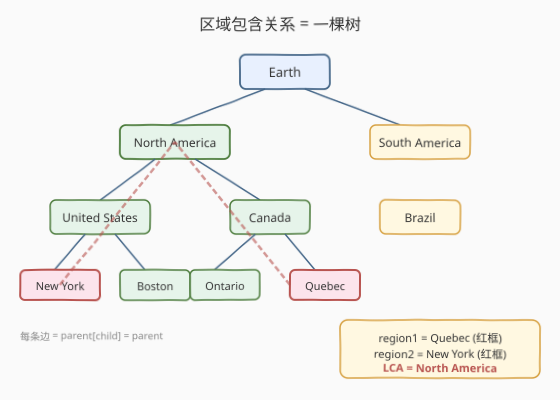
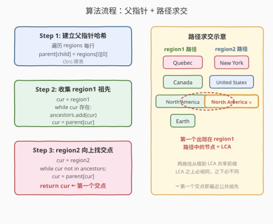
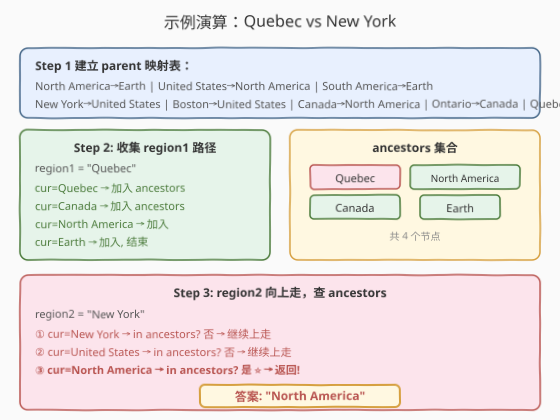

# 最小公共区域

- **题目名称**：最小公共区域
- **链接**：[1257. 最小公共区域](https://leetcode.cn/problems/smallest-common-region/)
- **难度**：中等
- **标签**：树、哈希表、最近公共祖先

## 1. 题目概述

给定若干个区域列表 `regions`，其中每个列表 `regions[i] = [region_a, region_b, region_c, ...]` 表示 `region_a` **包含**后面所有的区域（`region_b`、`region_c` 等）。包含关系具有传递性：若 `X` 包含 `Y`，`Y` 包含 `Z`，则 `X` 包含 `Z`。每个区域也包含自身。

再给定两个区域 `region1` 和 `region2`，求**同时包含这两个区域的最小区域**（即最近的公共祖先区域）。

**示例 1**：

```text
输入：
regions = [["Earth","North America","South America"],
            ["North America","United States","Canada"],
            ["United States","New York","Boston"],
            ["Canada","Ontario","Quebec"],
            ["South America","Brazil"]]
region1 = "Quebec"
region2 = "New York"
输出："North America"
解释：Quebec 属于 Canada，Canada 属于 North America；
      New York 属于 United States，United States 属于 North America。
      North America 是同时包含两者的最小区域。
```

**示例 2**：

```text
输入：
regions = [["Earth", "North America", "South America"],
            ["North America", "United States", "Canada"],
            ["United States", "New York", "Boston"],
            ["Canada", "Ontario", "Quebec"],
            ["South America", "Brazil"]]
region1 = "Canada"
region2 = "South America"
输出："Earth"
```

**约束条件**：

- $2 \le \text{regions.length} \le 10^4$
- `regions[i].length >= 2`
- 所有区域名字互不相同
- 区域名字由字母和空格组成
- `region1 != region2`，且两者都存在于区域树中

> 💡 **本质观察**：包含关系天然构成一棵**树**——每个列表的第一个元素是父节点，后面的元素是子节点。求最小公共区域 = 求树上的**最近公共祖先（LCA）**。与 [236. 二叉树的最近公共祖先](../0201-0300/236_二叉树的最近公共祖先.md) 的区别在于：这是一棵**一般树（多叉树）**，且以**父指针**形式给出，而非二叉树的左右子节点。

---

## 2. 解题思路

### 2.1 暴力思路：建树后 DFS

最直观的做法是先根据 `regions` 构建出完整的多叉树（邻接表），找到根节点（唯一不出现在任何子列表首位的区域），然后套用 [236](../0201-0300/236_二叉树的最近公共祖先.md) 的后序 DFS 思路求 LCA。

缺点是：需要额外的建树开销和找根步骤，且 DFS 递归对于深度较大的树可能有栈溢出风险。更重要的是——题目给的信息本质是**父子关系**，而非树的完整结构，直接利用父指针更高效。

### 2.2 核心观察：父指针 + 路径求交



> 💡 **关键洞察**：每行 `regions[i]` 的第一个元素是父，其余都是子。只需构建一个 `child → parent` 的哈希映射，就能从任意节点**向上追溯到根**。两条向上路径的第一个交点就是 LCA。

这和 [236 题](../0201-0300/236_二叉树的最近公共祖先.md)中「带父指针的迭代法」思路完全一致（见 236 面试要点第 5 条），只是本题天然带父指针，无需额外构建。

**路径求交的正确性**：

1. 从 `region1` 向上到根的路径 = `region1` 的所有祖先（含自身）。
2. 从 `region2` 向上到根的路径 = `region2` 的所有祖先（含自身）。
3. 两条路径**从根到 LCA 的部分完全相同**（共享前缀），LCA 之上相同、之下不同。
4. 因此 `region2` 向上走时，**第一个出现在 `region1` 路径集合中的节点**就是 LCA。

### 2.3 算法流程图



三步线性流程：

1. **建父指针哈希**：遍历 `regions`，对每行的每个子区域，记录 `parent[child] = regions[i][0]`。
2. **收集 `region1` 祖先**：从 `region1` 出发，沿父指针向上，将沿途所有节点加入哈希集合 `ancestors`。
3. **`region2` 向上找交点**：从 `region2` 出发，沿父指针向上，第一个在 `ancestors` 中的节点即为答案。

> 💡 **为什么不用找根？** 根节点是唯一没有父指针的区域（不在 `parent` 映射中），向上追溯自然终止。无需预先识别根。

### 2.4 示例演算



以示例 1（`region1 = "Quebec"`, `region2 = "New York"`）为例：

**Step 1**：遍历 `regions` 建立父指针映射：

| child | parent |
|-------|--------|
| North America | Earth |
| United States | North America |
| South America | Earth |
| New York | United States |
| Boston | United States |
| Canada | North America |
| Ontario | Canada |
| Quebec | Canada |
| Brazil | South America |

**Step 2**：从 `Quebec` 向上收集祖先：

```
Quebec → Canada → North America → Earth → (无父, 停止)
ancestors = {Quebec, Canada, North America, Earth}
```

**Step 3**：从 `New York` 向上找交点：

| 步骤 | 当前节点 | 在 ancestors 中? | 动作 |
|------|---------|-----------------|------|
| ① | New York | 否 | 继续上走 |
| ② | United States | 否 | 继续上走 |
| ③ | North America | **是** ⭐ | 返回 "North America" |

> 💡 **验证**：`Quebec` 的路径是 `Quebec → Canada → North America → Earth`，`New York` 的路径是 `New York → United States → North America → Earth`。两条路径在 `North America` 处首次汇合，正是 LCA。

---

## 3. 参考代码

### C++

```cpp
class Solution {
  public:
    string findSmallestRegion(vector<vector<string>>& regions,
                              string region1, string region2) {
        unordered_map<string, string> parent;
        for (auto& r : regions) {
            for (int i = 1; i < r.size(); i++) {
                parent[r[i]] = r[0];
            }
        }
        // 收集 region1 的所有祖先
        unordered_set<string> ancestors;
        string cur = region1;
        while (!cur.empty()) {
            ancestors.insert(cur);
            auto it = parent.find(cur);
            cur = (it != parent.end()) ? it->second : "";
        }
        // region2 向上走，找第一个交点
        cur = region2;
        while (ancestors.find(cur) == ancestors.end()) {
            cur = parent[cur];
        }
        return cur;
    }
};
```

### Python

```python
class Solution:
    def findSmallestRegion(self, regions: list[list[str]],
                           region1: str, region2: str) -> str:
        parent = {}
        for r in regions:
            for child in r[1:]:
                parent[child] = r[0]

        # 收集 region1 的所有祖先
        ancestors = set()
        cur = region1
        while cur:
            ancestors.add(cur)
            cur = parent.get(cur, "")

        # region2 向上走，找第一个交点
        cur = region2
        while cur not in ancestors:
            cur = parent[cur]
        return cur
```

> ⚠️ **边界说明**：根节点不在 `parent` 映射中。C++ 版用 `parent.find()` 判断是否到根；Python 版用 `parent.get(cur, "")` 返回空串终止。因为题目保证 `region1` 和 `region2` 都存在于树中且必有一个公共祖先（根），所以 `region2` 向上走一定能命中 `ancestors` 集合，不会死循环。

---

## 4. 复杂度分析

| 维度 | 复杂度 | 说明 |
|------|--------|------|
| 时间复杂度 | $O(n)$ | 建父指针表遍历所有行 $O(n)$；收集 region1 路径 $O(h)$；region2 向上走 $O(h)$；$h$ 为树高，$h \le n$ |
| 空间复杂度 | $O(n)$ | `parent` 哈希表存所有非根节点 $O(n)$；`ancestors` 集合存 region1 路径 $O(h)$ |

> 💡 $n$ 为所有区域总数（`regions` 中出现的不同区域数）。树高 $h$ 最坏为 $O(n)$（链状），平衡时 $O(\log n)$。本题数据量 $n \le 10^4$，$O(n)$ 完全足够。

---

## 5. 扩展：与二叉树 LCA 的对比

本题与 [236. 二叉树的最近公共祖先](../0201-0300/236_二叉树的最近公共祖先.md) 本质相同，区别在于信息表示方式：

| 维度 | 236 二叉树 LCA | 1257 最小公共区域 |
|------|---------------|-------------------|
| 树的类型 | 二叉树 | 多叉树 |
| 信息形式 | 左右子节点指针 | 父子列表（隐式父指针） |
| 解法 | 后序 DFS 三路决策 | 父指针 + 路径求交 |
| 时间 | $O(n)$ | $O(n)$ |
| 空间 | $O(h)$（递归栈） | $O(n)$（哈希表 + 集合） |

> 💡 **何时用路径求交？** 当树**天然带父指针**（或容易构建）时，路径求交法更简洁——无需建树、无需找根、无需递归。当只有子节点指针时（如 236），后序 DFS 更自然。面试中遇到 LCA 问题，先判断信息是「自上而下」还是「自下而上」再选解法。

### 另一种解法：建树 + 后序 DFS

如果面试官要求不使用额外 $O(n)$ 空间的哈希集合，可以先建邻接表找到根，再用类似 236 的后序 DFS（扩展到多叉树：递归所有子节点，统计命中 `region1`/`region2` 的子树数，两路命中即 LCA）。但实际复杂度不更优（仍需 $O(n)$ 空间存邻接表），代码更长，不推荐作为首选。

---

## 6. 面试要点

1. **如何识别这是 LCA 问题？**

   - 包含关系具有传递性和层次性，天然构成一棵树。求「同时包含两者的最小区域」就是求树上两个节点的最近公共祖先。识别出 LCA 本质后，就能直接套用成熟的 LCA 解法模板。

2. **为什么用父指针法而不是 DFS？**

   - 题目给的信息是「每个父包含哪些子」，构建 `child → parent` 映射只需一次遍历。父指针法无需建完整邻接表、无需找根节点、无需递归，代码最简洁。DFS 需要额外建树和找根，多两步预处理。

3. **路径求交的正确性如何保证？**

   - 两条从叶到根的路径，从根到 LCA 的部分必然完全相同（共享前缀），LCA 之下必然不同（否则 LCA 就不是「最近」）。因此 `region2` 向上走时，第一个出现在 `region1` 路径集合中的节点就是分叉点，即 LCA。

4. **如果树极深（链状），递归会栈溢出吗？**

   - 本解法是**迭代**的（`while` 循环沿父指针上走），无递归栈，不会溢出。这也是父指针法相比 DFS 的一个实践优势——适合树深不可控的场景。

5. **能否优化空间到 $O(1)$？**

   - 可以用「双指针等深度」法：先让两个指针走到同一深度，再同步上走直到相遇（类似 [160. 相交链表](https://leetcode.cn/problems/intersection-of-two-linked-lists/) 的思路）。需要先计算两路径长度（遍历两次到根），再同步。但实现更复杂，且仍需 $O(n)$ 的 `parent` 表，实际收益有限。

---

## 7. 同类练习题

- [236. 二叉树的最近公共祖先](https://leetcode.cn/problems/lowest-common-ancestor-of-a-binary-tree/)（[题解](../0201-0300/236_二叉树的最近公共祖先.md)）：LCA 经典题，后序 DFS 三路决策，本题的二叉树版
- [235. 二叉搜索树的最近公共祖先](https://leetcode.cn/problems/lowest-common-ancestor-of-a-binary-search-tree/)（[题解](../0201-0300/235_二叉搜索树的最近公共祖先.md)）：BST 版 LCA，利用有序性 O(h) 迭代
- [1740. 找到二叉树中的距离](https://leetcode.cn/problems/find-distance-in-a-binary-tree/)：先求 LCA 再算两节点到 LCA 的距离之和
- [160. 相交链表](https://leetcode.cn/problems/intersection-of-two-linked-lists/)：双指针等深度求交点，与本题路径求交思路同源
- [1123. 最深叶节点的最近公共祖先](https://leetcode.cn/problems/lowest-common-ancestor-of-deepest-leaves/)（[题解](../1101-1200/1123_最深叶节点的最近公共祖先.md)）：LCA 变体，求最深叶子节点的公共祖先
