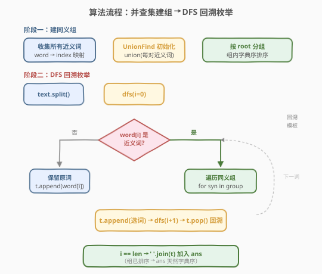
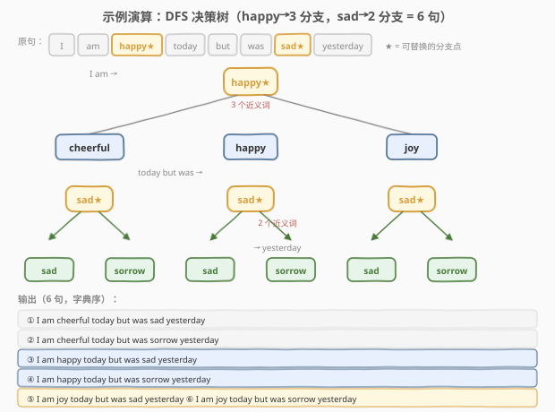

# 近义词句子

- **题目名称**：近义词句子
- **链接**：[1258. 近义词句子](https://leetcode.cn/problems/synonymous-sentences/)
- **难度**：中等
- **标签**：并查集、回溯、哈希表、字符串、排序

## 1. 题目概述

给定一个近义词表 `synonyms` 和一个句子 `text`，`synonyms` 表中是一些近义词对。你可以将句子 `text` 中每个单词用它的近义词来替换。近义词关系**可传递**：若 `a` 与 `b` 是近义词、`b` 与 `c` 是近义词，则 `a` 与 `c` 也是近义词。

请找出所有用近义词替换后的句子，按**字典序排序**后返回。

**示例 1**：

```text
输入：
synonyms = [["happy","joy"],["sad","sorrow"],["joy","cheerful"]],
text = "I am happy today but was sad yesterday"

输出：
["I am cheerful today but was sad yesterday",
 "I am cheerful today but was sorrow yesterday",
 "I am happy today but was sad yesterday",
 "I am happy today but was sorrow yesterday",
 "I am joy today but was sad yesterday",
 "I am joy today but was sorrow yesterday"]
```

> 💡 **传递性示例**：`happy` 与 `joy` 是近义词，`joy` 与 `cheerful` 是近义词，因此 `happy`、`joy`、`cheerful` 三者互为近义词，构成一个同义组 `{cheerful, happy, joy}`。

**约束条件**：

- $0 \le \text{synonyms.length} \le 10$
- $\text{synonyms[i].length} == 2$，且 $\text{synonyms[i][0]} \ne \text{synonyms[i][1]}$
- 所有单词仅包含英文字母，长度最多为 $10$
- `text` 最多包含 $10$ 个单词，单词间用单个空格分隔

> ⚠️ **本题是 Plus 会员专享题（🔒）**，来源于第 13 场双周赛 Q3。

---

## 2. 解题思路

### 2.1 暴力思路：直接枚举 + 最后排序

对 `text` 中的每个单词，如果它出现在近义词表中，就尝试用它所有的近义词替换。但近义词的**传递性**使得"哪些词互为近义词"不好直接判断——如果用邻接表存原始近义词对，查找一个词的所有近义词需要 BFS/DFS 遍历整个连通分量，效率低且代码复杂。

此外，如果枚举时不保证顺序，最后还需对所有输出句子做全局排序，增加额外开销。

### 2.2 核心观察：并查集建同义组 + DFS 回溯


> 💡 **关键洞察**：近义词的传递性 = 图的连通性。每对近义词是一条无向边，所有互为近义词的单词构成一个**连通分量**。用**并查集**合并近义词对，即可高效地找出每个单词所属的同义组。

整体思路分两阶段：

1. **建同义组**：收集所有近义词单词 → 并查集 `union` 每对近义词 → 按 `find` 根节点分组 → 每组内按字典序排序。
2. **DFS 回溯枚举**：将 `text` 按空格切分为单词数组，对每个单词：
   - 若**不是**近义词 → 保留原词，递归下一个；
   - 若**是**近义词 → 遍历其同义组中所有词（已排序），逐个尝试并回溯。

> 💡 **为何 DFS 天然产出字典序？** 每个同义组已按字典序排序，DFS 按组内顺序枚举。对于句子的比较，两个句子必定在**第一个不同的可替换位置**决定先后——而该位置的枚举顺序就是字典序。因此无需最后再排序，**排序前置到建组阶段**即可。

### 2.3 算法流程图



流程分两阶段：

**阶段一（建同义组）**：

1. **收集单词**：遍历 `synonyms`，将所有近义词加入集合，建立 `word → index` 映射。
2. **并查集合并**：初始化 UnionFind，对每对近义词 `(a, b)` 执行 `union(idx[a], idx[b])`。
3. **分组排序**：按 `find(i)` 根节点将所有单词分组，每组内按字典序排序。

**阶段二（DFS 回溯）**：

4. **切分句子**：`text.split()` 得到单词数组。
5. **DFS 枚举**：`dfs(i)` 处理第 `i` 个单词：
   - **基准情况**：`i == len` → `join(t)` 加入答案。
   - **非近义词**：`t.append(word)` → `dfs(i+1)` → `t.pop()` 回溯。
   - **近义词**：遍历同义组中每个词 `syn` → `t.append(syn)` → `dfs(i+1)` → `t.pop()` 回溯。
6. **返回答案**：组已排序 → 答案天然字典序。

### 2.4 示例演算



以示例 1 为例，`text = "I am happy today but was sad yesterday"`：

- **同义组 1**：`{cheerful, happy, joy}`（`happy` 与 `joy` 配对，`joy` 与 `cheerful` 配对，传递合并）
- **同义组 2**：`{sad, sorrow}`

句子中只有 `happy`（位置 2）和 `sad`（位置 6）是可替换的分支点：

| 分支点 | 同义组（已排序） | 分支数 |
|--------|-----------------|--------|
| `happy` | `cheerful < happy < joy` | 3 |
| `sad` | `sad < sorrow` | 2 |

DFS 决策树：`happy` 先分 3 支，每支到达 `sad` 再分 2 支，共 $3 \times 2 = 6$ 个叶子，即 6 个输出句子。由于同义组已排序，DFS 遍历顺序恰好对应字典序：

| 序号 | happy 替换 | sad 替换 | 完整句子 |
|------|-----------|---------|---------|
| ① | cheerful | sad | I am cheerful today but was sad yesterday |
| ② | cheerful | sorrow | I am cheerful today but was sorrow yesterday |
| ③ | happy | sad | I am happy today but was sad yesterday |
| ④ | happy | sorrow | I am happy today but was sorrow yesterday |
| ⑤ | joy | sad | I am joy today but was sad yesterday |
| ⑥ | joy | sorrow | I am joy today but was sorrow yesterday |

> 💡 **字典序保证**：`cheerful < happy < joy` 决定了前两行在前，`sad < sorrow` 决定了每对中 `sad` 在前。排序前置到建组阶段，DFS 自然产出正确顺序。

---

## 3. 参考代码

### C++

```cpp
class Solution {
public:
    vector<string> generateSentences(vector<vector<string>>& synonyms, string text) {
        set<string> wordSet;
        for (auto& p : synonyms) {
            wordSet.insert(p[0]);
            wordSet.insert(p[1]);
        }
        vector<string> words(wordSet.begin(), wordSet.end());
        unordered_map<string, int> idx;
        for (int i = 0; i < (int)words.size(); ++i)
            idx[words[i]] = i;

        int n = words.size();
        parent.resize(n);
        iota(parent.begin(), parent.end(), 0);
        for (auto& p : synonyms)
            parent[find(idx[p[0]])] = find(idx[p[1]]);

        unordered_map<int, vector<int>> groups;
        for (int i = 0; i < n; ++i)
            groups[find(i)].push_back(i);
        for (auto& [root, members] : groups)
            sort(members.begin(), members.end(),
                 [&](int a, int b) { return words[a] < words[b]; });

        vector<string> sentence;
        istringstream iss(text);
        string w;
        while (iss >> w) sentence.push_back(w);

        vector<string> ans, cur;
        function<void(int)> dfs = [&](int i) {
            if (i >= (int)sentence.size()) {
                string s;
                for (int j = 0; j < (int)cur.size(); ++j)
                    s += (j ? " " : "") + cur[j];
                ans.push_back(s);
                return;
            }
            if (!idx.count(sentence[i])) {
                cur.push_back(sentence[i]);
                dfs(i + 1);
                cur.pop_back();
            } else {
                for (int j : groups[find(idx[sentence[i]])]) {
                    cur.push_back(words[j]);
                    dfs(i + 1);
                    cur.pop_back();
                }
            }
        };
        dfs(0);
        return ans;
    }
private:
    vector<int> parent;
    int find(int x) {
        return parent[x] == x ? x : parent[x] = find(parent[x]);
    }
};
```

### Python

```python
class Solution:
    def generateSentences(self, synonyms: List[List[str]], text: str) -> List[str]:
        from collections import defaultdict

        word_set = set()
        for a, b in synonyms:
            word_set.add(a)
            word_set.add(b)
        words = sorted(word_set)
        idx = {w: i for i, w in enumerate(words)}

        n = len(words)
        parent = list(range(n))
        def find(x):
            while parent[x] != x:
                parent[x] = parent[parent[x]]
                x = parent[x]
            return x
        for a, b in synonyms:
            parent[find(idx[a])] = find(idx[b])

        groups = defaultdict(list)
        for i in range(n):
            groups[find(i)].append(i)
        for k in groups:
            groups[k].sort(key=lambda i: words[i])

        sentence = text.split()
        ans = []
        cur = []
        def dfs(i):
            if i >= len(sentence):
                ans.append(' '.join(cur))
                return
            if sentence[i] not in idx:
                cur.append(sentence[i])
                dfs(i + 1)
                cur.pop()
            else:
                for j in groups[find(idx[sentence[i]])]:
                    cur.append(words[j])
                    dfs(i + 1)
                    cur.pop()
        dfs(0)
        return ans
```

> 💡 **Python 中 `words = sorted(word_set)` 的作用**：此处对全局单词排序并非必须——真正决定输出顺序的是**每组内**的排序。但全局排序后 `idx` 映射的顺序更直观，且 `sorted()` 返回确定顺序，便于调试。

> ⚠️ **非近义词的处理**：`text` 中不在 `synonyms` 表里的单词（如 `I`、`am`、`today`）不会出现在 `idx` 映射中，DFS 中通过 `if sentence[i] not in idx` 判定后直接保留原词，不进行替换。

---

## 4. 复杂度分析

设 $s$ 为近义词对数（$\le 10$），$m$ 为近义词唯一单词数（$\le 2s$），$n$ 为 `text` 中单词数（$\le 10$），$k$ 为最大同义组大小。

| 维度 | 复杂度 | 说明 |
|------|--------|------|
| **时间** | $O(m \cdot \alpha(m) + k^c \cdot n)$ | 并查集构建 $O(m\alpha)$ + DFS 枚举 $k^c$ 个句子每个拼接 $O(n)$，其中 $c$ 为可替换位置数 |
| **空间** | $O(m + n)$ | 并查集 $O(m)$ + DFS 栈 $O(n)$ + 同义组映射 $O(m)$（不含输出） |
| **输出** | $O(k^c \cdot n)$ | 最坏情况 $c$ 个可替换位置各 $k$ 选择，但约束 $s \le 10$、$n \le 10$ 保证实际规模很小 |

> 💡 $\alpha$ 为反阿克曼函数，对 $\le 20$ 个元素几乎为常数。最坏情况所有 20 个近义词在一组、`text` 10 个词全可替换，理论输出 $20^{10}$——但实际测试用例远小于此，题目保证输出可行。

---

## 5. 扩展：与「句子相似性」系列的对比

LeetCode 有一组「句子相似性」问题，与本题共享并查集建同义组的核心思想：

- **734. 句子相似性**：近义词**不可传递**，直接用哈希集合查配对即可，$O(1)$ 查询。
- **737. 句子相似性 II** 🔒：近义词**可传递**，需要并查集预处理——与本题的建组阶段完全一致，只是查询场景不同（737 判定两句是否相似，1258 枚举所有替换句）。
- **1258. 近义词句子**（本题）：在 737 的基础上，增加 DFS 回溯枚举所有可能句子。

三题的并查集部分是同一个模板，区别在于**查询方式**：734 哈希查、737 `find` 查、1258 `find` + DFS 枚举。

> 💡 **不使用并查集的替代方案**：也可以用 `HashMap<String, Set<String>>` 直接存每个词的完整同义集——对每个近义词对 `(a, b)`，将 `b` 加入 `a` 的集合、`a` 加入 `b` 的集合，然后 BFS 合并传递闭包。但并查集更简洁高效，是处理传递关系的标准工具。

---

## 6. 面试要点

1. **为什么用并查集而不是邻接表 + BFS？**

   - 近义词的传递性本质是**图的连通性**。并查集用 `union`/`find` 两步即可维护连通关系，查询 $O(\alpha)$。邻接表需要在每次查询时 BFS 遍历整个连通分量，代码更长且效率更低。并查集是处理"传递等价关系"的标准工具。

2. **如何保证输出是字典序而无需最后排序？**

   - 在**建组阶段**就对每个同义组按字典序排序。DFS 按组内顺序枚举，对两个句子的比较取决于第一个不同的可替换位置，而该位置的枚举顺序就是字典序。因此**排序前置**到建组阶段，DFS 天然产出字典序。

3. **`text` 中的非近义词如何处理？**

   - 只收集 `synonyms` 中出现的单词建索引。`text` 中不在索引里的单词直接保留原词，通过 `if word not in idx` 判定。注意：`text` 中可能出现未在 `synonyms` 中登记的单词，这些词不可替换。

4. **并查集的 `find` 为什么要做路径压缩？**

   - 路径压缩（`parent[x] = find(parent[x])`）将树高降至近似常数，使后续 `find` 查询从 $O(\log n)$ 降到 $O(\alpha)$。本题数据量小（$\le 20$ 元素），压缩与否差异不大，但它是并查集模板的标准写法，面试时应默认写出。

5. **如果 `synonyms` 为空怎么办？**

   - `word_set` 为空，`idx` 为空，所有 `text` 单词都走"非近义词"分支，输出 `[原句]`。代码天然处理此边界，无需特判。

---

## 7. 同类练习题

- [547. 省份数量](https://leetcode.cn/problems/number-of-provinces/)（[题解](../0501-0600/547_省份数量.md)）：并查集模板题，与本题的建组阶段使用同一套 `union`/`find` 套路
- [684. 冗余连接](https://leetcode.cn/problems/redundant-connection/)（[题解](../0601-0700/684_冗余连接.md)）：并查集判环，`union` 失败即冗余边，对比本题用 `union` 建同义组
- [140. 单词拆分 II](https://leetcode.cn/problems/word-break-ii/)（[题解](../0001-0100/140_单词拆分II.md)）：DFS 回溯枚举所有方案，与本题的 DFS 枚举所有替换句结构一致，加记忆化优化重复搜索
- [46. 全排列](https://leetcode.cn/problems/permutations/)（[题解](../0001-0100/46_全排列.md)）：回溯枚举模板，本题的 `t.append → dfs → t.pop` 三件套即来源于此
- [737. 句子相似性 II](https://leetcode.cn/problems/sentence-similarity-ii/) 🔒：同样用并查集处理可传递的近义词关系，查询场景不同（判定两句是否相似 vs 枚举所有替换句），并查集部分完全通用
