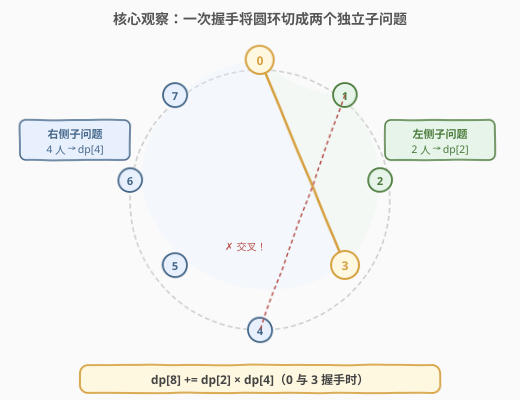
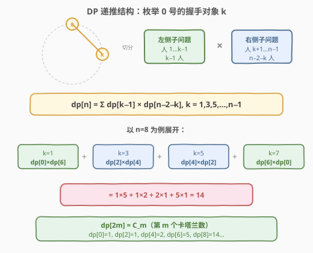
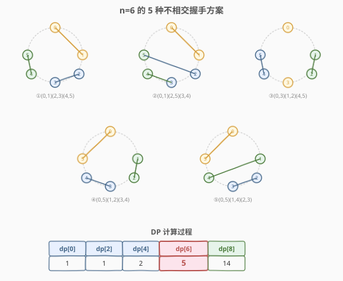

# LeetCode 不相交的握手 题解

## 1. 题目概述

- **标题 / 题号**：不相交的握手（#1259，hard）
- **链接**：https://leetcode.cn/problems/handshakes-that-dont-cross/
- **难度**：困难
- **标签**：动态规划、数学、卡塔兰数

**题意**：`numPeople` 个人围成一圈，编号为 `0` 到 `numPeople - 1`。每个人与另一个人握手，且**任意两次握手之间不能交叉**（即在圆环内画弦，弦与弦不能相交）。返回满足条件的握手方案数，对 $10^9 + 7$ 取模。

**示例 1**：

```text
输入：numPeople = 6
输出：5
解释：6 人圆环有 5 种不相交握手方案（见 2.4 节示例演算）
```

**示例 2**：

```text
输入：numPeople = 2
输出：1
解释：两人互相握手，只有一种方案
```

**约束**：

- `2 <= numPeople <= 10^6`
- `numPeople` 为偶数

> 💡 **圆环上不相交弦的计数**是组合数学中的经典问题，答案恰为**卡塔兰数（Catalan number）** $C_{n/2}$。它与 [96. 不同的二叉搜索树](../0001-0100/96_不同的二叉搜索树.md)、[22. 括号生成](../0001-0100/22_括号生成.md) 同源——都满足「按分界点切两半、各自独立计数再相乘求和」的卡塔兰递推结构。

## 2. 解题思路

### 2.1 暴力思路：枚举所有配对

最直觉的做法是枚举所有可能的配对方案，再检查是否有交叉。但 `n` 个人的配对方案数为 $(n-1)!! = (n-1) \times (n-3) \times \cdots \times 1$，当 `n = 10^6` 时是天文数字，**完全不可行**。

> ⚠️ 暴力枚举的问题在于没有利用「不相交」这一约束来缩小搜索空间——我们需要从约束本身出发，找到**子问题分解**的结构。

### 2.2 核心观察：一次握手将圆环切成两个独立子问题



**关键思路**：固定 0 号人的握手对象 `k`。一旦 0 与 `k` 握手，这条弦将圆环分成两段弧：

- **左侧弧**：人 `1, 2, ..., k-1`，共 `k - 1` 人，必须在内部自行配对（不能跨越 0–k 弦）
- **右侧弧**：人 `k+1, k+2, ..., n-1`，共 `n - 2 - k` 人，同样在内部自行配对

两侧的配对**互相独立**——左侧的任何合法配对方案与右侧的任何合法配对方案组合起来，加上 0–k 这条弦，就是一个完整的合法方案。反之，任何合法方案中 0 号的握手对象是唯一的，因此枚举 `k` 不会重复也不会遗漏。

> 💡 **为什么 `k` 必须是奇数？** 0 号与 `k` 号握手后，左侧 `k - 1` 人和右侧 `n - 2 - k` 人都必须能完全配对，即各自人数为偶数。`n` 是偶数，`k - 1` 为偶数要求 `k` 为奇数。因此 `k = 1, 3, 5, ..., n - 1`。

由此得到递推：

$$\text{dp}[n] = \sum_{k=1,3,5,\ldots,n-1} \text{dp}[k-1] \times \text{dp}[n-2-k]$$

其中 $\text{dp}[0] = 1$（空圆环算 1 种），$\text{dp}[2] = 1$。

### 2.3 算法流程图



**DP 流程**（四步法）：

1. **状态定义**：$\text{dp}[i]$ = `i` 人圆环的不相交握手方案数（`i` 为偶数）
2. **转移方程**：$\text{dp}[i] = \sum_{k=1,3,\ldots,i-1} \text{dp}[k-1] \times \text{dp}[i-2-k]$
3. **初始条件**：$\text{dp}[0] = 1$
4. **计算顺序**：从 `i = 2` 到 `n`，步长 2，自底向上

> ⚠️ **$O(n^2)$ DP 适用于理解，但 `n ≤ 10^6` 时需要 $O(n)$ 优化。** 观察到 $\text{dp}[2m] = C_m$（第 $m$ 个卡塔兰数），可用线性递推 $C_m = \frac{2(2m-1)}{m+1} C_{m-1}$ 在 $O(n)$ 时间内求解。

### 2.4 示例演算

以 `numPeople = 6`（即 `n = 6, m = 3`）为例，展示全部 5 种合法方案：



DP 计算 $\text{dp}[6]$：

| k（0 号握手对象） | 左侧人数 | 右侧人数 | 贡献 | 对应方案 |
|------|---------|---------|------|---------|
| 1 | 0 | 4 | $\text{dp}[0] \times \text{dp}[4] = 1 \times 2 = 2$ | 方案 ①② |
| 3 | 2 | 2 | $\text{dp}[2] \times \text{dp}[2] = 1 \times 1 = 1$ | 方案 ③ |
| 5 | 4 | 0 | $\text{dp}[4] \times \text{dp}[0] = 2 \times 1 = 2$ | 方案 ④⑤ |

合计 $2 + 1 + 2 = 5$。$\checkmark$

> 💡 观察 $\text{dp}$ 序列：$\text{dp}[0]=1, \text{dp}[2]=1, \text{dp}[4]=2, \text{dp}[6]=5, \text{dp}[8]=14 \ldots$——这正是卡塔兰数 $C_0, C_1, C_2, C_3, C_4 \ldots$。令 $m = n/2$，则 $\text{dp}[n] = C_m$。

## 3. 参考代码

### 方法一：$O(n^2)$ 区间 DP（适合理解，小数据可过）

#### C++

```cpp
class Solution {
  public:
    int numberOfWays(int numPeople) {
        const int MOD = 1e9 + 7;
        int n = numPeople;
        vector<long long> dp(n + 1, 0);
        dp[0] = 1;
        for (int i = 2; i <= n; i += 2) {
            for (int k = 1; k < i; k += 2) {
                dp[i] = (dp[i] + dp[k - 1] * dp[i - 2 - k]) % MOD;
            }
        }
        return dp[n];
    }
};
```

#### Python

```python
class Solution:
    def numberOfWays(self, numPeople: int) -> int:
        MOD = 10**9 + 7
        n = numPeople
        dp = [0] * (n + 1)
        dp[0] = 1
        for i in range(2, n + 1, 2):
            for k in range(1, i, 2):
                dp[i] = (dp[i] + dp[k - 1] * dp[i - 2 - k]) % MOD
        return dp[n]
```

### 方法二：$O(n)$ 卡塔兰数线性递推（大数据必备）

利用 $\text{dp}[2m] = C_m$ 及线性递推 $C_m = \frac{2(2m-1)}{m+1} C_{m-1}$，在模 $10^9+7$ 下用**费马小定理**求除法的模逆元。

#### C++

```cpp
class Solution {
  public:
    int numberOfWays(int numPeople) {
        const int MOD = 1e9 + 7;
        int m = numPeople / 2;
        long long catalan = 1; // C_0 = 1
        for (int i = 1; i <= m; ++i) {
            catalan = catalan * 2 % MOD * (2 * i - 1) % MOD;
            catalan = catalan * modPow(i + 1, MOD - 2, MOD) % MOD;
        }
        return catalan;
    }
  private:
    long long modPow(long long base, long long exp, long long mod) {
        long long result = 1;
        base %= mod;
        while (exp > 0) {
            if (exp & 1) result = result * base % mod;
            base = base * base % mod;
            exp >>= 1;
        }
        return result;
    }
};
```

#### Python

```python
class Solution:
    def numberOfWays(self, numPeople: int) -> int:
        MOD = 10**9 + 7
        m = numPeople // 2
        catalan = 1  # C_0 = 1
        for i in range(1, m + 1):
            catalan = catalan * 2 * (2 * i - 1) % MOD
            catalan = catalan * pow(i + 1, MOD - 2, MOD) % MOD
        return catalan
```

> 💡 **为什么用费马小定理做除法？** 递推中有 $\frac{1}{m+1}$，但模运算下不能直接除。由于 $10^9+7$ 是质数，$a^{-1} \equiv a^{p-2} \pmod{p}$（费马小定理），所以除以 $m+1$ 等价于乘以 $(m+1)^{p-2} \bmod p$。Python 的 `pow(base, exp, mod)` 内置快速幂，高效且简洁。

## 4. 复杂度分析

| 方法 | 时间复杂度 | 空间复杂度 | 说明 |
|------|-----------|-----------|------|
| 区间 DP | $O(n^2)$ | $O(n)$ | 双重循环，外层 $n/2$ 步，内层最多 $n/2$ 步；`n = 10^6` 时超时 |
| 卡塔兰线性递推 | $O(n \log p)$ | $O(1)$ | 每步一次快速幂 $O(\log p)$，$p = 10^9+7$；实际常数极小，$n = 10^6$ 约百万次乘法 |

> 💡 方法二的时间复杂度严格说是 $O(n \log p)$，但 $\log p \approx 30$ 是常数，实际运行与 $O(n)$ 无异。若需严格 $O(n)$，可预处理 $1$ 到 $m+1$ 的模逆元数组（利用 $\text{inv}[i] = (p - p/i) \cdot \text{inv}[p \bmod i] \bmod p$），但代码更复杂，收益有限。

## 5. 扩展：卡塔兰数家族

### 5.1 闭式公式

$$C_m = \frac{1}{m+1} \binom{2m}{m} = \frac{(2m)!}{(m+1)! \cdot m!}$$

理论上可预处理阶乘与逆元阶乘后 $O(1)$ 查询，但线性递推更简洁且无需额外空间。

### 5.2 卡塔兰数的多种等价形式

卡塔兰数在不同问题中以不同面貌出现，但递推结构完全一致：

| 问题 | 卡塔兰意义 | 切分方式 |
|------|-----------|---------|
| [96. 不同的二叉搜索树](../0001-0100/96_不同的二叉搜索树.md) | $n$ 节点 BST 的形态数 | 枚举根 → 左子树 × 右子树 |
| [22. 括号生成](../0001-0100/22_括号生成.md) | $n$ 对括号的合法序列数 | 枚举第一对括号位置 → 内部 × 外部 |
| 本题（1259） | $2m$ 人圆环不相交握手数 | 枚举 0 号对象 → 左弧 × 右弧 |
| 矩阵链乘法 | $n$ 个矩阵的括号化方案数 | 枚举最后乘的位置 → 左链 × 右链 |
| 出栈序列 | $n$ 个元素的合法出栈序列数 | 枚举第一个出栈元素 → 栈内 × 栈外 |

> 💡 识别卡塔兰数的关键信号：**「在序列/圆环/树中选一个分界点，将问题切成两个规模更小的独立子问题，相乘后对所有分界点求和」**。看到这一结构，就能套用 $C_n = \sum C_{i-1} \cdot C_{n-i}$ 的模板。

## 6. 面试要点

1. **为什么固定 0 号人的握手对象来枚举？**

   - 0 号人必定与某人握手，且对象唯一。固定 0 号后，其握手弦将圆环切成两段弧，两弧内部的配对互不影响（不能跨弦）。这样把原问题分解为两个**规模更小**的独立子问题，自然得到递推。

2. **为什么 `k` 只取奇数？**

   - 0 与 `k` 握手后，左侧 `k-1` 人和右侧 `n-2-k` 人都必须完全配对（偶数人）。`n` 已知为偶数，`k-1` 为偶数要求 `k` 为奇数。若 `k` 为偶数，左侧人数为奇数，无法完全配对，方案数为 0。

3. **为什么答案是卡塔兰数？**

   - 令 $m = n/2$，递推 $\text{dp}[2m] = \sum_{j=0}^{m-1} \text{dp}[2j] \cdot \text{dp}[2(m-1-j)]$ 与卡塔兰数 $C_m = \sum_{j=0}^{m-1} C_j \cdot C_{m-1-j}$ 完全一致，初始条件 $\text{dp}[0] = C_0 = 1$ 也相同，故 $\text{dp}[2m] = C_m$。

4. **$n = 10^6$ 时 $O(n^2)$ DP 为什么不行？**

   - $O(n^2)$ 意味着约 $10^{12}$ 次运算，远超时间限制。必须用线性递推 $C_m = \frac{2(2m-1)}{m+1} C_{m-1}$，将复杂度降至 $O(n)$。

5. **模运算下如何做除法？**

   - 递推含 $\frac{1}{m+1}$，模 $p = 10^9+7$（质数）下用费马小定理：$a^{-1} \equiv a^{p-2} \pmod{p}$。即除以 $m+1$ 等价于乘 $(m+1)^{p-2} \bmod p$，用快速幂计算。

## 同类练习题

| # | 题目 | 与本题的关联 |
|---|------|-------------|
| 96 | [不同的二叉搜索树](https://leetcode.cn/problems/unique-binary-search-trees/)（[题解](../0001-0100/96_不同的二叉搜索树.md)） | 卡塔兰数 DP 母题，按根切分，递推结构完全一致 |
| 22 | [括号生成](https://leetcode.cn/problems/generate-parentheses/)（[题解](../0001-0100/22_括号生成.md)） | 答案同为卡塔兰数，回溯枚举合法括号序列 |
| 959 | [由斜杠划分区域](https://leetcode.cn/problems/regions-cut-by-slashes/) | 圆环/平面区域划分的另一变体，图论解法 |
| 89 | [格雷编码](https://leetcode.cn/problems/gray-code/)（[题解](../0001-0100/89_格雷编码.md)） | 另一经典构造型计数问题，镜像反射递推 |
| 1039 | [多边形三角剖分的最小得分](https://leetcode.cn/problems/minimum-score-triangulation-of-polygon/) | 同为圆环上区间 DP，枚举切分点后左右独立递推 |
