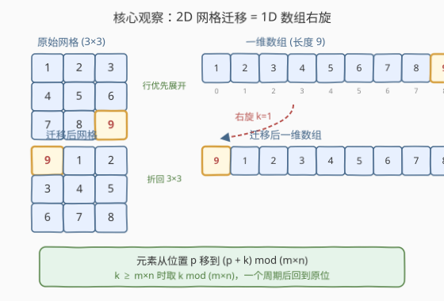
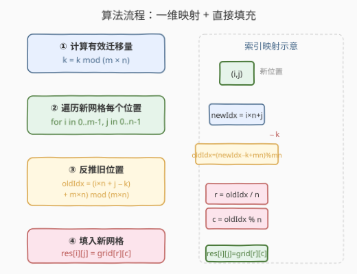
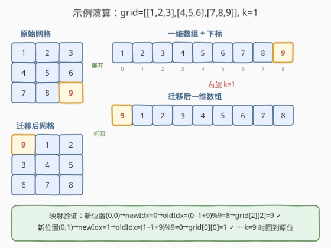

# LeetCode 二维网格迁移 题解

## 1. 题目概述

- **标题 / 题号**：二维网格迁移（#1260，easy）
- **链接**：https://leetcode.cn/problems/shift-2d-grid/
- **难度**：简单
- **标签**：数组、数学、模拟、矩阵

**题意**：给定一个 $m \times n$ 的二维网格 `grid` 和一个整数 $k$。每次「迁移」操作按如下规则移动网格中**所有**元素：

- `grid[i][j]` 移动到 `grid[i][j + 1]`（同行右移一格）
- `grid[i][n - 1]` 移动到 `grid[i + 1][0]`（行末到下一行行首）
- `grid[m - 1][n - 1]` 移动到 `grid[0][0]`（末行末列绕回首行首列）

返回经过 $k$ 次迁移操作后的最终网格。

**示例 1**：

```text
输入：grid = [[1,2,3],[4,5,6],[7,8,9]], k = 1
输出：[[9,1,2],[3,4,5],[6,7,8]]
解释：
  [1,2,3]       [9,1,2]
  [4,5,6]  -->  [3,4,5]
  [7,8,9]       [6,7,8]
  末尾的 9 绕回左上角，其余整体右移一位。
```

**示例 2**：

```text
输入：grid = [[3,8,1,9],[19,7,2,5],[4,6,11,10],[12,0,21,13]], k = 4
输出：[[12,0,21,13],[3,8,1,9],[19,7,2,5],[4,6,11,10]]
解释：k=4 恰好等于总列数 n=4，等价于每行整体下移一行（末行绕回首行）。
```

**示例 3**：

```text
输入：grid = [[1,2,3],[4,5,6],[7,8,9]], k = 9
输出：[[1,2,3],[4,5,6],[7,8,9]]
解释：网格共 9 个元素，k=9 恰好迁移一整圈，回到原位。
```

**约束**：

- $m == \text{grid.length}$
- $n == \text{grid[i].length}$
- $1 \le m, n \le 50$
- $-1000 \le \text{grid[i][j]} \le 1000$
- $0 \le k \le 100$

> 💡 **关键信号**：迁移操作的实质是元素沿「行优先」顺序在一维序列上**整体右移一位并循环回绕**。$k$ 次迁移 = 一维数组**右旋 $k$ 位**。又因为总元素数 $m \times n$ 是周期，$k \ge m \times n$ 时可用取模化简。

## 2. 解题思路

### 2.1 暴力思路：逐次模拟迁移

最直观的做法：开一个新网格，每次迁移按规则逐元素搬运——原 `(i, j)` 的新位置为：

- 若 `j < n - 1`：同行右移 → `(i, j + 1)`
- 若 `j == n - 1` 且 `i < m - 1`：行末转下行首 → `(i + 1, 0)`
- 若 `i == m - 1` 且 `j == n - 1`：末尾绕回 → `(0, 0)`

重复 $k$ 次，每次 $O(m \times n)$，总时间 $O(k \times m \times n)$。当 $k$ 和 $m, n$ 都取上限 $50$ 时约 $12500$ 次操作，实际能过但**做了大量重复工作**。

### 2.2 核心观察：一维化 + 右旋



关键洞察分三步：

**第一步：迁移操作 = 行优先一维数组的循环右移一位。**

将 $m \times n$ 网格按**行优先**展开为一维数组（`grid[i][j]` 对应下标 $p = i \times n + j$），则一次迁移操作等价于该一维数组**整体右移一位并循环回绕**：

- 原下标 $p$ 的元素移到下标 $(p + 1) \bmod (m \times n)$
- 末尾元素（下标 $m \times n - 1$）绕回下标 $0$

这与题目描述的三条规则完全吻合——行内右移、行末转下行首、末尾绕回，本质就是一维序列的循环右移。

**第二步：$k$ 次迁移 = 右旋 $k$ 位。**

$k$ 次循环右移一位 = 一次循环右移 $k$ 位。因此原下标 $p$ 的元素最终到达下标：

$$\text{newIdx} = (p + k) \bmod (m \times n)$$

**第三步：取模消周期。**

总元素数 $N = m \times n$ 是迁移的周期——迁移 $N$ 次后每个元素回到原位。因此：

$$k_{\text{eff}} = k \bmod N$$

> 💡 **为何取模有效？** $N$ 个元素循环右移 $N$ 位 = 每个元素绕一圈回到原位 = 恒等变换。所以只需关心 $k \bmod N$ 的有效迁移量。

### 2.3 算法流程图



流程说明：

1. **计算有效迁移量**：$k = k \bmod (m \times n)$，消除整圈冗余
2. **遍历新网格每个位置** $(i, j)$：计算其在一维数组中的新下标 $\text{newIdx} = i \times n + j$
3. **反推旧位置**：新位置 $\text{newIdx}$ 上的元素来自旧下标 $\text{oldIdx} = (\text{newIdx} - k + N) \bmod N$（加 $N$ 防负数）
4. **拆回二维坐标**：$r = \text{oldIdx} \;/\; n$，$c = \text{oldIdx} \bmod n$，填入 $\text{res}[i][j] = \text{grid}[r][c]$

> ⚠️ **为何反推而非正推？** 遍历新网格的每个位置 $(i, j)$ 逐一填值，比「遍历旧网格找新位置」更自然——新网格的大小已知，按顺序填充即可，无需处理「一个位置可能被多次写入」的顺序问题。

### 2.4 示例演算



以 `grid = [[1,2,3],[4,5,6],[7,8,9]]`, `k = 1` 为例，$m = 3$, $n = 3$, $N = 9$：

1. $k_{\text{eff}} = 1 \bmod 9 = 1$
2. 展开一维数组：`[1, 2, 3, 4, 5, 6, 7, 8, 9]`，下标 `0..8`
3. 右旋 1 位：`[9, 1, 2, 3, 4, 5, 6, 7, 8]`
4. 折回 $3 \times 3$：

| 新位置 $(i,j)$ | newIdx | oldIdx $=(\text{newIdx}-1+9)\bmod 9$ | 旧坐标 $(r,c)$ | 值 |
|----------------|--------|--------------------------------------|----------------|----|
| $(0,0)$ | 0 | 8 | $(2,2)$ | 9 |
| $(0,1)$ | 1 | 0 | $(0,0)$ | 1 |
| $(0,2)$ | 2 | 1 | $(0,1)$ | 2 |
| $(1,0)$ | 3 | 2 | $(0,2)$ | 3 |
| $(1,1)$ | 4 | 3 | $(1,0)$ | 4 |
| $(1,2)$ | 5 | 4 | $(1,1)$ | 5 |
| $(2,0)$ | 6 | 5 | $(1,2)$ | 6 |
| $(2,1)$ | 7 | 6 | $(2,0)$ | 7 |
| $(2,2)$ | 8 | 7 | $(2,1)$ | 8 |

最终结果：

$$\begin{bmatrix} 9 & 1 & 2 \\ 3 & 4 & 5 \\ 6 & 7 & 8 \end{bmatrix} \checkmark$$

> 验证示例 3：$k = 9 = N$，$k_{\text{eff}} = 0$，每个位置 $\text{oldIdx} = \text{newIdx}$，结果即原网格，与预期一致。

## 3. 参考代码

### 方法一：一维映射直接填充（推荐，$O(m \times n)$）

### C++

```cpp
class Solution {
  public:
    vector<vector<int>> shiftGrid(vector<vector<int>>& grid, int k) {
        int m = grid.size(), n = grid[0].size();
        int N = m * n;
        k %= N;
        vector<vector<int>> res(m, vector<int>(n));
        for (int i = 0; i < m; ++i) {
            for (int j = 0; j < n; ++j) {
                int newIdx = i * n + j;
                int oldIdx = (newIdx - k + N) % N;
                int r = oldIdx / n, c = oldIdx % n;
                res[i][j] = grid[r][c];
            }
        }
        return res;
    }
};
```

### Python

```python
class Solution:
    def shiftGrid(self, grid: List[List[int]], k: int) -> List[List[int]]:
        m, n = len(grid), len(grid[0])
        N = m * n
        k %= N
        res = [[0] * n for _ in range(m)]
        for i in range(m):
            for j in range(n):
                new_idx = i * n + j
                old_idx = (new_idx - k + N) % N
                r, c = divmod(old_idx, n)
                res[i][j] = grid[r][c]
        return res
```

> 💡 **核心要点**：将二维迁移降维为一维循环右移，用取模直接计算每个元素的源位置，一次遍历填充结果，无需逐次模拟。

### 方法二：展平 + 切片拼接（Python 惯用，$O(m \times n)$）

### Python

```python
class Solution:
    def shiftGrid(self, grid: List[List[int]], k: int) -> List[List[int]]:
        m, n = len(grid), len(grid[0])
        N = m * n
        k %= N
        flat = [grid[i][j] for i in range(m) for j in range(n)]
        flat = flat[-k:] + flat[:-k] if k else flat
        return [flat[i * n:(i + 1) * n] for i in range(m)]
```

> 利用 Python 切片：`flat[-k:] + flat[:-k]` 即循环右移 $k$ 位。当 $k = 0$ 时切片为空，直接返回原数组。

### 方法三：逐次模拟（直观，适合讲解对照）

### C++

```cpp
class Solution {
  public:
    vector<vector<int>> shiftGrid(vector<vector<int>>& grid, int k) {
        int m = grid.size(), n = grid[0].size();
        k %= (m * n);
        while (k--) {
            vector<vector<int>> tmp(m, vector<int>(n));
            for (int i = 0; i < m; ++i) {
                for (int j = 0; j < n; ++j) {
                    if (j < n - 1)
                        tmp[i][j + 1] = grid[i][j];
                    else if (i < m - 1)
                        tmp[i + 1][0] = grid[i][j];
                    else
                        tmp[0][0] = grid[i][j];
                }
            }
            grid = tmp;
        }
        return grid;
    }
};
```

## 4. 复杂度分析

| 维度 | 方法一（一维映射） | 方法二（切片拼接） | 方法三（逐次模拟） |
|------|---------------------|---------------------|---------------------|
| 时间复杂度 | $O(m \times n)$ | $O(m \times n)$ | $O(k \times m \times n)$ |
| 空间复杂度 | $O(m \times n)$ | $O(m \times n)$ | $O(m \times n)$ |

- **方法一**：先取模 $O(1)$，遍历新网格 $O(m \times n)$，每个位置 $O(1)$ 计算源坐标。总时间 $O(m \times n)$，空间为结果网格 $O(m \times n)$。
- **方法二**：展平 $O(m \times n)$，切片拼接 $O(m \times n)$，折回 $O(m \times n)$。总时间 $O(m \times n)$。
- **方法三**：$k$ 次迁移，每次 $O(m \times n)$。取模后 $k < m \times n$，最坏 $O((m \times n)^2)$。

> 💡 本题 $m, n \le 50$，$k \le 100$，三种方法都能通过。面试中**先讲方法三建立直觉，再优化到方法一**展示降维思维。

## 5. 扩展：原地迁移

方法一和方法二都开辟了 $O(m \times n)$ 的结果数组。若要求**原地**修改网格（$O(1)$ 额外空间），可以借鉴**数组循环移位的经典做法**——三次反转：

1. 将一维展开数组整体反转
2. 反转前 $k$ 个元素
3. 反转后 $N - k$ 个元素

但二维网格上原地做三次反转需要小心处理行边界，实现复杂度较高。更实用的做法是：若题目允许返回新网格（本题即如此），方法一已是最优；若必须原地，则先将网格元素视为一维数组（用 $i \times n + j$ 映射），做三次区间反转后再按行重排。

```cpp
class Solution {
  public:
    vector<vector<int>> shiftGrid(vector<vector<int>>& grid, int k) {
        int m = grid.size(), n = grid[0].size();
        int N = m * n;
        k %= N;
        if (k == 0) return grid;
        auto get = [&](int idx) -> int& { return grid[idx / n][idx % n]; };
        auto rev = [&](int lo, int hi) {
            while (lo < hi) swap(get(lo++), get(hi--));
        };
        rev(0, N - 1);
        rev(0, k - 1);
        rev(k, N - 1);
        return grid;
    }
};
```

> ⚠️ 此法修改了输入网格。若调用方需要保留原数据，应先拷贝再反转。

## 6. 面试要点

1. **如何想到把二维迁移转化为一维循环右移？**

   迁移规则的三条路径——行内右移、行末转下行首、末尾绕回首行首列——恰好对应一维数组「行优先展开后整体右移一位并循环回绕」。把二维坐标 $p = i \times n + j$ 代入即可验证：一次迁移后 $p \to (p+1) \bmod N$，正是循环右移一位。

2. **为什么要对 $k$ 取模？不取模会怎样？**

   总元素数 $N = m \times n$ 是迁移周期——迁移 $N$ 次后每个元素绕一圈回到原位。因此 $k \ge N$ 时只需 $k \bmod N$。不取模在方法一中对结果无影响（因为 $(p + k) \bmod N$ 天然处理），但在方法三逐次模拟中会导致 $k$ 高达 $10^9$ 级别时超时。

3. **正推和反推有什么区别？哪种更好？**

   正推是遍历旧位置 $p$，算 $\text{newIdx} = (p + k) \bmod N$ 再写入新网格——需要预先建好新网格且按新坐标写入。反推是遍历新位置 $\text{newIdx}$，算 $\text{oldIdx} = (\text{newIdx} - k + N) \bmod N$ 再从旧网格取值——按新网格顺序填充更自然。两者等价，反推更直观。

4. **方法三（逐次模拟）的瓶颈在哪里？**

   每次 $O(m \times n)$，$k$ 次共 $O(k \times m \times n)$。若 $k$ 和 $m, n$ 都很大（如 $k = 10^9$, $m = n = 100$），方法三完全不可行，而方法一取模后始终 $O(m \times n)$。

5. **如果网格不是矩形（各行长度不等）怎么办？**

   行优先展开的前提是各行列数一致（$n$ 相同）。若各行长度不等，迁移规则的「行末转下行首」语义会变——每行末尾元素移到下一行的第一个位置，末行末尾绕回首行首部。此时仍可按行优先展开为一维数组（总长度为所有元素之和），迁移仍等价于一维循环右移，方法一依然适用。

## 同类练习题

| # | 题目 | 与本题的关联 |
|---|------|-------------|
| 189 | [轮转数组](https://leetcode.cn/problems/rotate-array/) | 一维数组循环右移 $k$ 位，本题的一维退化版，三次反转原地解法 |
| 61 | [旋转链表](https://leetcode.cn/problems/rotate-list/)（[站内题解](../0001-0100/61_旋转链表.md)） | 链表版的循环右移，成环再断开，与本题一维化思路同源 |
| 48 | [旋转图像](https://leetcode.cn/problems/rotate-image/) | 二维矩阵顺时针旋转 90°，同样是坐标映射（转置 + 反转行），对比本题的行优先一维映射 |
| 54 | [螺旋矩阵](https://leetcode.cn/problems/spiral-matrix/) | 二维矩阵的另一种一维化遍历（螺旋序），对比行优先展开的不同展开方式 |
