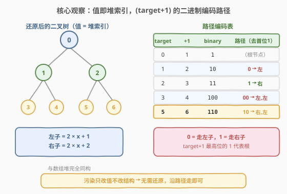
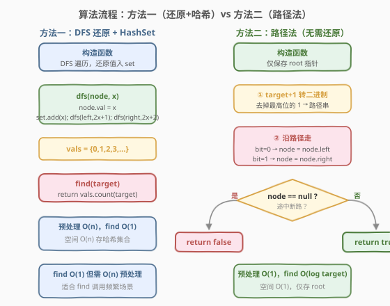
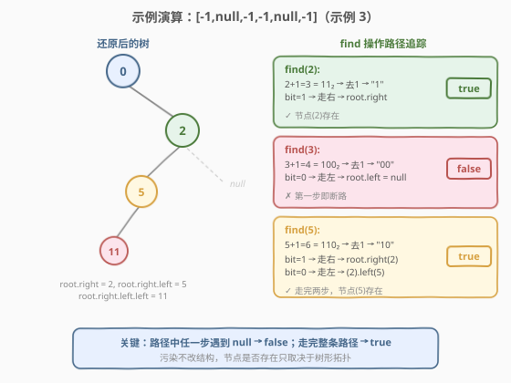

# LeetCode 在受污染的二叉树中查找元素 题解

## 1. 题目概述

- **标题 / 题号**：在受污染的二叉树中查找元素（#1261，medium）
- **链接**：https://leetcode.cn/problems/find-elements-in-a-contaminated-binary-tree/
- **难度**：中等
- **标签**：树、二叉树、深度优先搜索、哈希集合、位运算

**题意**：给出一棵满足下述规则的二叉树：

- `root.val == 0`
- 若 `treeNode.val == x` 且左子非空，则 `treeNode.left.val == 2 * x + 1`
- 若 `treeNode.val == x` 且右子非空，则 `treeNode.right.val == 2 * x + 2`

现在这棵树被「污染」了——所有节点值都变成了 `-1`。需要先还原二叉树，再实现 `FindElements` 类：

- `FindElements(TreeNode* root)`：用受污染的树初始化，需要先还原
- `bool find(int target)`：判断 `target` 是否存在于还原后的树中

**示例 1**：

```text
输入：["FindElements","find","find"], [[[-1,null,-1]],[1],[2]]
输出：[null,false,true]
解释：还原后 root=0, root.right=2。find(1)=false, find(2)=true。
```

**示例 2**：

```text
输入：["FindElements","find","find","find"], [[[-1,-1,-1,-1,-1]],[1],[3],[5]]
输出：[null,true,true,false]
解释：还原后树为
         0
        / \
       1   2
      / \
     3   4
find(1)=true, find(3)=true, find(5)=false。
```

**示例 3**：

```text
输入：["FindElements","find","find","find","find"], [[[-1,null,-1,-1,null,-1]],[2],[3],[4],[5]]
输出：[null,true,false,false,true]
解释：还原后树为
         0
          \
           2
          /
         5
        /
       11
find(2)=true, find(3)=false, find(4)=false, find(5)=true。
```

**约束**：

- `TreeNode.val == -1`
- 二叉树的高度不超过 `20`
- 节点总数在 `[1, 10⁴]`
- `find()` 总调用次数在 `[1, 10⁴]`
- `0 <= target <= 10⁶`

## 2. 解题思路

### 2.1 暴力思路

最直接的做法：构造时 DFS 遍历整棵树，按 `2x+1` / `2x+2` 规则还原每个节点值，存入哈希集合；`find` 时直接查集合即可。这完全正确，但需要 `O(n)` 额外空间存储所有值。

如果不预先存储，每次 `find` 都 DFS 全树搜索目标值，则单次 `find` 为 `O(n)`，`10⁴` 次调用共 `O(n²)`——虽然本题约束下可过，但远非最优。

### 2.2 核心观察：值即堆索引，二进制编码路径



关键洞察：`2x+1` / `2x+2` 的递推规则与**数组二叉堆**的索引映射完全一致。如果根节点值 `0` 对应堆索引 `0`，那么每个节点的**值就等于它在完全二叉树中的堆索引**。

> 💡 **为什么？** 堆索引规则正是：根 = 0，左子 = `2i+1`，右子 = `2i+2`。这与本题的值递推规则一模一样。所以节点值 `v` 唯一确定了它在完全二叉树中的位置。

由此推出一个优美的性质：**`target + 1` 的二进制表示编码了从根到该值节点的路径**。

- `target = 0` → `0+1 = 1 = 1₂` → 去掉最高位的 `1`，路径为空 → 根节点
- `target = 1` → `1+1 = 2 = 10₂` → 去掉最高位的 `1`，剩余 `"0"` → 走左
- `target = 2` → `2+1 = 3 = 11₂` → 去掉最高位的 `1`，剩余 `"1"` → 走右
- `target = 5` → `5+1 = 6 = 110₂` → 去掉最高位的 `1`，剩余 `"10"` → 右、左
- `target = 3` → `3+1 = 4 = 100₂` → 去掉最高位的 `1`，剩余 `"00"` → 左、左

规则：**最高位的 `1` 代表根节点，其后每一位 `0` 表示走左子、`1` 表示走右子**。

> ⚠️ **更关键的是**：污染只把值改成 `-1`，**树的结构（哪些位置有节点、哪些是 null）完全不变**。因此 `find(target)` 根本不需要还原值——只需沿二进制路径走，检查沿途节点是否存在即可。走到 `null` 则 `false`；走完整条路径则 `true`。

### 2.3 算法流程图



**方法一：DFS 还原 + HashSet**（标准解法）

1. 构造函数：DFS 遍历，`dfs(node, x)` 令 `node.val = x`，将 `x` 存入哈希集合，递归 `dfs(left, 2x+1)` 和 `dfs(right, 2x+2)`
2. `find(target)`：直接返回 `vals.count(target)`

**方法二：路径法**（最优解法，无需还原）

1. 构造函数：仅保存 `root` 指针
2. `find(target)`：
   - 令 `t = target + 1`
   - 从 `t` 的次高位开始逐位读取（跳过最高位的 `1`）
   - 每位 `0` 走左子，`1` 走右子
   - 途中遇到 `null` → 返回 `false`
   - 走完所有位 → 返回 `true`

### 2.4 示例演算

以示例 3 为例（`[-1,null,-1,-1,null,-1]`），还原后的树结构：



| 操作 | target+1 | 二进制 | 路径 | 走法 | 结果 |
|------|----------|--------|------|------|------|
| `find(2)` | 3 | `11₂` | `"1"` | root → 右 | root.right 存在(值2) → `true` |
| `find(3)` | 4 | `100₂` | `"00"` | root → 左 → 左 | root.left = null → `false` |
| `find(4)` | 5 | `101₂` | `"01"` | root → 左 → 右 | root.left = null → `false` |
| `find(5)` | 6 | `110₂` | `"10"` | root → 右 → 左 | root.right(2) → .left(5) 存在 → `true` |

> 💡 `find(3)` 和 `find(4)` 的路径第一步都是"走左"，而 `root.left` 为 `null`，所以两者在第一步就断路返回 `false`——不需要走完整个路径。

最终输出 `[null, true, false, false, true]`，与预期一致。

## 3. 参考代码

### 方法一：DFS 还原 + HashSet

#### C++

```cpp
class FindElements {
    unordered_set<int> vals;

    void dfs(TreeNode* node, int x) {
        if (!node) return;
        node->val = x;
        vals.insert(x);
        dfs(node->left, 2 * x + 1);
        dfs(node->right, 2 * x + 2);
    }

public:
    FindElements(TreeNode* root) {
        dfs(root, 0);
    }

    bool find(int target) {
        return vals.count(target);
    }
};
```

#### Python

```python
class FindElements:
    def __init__(self, root: Optional[TreeNode]):
        self.vals = set()
        def dfs(node, x):
            if not node:
                return
            node.val = x
            self.vals.add(x)
            dfs(node.left, 2 * x + 1)
            dfs(node.right, 2 * x + 2)
        dfs(root, 0)

    def find(self, target: int) -> bool:
        return target in self.vals
```

### 方法二：路径法（无需还原）

#### C++

```cpp
class FindElements {
    TreeNode* root;

public:
    FindElements(TreeNode* root) : root(root) {}

    bool find(int target) {
        int t = target + 1;
        // 找到 t 的最高有效位
        int high = 31;
        while (high >= 0 && !((t >> high) & 1)) high--;
        // 从次高位开始，逐位走路径（最高位的 1 代表根，跳过）
        TreeNode* cur = root;
        for (int bit = high - 1; bit >= 0; bit--) {
            if ((t >> bit) & 1)
                cur = cur->right;   // 1 → 右
            else
                cur = cur->left;    // 0 → 左
            if (!cur) return false;
        }
        return true;
    }
};
```

> 💡 先找到 `t = target + 1` 的最高有效位（代表根），然后从次高位开始逐位走：`0` 走左、`1` 走右。途中遇 `null` 即 `false`，走完全程即 `true`。

#### Python

```python
class FindElements:
    def __init__(self, root: Optional[TreeNode]):
        self.root = root

    def find(self, target: int) -> bool:
        t = target + 1
        cur = self.root
        # bin(t) 形如 '0b110'，去掉 '0b1' 即去掉最高位的 1，剩余即路径
        for ch in bin(t)[3:]:
            if ch == '0':
                cur = cur.left
            else:
                cur = cur.right
            if not cur:
                return False
        return True
```

> 💡 Python 的 `bin(t)` 返回如 `'0b110'`，`[3:]` 切掉 `'0b1'`（前缀 `0b` + 最高位 `1`），直接得到路径串 `"10"`。这是最简洁的写法。

## 4. 复杂度分析

| 维度 | 方法一（还原+哈希） | 方法二（路径法） | 说明 |
|------|---------------------|------------------|------|
| 构造时间 | `O(n)` | `O(1)` | 方法一需 DFS 遍历全树存值；方法二仅存指针 |
| `find` 时间 | `O(1)` | `O(log target)` | 方法一哈希查询；方法二沿路径走，路径长度 = `target+1` 的位数 |
| 空间 | `O(n)` | `O(1)` | 方法一存哈希集合；方法二仅存 root 指针（不计输入树本身） |

> 💡 **方法选择**：当 `find` 调用次数远大于节点数时，方法一的 `O(1)` 查询更优；当 `find` 调用不多或内存敏感时，方法二的 `O(1)` 空间更优。本题约束下两者都轻松通过。`O(log target)` 在 `target ≤ 10⁶` 时最多 20 步，与树高上限一致。

## 5. 扩展：为什么 target+1 的二进制编码路径成立

这一性质可以从两个角度理解：

**角度一：数学归纳法**

- `target = 0`：`0+1 = 1 = 1₂`，路径为空（仅根），正确。
- 假设 `target = v` 的路径为 `P`，则：
  - `v` 的左子值 = `2v+1`，对应 `(2v+1)+1 = 2v+2 = (v+1)×2`，二进制即在 `v+1` 后添一个 `0` → 路径 `P + "0"`（左）
  - `v` 的右子值 = `2v+2`，对应 `(2v+2)+1 = 2v+3 = (v+1)×2+1`，二进制即在 `v+1` 后添一个 `1` → 路径 `P + "1"`（右）

归纳成立。

**角度二：堆索引的位结构**

在 0-indexed 二叉堆中，节点 `i` 的父节点是 `(i-1) // 2`（`i > 0` 时）。判断 `i` 是左子还是右子：

- `i` 为**奇数**：`i = 2 × parent + 1` → 左子 → 路径位 `0`
- `i` 为**偶数**：`i = 2 × parent + 2` → 右子 → 路径位 `1`

从叶到根逐层上推，每步记录路径位，得到的是**从叶到根**的路径；反转后即**从根到叶**的路径。

以 `target = 5` 为例：

```text
index=5 (奇,左子,位=0) → parent=(5-1)//2=2
index=2 (偶,右子,位=1) → parent=(2-1)//2=0 (根)
叶→根路径位: 0, 1 → 反转为根→叶: 1, 0 → "10"
验证: 5+1=6=110₂, 去掉首位1 → "10" ✓
```

> 💡 **奇偶与 `+1` 的关系**：奇数 `i` 加 `1` 变偶数（末位 `0`），偶数 `i` 加 `1` 变奇数（末位 `1`）。所以 `(target+1)` 的二进制位天然编码了"左(0)/右(1)"信息——这就是 `target+1` 而非 `target` 的本质原因。

## 6. 面试要点

1. **为什么说"值即堆索引"？**

   - 本题的值递推规则 `左=2x+1, 右=2x+2` 与数组二叉堆的索引映射完全相同。根值 `0` 对应堆索引 `0`，所以每个节点的值就是它在完全二叉树中的位置编号。

2. **方法一和方法二各自的适用场景？**

   - 方法一（还原+哈希）：`find` 频繁调用时 `O(1)` 查询最优，但需 `O(n)` 预处理和空间。方法二（路径法）：构造 `O(1)`、`find` `O(log target)`、空间 `O(1)`，适合 `find` 调用不多或树很大的场景。

3. **为什么路径法不需要还原树？**

   - 污染只把节点值改成 `-1`，树的拓扑结构（哪些位置有节点）不变。`find` 只需要检查"某个位置上有没有节点"，不需要知道节点的值。二进制路径直接定位位置。

4. **`target+1` 而不是 `target`，为什么？**

   - 根值 `0` 对应 `0+1=1=1₂`，最高位的 `1` 标记"从根出发"。如果直接用 `target` 的二进制，`target=0` 的二进制是空串，无法统一处理。加 `1` 后所有值都以 `1` 开头，统一了路径编码格式。

5. **路径中 `0=左` 还是 `0=右`？**

   - `0 = 左`（因为左子值 `2x+1`，`+1` 后末位为 `0`），`1 = 右`（右子值 `2x+2`，`+1` 后末位为 `1`）。记忆方式：左子在堆中索引为奇数，但 `+1` 后变偶数（末位 `0`）；右子索引为偶数，`+1` 后变奇数（末位 `1`）。

## 同类练习题

| # | 题目 | 与本题的关联 |
|---|------|-------------|
| 222 | [完全二叉树的节点个数](https://leetcode.cn/problems/count-complete-tree-nodes/)（[题解](../0201-0300/222_完全二叉树的节点个数.md)） | 利用完全二叉树的堆索引性质，二分判定路径是否存在 |
| 958 | [二叉树的完全性检验](https://leetcode.cn/problems/check-completeness-of-a-binary-tree/)（[题解](../0901-1000/958_二叉树的完全性检验.md)） | 层序遍历判空节点，与堆索引的位置连续性相关 |
| 662 | [二叉树最大宽度](https://leetcode.cn/problems/maximum-width-of-binary-tree/)（[题解](../0601-0700/662_二叉树最大宽度.md)） | 用堆编号（2i+1/2i+2）标记节点位置，BFS 求每层首尾编号差 |
| 112 | [路径总和](https://leetcode.cn/problems/path-sum/)（[题解](../0101-0200/112_路径总和.md)） | DFS 沿路径走并判定，与本题"沿二进制路径追踪"思想呼应 |
| 129 | [求根节点到叶节点数字之和](https://leetcode.cn/problems/sum-root-to-leaf-numbers/)（[题解](../0101-0200/129_求根节点到叶节点数字之和.md)） | DFS 前缀累积，路径上每一步的选择决定最终值 |
