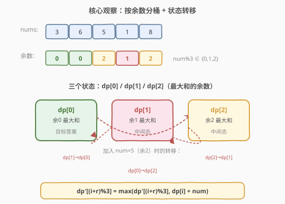
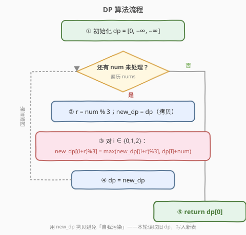
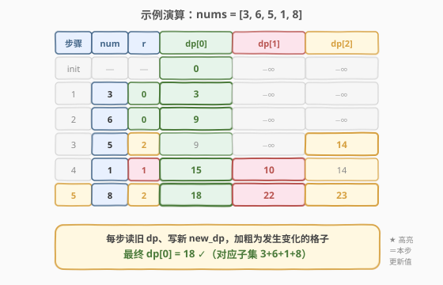

# LeetCode 可被三整除的最大和 题解

## 1. 题目概述

- **标题 / 题号**：可被三整除的最大和（#1262，medium）
- **链接**：https://leetcode.cn/problems/greatest-sum-divisible-by-three/
- **难度**：中等
- **标签**：数组、动态规划、贪心

**题意**：给你一个整数数组 `nums`，请你选出并求和其中**任意个子集**的元素，使得该和能被 `3` 整除，并返回**该最大和**。若不存在这样的和，返回 `0`。

**示例 1**：

```text
输入：nums = [3,6,5,1,8]
输出：18
解释：选出 3, 6, 1, 8，和为 18，是所有可被 3 整除的子集和中的最大值。
```

**示例 2**：

```text
输入：nums = [4]
输出：0
解释：4 不能被 3 整除，且没有其他可选元素，故返回 0。
```

**示例 3**：

```text
输入：nums = [1,2,3,4,4]
输出：12
解释：选出 1, 3, 4, 4，和为 12，可被 3 整除。
```

**约束**：

- `1 <= nums.length <= 4 * 10^4`
- `1 <= nums[i] <= 10^4`

> 💡 **子集 ≠ 子数组**：本题选的是「任意子集」，不要求连续，也不要求保序。这把问题从「滑窗/前缀和」家族推向了「背包/状态DP」家族——每个元素「选 / 不选」。

## 2. 解题思路

### 2.1 暴力思路

枚举每个元素的选/不选，共 $2^n$ 个子集，对每个子集求和判 `% 3 == 0` 取最大。`n = 4 \times 10^4` 时显然不可行。

### 2.2 核心观察：按余数分桶 + 状态转移



> 💡 **关键降维**：我们只关心和的「**余数**」`sum % 3`（取值 0/1/2），而非和本身。于是用三个状态记录到当前位置为止、各余数对应的最大子集和：

$$
\text{dp}[r] = \text{目前能凑出的、且} \sum \% 3 = r \text{ 的最大子集和}, \quad r \in \{0,1,2\}
$$

- **初始**：`dp = [0, -1, -1]`——空子集和为 `0`（余 0），其余余数暂时「不可达」用 `-1` 表示。
- **转移**：处理 `num`，设 $r = \text{num} \% 3$。对每个旧余数 $i$，选 `num` 后新余数为 $(i + r) \% 3$，候选值为 $\text{dp}[i] + \text{num}$，与原值取 `max`。

$$
\text{dp}'[(i+r)\bmod 3] = \max\bigl(\text{dp}'[(i+r)\bmod 3],\ \text{dp}[i] + \text{num}\bigr)
$$

- **答案**：最终 `dp[0]`（和能被 3 整除的最大子集和）。

> ⚠️ **必须用拷贝避免「自我污染」**：转移时要读**旧** `dp`、写**新** `nd`。若原地更新，先改的 `nd[j]` 可能被同轮后续转移当作旧值读入，导致同一个 `num` 被重复选用。拷贝一份 `nd = dp` 即可。

### 2.3 算法流程图



文字流程：

1. 初始化 `dp = [0, -1, -1]`
2. 对每个 `num`：
   - `r = num % 3`，拷贝 `nd = dp`
   - 对 `i ∈ {0,1,2}`：若 `dp[i]` 可达（`>= 0`），令 `j = (i+r) % 3`，`nd[j] = max(nd[j], dp[i] + num)`
   - `dp = nd`
3. 返回 `dp[0]`

### 2.4 示例演算

以 `nums = [3,6,5,1,8]` 为例，展示 `dp` 三个状态的逐轮演化：



| 步骤 | num | r | dp[0] | dp[1] | dp[2] | 说明 |
|------|-----|---|-------|-------|-------|------|
| init | —   | — | 0     | −1    | −1    | 空子集余 0 |
| 1    | 3   | 0 | **3** | −1    | −1    | dp[0]+3→dp[0] |
| 2    | 6   | 0 | **9** | −1    | −1    | dp[0]+6→dp[0] |
| 3    | 5   | 2 | 9     | −1    | **14**| dp[0]+5→dp[2]（9+5=14） |
| 4    | 1   | 1 | **15**| **10**| 14    | dp[2]+1→dp[0]（14+1=15）；dp[0]+1→dp[1]（9+1=10） |
| 5    | 8   | 2 | **18**| **22**| **23**| dp[1]+8→dp[0]（10+8=18）；dp[2]+8→dp[1]（14+8=22）；dp[0]+8→dp[2]（15+8=23） |

最终 `dp[0] = 18`，对应子集 $\{3,6,1,8\}$，和为 $18$，可被 3 整除 ✓。

## 3. 参考代码

### C++

```cpp
class Solution {
  public:
    int maxSumDivThree(vector<int>& nums) {
        vector<int> dp = {0, -1, -1};   // -1 表示该余数暂不可达
        for (int num : nums) {
            int r = num % 3;
            vector<int> nd = dp;        // 拷贝旧值，避免自我污染
            for (int i = 0; i < 3; i++) {
                if (dp[i] >= 0) {
                    int j = (i + r) % 3;
                    nd[j] = max(nd[j], dp[i] + num);
                }
            }
            dp = nd;
        }
        return dp[0];
    }
};
```

### Python

```python
class Solution:
    def maxSumDivThree(self, nums: List[int]) -> int:
        dp = [0, -1, -1]  # -1 表示该余数暂不可达
        for num in nums:
            r = num % 3
            nd = dp[:]    # 拷贝旧值，避免自我污染
            for i in range(3):
                if dp[i] >= 0:
                    j = (i + r) % 3
                    nd[j] = max(nd[j], dp[i] + num)
            dp = nd
        return dp[0]
```

## 4. 复杂度分析

| 方法 | 时间复杂度 | 空间复杂度 | 说明 |
|------|-----------|-----------|------|
| 余数状态 DP | $O(n)$ | $O(1)$ | 每个元素做 3 次常数转移；`dp` 仅 3 个状态，额外数组同长 |

> 💡 本质是一个「状态数 = 3 的滚动 DP」：把通用的 $O(n \cdot \text{sum})$ 背包压缩为 $O(n \cdot 3) = O(n)$，余数取值少是降维的根因。若把 `3` 换成任意 `K`，则状态数为 `K`，复杂度 $O(nK)$。

## 5. 扩展：贪心解法

除 DP 外，本题还有一类**贪心**解法，思路更直观但细节较多：

> 💡 **贪心直觉**：先全选，和为 `total`。若 `total % 3 == 0` 直接返回；否则需要「**丢掉**尽量小的若干元素」使余数归零。

把元素按 `% 3` 分三组：余 0 的不影响整除性，余 1 记入 `r1`，余 2 记入 `r2`，各自**升序排序**。设 `total % 3 = m`：

- **`m == 1`**：丢掉 1 个余 1 的（最小 `r1[0]`），或丢掉 2 个余 2 的（`r2[0]+r2[1]`），取两者较小。
- **`m == 2`**：丢掉 1 个余 2 的（最小 `r2[0]`），或丢掉 2 个余 1 的（`r1[0]+r1[1]`），取两者较小。

> ⚠️ 因为 $2 \times 2 \equiv 1 \pmod 3$、$2 \times 1 \equiv 2 \pmod 3$，所以「丢 2 个余 2」等价于「丢 1 个余 1」对余数的修正效果。

#### C++

```cpp
class Solution {
  public:
    int maxSumDivThree(vector<int>& nums) {
        int total = accumulate(nums.begin(), nums.end(), 0);
        if (total % 3 == 0) return total;
        vector<int> r1, r2;
        for (int x : nums) {
            if (x % 3 == 1) r1.push_back(x);
            else if (x % 3 == 2) r2.push_back(x);
        }
        sort(r1.begin(), r1.end());
        sort(r2.begin(), r2.end());
        int cand = INT_MAX;
        if (total % 3 == 1) {
            if (!r1.empty()) cand = min(cand, r1[0]);
            if (r2.size() >= 2) cand = min(cand, r2[0] + r2[1]);
        } else {  // total % 3 == 2
            if (!r2.empty()) cand = min(cand, r2[0]);
            if (r1.size() >= 2) cand = min(cand, r1[0] + r1[1]);
        }
        return total - cand;
    }
};
```

| 方法 | 时间复杂度 | 空间复杂度 | 说明 |
|------|-----------|-----------|------|
| 贪心 | $O(n \log n)$ | $O(n)$ | 排序主导；需分类、排序、特判分支，边界较多 |

> 💡 **DP vs 贪心**：DP 时间更优（$O(n)$）、边界更少、易推广到任意 `K`；贪心思路直观但需处理「丢 1 个」与「丢 2 个」的合法性判断，扩展性弱。面试推荐 DP 为主、贪心作为补充思路。

## 6. 面试要点

1. **为什么用「余数」而非「和」作为状态？**

   - 答案只关心 `% 3` 的结果，具体和值不影响后续整除性判定。按余数分桶把状态空间从 $O(\text{sum})$ 压缩到 $O(3)$，是「同余/模运算」类问题的通用降维手法。

2. **为什么要拷贝 `nd = dp` 而不能原地更新？**

   - 同一轮内可能有多条转移写入同一目标格，若原地更新，先写入的新值会被后续转移误读为旧值，导致同一个 `num` 被多次累加。拷贝保证「读旧写新」。

3. **`-1` 代替 `-∞` 作不可达标记是否安全？**

   - 本题 `nums[i] >= 1`，任何非空子集和都 `> 0`，空子集和为 `0`，因此合法状态恒 `>= 0`，`-1` 不会与真实和冲突。若元素可负则需改用 `-∞` 哨兵。

4. **DP 能否推广到「被 K 整除的最大和」？**

   - 可以。状态数变为 `K`，`dp[(i + num % K) % K]` 转移，复杂度 $O(nK)$。贪心法仅在 `K` 很小（如 3）时才便于手列分支，不通用。

5. **贪心法中「丢 2 个余 2」为何能修正余 1？**

   - $2 + 2 = 4 \equiv 1 \pmod 3$，从总和中减去这两个等价于减去一个余 1 的量，正好抵消 `total % 3 == 1` 的多余余数。反之 $1 + 1 = 2$ 抵消余 2。

## 同类练习题

| # | 题目 | 与本题的关联 |
|---|------|-------------|
| 974 | [和可被 K 整除的子数组](https://leetcode.cn/problems/subarray-sum-divisible-by-k/)（[题解](../0901-1000/974_和可被K整除的子数组.md)） | 前缀和 + 同余定理的「连续子数组计数」版，对比 1262 的「子集最值」版 |
| 1590 | [使数组和能被 P 整除](https://leetcode.cn/problems/make-sum-divisible-by-p/) | 删除最短连续子数组使剩余和被 P 整除，同余思想 + 哈希找最近前缀 |
| 1015 | [可被 K 整除的最小整数](https://leetcode.cn/problems/smallest-integer-divisible-by-k/) | 由全 1 组成的数模 K 找首个余 0，余数 BFS |
| 523 | [连续子数组和](https://leetcode.cn/problems/continuous-subarray-sum/) | 同余判定和为 N 倍且长度 ≥ 2 |
| 416 | [分割等和子集](https://leetcode.cn/problems/partition-equal-subset-sum/)（[题解](../0401-0500/416_分割等和子集.md)） | 0-1 背包求子集和，同属「子集型 DP」家族 |
