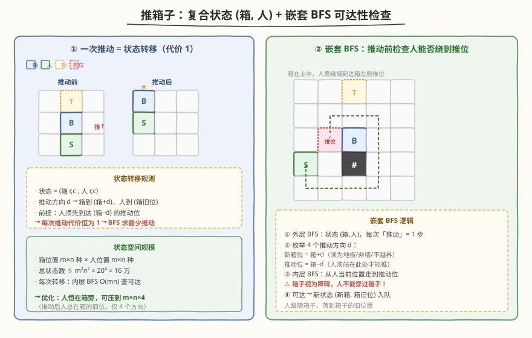
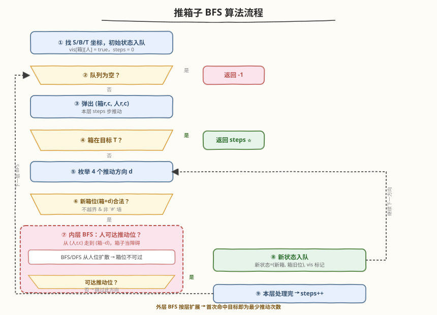
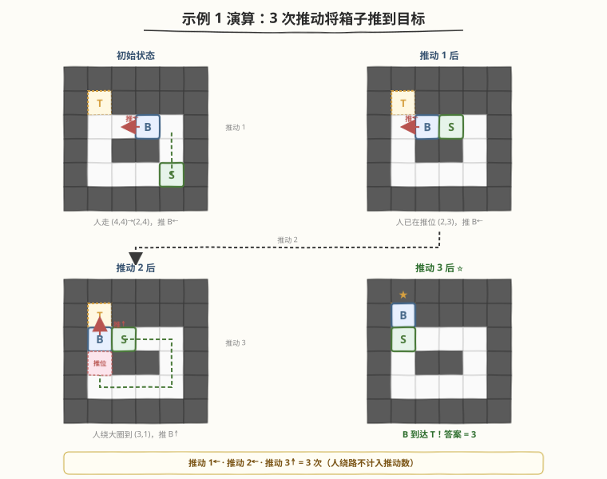

# 推箱子

- **题目名称**：推箱子
- **链接**：[1263. 推箱子](https://leetcode.cn/problems/minimum-moves-to-move-a-box-to-their-target-location/)
- **难度**：困难
- **标签**：广度优先搜索、矩阵、嵌套 BFS

## 1. 题目概述

在一个 $m \times n$ 的网格上进行「推箱子」游戏。网格中每个单元格是以下字符之一：

- `'S'`：玩家起始位置
- `'B'`：箱子起始位置
- `'T'`：目标位置
- `'#'`：墙（障碍物，不可通行）
- `'.'`：地板（可自由行走）

玩家可以在地板上向上下左右四个方向移动。当玩家**站在箱子旁边并沿箱子方向移动**时，箱子被推到相邻的地板单元格——记作一次「推动」。玩家**无法越过箱子**。

返回将箱子推到目标位置的最小**推动**次数；若无法做到则返回 `-1`。

**示例 1**：

```text
输入：grid = [["#","#","#","#","#","#"],
             ["#","T","#","#","#","#"],
             ["#",".",".","B",".","#"],
             ["#",".","#","#",".","#"],
             ["#",".",".",".","S","#"],
             ["#","#","#","#","#","#"]]
输出：3
解释：我们只需要返回推箱子的次数。
```

**示例 2**：

```text
输入：grid = [["#","#","#","#","#","#"],
             ["#","T","#","#","#","#"],
             ["#",".",".","B",".","#"],
             ["#","#","#","#",".","#"],
             ["#",".",".",".","S","#"],
             ["#","#","#","#","#","#"]]
输出：-1
```

> ⚠️ 示例 1 与示例 2 仅第 3 行（索引 3）不同：示例 1 的 `(3,1)` 是地板 `'.'`，示例 2 的 `(3,1)` 是墙 `'#'`。这导致示例 2 中玩家无法绕到箱子下方推动它向上——仅一墙之差，从 3 次变成不可达。

**示例 3**：

```text
输入：grid = [["#","#","#","#","#","#"],
             ["#","T",".",".","#","#"],
             ["#",".","#","B",".","#"],
             ["#",".",".",".",".","#"],
             ["#",".",".",".","S","#"],
             ["#","#","#","#","#","#"]]
输出：5
解释：向下、向左、向左、向上再向上。
```

**约束条件**：

- $m == \text{grid.length}$
- $n == \text{grid[i].length}$
- $1 \le m, n \le 20$
- `grid` 仅包含 `'.'`, `'#'`, `'S'`, `'T'`, `'B'`
- `'S'`, `'B'`, `'T'` 各只出现一个

> 💡 **问题重塑**：答案只统计**推动次数**，玩家自己走来走去不计入答案。于是可以把「每次推动」视作一条代价为 1 的边，在状态图上求从初始状态到目标状态的无权最短路——BFS 的标准场景。难点在于：每次推动前必须先确认玩家能走到推动位，这需要一次**内层 BFS**。

---

## 2. 解题思路

### 2.1 暴力思路（DFS 全搜索）

用 DFS 枚举所有推动序列，记录箱子到达目标的最小推动数。问题在于：玩家位置也会影响后续可达的推动方向，状态空间包含「箱子位置 × 玩家位置」的组合；DFS 无法保证首次命中即最优，需搜遍所有可能再取最小，$m = n = 20$ 时组合爆炸。

### 2.2 核心观察：复合状态 + 嵌套 BFS



关键直觉分三层：

1. **状态 = (箱子位置, 玩家位置)**：游戏的全局状态由箱子和玩家两者的坐标共同决定。一个 4 元组 $(b_r, b_c, p_r, p_c)$ 唯一确定当前局面。

2. **每次推动 = 代价 1 的转移**：沿方向 $d$ 推动时——
   - 箱子从 $(b_r, b_c)$ 移到 $(b_r + d_r, b_c + d_c)$（须为地板、非墙、不越界）
   - 玩家须先站在推动位 $(b_r - d_r, b_c - d_c)$（箱子反方向那一格）
   - 推动后玩家落到箱子的**旧位置** $(b_r, b_c)$

   每次推动代价恒为 1 → **外层 BFS** 按层扩展，首次命中目标即为最少推动次数。

3. **推动前须检查玩家可达性（内层 BFS）**：玩家从当前位置走到推动位的过程中，**箱子是障碍物**——玩家不能穿过箱子。因此每次尝试推动时，需要跑一次内层 BFS（或 DFS），从玩家当前位置搜索到推动位，把箱子所在格视为墙。

> 💡 **为什么是嵌套 BFS 而非单层 BFS？** 单层 BFS 只能处理「一步 = 一条边」的图。但本题中，一次推动前可能需要玩家走很多步（不计入答案），这些「走路」不是答案的一部分。如果把玩家的每一步也算作状态转移，就变成了 0-1 BFS（走一步代价 0、推一次代价 1），虽然也可行但状态空间更大。更清晰的做法是：**外层 BFS 只关心推动（代价 1），内层 BFS 只负责验证玩家能否走到推位（不关心走几步）**——两层职责分离。

> ⚠️ **箱子是玩家的障碍**：内层 BFS 中必须将箱子所在格 $(b_r, b_c)$ 标记为不可通行。这是本题最常见的坑——忘记让箱子挡住玩家的路，导致玩家「穿箱而过」到达本不可达的推动位。

### 2.3 算法流程图



整体流程是一个带内层 BFS 的分层 BFS：

1. **初始化**：扫描网格找到 `S`、`B`、`T` 的坐标。初始状态 $(b_r, b_c, s_r, s_c)$ 入队，标记 `vis[箱][人] = true`，`steps = 0`。
2. **分层扩展**：每层处理队列中所有状态（同层 = 同样推动次数）。
3. **弹出状态** $(b_r, b_c, p_r, p_c)$：若 $(b_r, b_c) == (t_r, t_c)$，返回 `steps`。
4. **枚举 4 个推动方向** $d$：
   - 检查新箱位 $(b_r + d_r, b_c + d_c)$ 合法（不越界、非墙）
   - 检查推动位 $(b_r - d_r, b_c - d_c)$ 合法（不越界、非墙）
   - **内层 BFS**：从 $(p_r, p_c)$ 搜索到推动位，箱子当障碍
   - 可达且新状态未访问 → 新状态 $(b_r{+}d_r, b_c{+}d_c,\ b_r, b_c)$ 入队
5. **本层结束** → `steps++`，回到步骤 2。
6. **队列耗尽**仍未命中 → 返回 `-1`。

> 💡 **`vis` 一物两用**：`vis[箱r][箱c][人r][人c]` 同时承担访问标记与去重。BFS 首次写入即为最少推动次数对应的状态，后续再遇到直接跳过。

### 2.4 示例演算

以示例 1 为例，BFS 找到的 3 次推动最短路径如下：



| 推动 | 方向 | 箱子位置变化 | 玩家走位（不计入答案） | 说明 |
|------|------|-------------|----------------------|------|
| 0 | — | $(2,3)$ | $(4,4)$ | 初始状态 |
| 1 | ← 左 | $(2,3) \to (2,2)$ | $(4,4) \to (3,4) \to (2,4)$ | 人走到推位 $(2,4)$，推箱左移 |
| 2 | ← 左 | $(2,2) \to (2,1)$ | 无需走动（已在 $(2,3)$） | 人恰在推位，直接推 |
| 3 | ↑ 上 | $(2,1) \to (1,1)$ ⭐ | $(2,2) \to (2,3) \to (2,4) \to (3,4) \to (4,4) \to (4,3) \to (4,2) \to (4,1) \to (3,1)$ | 人绕大圈到推位 $(3,1)$，推箱上移命中 T |

> 💡 **推动 3 的绕路**：推动 2 后人停在 $(2,2)$，但要向上推箱子，人须到箱子下方的 $(3,1)$。$(3,1)$ 是地板（示例 1）而非墙（示例 2），但从 $(2,2)$ 到 $(3,1)$ 被墙 $(3,2),(3,3)$ 阻断，必须绕道第 4 行再折返上行——内层 BFS 自动找到这条绕路。这正是示例 1 可达（答案 3）而示例 2 不可达（答案 -1）的根本原因：示例 2 的 $(3,1)$ 是墙，人根本站不上去。

---

## 3. 参考代码

### C++

```cpp
class Solution {
  public:
    int minPushBox(vector<vector<char>>& grid) {
        int m = grid.size(), n = grid[0].size();
        int sr, sc, br, bc, tr, tc;
        for (int i = 0; i < m; i++)
            for (int j = 0; j < n; j++) {
                if (grid[i][j] == 'S') { sr = i; sc = j; }
                else if (grid[i][j] == 'B') { br = i; bc = j; }
                else if (grid[i][j] == 'T') { tr = i; tc = j; }
            }

        int dirs[4][2] = {{-1,0},{1,0},{0,-1},{0,1}};
        // vis[箱r][箱c][人r][人c]
        vector<vector<vector<vector<bool>>>> vis(m,
            vector<vector<vector<bool>>>(n,
                vector<vector<bool>>(m, vector<bool>(n, false))));
        queue<tuple<int,int,int,int>> q;
        q.emplace(br, bc, sr, sc);
        vis[br][bc][sr][sc] = true;
        int steps = 0;

        while (!q.empty()) {
            int sz = q.size();
            while (sz--) {
                auto [bx, by, px, py] = q.front(); q.pop();
                if (bx == tr && by == tc) return steps;
                for (auto& d : dirs) {
                    int nbx = bx + d[0], nby = by + d[1];       // 新箱位
                    if (nbx < 0 || nbx >= m || nby < 0 || nby >= n) continue;
                    if (grid[nbx][nby] == '#') continue;
                    int pfx = bx - d[0], pfy = by - d[1];       // 推动位
                    if (pfx < 0 || pfx >= m || pfy < 0 || pfy >= n) continue;
                    if (grid[pfx][pfy] == '#') continue;
                    // 内层 BFS：人从 (px,py) 走到 (pfx,pfy)，箱子当障碍
                    if (!canReach(grid, px, py, pfx, pfy, bx, by, m, n)) continue;
                    if (vis[nbx][nby][bx][by]) continue;
                    vis[nbx][nby][bx][by] = true;
                    q.emplace(nbx, nby, bx, by);
                }
            }
            steps++;
        }
        return -1;
    }

  private:
    bool canReach(vector<vector<char>>& g, int pr, int pc, int tr, int tc,
                  int br, int bc, int m, int n) {
        if (pr == tr && pc == tc) return true;
        int dirs[4][2] = {{-1,0},{1,0},{0,-1},{0,1}};
        vector<vector<bool>> seen(m, vector<bool>(n, false));
        queue<pair<int,int>> bq;
        bq.emplace(pr, pc);
        seen[pr][pc] = true;
        while (!bq.empty()) {
            auto [r, c] = bq.front(); bq.pop();
            for (auto& d : dirs) {
                int nr = r + d[0], nc = c + d[1];
                if (nr < 0 || nr >= m || nc < 0 || nc >= n) continue;
                if (g[nr][nc] == '#') continue;
                if (nr == br && nc == bc) continue;   // 箱子挡路
                if (seen[nr][nc]) continue;
                if (nr == tr && nc == tc) return true;
                seen[nr][nc] = true;
                bq.emplace(nr, nc);
            }
        }
        return false;
    }
};
```

### Python

```python
class Solution:
    def minPushBox(self, grid: List[List[str]]) -> int:
        m, n = len(grid), len(grid[0])
        for i in range(m):
            for j in range(n):
                if grid[i][j] == 'S': sr, sc = i, j
                elif grid[i][j] == 'B': br, bc = i, j
                elif grid[i][j] == 'T': tr, tc = i, j

        dirs = [(-1, 0), (1, 0), (0, -1), (0, 1)]

        def can_reach(pr, pc, goal_r, goal_c, br, bc):
            """内层 BFS：人从 (pr,pc) 走到 (goal_r,goal_c)，箱子当障碍"""
            if (pr, pc) == (goal_r, goal_c):
                return True
            seen = [[False] * n for _ in range(m)]
            dq = collections.deque([(pr, pc)])
            seen[pr][pc] = True
            while dq:
                r, c = dq.popleft()
                for dr, dc in dirs:
                    nr, nc = r + dr, c + dc
                    if not (0 <= nr < m and 0 <= nc < n):
                        continue
                    if grid[nr][nc] == '#':
                        continue
                    if (nr, nc) == (br, bc):       # 箱子挡路
                        continue
                    if seen[nr][nc]:
                        continue
                    if (nr, nc) == (goal_r, goal_c):
                        return True
                    seen[nr][nc] = True
                    dq.append((nr, nc))
            return False

        vis = set()
        vis.add((br, bc, sr, sc))
        dq = collections.deque([(br, bc, sr, sc)])
        steps = 0
        while dq:
            for _ in range(len(dq)):
                bx, by, px, py = dq.popleft()
                if (bx, by) == (tr, tc):
                    return steps
                for dr, dc in dirs:
                    nbx, nby = bx + dr, by + dc       # 新箱位
                    if not (0 <= nbx < m and 0 <= nby < n) or grid[nbx][nby] == '#':
                        continue
                    pfx, pfy = bx - dr, by - dc       # 推动位
                    if not (0 <= pfx < m and 0 <= pfy < n) or grid[pfx][pfy] == '#':
                        continue
                    if not can_reach(px, py, pfx, pfy, bx, by):
                        continue
                    if (nbx, nby, bx, by) in vis:
                        continue
                    vis.add((nbx, nby, bx, by))
                    dq.append((nbx, nby, bx, by))
            steps += 1
        return -1
```

> ⚠️ **代码组织说明**：外层 BFS 按 `steps` 分层——同层所有状态代表「同样推动次数」下的不同局面。弹出状态时若箱子已在目标则立即返回 `steps`。每次扩展 4 个方向时，先做 O(1) 的越界/墙检查（新箱位 + 推动位），再调用 `canReach` 做内层 BFS 验证玩家可达性——把昂贵的内层搜索放在最后，利用短路求值减少调用次数。

> 💡 **Python 用 `set` 而非 4 维数组**：状态实际访问数远小于 $m^2 n^2$（很多组合不可达），用 `set` 存 4 元组更省内存且无需预分配。C++ 中 4 维 `vector<bool>` 仅 $20^4 = 16$ 万 bit ≈ 20 KB，预分配反而更快。

---

## 4. 复杂度分析

| 维度 | 复杂度 | 说明 |
|------|--------|------|
| 时间复杂度 | $O(m^2 n^2 \cdot mn)$ | 状态总数 $\le m^2 n^2$（箱位 $\times$ 人位），每个状态扩展 4 方向，每方向内层 BFS $O(mn)$ |
| 空间复杂度 | $O(m^2 n^2)$ | `vis` 4 维数组 / 集合 + 内层 BFS 的 `seen` 数组 $O(mn)$ |

> 💡 $m = n = 20$ 时 $m^2 n^2 = 16$ 万，内层 BFS $\le 400$ 格，总操作 $\le 6.4 \times 10^7$，在时限内轻松通过。实际运行远小于理论上界——大量状态不可达，`vis` 去重后每个状态只扩展一次。

---

## 5. 扩展：状态压缩——利用「人恒在箱旁」性质

观察一个关键性质：**每次推动后，玩家总是落在箱子的旧位置**，而箱子的旧位置与新位置相邻。因此除初始状态外，玩家位置恒为箱子的 4 个邻居之一。

据此可将状态从 $(b_r, b_c, p_r, p_c)$ 压缩为 $(b_r, b_c, \text{dir})$，其中 `dir` 表示玩家相对于箱子的方向（上/下/左/右）。状态数从 $O(m^2 n^2)$ 降到 $O(mn \cdot 4)$。

初始状态需特殊处理：先做一次内层 BFS，找出玩家能到达的箱子 4 个邻居中哪些可行，将这些 $(b_r, b_c, \text{dir})$ 作为起点入队。

```cpp
// 状态压缩版核心逻辑（仅展示差异部分）
// vis[m][n][4]，dir = 玩家相对箱子的方向（0=上 1=下 2=左 3=右）
// 初始：内层 BFS 找出玩家能到达的箱子邻居，按 dir 入队
// 转移：沿 d 推动后，新 dir = d 的反方向（人落在箱旧位=新箱的 d 反方向侧）
```

| 方法 | 状态数 | 时间复杂度 | 适用场景 |
|------|--------|-----------|---------|
| 4 元组 BFS | $O(m^2 n^2)$ | $O(m^2 n^2 \cdot mn)$ | 实现直观，本题首选 |
| 方向压缩 BFS | $O(mn \cdot 4)$ | $O(mn \cdot 4 \cdot mn)$ | 网格更大时优势明显 |

> 💡 本题 $m, n \le 20$，两种方法都能轻松通过。方向压缩版的核心收益在于状态数从 $O(m^2 n^2)$ 降到 $O(mn)$，当网格放宽到 $100 \times 100$ 时差距显著。

---

## 6. 面试要点

1. **为什么状态要包含玩家位置，而不只是箱子位置？**

   - 同一个箱子位置下，玩家在不同位置能推的方向不同。例如箱子在 $(2,2)$，玩家在 $(2,3)$ 只能向左推，在 $(3,2)$ 只能向上推。若只记录箱子位置会丢失「玩家此刻能推哪些方向」的信息，导致漏解或重复扩展。

2. **为什么用嵌套 BFS 而不是把玩家的每一步也作为状态转移？**

   - 答案只统计推动次数，玩家走路不计。若把走路也作为代价 0 的边、推动作为代价 1 的边，可以用 0-1 BFS（双端队列），但状态空间膨胀为 $(b_r, b_c, p_r, p_c)$ 的每一步——而嵌套 BFS 把「走路」封装在内层 BFS 里，外层只关心推动，职责更清晰、实现更简洁。

3. **内层 BFS 为什么要将箱子视为障碍？**

   - 玩家「无法越过箱子」是题目规则。若内层 BFS 不挡箱子，玩家可能「穿箱」到达本不可达的推动位，从而产生非法的推动序列——典型 bug 是忘加这一行导致答案偏小甚至错误。

4. **BFS 分层时 `steps` 何时递增？**

   - 先处理当前队列中的全部状态（同一层 = 同一推动次数），处理完毕后 `steps++`。弹出状态时若箱子已在目标，直接返回当前 `steps`——因为同层状态对应相同的推动次数，首次命中即为最优。

5. **示例 1 与示例 2 仅一格之差，为何一个返回 3 一个返回 -1？**

   - 两者唯一区别是 $(3,1)$：示例 1 是地板（人能站上去向上推箱），示例 2 是墙（人无法到达推动位）。这格决定了推动 3（向上推）是否可行——少了这一次推动，箱子永远到不了目标，故返回 -1。

---

## 7. 同类练习题

- [1210. 穿过迷宫的最少移动次数](https://leetcode.cn/problems/minimum-moves-to-reach-target-with-rotations/)（[题解](../1201-1300/1210_穿过迷宫的最少移动次数.md)）：同为「状态编码 + 无权图 BFS 求最少操作」，把蛇身姿态编码为 (锚点, 朝向)，对照本题把 (箱, 人) 编码为状态
- [773. 滑动谜题](https://leetcode.cn/problems/sliding-puzzle/)（[题解](../0701-0800/773_滑动谜题.md)）：2×3 棋盘数字滑块，把棋盘排列编码为状态 BFS 求最少移动，与本题「复合状态作节点」思路同构
- [752. 打开转盘锁](https://leetcode.cn/problems/open-the-lock/)（[题解](../0701-0800/752_打开转盘锁.md)）：把转盘 4 位串编码为节点、每次拨一格连边，BFS 求最少操作，对照「状态作节点、合法转移作边」的通用范式
- [994. 腐烂的橘子](https://leetcode.cn/problems/rotting-oranges/)（[题解](../0901-1000/994_腐烂的橘子.md)）：网格多源 BFS 逐层扩散，层 = 时间步，与本题「BFS 层数即答案」同源
- [542. 01 矩阵](https://leetcode.cn/problems/01-matrix/)（[题解](../0501-0600/542_01矩阵.md)）：多源 BFS 求每个格子到最近 0 的距离，对照本题单源 BFS 求最少推动次数
