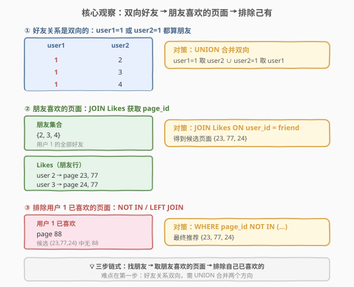
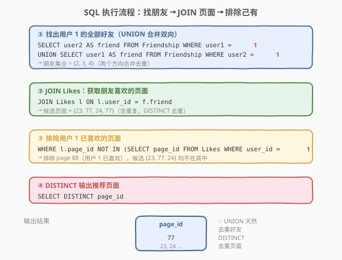
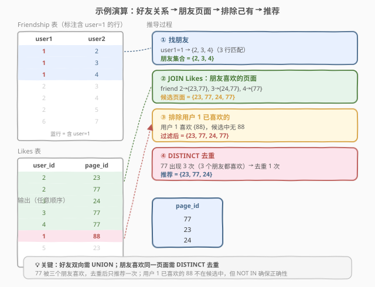

# LeetCode 页面推荐 题解

## 1. 题目概述

- **标题 / 题号**：页面推荐（#1264，medium）
- **链接**：https://leetcode.cn/problems/page-recommendations/
- **难度**：中等
- **标签**：SQL、JOIN、UNION、NOT IN、DISTINCT

**题意**：给定 `Friendship` 表和 `Likes` 表，要求为 **用户 1** 推荐页面：推荐其**好友喜欢的**、但**用户 1 自己尚未喜欢的**页面。

**表结构**：

```text
Table: Friendship
+---------------+---------+
| Column Name   | Type    |
+---------------+---------+
| user1         | int     |
| user2         | int     |
+---------------+---------+
```

- `(user1, user2)` 是主键
- 每行表示 user1 与 user2 互为好友（**双向关系**）

```text
Table: Likes
+---------------+---------+
| Column Name   | Type    |
+---------------+---------+
| user_id       | int     |
| page_id       | int     |
+---------------+---------+
```

- `(user_id, page_id)` 是主键
- 每行表示 user_id 喜欢 page_id

> ⚠️ 本题核心难点在于：**好友关系是双向的**——用户 1 可能出现在 `user1` 列或 `user2` 列，需要从两个方向查找才能找全好友。

**示例 1**：

```text
输入：
Friendship 表:
+-------+-------+
| user1 | user2 |
+-------+-------+
| 1     | 2     |
| 1     | 3     |
| 1     | 4     |
| 2     | 3     |
| 2     | 4     |
| 2     | 5     |
| 6     | 7     |
+-------+-------+

Likes 表:
+---------+---------+
| user_id | page_id |
+---------+---------+
| 1       | 88      |
| 2       | 23      |
| 2       | 77      |
| 3       | 24      |
| 3       | 77      |
| 4       | 77      |
| 5       | 23      |
| 6       | 88      |
+---------+---------+

输出：
+---------+
| page_id |
+---------+
| 77      |
| 23      |
| 24      |
+---------+
```

**解释**：

| 步骤 | 说明 |
|------|------|
| 找好友 | 用户 1 出现在 `user1=1` 的行 → 好友 {2, 3, 4}（本例无 `user2=1` 的行） |
| 朋友喜欢的页面 | friend 2 → {23, 77}；friend 3 → {24, 77}；friend 4 → {77} |
| 排除用户 1 已喜欢 | 用户 1 喜欢 {88}，候选中无 88 |
| 去重输出 | 候选 {23, 77, 24, 77} → `DISTINCT` → {23, 77, 24} |

**约束**：

- 好友关系双向：`user1` 是 `user2` 的好友，反之亦然
- 结果不含用户 1 已喜欢的页面
- 结果不含重复页面（同一页面可能被多个好友喜欢）
- 结果顺序不限

## 2. 解题思路

### 2.1 暴力思路：只查一个方向（❌ 不完整）

最直觉的写法是只从 `user1 = 1` 查好友：

```sql
-- ❌ 不完整：遗漏 user2 = 1 的好友
SELECT l.page_id
FROM Friendship f
JOIN Likes l ON l.user_id = f.user2
WHERE f.user1 = 1
  AND l.page_id NOT IN (SELECT page_id FROM Likes WHERE user_id = 1);
```

看似合理，但有**致命缺陷**：

1. **遗漏好友**：如果某行是 `(5, 1)`（即 `user2 = 1`），上述查询查不到好友 5。好友关系是双向的，用户 1 可能在任一列出现。

> ⚠️ 根本问题在于「单向查找」——`Friendship` 表中用户 1 可能在 `user1` 或 `user2` 任一列，必须**两个方向都查**再合并。

### 2.2 核心观察：UNION 合并双向好友 + 三步链式推荐



正确思路分三步：

**第一步：用 UNION 合并双向好友**

用户 1 的好友来自两个方向：
- `user1 = 1` → 好友是 `user2`
- `user2 = 1` → 好友是 `user1`

用 `UNION`（而非 `UNION ALL`）合并两个方向，天然去重：

```sql
SELECT user2 AS friend FROM Friendship WHERE user1 = 1
UNION
SELECT user1 AS friend FROM Friendship WHERE user2 = 1
```

得到好友集合 $F = \{2, 3, 4\}$。

**第二步：JOIN Likes 获取候选页面**

将好友集合与 `Likes` 表连接，获取所有好友喜欢的页面：

```sql
JOIN Likes l ON l.user_id = f.friend
```

候选页面 = {23, 77, 24, 77}（77 被三个好友喜欢，出现 3 次）。

**第三步：排除用户 1 已喜欢的页面 + DISTINCT 去重**

```sql
WHERE l.page_id NOT IN (SELECT page_id FROM Likes WHERE user_id = 1)
```

用户 1 喜欢 {88}，候选中无 88，但 `NOT IN` 确保**即使候选中有 88 也被排除**。最后 `DISTINCT page_id` 对多好友重复喜欢的页面去重。

> 💡 **为什么用 UNION 而非 UNION ALL**：`UNION` 自动去重，避免同一好友被两个方向同时匹配时产生重复。若用 `UNION ALL`，则需要在后续步骤中额外 `DISTINCT`。本题 `UNION` 更简洁。

### 2.3 算法流程图



**逻辑执行步骤**：

| 步骤 | SQL 子句 | 作用 |
|------|----------|------|
| ① | `UNION` 合并双向好友 | 从 `user1=1` 和 `user2=1` 两个方向找好友，去重合并 |
| ② | `JOIN Likes ON user_id = friend` | 获取所有好友喜欢的页面（含重复） |
| ③ | `WHERE page_id NOT IN (...)` | 排除用户 1 已喜欢的页面 |
| ④ | `SELECT DISTINCT page_id` | 对多好友重复喜欢的页面去重 |

> 💡 **SQL 子句执行顺序**：`FROM`（含 `JOIN`/子查询）→ `WHERE`（含 `NOT IN`）→ `GROUP BY` → `HAVING` → `SELECT`（含 `DISTINCT`）→ `ORDER BY`。子查询中的 `UNION` 先执行得到好友集合，再 `JOIN Likes`，`WHERE` 过滤排除己有页面，最后 `DISTINCT` 去重输出。

### 2.4 示例演算



以示例 1 数据为例，逐步跟踪：

**步骤 ①：找好友**

```sql
SELECT user2 AS friend FROM Friendship WHERE user1 = 1   -- → {2, 3, 4}
UNION
SELECT user1 AS friend FROM Friendship WHERE user2 = 1   -- → {}（本例无 user2=1 的行）
```

好友集合 $F = \{2, 3, 4\}$

> 若存在行 `(5, 1)`，则第二个 SELECT 会产出 friend=5，合并入 $F$。

**步骤 ②：JOIN Likes 获取候选页面**

| 好友 | 喜欢的页面 |
|------|-----------|
| 2 | 23, 77 |
| 3 | 24, 77 |
| 4 | 77 |

候选页面（含重复）= {23, 77, 24, 77}

**步骤 ③：排除用户 1 已喜欢的**

用户 1 喜欢的页面 = {88}。`NOT IN (88)` 过滤后，候选中无 88 → 候选不变 = {23, 77, 24, 77}

> 若用户 1 也喜欢 77，则 77 会被排除，推荐变为 {23, 24}。

**步骤 ④：DISTINCT 去重**

77 出现 3 次 → 去重为 1 次。最终推荐 = {23, 77, 24} ✓

## 3. 参考代码

### SQL（解法 A：UNION + JOIN + NOT IN，推荐）

```sql
SELECT DISTINCT page_id
FROM (
    SELECT user2 AS friend FROM Friendship WHERE user1 = 1
    UNION
    SELECT user1 AS friend FROM Friendship WHERE user2 = 1
) f
JOIN Likes l ON l.user_id = f.friend
WHERE l.page_id NOT IN (
    SELECT page_id FROM Likes WHERE user_id = 1
);
```

> 💡 **写法要点**：
> - **`UNION`**：合并 `user1=1`（取 `user2`）和 `user2=1`（取 `user1`）两个方向的好友，自动去重。若用 `UNION ALL` 则同一好友可能重复出现，后续需额外 `DISTINCT`。
> - **`JOIN Likes l ON l.user_id = f.friend`**：将好友集合与 Likes 表连接，获取所有好友喜欢的页面。
> - **`NOT IN (SELECT page_id FROM Likes WHERE user_id = 1)`**：排除用户 1 已喜欢的页面。子查询先执行得到用户 1 的页面集合，外层逐行判定。
> - **`DISTINCT page_id`**：多个好友可能喜欢同一页面（如 77 被 3 个好友喜欢），`DISTINCT` 去重保证每个推荐页面只出现一次。

### SQL（解法 B：NOT EXISTS 替代 NOT IN）

```sql
SELECT DISTINCT page_id
FROM (
    SELECT user2 AS friend FROM Friendship WHERE user1 = 1
    UNION
    SELECT user1 AS friend FROM Friendship WHERE user2 = 1
) f
JOIN Likes l ON l.user_id = f.friend
WHERE NOT EXISTS (
    SELECT 1 FROM Likes l2
    WHERE l2.user_id = 1 AND l2.page_id = l.page_id
);
```

> 💡 **写法要点**：用 `NOT EXISTS` 替代 `NOT IN`。`NOT IN` 在子查询结果含 `NULL` 时会有意外行为（整个查询返回空），而 `NOT EXISTS` 不受 `NULL` 影响。本题 `(user_id, page_id)` 是主键，无 `NULL`，两种写法等价。但 `NOT EXISTS` 是更安全的惯用法，面试推荐。

### SQL（解法 C：WITH CTE，可读性优先）

```sql
WITH Friends AS (
    SELECT user2 AS friend FROM Friendship WHERE user1 = 1
    UNION
    SELECT user1 AS friend FROM Friendship WHERE user2 = 1
),
User1Pages AS (
    SELECT page_id FROM Likes WHERE user_id = 1
)
SELECT DISTINCT l.page_id
FROM Friends f
JOIN Likes l ON l.user_id = f.friend
WHERE l.page_id NOT IN (SELECT page_id FROM User1Pages);
```

> 💡 **写法要点**：用 `WITH`（CTE）将好友集合和用户 1 的页面集合分别命名为临时表 `Friends` 和 `User1Pages`，使主查询逻辑清晰。逻辑与解法 A 完全相同，只是把子查询具名化。CTE 在多步骤查询中显著提升可读性，面试推荐此写法。

### SQL（解法 D：LEFT JOIN / IS NULL 替代 NOT IN）

```sql
SELECT DISTINCT l.page_id
FROM (
    SELECT user2 AS friend FROM Friendship WHERE user1 = 1
    UNION
    SELECT user1 AS friend FROM Friendship WHERE user2 = 1
) f
JOIN Likes l ON l.user_id = f.friend
LEFT JOIN Likes l2 ON l2.user_id = 1 AND l2.page_id = l.page_id
WHERE l2.page_id IS NULL;
```

> 💡 **写法要点**：用 `LEFT JOIN ... IS NULL` 替代 `NOT IN`。对候选页面做左连接用户 1 的 Likes，匹配不到（`l2.page_id IS NULL`）即为用户 1 未喜欢的页面。此写法在某些数据库中性能优于 `NOT IN`（避免子查询的多次执行），且不受 `NULL` 影响。

### Python（pandas）

```python
import pandas as pd

def page_recommendations(friendship: pd.DataFrame, likes: pd.DataFrame) -> pd.DataFrame:
    friends = pd.concat([
        friendship.loc[friendship['user1'] == 1, 'user2'],
        friendship.loc[friendship['user2'] == 1, 'user1']
    ]).unique()
    friend_pages = likes.loc[likes['user_id'].isin(friends), 'page_id']
    user1_pages = set(likes.loc[likes['user_id'] == 1, 'page_id'])
    recommended = friend_pages[~friend_pages.isin(user1_pages)].unique()
    return pd.DataFrame({'page_id': recommended})
```

> 💡 **pandas 对照**：
> - `pd.concat([...])` 对应 SQL 的 `UNION`——将 `user1=1` 取 `user2` 和 `user2=1` 取 `user1` 两个方向合并，`.unique()` 去重。
> - `likes['user_id'].isin(friends)` 对应 SQL 的 `JOIN Likes ON user_id = friend`——筛选好友喜欢的页面行。
> - `~friend_pages.isin(user1_pages)` 对应 SQL 的 `NOT IN (SELECT page_id FROM Likes WHERE user_id = 1)`——排除用户 1 已喜欢的页面。
> - `.unique()` 对应 SQL 的 `DISTINCT`——对多好友重复喜欢的页面去重。

## 4. 复杂度分析

| 维度 | 解法 A（UNION+NOT IN） | 解法 B（NOT EXISTS） | 解法 D（LEFT JOIN） | pandas |
|------|------------------------|---------------------|---------------------|--------|
| **时间** | $O(n + m)$ | $O(n + m)$ | $O(n + m)$ | $O(n + m)$ |
| **空间** | $O(k + p)$ | $O(k + p)$ | $O(k + p)$ | $O(n + m)$ |
| **NULL 安全** | ✗ 受 NULL 影响 | ✓ 不受影响 | ✓ 不受影响 | ✓ |
| **推荐度** | ✓ 简洁首选 | ✓ **面试推荐** | ✓ 性能备选 | ✓ pandas 环境 |

> - $n$ = `Friendship` 表行数，$m$ = `Likes` 表行数，$k$ = 用户 1 的好友数，$p$ = 用户 1 喜欢的页面数
> - **UNION**：扫描 `Friendship` 两遍 $O(n)$，去重 $O(k)$
> - **JOIN Likes**：哈希连接 $O(m)$，或嵌套循环 $O(k \cdot m)$（无索引时）
> - **NOT IN / NOT EXISTS**：子查询 $O(m)$ 扫描用户 1 的页面（通常很少），外层判定 $O(1)$ 哈希查找
> - **LEFT JOIN IS NULL**：额外一次哈希连接 $O(m)$，空间换时间
> - **索引优化**：在 `Friendship.user1`、`Friendship.user2`、`Likes.user_id` 上建索引可加速查找

## 5. 扩展：NOT IN vs NOT EXISTS vs LEFT JOIN

### 5.1 三种「排除」写法对比

```sql
-- 写法 1：NOT IN
WHERE l.page_id NOT IN (SELECT page_id FROM Likes WHERE user_id = 1)

-- 写法 2：NOT EXISTS
WHERE NOT EXISTS (
    SELECT 1 FROM Likes l2 WHERE l2.user_id = 1 AND l2.page_id = l.page_id
)

-- 写法 3：LEFT JOIN ... IS NULL
LEFT JOIN Likes l2 ON l2.user_id = 1 AND l2.page_id = l.page_id
WHERE l2.page_id IS NULL
```

| 维度 | NOT IN | NOT EXISTS | LEFT JOIN IS NULL |
|------|--------|------------|-------------------|
| **NULL 安全** | ✗ 子查询含 NULL 时返回空 | ✓ 不受影响 | ✓ 不受影响 |
| **语义** | 值不在集合中 | 不存在匹配行 | 左连接无匹配 |
| **性能** | 子查询可能多次执行 | 通常优化为半连接 | 哈希连接，一次完成 |
| **可读性** | ✓ 最直观 | ✓ 显式 | △ 需理解 LEFT JOIN |

> 💡 **NULL 陷阱**：若 `NOT IN` 的子查询结果包含 `NULL`，则整个 `WHERE` 条件恒为 `FALSE`（因为 `x NOT IN (a, NULL)` 等价于 `x != a AND x != NULL`，而 `x != NULL` 恒为 `UNKNOWN`）。本题 `(user_id, page_id)` 是主键，无 `NULL`，但生产环境中 `NOT EXISTS` 是更安全的选择。

### 5.2 如果要推荐给任意用户？

本题硬编码 `user_id = 1`。若要推荐给**任意指定用户** $U$，只需将 SQL 中的 `1` 替换为参数 $U$：

```sql
SELECT DISTINCT page_id
FROM (
    SELECT user2 AS friend FROM Friendship WHERE user1 = :U
    UNION
    SELECT user1 AS friend FROM Friendship WHERE user2 = :U
) f
JOIN Likes l ON l.user_id = f.friend
WHERE NOT EXISTS (
    SELECT 1 FROM Likes l2 WHERE l2.user_id = :U AND l2.page_id = l.page_id
);
```

> ⚠️ 若要为**每个用户**生成推荐（非单个用户），需要用窗口函数或相关子查询，复杂度显著上升，属于推荐系统范畴。

## 6. 面试要点

1. **为什么不能只查 `user1 = 1` 一个方向？**

   > 好友关系是双向的，用户 1 可能出现在 `user1` 列或 `user2` 列。若只查 `user1 = 1`，会遗漏所有 `(x, 1)` 形式的好友行。必须用 `UNION` 合并 `user1=1`（取 `user2`）和 `user2=1`（取 `user1`）两个方向。

2. **`UNION` 和 `UNION ALL` 的区别？本题用哪个？**

   > `UNION` 自动去重，`UNION ALL` 保留所有行（含重复）。本题用 `UNION`——若同一好友在两个方向都被匹配（理论上不应出现，但数据可能不规范），`UNION` 自动去重。若用 `UNION ALL`，需在最终 `SELECT DISTINCT` 时一并去重，效果相同但 `UNION` 更简洁。

3. **`NOT IN` 和 `NOT EXISTS` 有什么区别？**

   > `NOT IN` 在子查询结果含 `NULL` 时会导致整个条件恒为 `FALSE`（NULL 陷阱），而 `NOT EXISTS` 不受 NULL 影响。本题主键约束保证无 NULL，两者等价。但 `NOT EXISTS` 是更安全的惯用法，面试推荐。性能上现代数据库通常将两者优化为相同的半连接执行计划。

4. **为什么需要 `DISTINCT`？**

   > 多个好友可能喜欢同一页面（如示例中 77 被 friend 2、3、4 都喜欢）。`JOIN Likes` 后 77 出现 3 次。不加 `DISTINCT` 会输出重复行。`DISTINCT page_id` 保证每个推荐页面只出现一次。

5. **如果要考虑好友的好友（二度好友）推荐，如何扩展？**

   > 需要在好友集合的基础上再做一层 `JOIN Friendship`，获取二度好友，然后取二度好友喜欢的页面。但需注意排除一度好友和用户自己已喜欢的页面，避免推荐过载。这属于社交推荐系统的范畴，通常配合协同过滤等算法使用。

> 💡 **一句话总结**：1264 是 SQL **"双向好友 + 排除己有"招牌题**——核心三步：① `UNION` 合并 `user1=1`/`user2=1` 两个方向找全好友；② `JOIN Likes` 取好友喜欢的页面；③ `NOT IN`/`NOT EXISTS` 排除用户已喜欢的 + `DISTINCT` 去重。难点全在第一步的双向好友合并。

## 同类练习题

| # | 题目 | 与本题的关联 |
|---|------|-------------|
| 602 | [好友申请 II：谁有最多的好友](https://leetcode.cn/problems/friend-requests-ii-who-has-the-most-friends/) | `UNION` 合并双向好友 + `GROUP BY` 计数，同为「好友关系双向」模式，对比理解 UNION 在计数场景的应用 |
| 612 | [平面上的最近距离](https://leetcode.cn/problems/shortest-distance-in-a-plane/) | `JOIN` 笛卡尔积 + 聚合求最小值，练习多表 JOIN 后的过滤与聚合 |
| 584 | [寻找用户推荐人](https://leetcode.cn/problems/find-customer-referee/) | `NOT IN` / `IS NULL` 排除条件，对照理解「排除己有」的不同 SQL 写法 |
| 570 | [至少有 5 名直接下属的经理](https://leetcode.cn/problems/managers-with-at-least-5-direct-reports/) | 自连接 + `GROUP BY` + `HAVING COUNT` 过滤，同为「关系表 JOIN + 分组计数」模式 |
| 1070 | [产品销售分析 III](https://leetcode.cn/problems/product-sales-analysis-iii/) | `JOIN` + 子查询过滤，练习多表连接与条件排除的组合 |
