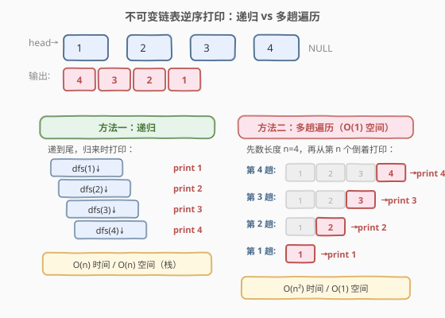
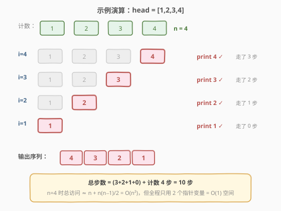

# 逆序打印不可变链表

- **题目名称**：逆序打印不可变链表
- **链接**：[1265. 逆序打印不可变链表](https://leetcode.cn/problems/print-immutable-linked-list-in-reverse/)
- **难度**：中等
- **标签**：链表、递归、双指针

## 1. 题目概述

给定一个**不可变链表**（immutable linked list），要求将其所有节点值**逆序打印**出来。你**不能修改链表**本身，只能通过以下两个接口访问节点：

- `ImmutableListNode.getNext()`：返回下一个节点，若已是尾节点则返回 `null`。
- `ImmutableListNode.getValue()`：返回当前节点的值。

**示例 1**：

```text
输入：head = [1,2,3,4]
输出：[4,3,2,1]
解释：从尾到头依次打印 4, 3, 2, 1。
```

**示例 2**：

```text
输入：head = []
输出：[]
解释：空链表，不打印任何值。
```

**示例 3**：

```text
输入：head = [1]
输出：[1]
```

**约束条件**：

- 链表长度在 `[1, 1000]` 范围内。

> 💡 **不可变的含义**：节点结构是只读的，没有 `prev` 指针，也不能翻转链表指针方向。这意味着所有「就地翻转后正序遍历」的经典套路（如 [206. 反转链表](../0201-0300/206_反转链表.md)）都**不可用**，必须另寻他法。

---

## 2. 解题思路

### 2.1 暴力思路：先存再倒序

最直白的想法是：遍历一遍链表，把所有值存入数组/栈，再倒序输出。时间 `O(n)`，空间 `O(n)`——但题目只给了 `getValue()` 和 `getNext()` 两个接口，虽然这个方法能过，却没有利用题目的结构特点，且空间为 `O(n)`，无法满足 follow-up 的 `O(1)` 空间要求。

### 2.2 核心观察：递归天然逆序 vs 多趟遍历换空间



本题的关键在于：**链表不可变且无 `prev` 指针**，要逆序输出只有两条路。

**方法一：递归**——利用调用栈天然后进先出（LIFO）的特性。先递归到链表末尾，在**归来**时打印，自然就是逆序。

**方法二（follow-up）：多趟遍历**——递归的 `O(n)` 栈空间不满足 `O(1)` 空间要求。换一种思路：**先数出链表长度 `n`，然后从第 `n` 个节点开始，逐趟从头走 `i−1` 步定位到第 `i` 个节点并打印**。每趟只用一个游标指针，全程不需要额外存储——这是经典的「时间换空间」。

> ⚠️ **为什么无法做到 `O(n)` 时间 + `O(1)` 空间？** 单向链表没有 `prev` 指针又不能改指针，要从尾向前走就必须借助栈（递归/显式栈）或重复遍历。前者费空间、后者费时间，不存在两全方案。这是本题的核心 trade-off。

### 2.3 算法流程图


**方法二（多趟遍历）流程**：

1. **计数**：遍历链表，统计节点总数 `n`。
2. **外层循环** `i` 从 `n` 递减到 `1`：
   - 从 `head` 出发，走 `i − 1` 步，定位到第 `i` 个节点。
   - 调用 `getValue()` 打印其值。
3. 循环结束即完成逆序输出。

> 💡 **第 `i` 个节点走 `i−1` 步**：`head` 是第 1 个节点，走 0 步即到它自身；第 2 个走 1 步；…；第 `n` 个走 `n−1` 步。`i` 从大到小，打印顺序自然从尾到头。

### 2.4 示例演算

以 `head = [1,2,3,4]` 为例，展示多趟遍历的完整过程：



| 趟次 `i` | 定位节点 | 走的步数 | 打印值 |
|-----------|----------|----------|--------|
| 4 | 第 4 个 | 3 步 | 4 |
| 3 | 第 3 个 | 2 步 | 3 |
| 2 | 第 2 个 | 1 步 | 2 |
| 1 | 第 1 个 | 0 步 | 1 |

> 💡 **总访问量**：计数 `n` 步 + 定位 $\sum_{i=1}^{n}(i-1) = \frac{n(n-1)}{2}$ 步，合计 $n + \frac{n(n-1)}{2} = O(n^2)$。但全程只用 `n`、`i`、`cur` 三个变量，空间 `O(1)`。

---

## 3. 参考代码

### 方法一：递归

#### C++

```cpp
class Solution {
  public:
    void printLinkedListInReverse(ImmutableListNode* head) {
        if (head == nullptr) return;
        printLinkedListInReverse(head->getNext());
        cout << head->getValue() << endl;
    }
};
```

#### Python

```python
class Solution:
    def printLinkedListInReverse(self, head: 'ImmutableListNode') -> None:
        if head is None:
            return
        self.printLinkedListInReverse(head.getNext())
        print(head.getValue())
```

### 方法二：多趟遍历（O(1) 空间，follow-up）

#### C++

```cpp
class Solution {
  public:
    void printLinkedListInReverse(ImmutableListNode* head) {
        int n = 0;
        for (ImmutableListNode* cur = head; cur != nullptr; cur = cur->getNext())
            n++;
        for (int i = n; i >= 1; i--) {
            ImmutableListNode* cur = head;
            for (int step = 0; step < i - 1; step++)
                cur = cur->getNext();
            cout << cur->getValue() << endl;
        }
    }
};
```

#### Python

```python
class Solution:
    def printLinkedListInReverse(self, head: 'ImmutableListNode') -> None:
        n = 0
        cur = head
        while cur is not None:
            n += 1
            cur = cur.getNext()
        for i in range(n, 0, -1):
            cur = head
            for _ in range(i - 1):
                cur = cur.getNext()
            print(cur.getValue())
```

---

## 4. 复杂度分析

| 方法 | 时间复杂度 | 空间复杂度 | 说明 |
|------|-----------|-----------|------|
| 递归 | `O(n)` | `O(n)` | 每个节点访问一次；递归深度为链表长度 `n` |
| 多趟遍历 | `O(n²)` | `O(1)` | 第 `i` 趟走 `i−1` 步，总计 $\frac{n(n-1)}{2}$ 步；仅用常数个指针变量 |

> 💡 **如何选择**：`n ≤ 1000` 时 `O(n²)` 仅约 $10^6$ 次操作，完全可以接受。若题目对空间有严格要求（如嵌入式环境栈空间受限），选多趟遍历；否则递归代码最简洁、时间最优。

---

## 5. 扩展：折中方案——分块递归

若 `n` 很大（递归栈溢出）又想比 `O(n²)` 更快，可采用**分块**策略：

1. 设块大小 `B`（如 $\sqrt{n}$），将链表分成 $\lceil n/B \rceil$ 块。
2. 先递归打印「块级别」的逆序（确定块的先后），块内再递归逆序打印。
3. 递归深度降为 $O(n/B + B)$，取 $B = \sqrt{n}$ 时深度为 $O(\sqrt{n})$，时间仍为 `O(n)`。

这是递归与多趟遍历之间的折中：牺牲少量栈空间换取时间从 `O(n²)` 回到 `O(n)`。

---

## 6. 面试要点

1. **为什么不能直接翻转链表再正序打印？**

   - 题目明确链表是**不可变**的，不能修改 `next` 指针。翻转链表（如 [206](../0201-0300/206_反转链表.md) 的做法）会破坏链表结构，违反约束。

2. **递归为什么能实现逆序打印？**

   - 递归的调用栈是后进先出（LIFO）结构：先递归处理 `next`（压栈），等后续全部处理完归来时再打印当前节点，自然实现了「先入后出」的逆序输出。

3. **follow-up 的 `O(1)` 空间为什么是 `O(n²)` 时间？**

   - 没有 `prev` 指针又不能用栈，要访问第 `i` 个节点只能从头走 `i−1` 步。`i` 从 `n` 到 `1`，总步数为 $\sum_{i=1}^{n}(i-1) = \frac{n(n-1)}{2}$，即 `O(n²)`。这是「时间换空间」的典型体现。

4. **多趟遍历中外层为什么要先计数？**

   - 必须知道链表长度 `n`，才能从最后一个节点（第 `n` 个）开始倒着定位。计数本身只需一次遍历 `O(n)`，不影响整体 `O(n²)` 的量级。

5. **是否存在 `O(n)` 时间 + `O(1)` 空间的解法？**

   - 在「不可变 + 无 `prev` 指针」的约束下**不存在**。单向链表逆序访问本质上需要栈或重复遍历，二者必居其一。这是本题考察的核心 trade-off 认知。

---

## 7. 同类练习题

- [206. 反转链表](https://leetcode.cn/problems/reverse-linked-list/)（[题解](../0201-0300/206_反转链表.md)）：可变链表的经典翻转，对比本题不可变约束下为何不能照搬
- [92. 反转链表 II](https://leetcode.cn/problems/reverse-linked-list-ii/)（[题解](../0001-0100/92_反转链表II.md)）：区间翻转，指针操作进阶，同为链表逆序主题
- [21. 合并两个有序链表](https://leetcode.cn/problems/merge-two-sorted-lists/)（[题解](../0001-0100/21_合并两个有序链表.md)）：链表遍历基本功，哑节点 + 双指针模板
- [19. 删除链表的倒数第 N 个节点](https://leetcode.cn/problems/remove-nth-node-from-end-of-list/)（[题解](../0001-0100/19_删除链表的倒数第N个节点.md)）：快慢双指针一次遍历定位倒数第 N 个，对比本题多趟遍历的「从头走 i 步」定位思路
