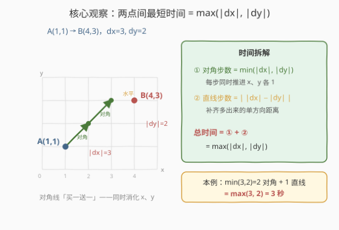
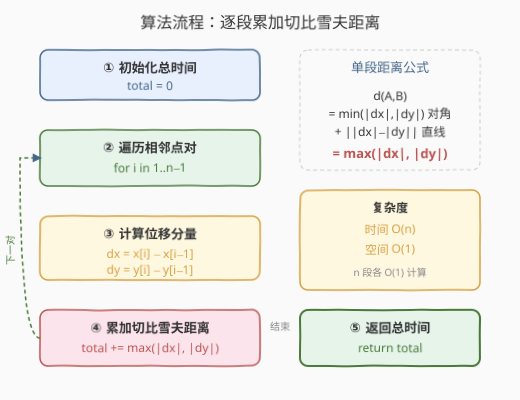
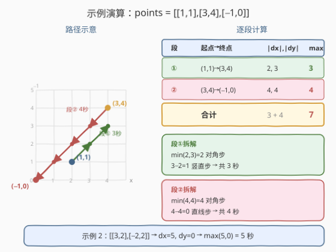

# 访问所有点的最小时间

- **题目名称**：访问所有点的最小时间
- **链接**：[1266. 访问所有点的最小时间](https://leetcode.cn/problems/minimum-time-visiting-all-points/)
- **难度**：简单
- **标签**：几何、数组、数学

## 1. 题目概述

平面上有 $n$ 个点，点的位置用整数坐标表示 `points[i] = [xi, yi]`。计算按数组顺序访问所有点所需的**最小时间**（秒）。

移动规则：每一秒可以沿**水平**方向移动一个单位、沿**竖直**方向移动一个单位，或沿**对角线**移动（即一秒内水平与竖直方向**各**移动一个单位）。必须按数组顺序访问，但路途中经过后续点不算有效访问。

**示例 1**：

```text
输入：points = [[1,1],[3,4],[-1,0]]
输出：7
解释：[1,1] → [2,2] → [3,3] → [3,4] → [2,3] → [1,2] → [0,1] → [-1,0]
       [1,1] 到 [3,4] 需 3 秒
       [3,4] 到 [-1,0] 需 4 秒
       共 7 秒
```

**示例 2**：

```text
输入：points = [[3,2],[-2,2]]
输出：5
解释：[3,2] 到 [-2,2] 水平距离 5，竖直距离 0，需 5 秒
```

**约束条件**：

- `points.length == n`
- $1 \le n \le 100$
- `points[i].length == 2`
- $-1000 \le \text{points[i][0]}, \text{points[i][1]} \le 1000$

> 💡 **关键信号**：每秒可走对角线「买一送一」——同时推进 $x$、$y$ 各一格。因此两点间最短时间不是曼哈顿距离 $|dx|+|dy|$，而是**切比雪夫距离** $\max(|dx|, |dy|)$。

---

## 2. 解题思路

### 2.1 暴力思路：逐秒 BFS 模拟

最直观的做法：对每对相邻点，用 BFS 逐秒搜索从 $A$ 到 $B$ 的最短步数。每秒扩展 8 个方向（水平/竖直/对角），首次到达 $B$ 即返回步数。逐段累加即为答案。

单段 BFS 在坐标范围 $[-1000, 1000]$ 内最坏需搜索 $O(\text{区域面积})$ 个状态，$n$ 段叠加后常数虽不大，但**完全没必要**——本题有 $O(1)$ 的闭式解。

### 2.2 核心观察：切比雪夫距离



关键洞察：从 $A=(x_1, y_1)$ 到 $B=(x_2, y_2)$，记 $|dx| = |x_2 - x_1|$，$|dy| = |y_2 - y_1|$。

**对角线「买一送一」**：每走一步对角线，$x$ 和 $y$ 方向**同时**各推进 1 个单位。因此：

1. **先走对角线**消化两个方向的重叠部分：走 $\min(|dx|, |dy|)$ 步，每步同时减少 $|dx|$ 和 $|dy|$ 各 1
2. **再走直线**补齐剩余：此时某一方向已归零，只剩 $|dx| - |dy|$（或 $|dy| - |dx|$）方向的单向距离，走 $\big||dx| - |dy|\big|$ 步

总时间：

$$\min(|dx|, |dy|) + \big||dx| - |dy|\big| = \max(|dx|, |dy|)$$

这就是**切比雪夫距离**（Chebyshev distance，$L_\infty$ 范数）。

> 💡 **为何对角线优先？** 对角线一步覆盖两个方向的距离，效率最高。若不走对角线（纯水平 + 纯竖直），总时间为 $|dx| + |dy|$，仅当 $|dx|$ 或 $|dy|$ 为 0 时才与切比雪夫距离相等。对角线把「重叠距离」从两步压缩为一步，节省了 $\min(|dx|, |dy|)$ 秒。

### 2.3 算法流程图



流程说明：

1. **初始化**：`total = 0`
2. **遍历相邻点对**：`for i in 1..n-1`
3. **计算位移分量**：`dx = x[i] - x[i-1]`，`dy = y[i] - y[i-1]`
4. **累加切比雪夫距离**：`total += max(|dx|, |dy|)`
5. **返回** `total`

> ⚠️ **为何无需考虑路径绕行？** 题目只要求「按序访问」，不限制路径。相邻两点间的最短时间由切比雪夫距离唯一确定，段与段之间互不影响——前一段的终点就是下一段的起点，直接逐段累加即可。

### 2.4 示例演算



以 `points = [[1,1],[3,4],[-1,0]]` 为例：

**段 ①**：$(1,1) \to (3,4)$

- $dx = 3 - 1 = 2$，$dy = 4 - 1 = 3$
- $\min(2, 3) = 2$ 步对角线，剩余 $3 - 2 = 1$ 步竖直
- 时间 $= \max(2, 3) = 3$ 秒

**段 ②**：$(3,4) \to (-1,0)$

- $dx = -1 - 3 = -4$，$dy = 0 - 4 = -4$
- $\min(4, 4) = 4$ 步对角线，剩余 $4 - 4 = 0$ 步直线
- 时间 $= \max(4, 4) = 4$ 秒

**合计**：$3 + 4 = 7$ 秒 ✓

> 验证示例 2：$(3,2) \to (-2,2)$，$dx = -5$，$dy = 0$，$\max(5, 0) = 5$ 秒 ✓。当某一方向距离为 0 时，切比雪夫距离退化为另一方向的绝对距离——此时对角线无用武之地，只能直线行进。

---

## 3. 参考代码

### 方法一：逐段累加切比雪夫距离（推荐，$O(n)$）

### C++

```cpp
class Solution {
  public:
    int minTimeToVisitAllPoints(vector<vector<int>>& points) {
        int total = 0;
        for (int i = 1; i < points.size(); ++i) {
            int dx = abs(points[i][0] - points[i - 1][0]);
            int dy = abs(points[i][1] - points[i - 1][1]);
            total += max(dx, dy);
        }
        return total;
    }
};
```

### Python

```python
class Solution:
    def minTimeToVisitAllPoints(self, points: List[List[int]]) -> int:
        total = 0
        for i in range(1, len(points)):
            dx = abs(points[i][0] - points[i - 1][0])
            dy = abs(points[i][1] - points[i - 1][1])
            total += max(dx, dy)
        return total
```

> 💡 **核心要点**：每段 $O(1)$ 计算 `max(|dx|, |dy|)`，$n-1$ 段遍历一次，无需 BFS、无需预处理。

### 方法二：Python 一行式（zip 滑窗）

### Python

```python
class Solution:
    def minTimeToVisitAllPoints(self, points: List[List[int]]) -> int:
        return sum(
            max(abs(x2 - x1), abs(y2 - y1))
            for (x1, y1), (x2, y2) in zip(points, points[1:])
        )
```

> 利用 `zip(points, points[1:])` 将相邻点对打包，逐对计算切比雪夫距离求和。逻辑与方法一等价，仅写法更紧凑。

### 方法三：逐秒 BFS 模拟（仅作对照）

### C++

```cpp
class Solution {
  public:
    int minTimeToVisitAllPoints(vector<vector<int>>& points) {
        int dx[] = {-1, -1, -1, 0, 0, 1, 1, 1};
        int dy[] = {-1, 0, 1, -1, 1, -1, 0, 1};
        int total = 0;
        for (size_t i = 1; i < points.size(); ++i) {
            int sx = points[i - 1][0], sy = points[i - 1][1];
            int tx = points[i][0], ty = points[i][1];
            queue<pair<int, int>> q;
            q.push({sx, sy});
            int steps = 0;
            while (q.front().first != tx || q.front().second != ty) {
                int sz = q.size();
                while (sz--) {
                    auto [x, y] = q.front();
                    q.pop();
                    for (int d = 0; d < 8; ++d) {
                        q.push({x + dx[d], y + dy[d]});
                    }
                }
                ++steps;
            }
            total += steps;
        }
        return total;
    }
};
```

> ⚠️ 此法每段 BFS 最坏搜索整个坐标平面，且队列可能含大量重复状态（未去重），仅用于理解「逐秒扩展」的含义，**不推荐实际使用**。正确做法应如方法一直接用闭式公式。

---

## 4. 复杂度分析

| 维度 | 方法一（切比雪夫公式） | 方法二（zip 一行式） | 方法三（BFS 模拟） |
|------|------------------------|----------------------|---------------------|
| 时间复杂度 | $O(n)$ | $O(n)$ | $O(n \cdot D^2)$ |
| 空间复杂度 | $O(1)$ | $O(n)$（切片） | $O(D^2)$ |

- **方法一**：遍历 $n-1$ 段，每段 $O(1)$ 计算绝对值与 max，总时间 $O(n)$，额外空间 $O(1)$。
- **方法二**：`points[1:]` 创建长度 $n-1$ 的切片 $O(n)$ 空间，逻辑同方法一，总时间 $O(n)$。
- **方法三**：每段 BFS，搜索区域边长 $D = \max(|dx|, |dy|) \le 2000$，状态数 $O(D^2)$，$n$ 段叠加。远劣于公式法。

> 💡 本题 $n \le 100$，坐标范围 $[-1000, 1000]$，方法一与方法二均瞬间通过。面试中**先讲切比雪夫距离的推导**，再给出方法一的简洁实现即可。

---

## 5. 扩展：切比雪夫距离与曼哈顿距离的互转

切比雪夫距离 $d_\infty$ 与曼哈顿距离 $d_1$ 之间存在经典的坐标变换关系：

$$d_\infty(A, B) = \max(|dx|, |dy|), \quad d_1(A, B) = |dx| + |dy|$$

通过 $45°$ 旋转坐标系（令 $u = x + y$，$v = x - y$），可将**切比雪夫距离转化为新坐标系下的曼哈顿距离**：

$$d_\infty\big((x_1, y_1), (x_2, y_2)\big) = \frac{1}{2} \Big( |(u_1 - u_2)| + |(v_1 - v_2)| \Big)$$

这一变换在解决「棋盘上国王的最少步数」「$k$ 步内可达格点计数」等问题时非常实用：将切比雪夫度量下的邻域（正方形）旋转为曼哈顿度量下的邻域（菱形），便于用前缀和等手段做区域统计。

> ⚠️ 本题无需此变换——直接用 $\max(|dx|, |dy|)$ 即可。此扩展仅供理解两种度量的内在联系。

---

## 6. 面试要点

1. **为什么最短时间是 $\max(|dx|, |dy|)$ 而不是 $|dx| + |dy|$？**

   因为对角线移动一步可**同时**推进 $x$ 和 $y$ 各一个单位，相当于「买一送一」。先走 $\min(|dx|, |dy|)$ 步对角线消化重叠距离，再走 $\big||dx| - |dy|\big|$ 步直线补齐剩余，总步数 $= \min(|dx|, |dy|) + \big||dx| - |dy|\big| = \max(|dx|, |dy|)$。而曼哈顿距离 $|dx| + |dy|$ 是不走对角线时的代价。

2. **如何想到用切比雪夫距离？**

   三个线索：（1）移动方式含 8 个方向（水平/竖直/对角），这是国际象棋「国王」的走法；（2）对角线与直线耗时相同（都是 1 秒）；（3）坐标为整数。国王走法 + 等时移动 + 整数坐标 = 切比雪夫距离，这是组合几何中的经典结论。

3. **为什么段与段之间可以独立累加？**

   题目要求按序访问，前一段的终点恰好是下一段的起点。每段的最短时间由两端点唯一确定，且到达终点后的位置固定，不影响后续段的选择。因此全局最优 = 各段最优之和，满足**最优子结构**，无需全局规划。

4. **如果允许任意顺序访问所有点呢？**

   这将变为**旅行商问题（TSP）**，距离度量为切比雪夫距离。$n$ 个点的 TSP 是 NP-hard，但 $n \le 100$ 时仍可用状态压缩 DP（$n$ 更小时）或启发式近似。本题限制了访问顺序，从而把 TSP 退化为简单的逐段累加。

5. **方法三（BFS）有什么问题？**

   BFS 未做状态去重，队列会指数膨胀；即便去重，单段搜索 $O(D^2)$ 也远劣于 $O(1)$ 公式。BFS 适用于「移动规则复杂、无闭式解」的场景，本题有简洁公式，BFS 是杀鸡用牛刀。

---

## 7. 同类练习题

- [1252. 奇数值单元格的数目](https://leetcode.cn/problems/cells-with-odd-values-in-a-matrix/)（[站内题解](../1201-1300/1252_奇数值单元格的数目.md)）：同区间的矩阵坐标操作题，差分思想标记行列
- [1232. 缀点成线](https://leetcode.cn/problems/check-if-it-is-a-straight-line/)（[站内题解](../1201-1300/1232_缀点成线.md)）：同区间的几何题，用斜率（叉积）判定共线，与本题同为坐标几何基础
- [149. 直线上最多的点数](https://leetcode.cn/problems/max-points-on-a-line/)（[站内题解](../0001-0100/149_直线上最多的点数.md)）：几何 + 哈希，GCD 化简斜率分组，进阶版共线判定
- [1131. 绝对值表达式](https://leetcode.cn/problems/maximum-of-absolute-value-expression/)：曼哈顿距离转切比雪夫距离的变形，$|x1-x2| + |y1-y2|$ 的最大值可通过拆分符号转化为切比雪夫形式
