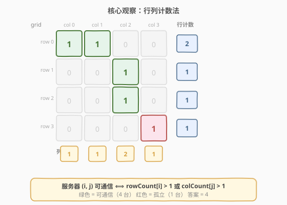
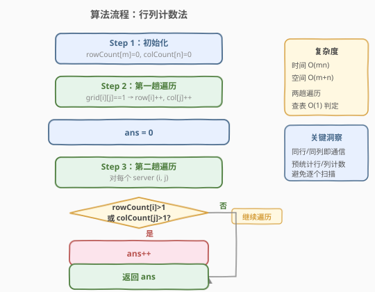
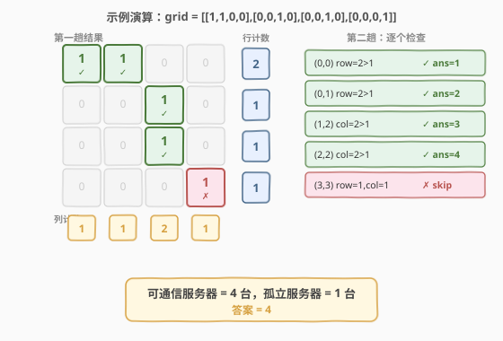

# 统计参与通信的服务器

- **题目名称**：统计参与通信的服务器
- **链接**：[1267. 统计参与通信的服务器](https://leetcode.cn/problems/count-servers-that-communicate/)
- **难度**：中等
- **标签**：数组、矩阵、计数

## 1. 题目概述

给定一个 $m \times n$ 的整数矩阵网格 `grid`，其中 `1` 表示该位置有服务器，`0` 表示没有。如果两台服务器位于**同一行**或**同一列**，则它们之间可以进行通信。请统计并返回能够与**至少一台**其他服务器进行通信的服务器数量。

**示例 1**：

```text
输入：grid = [[1,0],[0,1]]
输出：0
解释：两台服务器分别在不同行不同列，无法通信。
```

**示例 2**：

```text
输入：grid = [[1,0],[1,1]]
输出：3
解释：所有三台服务器都至少能与一台其他服务器通信。
```

**示例 3**：

```text
输入：grid = [[1,1,0,0],[0,0,1,0],[0,0,1,0],[0,0,0,1]]
输出：4
解释：第一行的两台服务器互相通信，第三列的两台服务器互相通信，右下角的服务器无法与其他服务器通信。
```

**约束条件**：

- `m == grid.length`
- `n == grid[i].length`
- `1 <= m <= 250`
- `1 <= n <= 250`
- `grid[i][j]` 为 `0` 或 `1`

> 💡 **关键理解**：「通信」不需要相邻，只要同一行或同一列有另一台服务器即可。这意味着一台服务器可能与距离很远的服务器通信，只要它们共享行或列坐标。

---

## 2. 解题思路

### 2.1 暴力思路：逐个扫描行列

最直观的想法：对每台服务器，扫描它所在的整行和整列，检查是否存在另一台服务器。若找到则该服务器可通信。

- 时间复杂度：$O(m \times n \times (m + n))$——每台服务器扫描一行一列
- 空间复杂度：$O(1)$

当 `m, n ≤ 250` 时，最坏情况约 $250 \times 250 \times 500 = 3.1 \times 10^7$，虽能通过但效率不高。问题在于**大量重复扫描**——同一行的服务器各自独立扫描该行，做了重复工作。

### 2.2 核心观察：行列计数法



**关键洞察**：一台服务器 $(i, j)$ 能否通信，**仅取决于它所在行有多少台服务器、所在列有多少台服务器**。具体而言：

$$\text{server}(i, j) \text{ 可通信} \iff \text{rowCount}[i] > 1 \;\text{或}\; \text{colCount}[j] > 1$$

因此，只需**两趟遍历**：

1. **第一趟**：遍历整个网格，统计每行的服务器数 `rowCount[i]` 和每列的服务器数 `colCount[j]`。
2. **第二趟**：再次遍历，对每台服务器查表判定——若 `rowCount[i] > 1` 或 `colCount[j] > 1`，则计入答案。

> ⚠️ **为什么必须两趟？** 第一趟尚未结束时，`rowCount` 和 `colCount` 还不完整，无法做出正确判定。例如示例 3 中 $(0,0)$ 在第一趟遍历到它时 `rowCount[0]=1`，看似孤立，但后续 $(0,1)$ 会让 `rowCount[0]` 变为 2。必须等第一趟完成后才能查表。

### 2.3 算法流程图



### 2.4 示例演算

以示例 3 `grid = [[1,1,0,0],[0,0,1,0],[0,0,1,0],[0,0,0,1]]` 为例：



**第一趟结果**：

| 行 | 服务器数 | | 列 | 服务器数 |
|----|---------|---|----|---------|
| 0  | 2       | | 0  | 1       |
| 1  | 1       | | 1  | 1       |
| 2  | 1       | | 2  | 2       |
| 3  | 1       | | 3  | 1       |

**第二趟判定**：

| 服务器 | rowCount[i] | colCount[j] | 判定 | ans |
|--------|-------------|-------------|------|-----|
| (0,0)  | 2 > 1       | 1           | ✓    | 1   |
| (0,1)  | 2 > 1       | 1           | ✓    | 2   |
| (1,2)  | 1           | 2 > 1       | ✓    | 3   |
| (2,2)  | 1           | 2 > 1       | ✓    | 4   |
| (3,3)  | 1           | 1           | ✗    | 4   |

> 💡 **$(3,3)$ 为何孤立？** 它所在行只有它自己（`rowCount[3]=1`），所在列也只有它自己（`colCount[3]=1`），没有任何其他服务器与它共享行或列。

---

## 3. 参考代码

### C++

```cpp
class Solution {
public:
    int countServers(vector<vector<int>>& grid) {
        int m = grid.size(), n = grid[0].size();
        vector<int> rowCount(m, 0), colCount(n, 0);

        for (int i = 0; i < m; i++) {
            for (int j = 0; j < n; j++) {
                if (grid[i][j] == 1) {
                    rowCount[i]++;
                    colCount[j]++;
                }
            }
        }

        int ans = 0;
        for (int i = 0; i < m; i++) {
            for (int j = 0; j < n; j++) {
                if (grid[i][j] == 1 && (rowCount[i] > 1 || colCount[j] > 1)) {
                    ans++;
                }
            }
        }
        return ans;
    }
};
```

### Python

```python
class Solution:
    def countServers(self, grid: List[List[int]]) -> int:
        m, n = len(grid), len(grid[0])
        rowCount = [0] * m
        colCount = [0] * n

        for i in range(m):
            for j in range(n):
                if grid[i][j] == 1:
                    rowCount[i] += 1
                    colCount[j] += 1

        ans = 0
        for i in range(m):
            for j in range(n):
                if grid[i][j] == 1 and (rowCount[i] > 1 or colCount[j] > 1):
                    ans += 1
        return ans
```

---

## 4. 复杂度分析

| 维度 | 复杂度 | 说明 |
|------|--------|------|
| 时间 | $O(m \times n)$ | 两趟遍历，每趟访问所有 $m \times n$ 个格子 |
| 空间 | $O(m + n)$ | `rowCount` 数组 $O(m)$ + `colCount` 数组 $O(n)$ |

> 💡 **与暴力法对比**：暴力法 $O(m \times n \times (m+n))$ 中，每台服务器重复扫描整行整列；计数法将「扫描行列」前置为一次性预处理，后续查询降为 $O(1)$。这是「**预处理聚合信息 → 查表**」的经典范式。

---

## 5. 扩展：反面计数法

除了正面统计「可通信的服务器」，也可以从反面出发——**总数减去孤立服务器**：

$$\text{ans} = \text{total} - \text{isolated}$$

其中 `total` 为所有服务器总数，`isolated` 为同时满足 `rowCount[i] == 1` 且 `colCount[j] == 1` 的服务器（即所在行列都只有自己）。

```cpp
int countServers(vector<vector<int>>& grid) {
    int m = grid.size(), n = grid[0].size();
    vector<int> rowCount(m, 0), colCount(n, 0);
    int total = 0;
    for (int i = 0; i < m; i++)
        for (int j = 0; j < n; j++)
            if (grid[i][j] == 1) {
                rowCount[i]++;
                colCount[j]++;
                total++;
            }
    int isolated = 0;
    for (int i = 0; i < m; i++)
        for (int j = 0; j < n; j++)
            if (grid[i][j] == 1 && rowCount[i] == 1 && colCount[j] == 1)
                isolated++;
    return total - isolated;
}
```

两种方法复杂度完全相同，仅视角不同。正面计数更直观（「能通信的就数」），反面计数在「孤立者少」时语义更清晰。

---

## 6. 面试要点

1. **为什么不能一趟遍历解决？**

   - 第一趟遍历到某台服务器时，`rowCount` 和 `colCount` 尚未统计完毕，无法判断该行/列是否有其他服务器。必须等整张网格扫描完毕后，计数才完整可靠。

2. **「同行或同列即通信」和「同行且同列」有什么区别？**

   - 「或」意味着只要共享行或列之一即可通信，判定条件是 `rowCount[i] > 1 || colCount[j] > 1`。若改为「且」，则需同行且同列都有其他服务器，条件变为 `rowCount[i] > 1 && colCount[j] > 1`，答案会不同。

3. **空间能否优化到 $O(1)$？**

   - 不能。必须存储 $m$ 个行计数和 $n$ 个列计数才能在第二趟中 $O(1)$ 查表判定。若改为暴力逐个扫描（不预存计数），空间降到 $O(1)$ 但时间升到 $O(m \times n \times (m+n))$，这是时间-空间 trade-off。

4. **如果通信定义为「同行或同列且相邻」怎么改？**

   - 相邻约束将问题转化为四方向连通块计数，需用 DFS/BFS 或并查集（类似 [200. 岛屿数量](../0101-0200/200_岛屿数量.md)），不再是简单的行列计数。

5. **反面计数法（总数减孤立）有什么优势？**

   - 当孤立服务器很少时，反面计数语义更直观：「几乎都能通信，只有几个例外」。两种方法复杂度相同，选择取决于哪种条件更易表达。

---

## 7. 同类练习题

- [1582. 二进制矩阵中的特殊位置](https://leetcode.cn/problems/special-positions-in-a-binary-matrix/)：完全相同的行列计数模式，但判定条件相反——找行列中唯一的 1（「特殊位置」= `rowCount==1 且 colCount==1`，恰好是本题的「孤立服务器」）
- [2352. 相等行列对](https://leetcode.cn/problems/equal-row-and-column-pairs/)：同为矩阵行列预处理，将行和列序列化后比较相等，考验行列关系建模
- [2482. 行和列中一和零的差值](https://leetcode.cn/problems/difference-between-ones-and-zeros-in-row-and-column/)：行列计数变体，统计每行/列的 1 和 0 个数之差，同为「预统计行列信息」范式
- [1254. 统计封闭岛屿的数目](https://leetcode.cn/problems/number-of-closed-islands/)（[题解](../1201-1300/1254_统计封闭岛屿的数目.md)）：同为矩阵计数问题，但用 DFS/BFS 求连通块，对比本题的计数法适用边界
- [200. 岛屿数量](https://leetcode.cn/problems/number-of-islands/)（[题解](../0101-0200/200_岛屿数量.md)）：矩阵连通分量经典题，若通信定义改为「相邻」则退化为此类 DFS/BFS 问题
