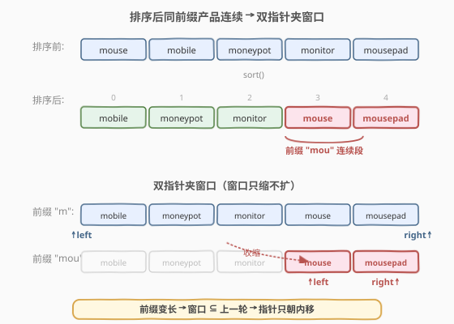
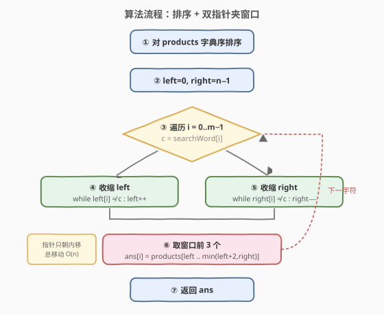
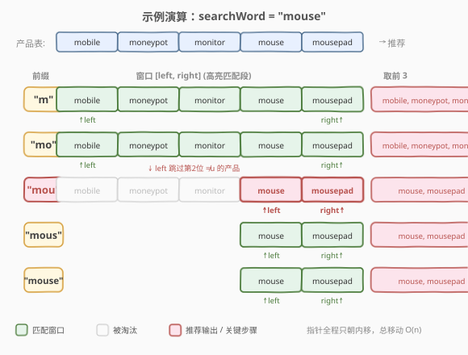

# LeetCode 搜索推荐系统 题解

## 1. 题目概述

- **标题 / 题号**：搜索推荐系统（#1268，medium）
- **链接**：https://leetcode.cn/problems/search-suggestions-system/
- **难度**：中等
- **标签**：字符串、排序、双指针、字典树、二分查找

**题意**：给定产品数组 `products`（每个产品是一个小写英文字符串）和搜索词 `searchWord`。在用户**逐字符**输入 `searchWord` 的过程中（先输入第 1 个字符得到长度 1 的前缀，再输入第 2 个字符得到长度 2 的前缀，……），对每个前缀，返回 `products` 中以该前缀开头的、字典序最小的**最多 3 个**产品。最终返回一个二维列表，第 `i` 个元素对应长度为 `i+1` 的前缀的推荐结果。

**示例 1**：

```text
输入：products = ["mobile","mouse","moneypot","monitor","mousepad"], searchWord = "mouse"
输出：[
  ["mobile","moneypot","monitor"],
  ["mobile","moneypot","monitor"],
  ["mouse","mousepad"],
  ["mouse","mousepad"],
  ["mouse","mousepad"]
]
解释：排序后产品为 ["mobile","moneypot","monitor","mouse","mousepad"]。
前缀 "m" / "mo" 匹配全部 5 个，取字典序最小 3 个 → ["mobile","moneypot","monitor"]。
前缀 "mou" / "mous" / "mouse" 只匹配 ["mouse","mousepad"]。
```

**示例 2**：

```text
输入：products = ["havana"], searchWord = "havana"
输出：[["havana"],["havana"],["havana"],["havana"],["havana"],["havana"]]
```

**示例 3**：

```text
输入：products = ["bags","baggage","banner","box","cloths"], searchWord = "bags"
输出：[["baggage","bags","banner"],["baggage","bags","banner"],["baggage","bags"],["bags"]]
```

**约束**：

- `1 <= products.length <= 1000`
- `1 <= Σ products[i].length <= 2 * 10^4`
- `products[i]` 仅含小写英文字母
- `1 <= searchWord.length <= 1000`
- `searchWord` 仅含小写英文字母

> 💡 **「最多 3 个 + 字典序最小」**：要求只取字典序最小的至多 3 个，强烈暗示**先排序再扫描**——排序后同一前缀的产品天然连续，且连续段的前 3 个正是答案。这与 [692. 前 K 个高频单词](../0601-0700/692_前K个高频单词.md)、[502. IPO](../0401-0500/502_IPO.md) 同属「排序解锁 + 取前 K」范式。

## 2. 解题思路

### 2.1 暴力思路

对 `searchWord` 的每个前缀 `p`（共 $m$ 个，$m$ 为 `searchWord` 长度），遍历全部 `n` 个产品，逐个判断是否以 `p` 开头，收集所有匹配者再排序取前 3。时间 $O(m \cdot n \cdot L + m \cdot k \log k)$（$L$ 为产品平均长度，$k$ 为匹配数），在 $n=1000, m=1000$ 时可达 $10^6 \cdot L$，偏慢但可过；缺点是重复扫描、重复排序，未利用前缀之间的递进关系。

### 2.2 核心观察：排序后同前缀产品连续 → 双指针夹窗口



两个关键观察让本题从 $O(m \cdot n)$ 降到接近线性：

**观察 1（排序解锁连续性）**：把 `products` 按字典序排序后，**共享同一前缀的产品必然连续排列**。这是因为字典序的比较本质是「逐字符比较，首个不同字符定序」——前缀相同的产品在前 `i` 个字符上无法分出高下，只能靠第 `i+1` 个字符及之后的差异排序，于是它们在有序序列中聚成一段。

**观察 2（前缀递进 → 窗口只缩不扩）**：长度 `i+1` 的前缀是长度 `i` 的前缀**再追加一个字符**。因此匹配 `i+1` 前缀的产品集合 $\subseteq$ 匹配 `i` 前缀的产品集合。反映在有序数组上：随着前缀变长，匹配窗口 `[left, right]` **只会向内收缩，不会扩张**。这天然适合双指针——每个指针在全程中至多移动 $n$ 次。

> 💡 **与 [392. 判断子序列](../0301-0400/392_判断子序列.md) 的同构**：那里用双指针在 `t` 中贪心匹配 `s`，指针只前进不回退；这里用双指针在有序产品表中夹出匹配窗口，指针也只朝内移动不回退。核心都是「单调性保证指针不回退，总移动量 $O(n)$」。

### 2.3 算法流程图



1. **排序**：对 `products` 按字典序升序排序。
2. **初始化**：`left = 0, right = n - 1`（候选窗口覆盖全部产品）。
3. **逐字符扩展前缀**：对 `i` 从 `0` 到 `m-1`（`c = searchWord[i]`）：
   - **收缩左边界**：当 `left <= right` 且 `products[left]` 第 `i` 位不匹配（`products[left]` 长度 $\le i$，或 `products[left][i] != c`）时，`left++`。
   - **收缩右边界**：当 `left <= right` 且 `products[right]` 第 `i` 位不匹配时，`right--`。
   - **取前 3**：从 `left` 开始取至多 3 个产品（下标 `left, left+1, ..., min(left+2, right)`）作为本前缀的推荐结果。
4. 收集所有前缀的结果返回。

> ⚠️ **为什么只检查第 `i` 位就够？** 归纳法：第 `i` 步开始时，窗口 `[left, right]` 内的产品都已匹配前 `i` 个字符（`i=0` 时空前提平凡成立）。要扩展到前 `i+1` 个字符，只需再确认第 `i` 位（0-indexed）等于 `c`。左指针跳过第 `i` 位 $< c$ 的（含长度不够视为「最小」），右指针跳过第 `i` 位 $> c$ 的，剩下的第 `i` 位必然 $= c$。下一轮归纳前提成立。

### 2.4 示例演算

以 `products = ["mobile","mouse","moneypot","monitor","mousepad"], searchWord = "mouse"` 为例：



排序后产品表（下标 0–4）：

| 下标 | 产品 |
|------|------|
| 0 | mobile |
| 1 | moneypot |
| 2 | monitor |
| 3 | mouse |
| 4 | mousepad |

| 步骤 | 前缀 | c | left 调整 | right 调整 | 窗口 | 推荐（取前 3） |
|------|------|---|-----------|------------|------|----------------|
| 0 | "m" | m | 0（全匹配） | 4（全匹配） | [0,4] | mobile, moneypot, monitor |
| 1 | "mo" | o | 0（全匹配） | 4（全匹配） | [0,4] | mobile, moneypot, monitor |
| 2 | "mou" | u | 0→3（mobile/moneypot/monitor 第 2 位 ≠ u） | 4 | [3,4] | mouse, mousepad |
| 3 | "mous" | s | 3（匹配） | 4（匹配） | [3,4] | mouse, mousepad |
| 4 | "mouse" | e | 3（匹配） | 4（匹配） | [3,4] | mouse, mousepad |

> 💡 **第 2 步是关键**：`mobile`/`moneypot`/`monitor` 的第 2 位（0-indexed）分别是 `b`/`n`/`n`，均 $\ne$ `u` 且 $<$ `u`，故左指针连续右移跳过它们；`mousepad` 第 2 位是 `u`，匹配，右指针不动。窗口瞬间从 `[0,4]` 收缩到 `[3,4]`，之后稳定不变。

## 3. 参考代码

### 方法一：排序 + 双指针

#### C++

```cpp
class Solution {
  public:
    vector<vector<string>> suggestedProducts(vector<string>& products,
                                             string searchWord) {
        sort(products.begin(), products.end());
        int n = products.size(), m = searchWord.size();
        vector<vector<string>> ans(m);
        int left = 0, right = n - 1;
        for (int i = 0; i < m; i++) {
            char c = searchWord[i];
            while (left <= right &&
                   (products[left].size() <= i || products[left][i] != c))
                left++;
            while (left <= right &&
                   (products[right].size() <= i || products[right][i] != c))
                right--;
            for (int k = left; k <= right && k < left + 3; k++)
                ans[i].push_back(products[k]);
        }
        return ans;
    }
};
```

#### Python

```python
class Solution:
    def suggestedProducts(self, products: List[str], searchWord: str) -> List[List[str]]:
        products.sort()
        n, m = len(products), len(searchWord)
        ans = []
        left, right = 0, n - 1
        for i, c in enumerate(searchWord):
            while left <= right and (len(products[left]) <= i or products[left][i] != c):
                left += 1
            while left <= right and (len(products[right]) <= i or products[right][i] != c):
                right -= 1
            ans.append([products[k] for k in range(left, min(left + 3, right + 1))])
        return ans
```

> ⚠️ **边界条件**：判断 `products[left].size() <= i` 必须在 `products[left][i]` 之前（短路求值），否则访问越界。产品比当前前缀还短时直接淘汰。

## 4. 复杂度分析

| 方法 | 时间复杂度 | 空间复杂度 | 说明 |
|------|-----------|-----------|------|
| 排序 + 双指针 | $O(L \cdot n \log n + n + m)$ | $O(\log n)$（排序栈） | 排序比较单次 $O(L)$；双指针全程各移动至多 $n$ 次，每次 $O(1)$ 字符比较；输出收集 $O(m)$ |
| 字典树（见扩展） | $O(L \cdot n \log n + \Sigma L_i + m)$ | $O(\Sigma L_i \cdot 26)$ | 排序后建 Trie，每节点存至多 3 个词；查询 $O(m)$ |
| 二分查找（见扩展） | $O(L \cdot n \log n + m \cdot L \log n)$ | $O(\log n)$ | 每个前缀用 `lower_bound` 定位起点，再线性检查至多 3 个 |

> 💡 $L$ 为产品平均长度，$n$ 为产品数，$m$ 为 `searchWord` 长度，$\Sigma L_i$ 为所有产品总长度。本题 $n \le 1000$、$\Sigma L_i \le 2 \times 10^4$、$m \le 1000$，三种方法均可轻松通过。**双指针法**省去了 Trie 的建树开销与二分的 $m \log n$，常数最小，面试首选。

## 5. 扩展：字典树与二分查找两种替代解法

### 5.1 字典树（Trie）

思路：先对 `products` 排序（保证插入顺序即字典序），再插入 Trie，**每个节点沿途保存至多 3 个产品名**（先到先得，由于已排序，先到的字典序更小）。查询时沿 `searchWord` 走，每个节点返回其保存的列表即可。

```cpp
struct Trie {
    Trie* ch[26] = {};
    vector<string> suggest;
    void insert(const string& w) {
        Trie* p = this;
        for (char c : w) {
            int idx = c - 'a';
            if (!p->ch[idx]) p->ch[idx] = new Trie();
            p = p->ch[idx];
            if (p->suggest.size() < 3) p->suggest.push_back(w);
        }
    }
    vector<string> search(const string& prefix) {
        Trie* p = this;
        for (char c : prefix) {
            int idx = c - 'a';
            if (!p->ch[idx]) return {};
            p = p->ch[idx];
        }
        return p->suggest;
    }
};

class Solution {
  public:
    vector<vector<string>> suggestedProducts(vector<string>& products,
                                             string searchWord) {
        sort(products.begin(), products.end());
        Trie* root = new Trie();
        for (const string& p : products) root->insert(p);
        vector<vector<string>> ans;
        string prefix;
        for (char c : searchWord) {
            prefix.push_back(c);
            ans.push_back(root->search(prefix));
        }
        return ans;
    }
};
```

> 与 [208. 实现 Trie](../0201-0300/208_实现Trie.md) 和 [212. 单词搜索 II](../0201-0300/212_单词搜索II.md) 的 Trie 模板一致，区别仅在于「节点携带至多 K 个候选词」这一优化，避免查询后再排序。承接 [692. 前 K 个高频单词](../0601-0700/692_前K个高频单词.md) 的「排序保证 Top-K 顺序」思想。

### 5.2 二分查找

思路：排序后，对每个前缀 `p`，用 `lower_bound` 找到首个 $\ge p$ 的产品，从该位置起线性检查至多 3 个产品是否以 `p` 开头（`product.substr(0, len) == p`）。

```cpp
class Solution {
  public:
    vector<vector<string>> suggestedProducts(vector<string>& products,
                                             string searchWord) {
        sort(products.begin(), products.end());
        vector<vector<string>> ans;
        string prefix;
        for (char c : searchWord) {
            prefix.push_back(c);
            auto it = lower_bound(products.begin(), products.end(), prefix);
            vector<string> cur;
            for (int k = 0; k < 3 && it + k != products.end(); k++) {
                const string& w = *(it + k);
                if (w.compare(0, prefix.size(), prefix) == 0) cur.push_back(w);
            }
            ans.push_back(cur);
        }
        return ans;
    }
};
```

> 三种方法对比：**双指针**利用前缀递进的单调性，指针全程只移 $O(n)$，最贴合本题结构；**二分**写法最短，但每个前缀都重新二分，忽略前缀间递进关系，多一个 $\log n$ 因子；**Trie** 适合需要重复查询多个 `searchWord` 的场景（建树一次，查询多次均摊 $O(m)$），单次查询则建树开销不划算。

## 6. 面试要点

1. **为什么排序后同前缀产品一定连续？**

   - 字典序比较逐字符进行。若两个产品共享前 `i` 个字符，它们在前 `i` 位上无法分出大小，相对顺序完全由第 `i+1` 位及之后决定。因此所有以同一前缀 `p` 开头的产品，在有序序列中必然聚成一段，不会与其他前缀的产品交错。

2. **双指针为什么只需检查第 `i` 位，不用重新核对整个前缀？**

   - 归纳：第 `i` 步开始时窗口内产品都已匹配前 `i` 个字符。扩展到 `i+1` 前缀只需确认第 `i` 位（0-indexed）等于 `c`。左指针跳过第 `i` 位 $< c$ 的，右指针跳过 $> c$ 的，剩余的必然 $= c$。前 `i-1` 位的匹配性由上一轮保证，无需复查。

3. **`left` 和 `right` 的总移动量为什么是 $O(n)$？**

   - `left` 只单调递增（从不回退），`right` 只单调递减，两者全程移动次数各 $\le n$。即便外层循环跑 $m$ 轮，双指针总开销仍 $O(n)$，这是本题优于「每轮重新扫描」的关键。

4. **产品比当前前缀短怎么办？**

   - 判断 `products[left].size() <= i` 时直接淘汰该产品（它没有第 `i` 位，无法匹配长度 `i+1` 的前缀）。注意必须放在 `products[left][i] != c` 之前短路，否则下标越界。短产品字典序较小，会被左指针跳过。

5. **Trie 解法为什么要先排序？**

   - 每个节点保存「先到达的至多 3 个产品」。若不排序，先到达的可能不是字典序最小的。先排序保证插入顺序即字典序升序，先到的就是最小的，节点保存的列表天然有序且为 Top-3。

## 同类练习题

| # | 题目 | 与本题的关联 |
|---|------|-------------|
| 208 | [实现 Trie（前缀树）](https://leetcode.cn/problems/implement-trie-prefix-tree/)（[题解](../0201-0300/208_实现Trie.md)） | Trie 模板母题，本题扩展解法 5.1 的基础 |
| 212 | [单词搜索 II](https://leetcode.cn/problems/word-search-ii/)（[题解](../0201-0300/212_单词搜索II.md)） | Trie + DFS 回溯的进阶应用 |
| 692 | [前 K 个高频单词](https://leetcode.cn/problems/top-k-frequent-words/)（[题解](../0601-0700/692_前K个高频单词.md)） | 同为「排序解锁 + 取前 K」范式，对比堆与排序两种取 Top-K 思路 |
| 392 | [判断子序列](https://leetcode.cn/problems/is-subsequence/)（[题解](../0301-0300/392_判断子序列.md)） | 双指针只前进不回退的经典，与本题双指针夹窗口同构 |
| 642 | [设计搜索自动补全系统](https://leetcode.cn/problems/design-search-autocomplete-system/) | 本题的进阶版——需要支持句子级匹配 + 热度排序 + 动态插入，Trie + 堆/排序的综合应用 |
