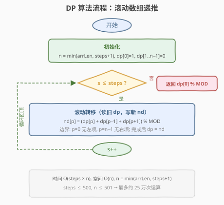
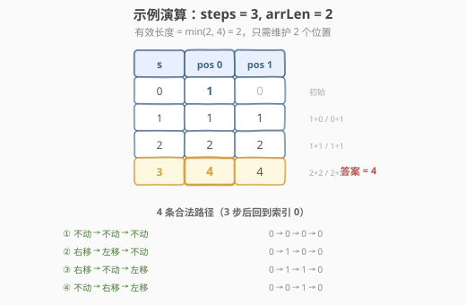

# LeetCode 停在原地的方案数 题解

## 1. 题目概述

- **标题 / 题号**：停在原地的方案数（#1269，hard）
- **链接**：https://leetcode.cn/problems/number-of-ways-to-stay-in-the-same-place-after-some-steps/
- **难度**：困难
- **标签**：动态规划、滚动数组、计数

**题意**：有一个长度为 `arrLen` 的数组，开始时指针在索引 `0` 处。每一步操作中，你可以将指针**向左**或**向右**移动 1 步，或者**停在原地**（指针不能移到数组范围外）。给你两个整数 `steps` 和 `arrLen`，计算并返回：在恰好执行 `steps` 次操作以后，指针仍然指向索引 `0` 处的方案数。由于答案可能很大，返回方案数模 $10^9 + 7$ 后的结果。

**示例 1**：

```text
输入：steps = 3, arrLen = 2
输出：4
解释：3 步后，总共有 4 种不同的方法可以停在索引 0 处。
向右，向左，不动
不动，向右，向左
向右，不动，向左
不动，不动，不动
```

**示例 2**：

```text
输入：steps = 2, arrLen = 4
输出：2
解释：2 步后，总共有 2 种不同的方法可以停在索引 0 处。
向右，向左
不动，不动
```

**示例 3**：

```text
输入：steps = 4, arrLen = 2
输出：8
```

**约束**：

- `1 <= steps <= 500`
- `1 <= arrLen <= 10^6`

> 💡 这道题的核心张力在于：`arrLen` 高达 $10^6$，但 `steps` 只有 500。直接开 `steps × arrLen` 的 DP 表会内存爆炸。突破口是**有界可达性**——每步最多右移 1 格，`steps` 步最远只能到索引 `steps`，因此有效数组长度只需 `min(arrLen, steps + 1)`，把 $10^6$ 直接砍到 501。

## 2. 解题思路

### 2.1 暴力思路：DFS 枚举所有走法

从位置 0 出发，每步三选一（左/右/不动），DFS 枚举所有长度为 `steps` 的操作序列，到达第 `steps` 步时若位置为 0 则计数 +1。

时间复杂度 $O(3^{\text{steps}})$，`steps = 500` 时天文数字，**完全不可行**。

> ⚠️ 暴力法的问题在于**重复子问题**：「走了 `s` 步后位于位置 `p`」的后续合法走法完全相同，与之前的具体路径无关。这正是 DP 的信号——用 `(步数, 位置)` 二元组压缩掉所有历史。

### 2.2 核心观察：状态机 DP + 有界可达

**状态定义**：设 `dp[s][p]` = 走了 `s` 步后位于位置 `p` 的方案数。

**转移方程**——反向视角「谁能到达位置 `p`」：

- 上一 步在 `p`，本步**不动** → `dp[s-1][p]`
- 上一 步在 `p-1`，本步**右移** → `dp[s-1][p-1]`
- 上一 步在 `p+1`，本步**左移** → `dp[s-1][p+1]`

$$
\text{dp}[s][p] = \text{dp}[s{-}1][p] + \text{dp}[s{-}1][p{-}1] + \text{dp}[s{-}1][p{+}1]
$$


**关键优化——有界可达**：从位置 0 出发，每步最多右移 1 格，走 `steps` 步最远只能到达索引 `steps`。因此：

$$
n = \min(\text{arrLen},\ \text{steps} + 1)
$$

超出 `steps` 的位置**永远走不到**，无需为其分配状态。当 `arrLen = 10^6` 而 `steps = 500` 时，`n` 从 $10^6$ 降到 501，DP 表从 $500 \times 10^6$ 缩减为 $500 \times 501 ≈ 2.5 \times 10^5$，完全可行。

> 💡 **无后效性验证**：`dp[s][p]` 只依赖 `dp[s-1][p-1/p/p+1]`，与更早的步数和路径无关。这保证了 DP 的正确性——每一步的方案数可以由上一步唯一确定。

### 2.3 算法流程图



**四步法**：

1. **状态定义**：`dp[p]` = 当前步数下位于位置 `p` 的方案数（一维滚动）
2. **转移方程**：`nd[p] = dp[p] + dp[p-1] + dp[p+1]`（边界：`p=0` 无左项，`p=n-1` 无右项）
3. **初始条件**：`dp[0] = 1`，`dp[1..n-1] = 0`（第 0 步在位置 0）
4. **计算顺序**：`s = 1 → 2 → ... → steps`，自底向上，每步用旧 `dp` 算新 `nd` 后覆盖

> ⚠️ **必须拷贝 `nd = dp` 后再写新值**：同一轮内，`nd[p]` 的计算需要读取旧 `dp` 的三个邻居。若原地更新，先改的 `dp[p]` 会被后续 `dp[p+1]` 的计算误读为旧值，导致同一 步被多次累加。拷贝保证「读旧写新」。

### 2.4 示例演算

以 `steps = 3, arrLen = 2` 为例，有效长度 $n = \min(2, 4) = 2$，只需维护位置 0 和 1：



| 步数 `s` | `dp[0]` | `dp[1]` | pos 0 计算 | pos 1 计算 |
|----------|---------|---------|------------|------------|
| 0        | **1**   | 0       | 初始       | 初始       |
| 1        | **1**   | 1       | $1+0$      | $0+1$      |
| 2        | **2**   | 2       | $1+1$      | $1+1$      |
| 3        | **4**   | 4       | $2+2$      | $2+2$      |

最终答案 `dp[3][0] = 4` ✓

> 💡 注意 `arrLen = 2` 时位置只有 0 和 1，边界情况简化：位置 0 只有「不动 + 左移到达」两项（无 `p-1`），位置 1 只有「不动 + 右移到达」两项（无 `p+1`）。这就是 `dp[0]` 和 `dp[1]` 始终相等的原因——两者互为镜像。

## 3. 参考代码

### C++

```cpp
// 停在原地的方案数.cpp —— 状态机 DP + 滚动数组
// 编译: g++ -O2 -std=c++17 停在原地的方案数.cpp -o swss
class Solution {
  public:
    int numWays(int steps, int arrLen) {
        const int MOD = 1e9 + 7;
        int n = min(arrLen, steps + 1);      // 有界可达：超过 steps 的位置走不到
        vector<int> dp(n, 0);
        dp[0] = 1;                           // 第 0 步在位置 0
        for (int s = 1; s <= steps; ++s) {
            vector<int> nd(n, 0);            // 读旧 dp，写新 nd
            for (int p = 0; p < n; ++p) {
                nd[p] = dp[p];               // 不动
                if (p > 0)
                    nd[p] = (nd[p] + dp[p - 1]) % MOD;  // 右移到达
                if (p < n - 1)
                    nd[p] = (nd[p] + dp[p + 1]) % MOD;  // 左移到达
            }
            dp = nd;
        }
        return dp[0];
    }
};
```

### Python

```python
class Solution:
    def numWays(self, steps: int, arrLen: int) -> int:
        MOD = 10**9 + 7
        n = min(arrLen, steps + 1)  # 有界可达：超过 steps 的位置走不到
        dp = [0] * n
        dp[0] = 1                    # 第 0 步在位置 0
        for s in range(1, steps + 1):
            nd = [0] * n             # 读旧 dp，写新 nd
            for p in range(n):
                nd[p] = dp[p]        # 不动
                if p > 0:
                    nd[p] = (nd[p] + dp[p - 1]) % MOD  # 右移到达
                if p < n - 1:
                    nd[p] = (nd[p] + dp[p + 1]) % MOD  # 左移到达
            dp = nd
        return dp[0]
```

> 💡 **C++ 的 `min(arrLen, steps + 1)`**：`arrLen` 是 `int`，`steps + 1` 也是 `int`，直接比较无溢出风险。注意 `n` 取 `steps + 1` 而非 `steps`，因为位置 0 到位置 `steps` 共 `steps + 1` 个位置。

## 4. 复杂度分析

| 维度 | 复杂度 | 说明 |
|------|--------|------|
| **时间复杂度** | $O(\text{steps} \times n)$ | 双层循环：外层 `steps` 轮，内层 `n` 个位置；$n = \min(\text{arrLen}, \text{steps}+1)$ |
| **空间复杂度（滚动）** | $O(n)$ | 两个长度为 `n` 的一维数组 `dp` 和 `nd` 交替使用 |
| **空间复杂度（二维表）** | $O(\text{steps} \times n)$ | 若保留整个 `dp[steps][n]` 表 |

> 💡 以 `steps = 500` 为例，$n \leq 501$，时间约 $500 \times 501 \approx 2.5 \times 10^5$ 次运算，空间约 $2 \times 501 \times 4\text{B} \approx 4\text{KB}$，远在限制之内。有界可达优化是将 $10^6$ 级空间降至 $500$ 级的关键。

## 5. 扩展：进一步剪枝内层循环

当前解法每轮遍历全部 `n` 个位置，但实际上在第 `s` 步时：

- **最远可达位置**为 $\min(s,\ n{-}1)$——从 0 出发最多右移 `s` 格
- **能回到 0 的最远位置**为 $\min(\text{steps} - s,\ n{-}1)$——剩余 `steps - s` 步需要走回来

因此内层只需遍历 $p \in [0,\ \min(s,\ \text{steps}-s,\ n{-}1)]$：

```cpp
int bound = min({s, steps - s, n - 1});
for (int p = 0; p <= bound; ++p) {
    ...
}
```

这把总运算量从 $O(\text{steps} \times n)$ 降为 $O(\text{steps}^2 / 4)$（三角形区域），对 `steps = 500` 约减少一半。实际提升有限，但展示了「**有效状态剪枝**」的思维方式。

> 💡 这种剪枝在 `steps` 远小于 `arrLen` 时收益最大——此时 `n ≈ steps`，有效状态呈三角形分布，总量约为 $\sum_{s=0}^{\text{steps}} \min(s, \text{steps}-s) \approx \text{steps}^2 / 4$。

## 6. 面试要点

1. **`arrLen` 高达 $10^6$，DP 表不会爆内存吗？**

   - 关键在于**有界可达**：每步最多右移 1 格，`steps` 步最远到索引 `steps`，所以有效长度 $n = \min(\text{arrLen}, \text{steps}+1)$。`steps ≤ 500` 时 `n ≤ 501`，DP 表仅 $500 \times 501$，完全可控。

2. **为什么要拷贝 `nd` 而不能原地更新 `dp`？**

   - `nd[p]` 依赖旧 `dp` 的三个邻居 `dp[p-1]`、`dp[p]`、`dp[p+1]`。若原地更新，先写入的 `dp[p-1]` 新值会被 `dp[p]` 的计算误读为旧值，导致同一步被重复累加。拷贝保证「读旧写新」。

3. **边界位置 0 和 n−1 的转移方程有什么不同？**

   - 位置 0 没有左邻居（不能从 `−1` 右移过来），`nd[0] = dp[0] + dp[1]`；位置 `n−1` 没有右邻居（不能从 `n` 左移过来），`nd[n-1] = dp[n-1] + dp[n-2]`。代码中用 `if (p > 0)` 和 `if (p < n-1)` 守卫。

4. **为什么有效长度是 `steps + 1` 而不是 `steps`？**

   - 位置编号从 0 开始，走 `steps` 步最远到索引 `steps`，从 0 到 `steps` 共 `steps + 1` 个位置。少算一个会漏掉「全部右移」的极端路径。

5. **如果 `steps` 放大到 $10^9$ 怎么办？**

   - 线性 DP 不再可行。转移是线性的（`dp[s] = M · dp[s-1]`，`M` 为三对角矩阵），可用**矩阵快速幂**在 $O(n^3 \log \text{steps})$ 内解决。但本题 `steps ≤ 500`，线性 DP 已是最优选择。

> 💡 **一句话总结**：本题是「状态机计数 DP + 有界可达剪枝」的招牌题——三操作转移方程简单直观，难点在于发现 `arrLen` 的有效截断。掌握「每步移动距离 ≤ 1 ⇒ 可达范围 ≤ steps」这一观察，所有「游走计数」类问题都能快速锁定状态规模。

## 同类练习题

| # | 题目 | 与本题的关联 |
|---|------|-------------|
| 70 | [爬楼梯](https://leetcode.cn/problems/climbing-stairs/)（[题解](../0001-0100/70_爬楼梯.md)） | 一维计数 DP 入门，同样的滚动数组骨架（2 状态 → n 状态的自然推广） |
| 1220 | [统计元音字母序列的数目](https://leetcode.cn/problems/count-vowels-permutation/)（[题解](../1201-1300/1220_统计元音字母序列的数目.md)） | 状态机计数 DP，状态间转移边驱动递推，同为「按规则计数走法」家族 |
| 62 | [不同路径](https://leetcode.cn/problems/unique-paths/)（[题解](../0001-0100/62_不同路径.md)） | 二维网格计数 DP，从左上到右下的方案数，同为「网格游走计数」主题 |
| 576 | [出界的路径数](https://leetcode.cn/problems/out-of-boundary-moves/) | 在网格上走 `k` 步后出界的方案数，同为「步数限制 + 位置状态」计数 DP，区别在于出界即终止而非回到原点 |
| 935 | [骑士拨号器](https://leetcode.cn/problems/knight-dialer/) | 骑士在电话键盘上跳 `n` 步的方案数，状态机计数 DP，转移由马的跳跃规则决定 |
