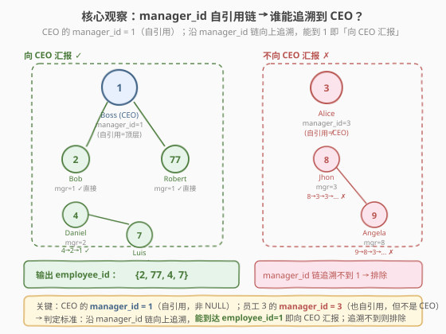
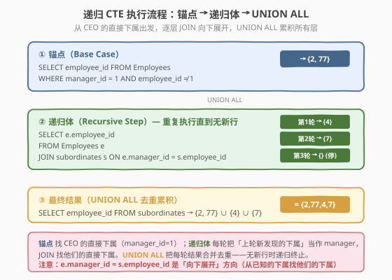
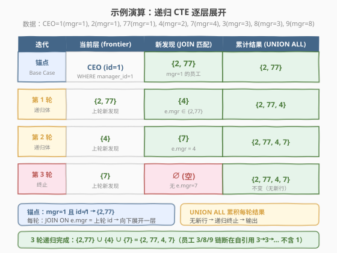

# LeetCode 向公司 CEO 汇报工作的所有人 题解

## 1. 题目概述

- **标题 / 题号**：向公司 CEO 汇报工作的所有人（#1270，medium）
- **链接**：https://leetcode.cn/problems/all-people-report-to-the-given-manager/
- **难度**：中等
- **标签**：SQL、递归 CTE、自连接、树遍历、BFS

**题意**：给定一张 `Employees` 表，每行记录一名员工的 `employee_id`、`employee_name` 及其直属经理的 `manager_id`。公司 CEO 是 `employee_id = 1` 的员工。编写 SQL 查询，找出**所有直接或间接向 CEO 汇报工作**的员工的 `employee_id`，结果不含 CEO 本人。

**表结构**：

```text
Table: Employees
+---------------+---------+
| Column Name   | Type    |
+---------------+---------+
| employee_id   | int     |  ← 主键
| employee_name | varchar |
| manager_id    | int     |  ← 指向 Employees.employee_id（自引用外键）
+---------------+---------+
```

> ⚠️ 本题有三个关键点：① CEO 的 `manager_id = 1`（**自引用**，不是 NULL 也不是 −1），表示「自己是自己的经理」= 顶层；② 其他员工也可能出现 `manager_id = employee_id` 的自引用（如员工 3 的 `manager_id = 3`），说明他也是顶层但**不是 CEO**——他的汇报链追溯到自己就断了，到不了 1；③ 题目保证「间接汇报关系不超过 3 层经理」，即从任意员工到 CEO 的链路最多经过 3 个中间经理（链长 ≤ 4），这使得**多重自连接**方案可行。

**示例 1**：

```text
输入：
Employees 表:
+-------------+---------------+------------+
| employee_id | employee_name | manager_id |
+-------------+---------------+------------+
| 1           | Boss          | 1          |
| 3           | Alice         | 3          |
| 2           | Bob           | 1          |
| 4           | Daniel        | 2          |
| 7           | Luis          | 4          |
| 8           | Jhon          | 3          |
| 9           | Angela        | 8          |
| 77          | Robert        | 1          |
+-------------+---------------+------------+

输出：
+-------------+
| employee_id |
+-------------+
| 2           |
| 77          |
| 4           |
| 7           |
+-------------+
```

**解释**：

| employee_id | manager_id | 汇报链 | 是否向 CEO 汇报 |
|-------------|------------|--------|----------------|
| 2 | 1 | 2 → **1** | ✓ 直接 |
| 77 | 1 | 77 → **1** | ✓ 直接 |
| 4 | 2 | 4 → 2 → **1** | ✓ 间接（1 层经理） |
| 7 | 4 | 7 → 4 → 2 → **1** | ✓ 间接（2 层经理） |
| 3 | 3 | 3 → 3 → 3 → ...（自引用循环） | ✗ 链断在 3，到不了 1 |
| 8 | 3 | 8 → 3 → 3 → ... | ✗ 追溯到 3 后循环，到不了 1 |
| 9 | 8 | 9 → 8 → 3 → 3 → ... | ✗ 追溯到 3 后循环，到不了 1 |

> 💡 注意员工 3 的 `manager_id = 3`——他与 CEO 一样是自引用（`manager_id = employee_id`），但他**不是 CEO**（`employee_id ≠ 1`）。他的汇报链 `3 → 3 → 3 → ...` 永远到不了 1，因此他和他的下属（8、9）都不向 CEO 汇报。这是本题最容易踩的坑：**自引用不等于 CEO**。

**约束**：

- `employee_id` 是 `Employees` 表的主键
- `manager_id` 是指向 `Employees.employee_id` 的自引用外键
- CEO 是 `employee_id = 1` 的员工，其 `manager_id = 1`（自引用）
- 结果不含 CEO（`employee_id = 1`）
- 间接汇报关系不超过 3 层经理（链路深度 ≤ 4）
- 结果可按任意顺序返回，不含重复

## 2. 解题思路

### 2.1 暴力思路：过程式逐行追溯经理链

最直觉的过程式思路：对每个员工，沿 `manager_id` 逐层向上追溯经理链，检查是否到达 `employee_id = 1`。伪代码如下：

```text
for each employee e in Employees:
    if e.employee_id == 1:
        continue                      # 跳过 CEO
    current = e.manager_id
    depth = 0
    while current != 1 and current != e.employee_id and depth < 4:
        manager = lookup(current)     # 查 current 的 manager_id
        if manager is NULL: break
        current = manager.manager_id
        depth += 1
    if current == 1:
        output(e.employee_id)         # 链到达 CEO → 输出
```

但**纯 SQL 没有显式循环**——「逐层追溯」需换成集合式表达。有两种 SQL 范式可实现：① **递归 CTE**（MySQL 8.0+，通用且优雅）；② **多重自连接**（利用深度 ≤ 3 的约束，兼容旧版 MySQL）。

> ⚠️ 核心矛盾：员工与 CEO 之间可能隔着多层经理，而 SQL 的 `JOIN` 一次只展开一层关系。要么用**递归 CTE** 自动迭代展开，要么用**多重自连接**手动展开固定层数（题目保证 ≤ 3 层）。

### 2.2 核心观察：沿 manager_id 链向下展开 vs 向上追溯



本题有两种等价的思考方向：

**方向 A（向下展开，推荐）**：从 CEO 出发，逐层向下找直接下属

- 第 0 层：CEO 的直接下属 = `WHERE manager_id = 1 AND employee_id ≠ 1`
- 第 1 层：第 0 层员工的直接下属 = `JOIN ON e.manager_id = 上一层.employee_id`
- 第 2 层：第 1 层员工的直接下属 = 同上
- ...直到某层无新员工为止

**方向 B（向上追溯）**：从每个员工出发，逐层向上追溯经理链

- 员工 e → e 的经理 e2 → e2 的经理 e3 → ... → 检查是否到达 1
- 利用深度 ≤ 3 的约束，用 3 次 `LEFT JOIN` 把链路拼平

> 💡 **方向 A 更自然**——「向下展开」是 BFS/递归的标准范式，且不受深度限制（递归 CTE 自动处理任意深度）。方向 B（多重自连接）需要预先知道最大深度，且层数越多 SQL 越冗长，但**兼容不支持递归 CTE 的旧版数据库**。

**关键洞察**：CEO 的 `manager_id = 1`（自引用），这意味着 `WHERE manager_id = 1` 能精准匹配到 CEO 的直接下属。而员工 3 的 `manager_id = 3`（也自引用）不会被匹配——他的下属（8、9）的 `manager_id` 是 3 而非 1，所以从 CEO 向下展开的 BFS 永远不会遍历到 3 的子树。

$$\text{向 CEO 汇报} \iff \exists\, \text{链路 } e \to m_1 \to m_2 \to \cdots \to 1,\ \text{其中每步 } m_i.\text{employee\_id} = m_{i-1}.\text{manager\_id}$$

### 2.3 算法流程图



**递归 CTE 的三段式结构**：

| 步骤 | CTE 部分 | SQL 子句 | 作用 |
|------|----------|----------|------|
| ① | 锚点（Base Case） | `SELECT employee_id FROM Employees WHERE manager_id = 1 AND employee_id ≠ 1` | 找 CEO 的直接下属，作为递归起点 |
| ② | 递归体（Recursive Step） | `SELECT e.employee_id FROM Employees e JOIN sub s ON e.manager_id = s.employee_id` | 把「上轮新发现的下属」当作 manager，JOIN 找他们的直接下属 |
| ③ | 终止 + 合并 | `UNION ALL` | 每轮结果合并累积；某轮无新行时递归终止 |

> 💡 **递归 CTE 的执行机制**：数据库先执行锚点查询得到初始集合 $S_0$；然后用 $S_0$ 作为 `sub` 执行递归体得到 $S_1$；再用 $S_1$ 执行得到 $S_2$……直到某轮结果为空集停止。最终 `UNION ALL` 把所有 $S_0 \cup S_1 \cup S_2 \cup \cdots$ 合并为最终结果。这本质上是 SQL 层面的 BFS。

> ⚠️ **方向别搞反**：递归体的 JOIN 条件是 `e.manager_id = s.employee_id`（s 是已知的下属，找 e 使 e 的经理是 s），即**向下展开**。若写成 `s.manager_id = e.employee_id` 则变成向上追溯，语义完全不同。

### 2.4 示例演算

以示例 1 数据为例，逐步跟踪递归 CTE 的每轮展开：



**步骤 ①：锚点 — 找 CEO 的直接下属**

```sql
SELECT employee_id FROM Employees WHERE manager_id = 1 AND employee_id != 1
```

- `manager_id = 1` 匹配 employee_id = 2（Bob）和 77（Robert）
- employee_id = 1（CEO）被 `≠ 1` 排除
- $S_0 = \{2, 77\}$

**步骤 ②：第 1 轮递归 — 找 {2, 77} 的直接下属**

```sql
SELECT e.employee_id FROM Employees e JOIN sub s ON e.manager_id = s.employee_id
```

- s = {2, 77}，找 `manager_id` 等于 2 或 77 的员工
- employee_id = 4（Daniel），`manager_id = 2` ✓
- $S_1 = \{4\}$

**步骤 ③：第 2 轮递归 — 找 {4} 的直接下属**

- s = {4}，找 `manager_id = 4` 的员工
- employee_id = 7（Luis），`manager_id = 4` ✓
- $S_2 = \{7\}$

**步骤 ④：第 3 轮递归 — 找 {7} 的直接下属**

- s = {7}，找 `manager_id = 7` 的员工
- 无匹配 → $S_3 = \emptyset$ → 递归终止

**最终结果**：$S_0 \cup S_1 \cup S_2 = \{2, 77\} \cup \{4\} \cup \{7\} = \{2, 77, 4, 7\}$

> 💡 **为什么 3、8、9 不在结果中**：从 CEO 向下展开的 BFS 只会遍历 CEO 的子树。员工 3 的 `manager_id = 3`（自引用），不是 1，所以 CEO 的直接下属里没有 3；3 的子树（8、9）自然也不会被展开。这正是「向下展开」策略的优势——**不需要显式排除不汇报的员工**，他们天然不在 CEO 的子树中。

## 3. 参考代码

### SQL（解法 A：递归 CTE，MySQL 8.0+ 推荐）

```sql
WITH RECURSIVE subordinates AS (
    SELECT employee_id
    FROM Employees
    WHERE manager_id = 1
      AND employee_id != 1
    UNION ALL
    SELECT e.employee_id
    FROM Employees e
    JOIN subordinates s ON e.manager_id = s.employee_id
)
SELECT employee_id FROM subordinates;
```

> 💡 **写法要点**：
> - **`WITH RECURSIVE`**：声明递归 CTE，MySQL 8.0+、PostgreSQL、SQLite 均支持。`RECURSIVE` 关键字告诉数据库这个 CTE 会自引用迭代。
> - **锚点**：`WHERE manager_id = 1 AND employee_id != 1`——找 CEO 的直接下属，同时排除 CEO 本人（CEO 的 `manager_id` 也是 1，但 `employee_id = 1` 被过滤）。
> - **递归体**：`JOIN subordinates s ON e.manager_id = s.employee_id`——s 是上一轮发现的下属集合，找 `manager_id` 指向 s 中某人的员工，即他们的直接下属。方向是**向下展开**。
> - **`UNION ALL`**：合并每轮结果。用 `UNION ALL` 而非 `UNION` 是因为每轮发现的新员工不可能与前轮重复（一个员工只有一个 `manager_id`，不会在两轮中被同时匹配），`UNION ALL` 省去去重开销。若担心数据异常，可换 `UNION`。
> - **终止条件**：某轮 JOIN 无匹配行时，递归自动终止。

### SQL（解法 B：多重自连接，兼容旧版 MySQL）

```sql
SELECT e1.employee_id
FROM Employees e1
LEFT JOIN Employees e2 ON e1.manager_id = e2.employee_id
LEFT JOIN Employees e3 ON e2.manager_id = e3.employee_id
LEFT JOIN Employees e4 ON e3.manager_id = e4.employee_id
WHERE e1.employee_id != 1
  AND (
      e1.manager_id = 1
   OR e2.manager_id = 1
   OR e3.manager_id = 1
   OR e4.manager_id = 1
  );
```

> 💡 **写法要点**：
> - **思路**：方向 B（向上追溯）。对每个员工 e1，沿 `manager_id` 链向上拼 3 层（e2 = e1 的经理，e3 = e2 的经理，e4 = e3 的经理），检查链上任何一层的 `manager_id` 是否为 1。
> - **`LEFT JOIN`**：用左连接而非内连接——不同员工的链长不同（有的只有 1 层），`LEFT JOIN` 保证短链员工不会被过滤掉，缺失的层为 NULL。
> - **深度 3 的来源**：题目保证「间接汇报不超过 3 层经理」，所以最多 3 次 `LEFT JOIN`（e2、e3、e4 对应 3 层经理）。若题目改为更深的层级，需增加更多 `LEFT JOIN`。
> - **`OR` 条件**：`e1.manager_id = 1`（直接下属）OR `e2.manager_id = 1`（隔一层）OR `e3.manager_id = 1`（隔两层）OR `e4.manager_id = 1`（隔三层）。任一层命中即向 CEO 汇报。
> - **NULL 安全**：`LEFT JOIN` 缺失的层 `manager_id` 为 NULL，`NULL = 1` 为 false，不影响 `OR` 判定。
> - **排除 CEO**：`e1.employee_id != 1` 确保不输出 CEO 本人。

### SQL（解法 C：三重自连接 + IN 简化）

```sql
SELECT employee_id
FROM Employees
WHERE employee_id != 1
  AND manager_id != employee_id
  AND employee_id IN (
      SELECT employee_id FROM Employees WHERE manager_id = 1
      UNION
      SELECT e2.employee_id
      FROM Employees e2
      JOIN Employees e3 ON e2.manager_id = e3.employee_id
      WHERE e3.manager_id = 1
      UNION
      SELECT e2.employee_id
      FROM Employees e2
      JOIN Employees e3 ON e2.manager_id = e3.employee_id
      JOIN Employees e4 ON e3.manager_id = e4.employee_id
      WHERE e4.manager_id = 1
  );
```

> 💡 **写法要点**：用三层 `UNION` 分别找 CEO 的 1 层、2 层、3 层下属，再用 `IN` 判定。`manager_id != employee_id` 排除自引用的非 CEO 顶层员工（如员工 3）。比解法 B 更直观地展示了「向下展开」的分层逻辑，但 SQL 更长。

### Python（pandas）

```python
import pandas as pd

def find_employees(employees: pd.DataFrame) -> pd.DataFrame:
    ceo_id = 1
    result = set()
    frontier = {ceo_id}
    while frontier:
        new = set(
            employees.loc[
                employees['manager_id'].isin(frontier)
                & (employees['employee_id'] != ceo_id)
                & (~employees['employee_id'].isin(result)),
                'employee_id'
            ]
        )
        result |= new
        frontier = new
    return pd.DataFrame({'employee_id': list(result)})
```

> 💡 **pandas 对照**：
> - `frontier` 对应递归 CTE 中每轮的 `subordinates` 集合——初始为 `{CEO}`。
> - `employees['manager_id'].isin(frontier)` 对应递归体的 `JOIN ON e.manager_id = s.employee_id`——找 frontier 中员工的直接下属。
> - `employees['employee_id'] != ceo_id` 排除 CEO，对应锚点的 `employee_id != 1`。
> - `~employees['employee_id'].isin(result)` 避免重复处理已发现的员工，对应 `UNION ALL` 的去重效果。
> - `result |= new` 累积每轮结果，对应 `UNION ALL`。
> - `frontier = new` 推进到下一层；`new` 为空集时 `while` 循环终止，对应递归终止。

## 4. 复杂度分析

| 维度 | 解法 A（递归 CTE） | 解法 B（多重自连接） | pandas |
|------|-------------------|---------------------|--------|
| **时间** | $O(n \cdot d)$ | $O(n \cdot d)$ | $O(n \cdot d)$ |
| **空间** | $O(n)$ | $O(n \cdot d)$ | $O(n)$ |
| **深度限制** | ✓ 任意深度 | ✗ 固定 3 层 | ✓ 任意深度 |
| **兼容性** | MySQL 8.0+ | ✓ 所有版本 | ✓ pandas 环境 |
| **推荐度** | ✓ **首选** | ✓ 旧版兼容 | ✓ pandas 环境 |

> - $n$ = `Employees` 表行数，$d$ = 树的最大深度（本题 $d \leq 4$）
> - **递归 CTE**：每轮扫描全表 $O(n)$，共 $d$ 轮，总计 $O(n \cdot d)$。空间 $O(n)$ 存累积结果。若在 `manager_id` 上建索引，每轮匹配接近 $O(1)$。
> - **多重自连接**：3 次 `LEFT JOIN` 每次 $O(n)$，总计 $O(n \cdot d)$。但 JOIN 产生 $n \times d$ 列的中间表，空间 $O(n \cdot d)$。
> - **pandas**：每轮 `isin` 扫描 $O(n)$，共 $d$ 轮。`set` 查找 $O(1)$，总计 $O(n \cdot d)$。
> - **索引优化**：在 `Employees(manager_id)` 上建索引可显著加速 JOIN 匹配——每轮从全表扫描降为索引查找。

## 5. 扩展：递归 CTE vs 多重自连接

### 5.1 两种范式的本质对比

| 维度 | 递归 CTE | 多重自连接 |
|------|----------|-----------|
| **方向** | 向下展开（BFS） | 向上追溯（链式拼平） |
| **深度** | 任意（自动终止） | 固定（需预知最大深度） |
| **SQL 长度** | 固定（与深度无关） | 随深度线性增长 |
| **可读性** | ✓ 高（锚点 + 递归体清晰） | △ 低（大量 OR / LEFT JOIN） |
| **兼容性** | MySQL 8.0+ / PG / SQLite | ✓ 所有 SQL 数据库 |
| **性能** | 递归迭代，每轮一次扫描 | 一次查询，多次 JOIN |

> 💡 **选择口诀**：支持 `WITH RECURSIVE` 的环境 → 递归 CTE（简洁、通用、不受深度限制）；旧版 MySQL（< 8.0）或不支持递归的数据库 → 多重自连接（需预知深度上限）。

### 5.2 自引用 vs NULL：CEO 的 manager_id 为什么是 1？

本题 CEO 的 `manager_id = 1`（自引用），而非 NULL 或 −1。这种设计有特殊含义：

| `manager_id` 取值 | 含义 | 是否 CEO |
|-------------------|------|----------|
| `= employee_id`（自引用） | 顶层员工，无上级 | 仅 `employee_id = 1` 时是 CEO |
| `= 1` | 直接向 CEO 汇报 | ✗（是 CEO 的直接下属） |
| `= 其他 employee_id` | 向对应经理汇报 | ✗ |

> ⚠️ **陷阱**：`WHERE manager_id = 1` 不仅匹配 CEO（`employee_id = 1, manager_id = 1`），也匹配 CEO 的直接下属（如 `employee_id = 2, manager_id = 1`）。因此锚点必须加 `AND employee_id != 1` 排除 CEO 本人。

### 5.3 如果树深度无上限？

题目保证「间接汇报不超过 3 层」，因此多重自连接只需 3 次 JOIN。若去掉此约束：

- **递归 CTE**：无需任何修改，自动处理任意深度
- **多重自连接**：无法使用——需要无限多次 JOIN，SQL 无法表达
- **替代方案**：存储过程（WHILE 循环逐层展开）、应用层 BFS（如 pandas 解法）

> 💡 生产环境中，组织架构树的深度通常不可预知，递归 CTE 是处理自引用层级结构（组织架构、物料 BOM、评论楼层、分类目录）的**标准手段**。

## 6. 面试要点

1. **CEO 的 `manager_id = 1`（自引用）有什么特殊含义？为什么要排除 `employee_id = 1`？**

   > `manager_id = employee_id` 表示「自己是自己的经理」，即顶层员工（无上级）。CEO 的 `employee_id = 1` 且 `manager_id = 1`。但 `WHERE manager_id = 1` 也会匹配 CEO 的直接下属（他们的 `manager_id` 同样是 1），因此锚点必须加 `employee_id != 1` 排除 CEO 本人。否则 CEO 会被错误地包含在结果中。

2. **员工 3 的 `manager_id = 3` 也是自引用，为什么他不是 CEO？**

   > 自引用（`manager_id = employee_id`）只表示「顶层员工，无上级」，并不等于 CEO。CEO 是 `employee_id = 1` 的员工。员工 3 的 `employee_id = 3`、`manager_id = 3`——他也是顶层，但不是 CEO。他的汇报链 `3 → 3 → 3 → ...` 永远到不了 1，因此他和他的下属（8、9）都不向 CEO 汇报。判定标准是「链能否到达 `employee_id = 1`」，而非「是否自引用」。

3. **递归 CTE 的 JOIN 条件 `e.manager_id = s.employee_id` 为什么是向下展开？**

   > `s` 是上一轮发现的下属集合。`e.manager_id = s.employee_id` 意味着找 `e` 使 e 的经理是 s 中的某人——即 s 的直接下属。这是从已知的上层向下层展开（BFS 方向）。若写成 `s.manager_id = e.employee_id` 则变成「找 e 使 e 是 s 的经理」，即向上追溯，语义完全不同。方向搞反会导致结果错误。

4. **多重自连接方案为什么用 `LEFT JOIN` 而非 `INNER JOIN`？**

   > 不同员工的汇报链长度不同——直接下属只有 1 层，隔一层的下属有 2 层。用 `INNER JOIN` 时，链长不足的员工会在某次 JOIN 时因无匹配行而被过滤掉。`LEFT JOIN` 保证短链员工保留在结果中，缺失的层为 NULL，`NULL = 1` 为 false 不影响 `OR` 判定。

5. **`UNION ALL` 和 `UNION` 在递归 CTE 中有什么区别？**

   > `UNION ALL` 保留所有行（含重复），`UNION` 自动去重。在递归 CTE 中，每轮发现的新员工不可能与前轮重复（一个员工只有一个 `manager_id`，只会被匹配一次），因此 `UNION ALL` 是安全且高效的。若数据存在异常（如循环引用），`UNION ALL` 可能产生无限循环，而 `UNION` 因去重会终止——但循环引用是数据质量问题，应在数据层面约束（如 `CHECK (manager_id != employee_id OR employee_id = 1)`）。

> 💡 **一句话总结**：1270 是 SQL **"自引用层级树遍历"招牌题**——核心就一句：递归 CTE 锚点找 `manager_id = 1` 的 CEO 直接下属，递归体 `JOIN ON e.manager_id = s.employee_id` 向下展开每层，`UNION ALL` 累积。难点全在理解 CEO 的 `manager_id = 1` 是自引用（非 NULL），以及「向下展开」方向的 JOIN 条件。

## 同类练习题

| # | 题目 | 与本题的关联 |
|---|------|-------------|
| 181 | [超过经理收入的员工](https://leetcode.cn/problems/employees-earning-more-than-their-managers/)（[站内题解](../0101-0200/181_超过经理收入的员工.md)） | 单层自连接（`JOIN ON e.managerId = m.id`），对比理解「一层自连接」与本题「多层递归展开」的递进关系 |
| 570 | [至少有 5 名直接下属的经理](https://leetcode.cn/problems/managers-with-at-least-5-direct-reports/)（[站内题解](../0501-0600/570_至少有5名直接下属的经理.md)） | 自引用外键 + `GROUP BY` 聚合，同为「员工-经理自引用表」模式，对比「统计直属下属数」与「递归遍历全子树」 |
| 582 | [杀死进程](https://leetcode.cn/problems/kill-process/)（[站内题解](../0501-0600/582_杀死进程.md)） | pid/ppid 建树 + DFS/BFS 遍历子树，与本题「从根向下属展开」完全同构，只是用编程语言而非 SQL 实现 |
| 608 | [树节点](https://leetcode.cn/problems/tree-node/) | 邻接表（id + parent_id）判定叶子/根/中间，对比理解 SQL 树查询的基础操作与递归遍历的关系 |
| 1241 | [每个帖子的评论数](https://leetcode.cn/problems/number-of-comments-per-post/)（[站内题解](1241_每个帖子的评论数.md)） | 含递归 CTE 扩展章节，沿 `parent_id` 链追溯评论楼层根帖，同为「自引用层级 + 递归 CTE」模式 |
