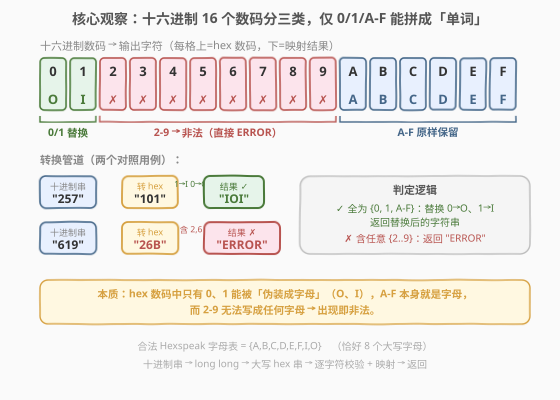
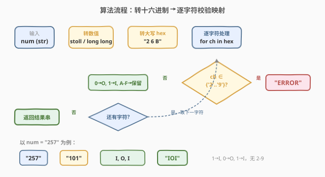
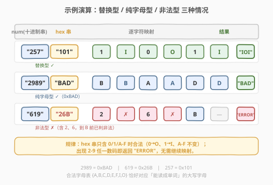

# LeetCode 十六进制魔术数字 题解

## 1. 题目概述

- **标题 / 题号**：十六进制魔术数字（#1271，easy）
- **链接**：https://leetcode.cn/problems/hexspeak/
- **难度**：简单
- **标签**：数学、字符串、进制转换

**题意**：给定一个表示非负整数的字符串 `num`，将其转换为**十六进制魔术数字**（Hexspeak）。规则如下：

1. 先把 `num` 转成**大写十六进制字符串**；
2. 把所有数字 `0` 替换成字母 `O`，数字 `1` 替换成字母 `I`；
3. 如果十六进制串中出现 `2` ~ `9` 中的**任意一个数字**，则不是合法的 Hexspeak，返回 `"ERROR"`；
4. 否则返回替换后的字符串。

> 💡 **什么是 Hexspeak？** 它是一种用十六进制数字「伪装成英文单词」的文字游戏——`A`~`F` 本身就是字母，`0` 形似 `O`、`1` 形似 `I`，于是只有这 8 个大写字母 `{A,B,C,D,E,F,I,O}` 能拼出「单词」。数字 `2`~`9` 没有对应的字母形，出现即破坏「全字母」约束。

**示例 1**：

```text
输入：num = "257"
输出："IOI"
解释：257 的十六进制为 "101"，1→I、0→O、1→I，得到 "IOI"。
```

**示例 2**：

```text
输入：num = "3"
输出："ERROR"
解释：3 的十六进制为 "3"，含数字 2-9，非法。
```

**示例 3**：

```text
输入：num = "619"
输出："ERROR"
解释：619 的十六进制为 "26B"，含数字 2 和 6，非法。
```

**约束**：

- `num` 由数字字符组成，不含前导零；
- $1 \le \text{num} \le 10^{12}$（以字符串形式给出，值域可放入 64 位整数）。

> ⚠️ **为什么输入是字符串？** 因为上界 $10^{12}$ 超过了 32 位 `int` 的范围（$\approx 2.1 \times 10^9$），用字符串传入可避免各语言 32 位整型溢出。但它仍在 64 位 `long long` 范围内（$\approx 9.2 \times 10^{18}$），所以直接 `stoll` / `int()` 转成 64 位整数即可。

## 2. 解题思路

### 2.1 朴素思路：模拟转换 + 逐字符校验

本题是一道**直接模拟**题，没有复杂的算法选择，核心在于把流程拆对、把数码分对类：

1. **字符串转数值**：`num`（字符串）→ `n`（64 位整数）。
2. **数值转大写 hex 串**：例如 `257` → `"101"`。
3. **逐字符扫描**：按规则分类处理每个 hex 数码，遇 `2`-`9` 立即返回 `"ERROR"`。

> ⚠️ **容易踩的坑**：
> - hex 转换后**默认就是大写还是小写**？不同语言行为不同（C++ `%llX` 大写、`%llx` 小写；Python `hex()` 返回小写，需 `.upper()`），务必统一成大写再做判断。
> - 判定 `2`-`9` 时，`A`~`F` 的 ASCII 值在 `'9'` 之后，不能用 `c > '1'` 这种宽泛条件误伤字母，必须精确限定 `'2' <= c <= '9'`。

### 2.2 核心观察：十六进制数码的三分类



十六进制共有 16 个数码 `0-9, A-F`，按「能否伪装成字母」分为三类：

| 类别 | 数码 | 处理方式 | 颜色 |
|------|------|----------|------|
| **替换** | `0`, `1` | `0→O`、`1→I`（形似字母） | 绿 |
| **非法** | `2` ~ `9` | 出现即返回 `"ERROR"` | 红 |
| **保留** | `A` ~ `F` | 本身就是字母，原样保留 | 蓝 |

> 💡 **一句话洞察**：合法的 Hexspeak 字母表恰好是 $\{A,B,C,D,E,F,I,O\}$ 共 8 个大写字母。只要 hex 串中每个字符都落在这个集合里（`0`/`1` 经替换后落入），就合法；否则非法。判定可以在**一次遍历**中完成——遇到 `2`-`9` 提前剪枝返回，无需扫完整个串。

### 2.3 算法流程图



流程是一条**线性管道 + 单分支剪枝**：

1. **输入** `num`（十进制字符串）
2. **转数值**：`stoll` / `int()` → 64 位整数 `n`
3. **转大写 hex**：得到 hex 字符串 `h`（如 `"101"`）
4. **逐字符循环**：对 `h` 中每个字符 `c`：
   - 若 `'2' <= c <= '9'` → 立即返回 `"ERROR"`（剪枝）
   - 否则映射：`'0'→'O'`、`'1'→'I'`、`A-F` 原样
5. **返回**拼接后的结果串

### 2.4 示例演算



用三个用例覆盖全部三种情况：

| num（十进制串） | hex 串 | 逐字符映射 | 结果 | 类型 |
|----------------|--------|-----------|------|------|
| `"257"` | `"101"` | `1→I, 0→O, 1→I` | `"IOI"` | 替换型 ✓ |
| `"2989"` | `"BAD"` | `B→B, A→A, D→D` | `"BAD"` | 纯字母型 ✓ |
| `"619"` | `"26B"` | `2→✗`（含 2-9） | `"ERROR"` | 非法型 ✗ |

> 💡 **验证 2989 = 0xBAD**：$11 \times 256 + 10 \times 16 + 13 = 2816 + 160 + 13 = 2989$ ✓。三个 hex 数码 `B, A, D` 全是字母，无需替换，直接返回 `"BAD"`——这正是 Hexspeak 「拼成单词」的精髓。
>
> 💡 **619 的剪枝**：hex 为 `"26B"`，第一个字符 `2` 就命中 `2`-`9`，无需看后面的 `6`、`B`，直接返回 `"ERROR"`。这说明**遇到首个非法数码即可提前退出**，是天然的短路优化。

## 3. 参考代码

### 方法一：模拟转换 + 逐字符校验（主流写法）

#### C++

```cpp
class Solution {
  public:
    string toHexspeak(string num) {
        long long n = stoll(num);
        char buf[20];
        snprintf(buf, sizeof(buf), "%llX", (unsigned long long)n);
        string ans;
        for (char c : string(buf)) {
            if (c >= '2' && c <= '9') return "ERROR";
            ans += (c == '0') ? 'O' : (c == '1') ? 'I' : c;
        }
        return ans;
    }
};
```

#### Python

```python
class Solution:
    def toHexspeak(self, num: str) -> str:
        h = hex(int(num))[2:].upper()
        ans = []
        for c in h:
            if '2' <= c <= '9':
                return "ERROR"
            if c == '0':
                ans.append('O')
            elif c == '1':
                ans.append('I')
            else:
                ans.append(c)
        return ''.join(ans)
```

> 💡 **细节说明**：
> - **C++ `snprintf(buf, ..., "%llX", ...)`**：`%llX` 把 `unsigned long long` 格式化为**大写**十六进制（`%llx` 是小写）。`n` 非负，强转 `unsigned long long` 安全。
> - **Python `hex(int(num))[2:].upper()`**：`hex()` 返回 `"0x..."` 小写前缀，`[2:]` 去掉 `"0x"`，`.upper()` 转大写。
> - **三元判断**：`'0'→'O'`、`'1'→'I'`、其余（`A-F`）原样追加。`2`-`9` 已在上一步被剪枝返回，不会走到这里。

### 方法二：Python 字符串 API（最简洁）

```python
class Solution:
    def toHexspeak(self, num: str) -> str:
        h = hex(int(num))[2:].upper()
        if any('2' <= c <= '9' for c in h):
            return "ERROR"
        return h.translate(str.maketrans('01', 'OI'))
```

> 💡 **`str.maketrans('01', 'OI')` + `translate`**：一次性把串中所有 `'0'`→`'O'`、`'1'`→`'I'`，比循环拼接更 Pythonic。先用 `any()` 做一遍合法性扫描（短路），通过后再 `translate` 批量替换，逻辑分两段、各司其职。

## 4. 复杂度分析

| 维度 | 复杂度 | 说明 |
|------|--------|------|
| 时间复杂度 | $O(\log_{16} \text{num})$ | hex 串长度 $= \lfloor \log_{16} \text{num} \rfloor + 1$，遍历一次即可；$10^{12}$ 的 hex 仅 10 位 |
| 空间复杂度 | $O(\log_{16} \text{num})$ | 存储 hex 串与结果串，长度相同；不计输出则 $O(1)$ |

> 💡 当 $\text{num} = 10^{12}$ 时，hex 表示为 `E8D4A51000`（10 位），循环最多 10 次，实际为常数级。渐近界 $O(\log \text{num})$ 刻画的是「位数随数值增长」的本质。

## 5. 扩展：超大数的手动进制转换

题目约束 $\text{num} \le 10^{12}$，`stoll` / `int()` 足以应对。但若 `num` 超出 64 位整数范围（如几十位的大数），则需要**直接对十进制字符串做「除 16 取余」**，模拟长除法：

```python
class Solution:
    def toHexspeak(self, num: str) -> str:
        # 大数：直接对十进制字符串反复除 16 取余
        digits = "0123456789ABCDEF"
        n = num
        if int(n) == 0:
            hexs = "0"
        else:
            hexs = ""
            while int(n) > 0:
                # 大数除法：逐位模拟 num // 16 与 num % 16
                q, r = "", 0
                for ch in n:
                    cur = r * 10 + int(ch)
                    q += str(cur // 16)
                    r = cur % 16
                hexs += digits[r]
                n = str(int(q))  # 去掉前导零
            hexs = hexs[::-1]
        # 校验 + 映射（同主方法）
        for c in hexs:
            if '2' <= c <= '9':
                return "ERROR"
        return hexs.translate(str.maketrans('01', 'OI'))
```

> ⚠️ **大数除法的要点**：每次把十进制串除以 16，得到商串（去掉前导零后进入下一轮）和余数（即一位 hex 数码，从低位到高位产出，最后反转）。这与 [166. 分数到小数](../0001-0400/166_分数到小数.md) 的长除法模拟、[415. 字符串相加](../0001-0100/415_字符串相加.md) 的大数加法属于同一族「字符串模拟算术」技巧。本题约束下无需此法，仅作思路扩展。

## 6. 面试要点

1. **为什么输入用字符串而不是整数？**

   - 上界 $10^{12}$ 超过 32 位 `int`（$\approx 2.1 \times 10^9$），用字符串避免 32 位溢出。但它仍在 64 位 `long long` 范围内，所以解法里 `stoll` 转一次即可。面试时若被追问「数更大怎么办」，就引出第 5 节的大数长除法。

2. **如何精确判定 `2`-`9`？能用 `c > '1'` 吗？**

   - 不能。`A`-`F` 的 ASCII 值都大于 `'9'`，`c > '1'` 会把合法字母也判成非法。必须写成 `'2' <= c <= '9'`（或 `c >= '2' && c <= '9'`），精确限定数字区间。这是本题最常见的 off-by-one 坑。

3. **hex 转换后的大小写问题？**

   - C++ 的 `%llX` 产出大写、`%llx` 产出小写；Python `hex()` 产出小写，需 `.upper()`。题目要求 `A-F` 大写，且 `I`/`O` 本身就是大写字母，所以统一转大写后判断最稳妥。

4. **遇到首个非法数码就返回有什么好处？**

   - 天然短路剪枝。例如 `"619"` → hex `"26B"`，第一个字符 `2` 即非法，无需扫描后面的 `6`、`B`。最坏情况（全合法）才需扫完整串，平均更优。时间复杂度界 $O(\log \text{num})$ 不变，但常数更小。

5. **`num = 0` 会怎样？**

   - 约束保证 $\text{num} \ge 1$，不会出现。但若传入 `"0"`，hex 为 `"0"` → `0→O` → 返回 `"O"`，逻辑自洽。C++ 中 `snprintf` 对 `n=0` 输出 `"0"`，Python `hex(0)` = `"0x0"` → `"0"`，均正确处理。

## 同类练习题

| # | 题目 | 与本题的关联 |
|---|------|-------------|
| 168 | [Excel表列名称](https://leetcode.cn/problems/excel-sheet-column-title/)（[题解](../0001-0100/168_Excel表列名称.md)） | 同为「整数 → 字符串」的进制转换，对比 1-indexed 26 进制的 off-by-one 与本题的 0-indexed 16 进制 |
| 504 | [七进制数](https://leetcode.cn/problems/base-7/) | 标准 0-indexed 进制转换（含负数），对比「含 0 数码」的普通进制与本题的数码分类映射 |
| 1256 | [加密数字](https://leetcode.cn/problems/encode-number/)（[题解](1256_加密数字.md)） | 另一类「整数 → 字符串」编码映射，`bin(num+1)` 去前导 1，与本题的 hex 转换形成对比 |
| 166 | [分数到小数](https://leetcode.cn/problems/fraction-to-recurring-decimal/)（[题解](../0001-0400/166_分数到小数.md)） | 长除法模拟 + 哈希检测循环节，与第 5 节大数进制转换共享「字符串模拟算术」思想 |
| 12 | [整数转罗马数字](https://leetcode.cn/problems/integer-to-roman/) | 「整数 → 符号串」转换的贪心配面值法，对比本题的直接取余映射 |
