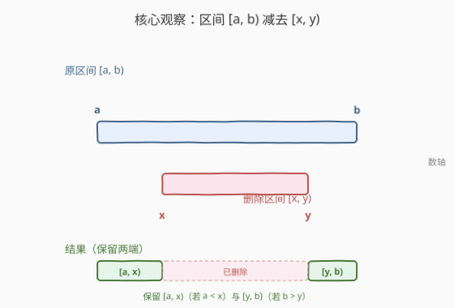
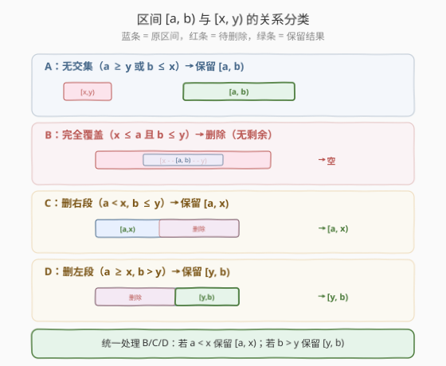
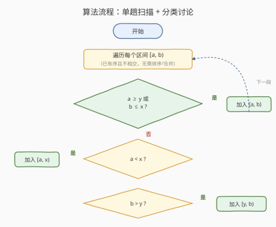
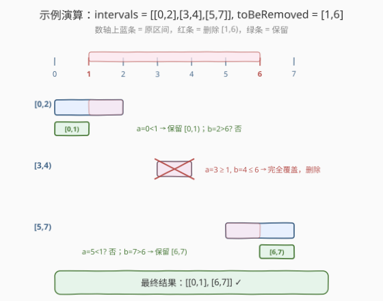

# 删除区间

- **题目名称**：删除区间
- **链接**：[1272. 删除区间](https://leetcode.cn/problems/remove-interval/)
- **难度**：中等
- **标签**：数组、区间、分类讨论

## 1. 题目概述

实数集合可以表示为若干**不相交**区间的并集，每个区间形式为 $[a, b)$（左闭右开），表示满足 $a \le x < b$ 的所有实数 $x$。

给你一个**有序的**不相交区间列表 `intervals`，其中每一项 `intervals[i] = [ai, bi]` 表示区间 $[a_i, b_i)$。再给你一个要删除的区间 `toBeRemoved = [x, y)`。返回从 `intervals` 表示的实数集合中**删除** `toBeRemoved` 后的实数集合，结果仍为**有序的不相交**区间列表。

**示例 1**：

```text
输入：intervals = [[0,2],[3,4],[5,7]], toBeRemoved = [1,6]
输出：[[0,1],[6,7]]
解释：
  [0,2) 删 [1,6) → 剩 [0,1)
  [3,4) 被 [1,6) 完全覆盖 → 删除
  [5,7) 删 [1,6) → 剩 [6,7)
```

**示例 2**：

```text
输入：intervals = [[0,5]], toBeRemoved = [2,3]
输出：[[0,2],[3,5]]
解释：[0,5) 中间挖去 [2,3)，分裂为 [0,2) 与 [3,5)。
```

**示例 3**：

```text
输入：intervals = [[-5,-4],[-3,-2],[1,2],[3,5],[8,9]], toBeRemoved = [-1,4]
输出：[[-5,-4],[-3,-2],[4,5],[8,9]]
解释：[1,2) 被完全覆盖删除；[3,5) 删去 [3,4) 剩 [4,5)；其余无交集保留。
```

**约束条件**：

- $1 \le \text{intervals.length} \le 10^4$
- $-10^9 \le a_i < b_i \le 10^9$
- `intervals` 已按起点升序排列且区间两两不相交

> 💡 **关键信号**：输入已经**有序且不相交**，无需排序、无需合并。每个区间与 `toBeRemoved` 的关系只有「无交集 / 被覆盖 / 部分重叠」三种，逐个做一次**区间减法**即可，单趟 $O(n)$。

---

## 2. 解题思路

### 2.1 暴力思路：标记法/离散化

一种笨办法是把所有区间端点收集、离散化成网格，对每个原子小段判断「在 `intervals` 中且不在 `toBeRemoved` 中」，再合并相邻段。实现繁琐、常数大，且对实数集（端点可达 $10^9$ 量级、坐标不一定是整数网格）并不自然。

事实上输入已经是**有序不相交**区间，最自然的操作就是对每个区间直接「减去」`toBeRemoved`，根本不需要离散化或合并。

### 2.2 核心观察：单区间减法



记待删除区间为 $[x, y)$。对每个原区间 $[a, b)$，$[a, b) \setminus [x, y)$ 至多分裂成**左右两段**：

$$[a, b) \setminus [x, y) = [a, x) \;\cup\; [y, b)$$

其中只有**真正存在**的部分需要保留：

- **左段** $[a, x)$：仅当 $a < x$ 时存在（原区间在删除区间左侧有残留）
- **右段** $[y, b)$：仅当 $b > y$ 时存在（原区间在删除区间右侧有残留）

> 💡 **为什么至多两段？** 删除区间是**单个连续段**，从一个连续段中挖掉一段，结果至多是被挖位置隔开的左右两段。这与「多段删除」不同——若 `toBeRemoved` 是多个区间，则需先合并删除区间（见第 5 节扩展）。

### 2.3 关系分类



把 $[a, b)$ 与 $[x, y)$ 的位置关系归纳为三类：

| 类别 | 关系判定 | 处理 |
|------|----------|------|
| **A 无交集** | $a \ge y$ 或 $b \le x$ | 原样保留 $[a, b)$ |
| **B 完全覆盖** | $x \le a$ 且 $b \le y$ | 删除整段，不加任何结果 |
| **C/D 部分重叠** | 其余相交情况 | 保留左段 $[a, x)$（若 $a < x$）和/或右段 $[y, b)$（若 $b > y$） |

> ⚠️ **统一处理 B/C/D**：无需单独写「完全覆盖」分支。只要先判「无交集」直接保留；否则套用「$a < x$ 保留左段、$b > y$ 保留右段」两条独立判断——完全覆盖时两条件都不成立，自然什么都不加。代码因此极简。

### 2.4 算法流程图



流程说明：

1. 设 $x, y$ 为 `toBeRemoved` 的两端
2. 遍历每个原区间 $[a, b)$
3. 若 $a \ge y$ 或 $b \le x$（无交集）→ 加入 $[a, b)$
4. 否则（有交集）：
   - 若 $a < x$ → 加入 $[a, x)$
   - 若 $b > y$ → 加入 $[y, b)$
5. 遍历结束返回结果

> 💡 **为何无需排序/合并？** 输入保证有序且不相交，且 `toBeRemoved` 只是一个区间。每个原区间独立做减法后，结果天然仍按原顺序排列、两两不相交（删除区间在任一原区间内最多挖一个缺口，跨区间的删除也不会让两段结果相接：若两段结果能相接，说明它们本属同一原区间，而同一原区间至多分裂成左右两段且被删除区间隔开，不可能相接）。

### 2.5 示例演算



以 `intervals = [[0,2],[3,4],[5,7]]`, `toBeRemoved = [1,6]`（即 $x=1, y=6$）为例：

| 原区间 | 无交集? | 左段 ($a<x$?) | 右段 ($b>y$?) | 结果 |
|--------|---------|---------------|---------------|------|
| $[0,2)$ | $a=0 \ge 6$? 否；$b=2 \le 1$? 否 → 有交集 | $0 < 1$ → $[0,1)$ | $2 > 6$? 否 | $[0,1)$ |
| $[3,4)$ | $3 \ge 6$? 否；$4 \le 1$? 否 → 有交集 | $3 < 1$? 否 | $4 > 6$? 否 | （空，完全覆盖） |
| $[5,7)$ | $5 \ge 6$? 否；$7 \le 1$? 否 → 有交集 | $5 < 1$? 否 | $7 > 6$ → $[6,7)$ | $[6,7)$ |

最终结果：`[[0,1],[6,7]]` ✓

> 验证示例 3：`toBeRemoved = [-1,4]`。$[-5,-4)$ 与 $[-3,-2)$ 的 $b \le x=-1$ → 无交集保留；$[1,2)$ 被 $[-1,4)$ 完全覆盖 → 删除；$[3,5)$ 的 $b=5 > y=4$ → 保留 $[4,5)$；$[8,9)$ 的 $a=8 \ge y=4$ → 无交集保留。结果 `[[-5,-4],[-3,-2],[4,5],[8,9]]` ✓

---

## 3. 参考代码

### 方法一：单趟扫描 + 分类讨论（推荐，$O(n)$）

### C++

```cpp
class Solution {
  public:
    vector<vector<int>> removeInterval(vector<vector<int>>& intervals,
                                       vector<int>& toBeRemoved) {
        int x = toBeRemoved[0], y = toBeRemoved[1];
        vector<vector<int>> ans;
        for (auto& e : intervals) {
            int a = e[0], b = e[1];
            if (a >= y || b <= x) {
                ans.push_back(e);
            } else {
                if (a < x) ans.push_back({a, x});
                if (b > y) ans.push_back({y, b});
            }
        }
        return ans;
    }
};
```

### Python

```python
class Solution:
    def removeInterval(
        self, intervals: List[List[int]], toBeRemoved: List[int]
    ) -> List[List[int]]:
        x, y = toBeRemoved
        ans = []
        for a, b in intervals:
            if a >= y or b <= x:
                ans.append([a, b])
            else:
                if a < x:
                    ans.append([a, x])
                if b > y:
                    ans.append([y, b])
        return ans
```

> 💡 **核心要点**：输入已有序不相交，无需排序与合并。只需一趟遍历，对每个区间用「无交集则保留，否则按 $a<x$、$b>y$ 两条独立判断切出左右两段」。代码只有十行，是区间减法的最小模板。

### 方法二：利用有序性提前终止

### C++

```cpp
class Solution {
  public:
    vector<vector<int>> removeInterval(vector<vector<int>>& intervals,
                                       vector<int>& toBeRemoved) {
        int x = toBeRemoved[0], y = toBeRemoved[1];
        vector<vector<int>> ans;
        for (auto& e : intervals) {
            int a = e[0], b = e[1];
            if (b <= x) {            // 整段在删除区间左侧，保留
                ans.push_back(e);
            } else if (a >= y) {     // 整段在删除区间右侧，保留并可直接终止
                ans.push_back(e);
                // 后续区间起点更大，必 >= a >= y，全部无交集
                // 但为保持代码简洁仍继续遍历，仅做说明
            } else {
                if (a < x) ans.push_back({a, x});
                if (b > y) ans.push_back({y, b});
            }
        }
        return ans;
    }
};
```

> 由于 `intervals` 按起点升序，遇到 $a \ge y$ 的区间后，其后的所有区间起点都 $\ge y$，必与 `toBeRemoved` 无交集。可在此处把剩余区间整体追加后 `break`，在 $n$ 很大、`toBeRemoved` 偏左时减少遍历量。最坏仍 $O(n)$。

---

## 4. 复杂度分析

| 维度 | 方法一（单趟扫描） | 方法二（提前终止） |
|------|---------------------|---------------------|
| 时间复杂度 | $O(n)$ | $O(n)$（最坏），实际可提前结束 |
| 空间复杂度 | $O(1)$（不计输出） | $O(1)$（不计输出） |

- **方法一**：遍历所有 $n$ 个区间，每个 $O(1)$ 处理。输出列表本身占 $O(n)$，但通常不计入空间复杂度。
- **方法二**：在 `toBeRemoved` 偏左/偏右时，遇到首个完全在其右侧的区间后即可终止遍历，常数优化；最坏情况（`toBeRemoved` 覆盖中段、两侧都有区间）仍遍历全部。

> 💡 $n \le 10^4$，$O(n)$ 轻松通过。瓶颈不在算法而在边界判断的写法是否正确。

---

## 5. 扩展：删除多个区间

若 `toBeRemoved` 是**多个区间**列表（例如周赛题 [3975. 筛选忙碌区间](https://leetcode.cn/problems/filter-occupied-intervals/)），思路是：

1. **先合并**待删除区间列表（按起点排序，相邻/重叠则合并），得到有序不相交的删除区间序列。
2. 再对每个原区间，依次减去与之有交集的删除区间。由于两端都已有序不相交，可用**双指针**对齐推进，每个原区间至多被切出若干段。

整体复杂度 $O(n \log n + m \log m)$（排序），其中 $n$ 为原区间数、$m$ 为删除区间数；若两者已有序则 $O(n + m)$。

> 本题（1272）是「多区间删除」的 $m = 1$ 特例：删除区间只有一个，无需合并，直接对每个原区间套用「左段/右段」两条件即可。

---

## 6. 面试要点

1. **为什么不用排序/合并？输入的有序不相交性质如何利用？**

   题目保证 `intervals` 有序且两两不相交，且 `toBeRemoved` 只是单个区间。因此每个原区间独立做一次减法即可，结果天然保持有序与不相交。引入排序/合并属于把简单题做复杂。

2. **「完全覆盖」需要单独写一个分支吗？**

   不需要。先判「无交集」直接保留；否则套用「$a < x$ 保留 $[a, x)$」「$b > y$ 保留 $[y, b)$」两条独立判断。完全覆盖时两条件都不成立，自然不加任何结果。统一处理让代码更短、更不易漏分支。

3. **左闭右开 $[a, b)$ 对判断条件有什么影响？**

   半开区间下，相邻段 $[a, x)$ 与 $[y, b)$ 是否相接取决于 $x$ 与 $y$ 是否相等，但本题中它们被删除区间 $[x, y)$ 隔开（$x < y$），所以左右两段不可能相接，无需再合并。无交集条件用 $a \ge y$（不是 $a > y$）和 $b \le x$（不是 $b < x$），正贴合半开语义：$[a, b)$ 与 $[x, y)$ 有公共点当且仅当 $a < y$ 且 $b > x$。

4. **如果要删除的区间跨越多个原区间怎么办？**

   不影响正确性。每个原区间独立做减法：被完全覆盖的删除、被部分覆盖的截断、无交集的保留。由于原区间本就不相交，删除同一个 `toBeRemoved` 后结果仍不相交——跨区间删除不会产生相接的相邻结果。

5. **坐标范围 $10^9$ 会不会有溢出问题？**

   不会。本算法只做比较与赋值，不做累加或乘法，端点值在 `int` 范围内（$-10^9 \sim 10^9$）。用 C++ 的 `int` 即可，无需 `long long`。

---

## 7. 同类练习题

- [57. 插入区间](https://leetcode.cn/problems/insert-interval/)（[站内题解](../0001-0100/57_插入区间.md)）：向有序不相交区间列表插入一个新区间并合并，与本题同属「单区间 vs 区间列表」的扫描处理
- [56. 合并区间](https://leetcode.cn/problems/merge-intervals/)（[站内题解](../0001-0100/56_合并区间.md)）：区间合并模板，是「多区间删除」扩展中预处理删除区间序列的基础
- [986. 区间列表的交集](https://leetcode.cn/problems/interval-list-intersections/)（[站内题解](../0901-1000/986_区间列表的交集.md)）：两个有序不相交区间列表求交集，与本题求差集互为对偶，双指针思路同源
- [435. 无重叠区间](https://leetcode.cn/problems/non-overlapping-intervals/)（[站内题解](../0401-0500/435_无重叠区间.md)）：贪心区间调度，对比本题对「区间相交/不相交」关系的判定
- [3975. 筛选忙碌区间](https://leetcode.cn/problems/filter-occupied-intervals/)：周赛题，本题的「多区间删除」升级版——先合并再对每个区间减去空闲区间
