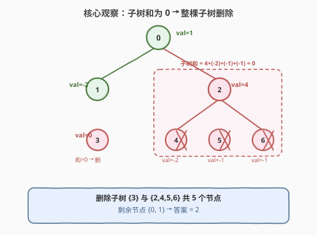
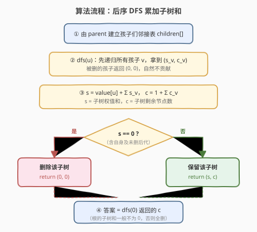
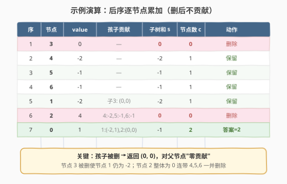

# 删除树节点

- **题目名称**：删除树节点
- **链接**：[1273. 删除树节点](https://leetcode.cn/problems/delete-tree-nodes/)
- **难度**：中等
- **标签**：树、深度优先搜索、后序遍历、树形 DP

## 1. 题目概述

给出一棵**以节点 0 为根**的树，用三个数组描述：

- `nodes`：节点总数；
- `parent[i]`：节点 `i` 的父节点（`parent[0] == -1` 表示 0 是根）；
- `value[i]`：节点 `i` 的权值。

要求**删除所有"权值和等于 0"的子树**（删掉整棵子树，即该子树根及其全部后代），返回删除后树中**剩余的节点数**。

**示例 1**（官方）：

```text
输入：nodes = 7, parent = [-1,0,0,1,2,2,2], value = [1,-2,4,0,-2,-1,-1]
输出：2
解释：树结构如下（节点编号 / 权值）
            0(1)
           /    \
        1(-2)   2(4)
         |     / | \
       3(0) 4(-2) 5(-1) 6(-1)
- 节点 3 子树和 = 0        → 删除 {3}
- 节点 2 子树和 = 4-2-1-1 = 0 → 删除 {2,4,5,6}
- 剩余 {0, 1}，共 2 个节点
```

**补充示例 2**（自构，用于展示嵌套零和子树）：

```text
输入：nodes = 5, parent = [-1,0,1,2,0], value = [1,2,-2,0,3]
输出：2
解释：
        0(1)
       /    \
     1(2)   4(3)
      |
     2(-2)
      |
     3(0)
- 节点 3 子树和 = 0           → 删除 {3}
- 节点 1 子树和 = 2+(-2)+0 = 0 → 删除 {1,2,3}
- 剩余 {0, 4}，共 2 个节点
```

**约束条件**：

- `1 <= nodes <= 10^4`
- `-10^5 <= value[i] <= 10^5`
- `parent.length == nodes`
- `parent[0] == -1`（0 为根）

> 💡 **关键提示**：本题是 Plus 会员题。核心是把"删除"转化为后序 DFS 中的"聚合 + 判零"——先递归孩子拿到子树信息，再决定当前子树是否整棵删除。

---

## 2. 解题思路

### 2.1 暴力思路

最直白的做法：**反复扫描**——每轮重新计算每个节点的子树和，找到一个和为 0 的子树就删掉，然后重新计算，直到没有和为 0 的子树为止。

- 每轮重新计算所有子树和：$O(n^2)$（每个节点都 DFS 自己的子树）；
- 最坏要删 $O(n)$ 轮；
- 总计 $O(n^3)$，在 $n = 10^4$ 时约 $10^{12}$ 次操作，远超时限。

即便优化成"每轮一次 $O(n)$ 后序求所有子树和"，仍需 $O(n)$ 轮判断删除是否引发新的零和，最坏 $O(n^2)$，且实现啰嗦、容易出错。

### 2.2 核心观察：后序聚合 + 判零即删（一次遍历足够）



把问题想成对每个节点 $u$ 求**两个量**：

- $s_u$：以 $u$ 为根的子树（删完后剩余部分）的**权值和**；
- $c_u$：以 $u$ 为根的子树（删完后剩余部分）的**节点数**。

用**后序 DFS**：先递归所有孩子 $v$，拿到 $(s_v, c_v)$，再聚合：

$$
s_u = \text{value}[u] + \sum_{v \in \text{children}(u)} s_v, \qquad
c_u = 1 + \sum_{v \in \text{children}(u)} c_v
$$

**关键判定**：若 $s_u = 0$，则**整棵以 $u$ 为根的子树都要删除**——此时令 $c_u = 0$（并向父节点返回 $(0, 0)$，即"零贡献"）。

> 💡 **为什么"被删的孩子返回 $(0,0)$"是对的？** 子树和为 $0$ 意味着这棵子树对父节点的权值贡献本来就是 $0$。删掉它，既不减父节点的和（去掉 $0$），也不该计入剩余节点数。所以让被删子树对父节点"零贡献"——$s$ 贡献 $0$、$c$ 贡献 $0$——完美自洽。

> ⚠️ **更深刻的引理（一次遍历足够）**：删除任意一棵和为 $0$ 的子树，**不会改变任何祖先节点的子树和**。因为被删子树对父节点的贡献恰为 $0$，沿链向上传递仍是减去 $0$。于是"先删小的零和子树、再判父节点是否变零"的多轮迭代**完全不需要**——后序一趟即可：每个节点 $u$ 最终的 $s_u$ 等于它在**原树**上的子树和，$s_u = 0$ 当且仅当它该被整棵删除。补充示例 2 中节点 3 被删后，节点 1 的和仍为 $2 + (-2) = 0$（不减不变），正体现了这条不变性。

### 2.3 算法流程图



1. 由 `parent` 建立**孩子们邻接表** `children[]`（跳过 `i = 0`，因其父为 $-1$）。
2. `dfs(u)`：先递归所有孩子 $v$，拿到 $(s_v, c_v)$。
3. 累加：$s = \text{value}[u] + \sum s_v$，$c = 1 + \sum c_v$。
4. 判定 $s = 0$：
   - **是** → 整棵删除，返回 $(0, 0)$；
   - **否** → 保留，返回 $(s, c)$。
5. 答案 = `dfs(0)` 返回的 $c$（根的子树和若也为 $0$，则全树删除，返回 $0$）。

### 2.4 示例演算

以官方示例 1 为例（`value = [1,-2,4,0,-2,-1,-1]`），后序处理顺序为 $3 \to 4 \to 5 \to 6 \to 1 \to 2 \to 0$：



| 序 | 节点 | value | 孩子贡献 | 子树和 $s$ | 节点数 $c$ | 动作 |
|----|------|-------|----------|-----------|-----------|------|
| 1 | 3 | 0 | — | 0 | 0 | 删除 |
| 2 | 4 | -2 | — | -2 | 1 | 保留 |
| 3 | 5 | -1 | — | -1 | 1 | 保留 |
| 4 | 6 | -1 | — | -1 | 1 | 保留 |
| 5 | 1 | -2 | 子3: (0,0) | -2 | 1 | 保留 |
| 6 | 2 | 4 | 4:-2, 5:-1, 6:-1 | 0 | 0 | 删除 |
| 7 | 0 | 1 | 1:(-2,1), 2:(0,0) | -1 | **2** | 答案 |

> 💡 注意第 5 行：节点 3 被删后对节点 1 "零贡献"，所以节点 1 的和仍是 $-2 + 0 = -2$，不为 $0$，保留。第 6 行节点 2 把三个孩子 $-2,-1,-1$ 加上自身 $4$ 恰好为 $0$，整棵删除。最终根节点 $0$ 只剩自身和节点 1，共 $2$ 个 ✓。

---

## 3. 参考代码

### 方法一：后序 DFS（递归）

#### C++

```cpp
class Solution {
  public:
    int deleteTreeNodes(int nodes, vector<int>& parent, vector<int>& value) {
        vector<vector<int>> children(nodes);
        for (int i = 1; i < nodes; ++i)
            children[parent[i]].push_back(i);

        // 返回 {子树权和, 剩余节点数}
        function<pair<int,int>(int)> dfs = [&](int u) -> pair<int,int> {
            int sum = value[u], cnt = 1;
            for (int v : children[u]) {
                auto [s, c] = dfs(v);
                sum += s;
                cnt += c;
            }
            if (sum == 0) return {0, 0};   // 整棵子树删除，对父节点零贡献
            return {sum, cnt};
        };
        return dfs(0).second;
    }
};
```

#### Python

```python
class Solution:
    def deleteTreeNodes(self, nodes: int, parent: List[int], value: List[int]) -> int:
        children = [[] for _ in range(nodes)]
        for i in range(1, nodes):
            children[parent[i]].append(i)

        def dfs(u: int):  # -> (子树权和, 剩余节点数)
            s, c = value[u], 1
            for v in children[u]:
                cs, cc = dfs(v)
                s += cs
                c += cc
            if s == 0:
                return 0, 0       # 整棵子树删除，对父节点零贡献
            return s, c

        return dfs(0)[1]
```

> ⚠️ **Python 递归深度**：$n \le 10^4$，树可能退化为单链，递归深度可达 $10^4$，超过默认上限 $1000$。LeetCode 环境通常已调高；本地运行需 `sys.setrecursionlimit(20000)`，或直接用第 5 节的迭代版（无栈风险）。C++ 默认栈在 $10^4$ 深度下安全。

---

## 4. 复杂度分析

| 方法 | 时间复杂度 | 空间复杂度 | 说明 |
|------|-----------|-----------|------|
| 后序 DFS（递归） | $O(n)$ | $O(n)$ | 每个节点访问一次；邻接表 + 递归栈（链状退化 $O(n)$） |
| 后序 DFS（迭代） | $O(n)$ | $O(n)$ | 显式栈模拟后序；`order` 数组 + `sum/cnt` 数组 |

> 💡 两种实现时间空间同级。递归版贴近"先孩子后自身"的直觉、代码最短；迭代版规避深树栈溢出，是大规模数据下的稳妥选择。建邻接表本身已 $O(n)$，无法再省。

---

## 5. 扩展：迭代后序（规避递归栈）

思路：先做一次**先根遍历**压栈得到 `order`（父在前、所有后代在后），**逆序**即为合法后序（后代先于父），随后按下标顺序聚合即可。

#### C++

```cpp
class Solution {
  public:
    int deleteTreeNodes(int nodes, vector<int>& parent, vector<int>& value) {
        vector<vector<int>> children(nodes);
        for (int i = 1; i < nodes; ++i)
            children[parent[i]].push_back(i);

        vector<int> sum(nodes), cnt(nodes), order, stk = {0};
        while (!stk.empty()) {                 // 先根遍历
            int u = stk.back(); stk.pop_back();
            order.push_back(u);
            for (int v : children[u]) stk.push_back(v);
        }
        for (auto it = order.rbegin(); it != order.rend(); ++it) {  // 逆序=后序
            int u = *it, s = value[u], c = 1;
            for (int v : children[u]) { s += sum[v]; c += cnt[v]; }
            if (s == 0) c = 0;                 // 整棵删除：节点数归零（和本就是 0）
            sum[u] = s; cnt[u] = c;
        }
        return cnt[0];
    }
};
```

#### Python

```python
class Solution:
    def deleteTreeNodes(self, nodes: int, parent: List[int], value: List[int]) -> int:
        children = [[] for _ in range(nodes)]
        for i in range(1, nodes):
            children[parent[i]].append(i)

        order, stack = [], [0]
        while stack:                            # 先根遍历
            u = stack.pop()
            order.append(u)
            stack.extend(children[u])

        sub_sum = [0] * nodes
        sub_cnt = [0] * nodes
        for u in reversed(order):               # 逆序即后序（后代先于父）
            s = value[u] + sum(sub_sum[v] for v in children[u])
            c = 1 + sum(sub_cnt[v] for v in children[u])
            if s == 0:
                c = 0
            sub_sum[u] = s
            sub_cnt[u] = c
        return sub_cnt[0]
```

> 💡 **为何"逆先根 = 合法后序"？** 先根遍历中父节点出现在所有后代之前，故逆序后父节点出现在所有后代之后——每个节点都晚于其全部后代被处理，正满足自底向上聚合的要求。这是树形后序迭代的标准技巧，无需维护"访问第几个孩子"的状态栈。

---

## 6. 面试要点

1. **为什么删除零和子树不会改变祖先的子树和？（不变性引理）**

   - 子树和为 $0$ 意味着该子树对父节点的权值贡献恰为 $0$。删掉它等于从父节点减去 $0$，父节点和不变；沿父链逐层上传仍是减 $0$，故任何祖先的子树和都不变。因此每个节点"该不该删"只取决于它在原树上的子树和，**一次后序遍历即可定论**，无需多轮迭代。

2. **被删子树为什么返回 $(0, 0)$ 而不是 $(0, \text{size})$？**

   - 返回的第一个分量是"对父节点的权和贡献"——子树和为 $0$ 自然贡献 $0$；第二个分量是"剩余节点数"——既然整棵删除，剩余为 $0$，对父节点计数也应贡献 $0$。两者都归零，父节点的聚合公式 `sum += s; cnt += c` 无需特判即可正确处理。

3. **若整棵树（根）的子树和也为 $0$ 怎么办？**

   - 根节点 $s_0 = 0$ 时整棵树删除，`dfs(0)` 返回 $c = 0$，答案即 $0$。如 `nodes=1, parent=[-1], value=[0]` → 输出 $0$。代码无需额外特判，判定 $s = 0$ 统一处理。

4. **为什么用后序而不是前序？**

   - 当前节点的子树和与节点数都**依赖孩子先算完**，必须"先孩子后自身"——这正是后序。前序访问父节点时孩子尚未处理，拿不到 $s_v, c_v$，无法聚合。

5. **$n = 10^4$ 的深树，递归会爆栈吗？**

   - C++ 默认栈容量在 $10^4$ 深度下安全；Python 默认递归上限 $1000$，链状退化会 `RecursionError`。解决：调高 `sys.setrecursionlimit`，或改用第 5 节迭代后序（显式栈把调用栈换成堆内存，彻底规避）。面试中先答递归讲思路，再主动提"深树可改迭代"，是稳妥节奏。

6. **本题与普通"求子树和"题（如 508）的区别？**

   - 508 只需后序求每个子树和并统计频次；本题多了一步"和为 $0$ → 整棵删除 + 对父零贡献"的判定与计数归零。核心的后序聚合框架完全一致，可视为"子树和聚合 + 条件剪枝"的扩展。

---

## 7. 同类练习题

- [508. 出现次数最多的子树元素和](https://leetcode.cn/problems/most-frequent-subtree-sum/)：后序 DFS 求每个子树和再统计频次，本题"后序聚合子树和"的直接母题
- [1245. 树的直径](https://leetcode.cn/problems/tree-diameter/)（[题解](../1201-1300/1245_树的直径.md)）：后序树形 DP 在每个节点聚合子树信息，与本题同一套"先孩子后自身"框架
- [543. 二叉树的直径](https://leetcode.cn/problems/diameter-of-binary-tree/)（[题解](../0501-0600/543_二叉树的直径.md)）：二叉树后序聚合左右子树最大深度，1245 的有根简化版
- [1519. 子树中标签相同的节点数](https://leetcode.cn/problems/number-of-nodes-in-the-sub-tree-with-the-same-label/)：后序 DFS 把子树标签计数向上合并，"子树聚合 + 父节点汇总"的另一变体
- [1373. 二叉搜索子树的最大键值和](https://leetcode.cn/problems/maximum-sum-bst-in-binary-tree/)：后序 DFS 返回多值元组（isBST/min/max/sum）并按条件更新答案，"后序聚合 + 条件判定"的进阶范例
