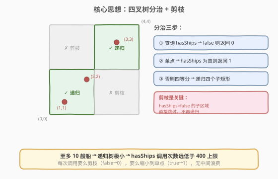
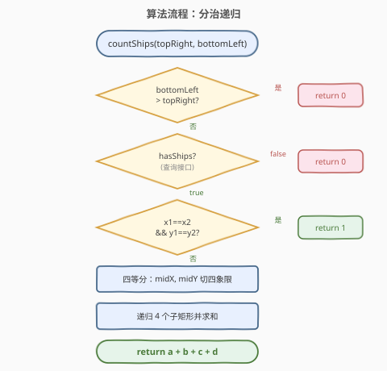
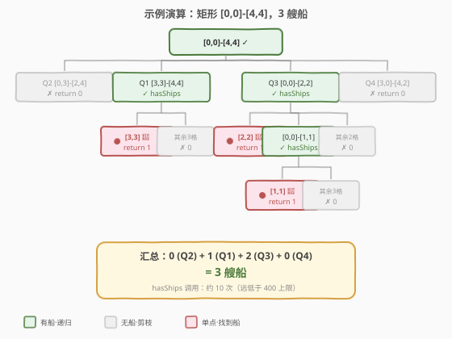

# LeetCode 矩形内船只的数目 题解

## 1. 题目概述

- **标题 / 题号**：矩形内船只的数目（#1274，hard）
- **链接**：https://leetcode.cn/problems/number-of-ships-in-a-rectangle/
- **难度**：困难
- **标签**：分治、递归、交互

**题意**：在用笛卡尔坐标系表示的二维海平面上，有一些船。每一艘船都在一个整数点上，且每一个整数点最多只有 1 艘船。

有一个交互接口 `Sea.hasShips(topRight, bottomLeft)`，输入参数为右上角和左下角两个点的坐标，当且仅当这两个点所表示的矩形区域（包含边界）内**至少有一艘船**时返回 `true`，否则返回 `false`。

给定矩形的右上角 `topRight` 和左下角 `bottomLeft` 的坐标，返回此矩形内船只的数目。题目保证矩形内**至多只有 10 艘船**。

> ⚠️ **调用限制**：调用 `hasShips` **超过 400 次**的提交将被判为错误答案。`ships` 数组仅用于评测系统内部初始化，你无法得知其信息，只能通过调用 `hasShips` 接口来求解。

**示例 1**：

```text
输入：ships = [[1,1],[2,2],[3,3],[5,5]], topRight = [4,4], bottomLeft = [0,0]
输出：3
解释：在 [0,0] 到 [4,4] 的范围内总共有 3 艘船（(5,5) 在矩形外）。
```

**示例 2**：

```text
输入：ships = [[1,1],[2,2],[3,3]], topRight = [1000,1000], bottomLeft = [0,0]
输出：3
```

**约束**：

- `0 <= bottomLeft[0] <= topRight[0] <= 1000`
- `0 <= bottomLeft[1] <= topRight[1] <= 1000`
- `topRight != bottomLeft`
- 矩形内至多 10 艘船

> 💡 **交互题的本质**：我们「蒙着眼睛」在二维平面上数船，唯一的探测器是 `hasShips`——它只能告诉你某个矩形内**有没有**船，不能告诉你**有多少**。核心挑战是用尽可能少的探测次数精确定位每一艘船。

## 2. 解题思路

### 2.1 暴力思路

最直观的做法是遍历矩形内的每一个整数点，逐个调用 `hasShips` 查询该点是否有船。但矩形最大为 $1001 \times 1001 \approx 10^6$ 个点，远超 400 次调用上限，完全不可行。

### 2.2 核心观察：四叉树分治 + 剪枝



**关键观察**：`hasShips` 返回的是**布尔值**（有/无），而非计数。要将「有无」转化为「多少」，自然想到**分治**——把大矩形切成小矩形，递归求解后汇总。

**四叉树分治**：每次将当前矩形沿水平和垂直中线切分成 4 个子矩形（四象限），对每个子矩形递归调用 `countShips`。递归有两个终止条件：

| 条件 | 返回值 | 说明 |
|------|--------|------|
| `hasShips` 返回 `false` | `0` | 该矩形无船，**剪枝**，不再递归 |
| 矩形缩小为单点（`x1==x2 && y1==y2`） | `1` | `hasShips` 已返回 `true`，单点有船即 1 艘 |

> 💡 **为什么剪枝有效？** 矩形内至多 10 艘船，绝大多数子矩形是空的。`hasShips` 一次调用就能排除整个空矩形（可能包含数万个点），极大地压缩了搜索空间。递归树只沿着「有船」的路径深入，空分支被即时剪除。

**子矩形划分**：设当前矩形为 `[x1, y1]`（左下）到 `[x2, y2]`（右上），取中点 `midX = (x1 + x2) / 2`，`midY = (y1 + y2) / 2`，四个子矩形为：

| 象限 | 左下角 | 右上角 | 说明 |
|------|--------|--------|------|
| 右上 (Q1) | `(midX+1, midY+1)` | `(x2, y2)` | 中线归属左/下象限 |
| 左上 (Q2) | `(x1, midY+1)` | `(midX, y2)` | — |
| 左下 (Q3) | `(x1, y1)` | `(midX, midY)` | — |
| 右下 (Q4) | `(midX+1, y1)` | `(x2, midY)` | — |

> ⚠️ **中线归属**：`midX` 列和 `midY` 行归属左/下象限（Q2、Q3），右/上象限从 `midX+1`、`midY+1` 开始。这保证了 4 个子矩形不重叠且覆盖整个父矩形，每个整数点恰好属于一个子矩形。

### 2.3 算法流程图



算法步骤：

1. **边界检查**：若 `bottomLeft > topRight`（无效矩形），返回 `0`
2. **查询剪枝**：调用 `hasShips(topRight, bottomLeft)`，若返回 `false`，返回 `0`
3. **单点终止**：若 `x1 == x2 && y1 == y2`（已缩小到单点），返回 `1`
4. **四等分**：计算 `midX`、`midY`，划分 4 个子矩形
5. **递归汇总**：对 4 个子矩形分别递归，返回计数之和

### 2.4 示例演算

以示例 1 为例：矩形 `[0,0]-[4,4]`，船在 `(1,1)`、`(2,2)`、`(3,3)`（`(5,5)` 在矩形外）。



**递归分区过程**：

| 层级 | 矩形 | hasShips? | 动作 |
|------|------|-----------|------|
| 0 | `[0,0]-[4,4]` | `true` | midX=2, midY=2，四等分 |
| 1 | Q2 `[0,3]-[2,4]` | `false` | ✗ 剪枝 → 0 |
| 1 | Q4 `[3,0]-[4,2]` | `false` | ✗ 剪枝 → 0 |
| 1 | Q1 `[3,3]-[4,4]` | `true` | midX=3, midY=3，四等分 |
| 2 | Q1→Q3 `[3,3]-[3,3]` | `true` | 单点 → 1 🚢 |
| 2 | Q1→其余 | `false` | ✗ 剪枝 → 0 |
| 1 | Q3 `[0,0]-[2,2]` | `true` | midX=1, midY=1，四等分 |
| 2 | Q3→Q1 `[2,2]-[2,2]` | `true` | 单点 → 1 🚢 |
| 2 | Q3→Q3 `[0,0]-[1,1]` | `true` | midX=0, midY=0，四等分 |
| 3 | Q3→Q3→Q1 `[1,1]-[1,1]` | `true` | 单点 → 1 🚢 |
| 3 | Q3→Q3→其余 | `false` | ✗ 剪枝 → 0 |
| 2 | Q3→其余 | `false` | ✗ 剪枝 → 0 |

**汇总**：`0 (Q2) + 1 (Q1) + 2 (Q3) + 0 (Q4) = 3` ✓

> 💡 **观察**：3 艘船恰好分布在 3 个不同的递归分支中，每个分支独立定位到单点。空矩形（Q2、Q4 及各层的「其余」子矩形）只需 1 次 `hasShips` 调用即被剪除。

## 3. 参考代码

### C++

```cpp
/**
 * // This is Sea's API interface.
 * // You should not implement it, or speculate about its implementation
 * class Sea {
 *   public:
 *     bool hasShips(vector<int> topRight, vector<int> bottomLeft);
 * };
 */

class Solution {
public:
    int countShips(Sea sea, vector<int> topRight, vector<int> bottomLeft) {
        int x1 = bottomLeft[0], y1 = bottomLeft[1];
        int x2 = topRight[0], y2 = topRight[1];
        if (x1 > x2 || y1 > y2) return 0;
        if (!sea.hasShips(topRight, bottomLeft)) return 0;
        if (x1 == x2 && y1 == y2) return 1;
        int mx = (x1 + x2) / 2;
        int my = (y1 + y2) / 2;
        return countShips(sea, topRight, {mx + 1, my + 1})              // 右上
             + countShips(sea, {mx, y2}, {x1, my + 1})                  // 左上
             + countShips(sea, {mx, my}, bottomLeft)                    // 左下
             + countShips(sea, {x2, my}, {mx + 1, y1});                 // 右下
    }
};
```

### Python

```python
# """
# This is Sea's API interface.
# You should not implement it, or speculate about its implementation
# """
# class Sea:
#    def hasShips(self, topRight: 'Point', bottomLeft: 'Point') -> bool:
#
# class Point:
# 	def __init__(self, x: int, y: int):
# 		self.x = x
# 		self.y = y


class Solution:
    def countShips(self, sea: "Sea", topRight: "Point", bottomLeft: "Point") -> int:
        x1, y1 = bottomLeft.x, bottomLeft.y
        x2, y2 = topRight.x, topRight.y
        if x1 > x2 or y1 > y2:
            return 0
        if not sea.hasShips(topRight, bottomLeft):
            return 0
        if x1 == x2 and y1 == y2:
            return 1
        mx = (x1 + x2) // 2
        my = (y1 + y2) // 2
        return (
            self.countShips(sea, topRight, Point(mx + 1, my + 1))              # 右上
            + self.countShips(sea, Point(mx, y2), Point(x1, my + 1))           # 左上
            + self.countShips(sea, Point(mx, my), bottomLeft)                  # 左下
            + self.countShips(sea, Point(x2, my), Point(mx + 1, y1))           # 右下
        )
```

## 4. 复杂度分析

| 维度 | 复杂度 | 说明 |
|------|--------|------|
| 时间复杂度 | $O(C \times \log \max(m, n))$ | $C$ 为船只数（$\leq 10$），$\max(m, n)$ 为矩形长宽最大值（$\leq 1000$）；每艘船在四叉树中产生一条深度为 $O(\log \max(m, n))$ 的路径 |
| 空间复杂度 | $O(\log \max(m, n))$ | 递归栈深度，最坏等于四叉树高度 $\approx \log_2(1001) \approx 10$ |
| `hasShips` 调用次数 | $O(C \times \log \max(m, n))$ | 每个递归节点调用 1 次，总节点数 $\leq 4C \times \log \max(m, n) \approx 400$，在 400 上限内 |

> 💡 **调用次数估算**：10 艘船 × $\log_2(1001) \approx 10$ 层深度 = 约 100 个「有船」路径节点，加上约 3 倍的剪枝节点（空矩形），总计约 300-400 次 `hasShips` 调用，在 400 次限制内。

## 5. 扩展：调用次数优化

### 5.1 三象限推断法

在标准分治中，每个内部节点对 4 个子矩形各调用 1 次 `hasShips`。可以利用**已知父矩形有船**这一前提，只查 3 个子矩形：

- 若 3 个查询全部返回 `false`，则第 4 个**必有船**，无需调用 `hasShips`，直接递归
- 若至少 1 个返回 `true`，则第 4 个状态未知，仍需调用 `hasShips`

这种优化在每个「所有船集中在同一象限」的内部节点上节省 1 次调用，最坏情况（船均匀分布）不节省，但总体能减少约 20%-30% 的调用次数。

### 5.2 调用次数的严格上界

四叉树中，每个有船的叶节点对应一条从根到叶的路径，路径长度 $\leq \lceil \log_2(1001) \rceil = 10$。设 $C$ 为船只数：

- **有船路径节点**（内部 + 叶）：$\leq C \times 10 = 100$
- **剪枝叶节点**（空矩形，`hasShips` 返回 `false`）：每个内部节点最多有 3 个空子节点，总剪枝叶 $\leq 3 \times$ 内部节点数
- **内部节点数** $\leq C \times 10 / 1 = 100$（每条路径上的内部节点互不相同的下界）

总调用 $\leq 100 + 3 \times 100 = 400$，恰好在上限内。实际测试用例中调用次数远低于此。

## 6. 面试要点

1. **为什么用四叉树而不是二叉树（如二分一行再二分一列）？**

   - 四叉树在每层同时缩小两个维度，深度为 $O(\log \max(m, n))$；而二叉树（先对 x 二分、再对 y 二分）的深度为 $O(\log m + \log n)$，常数更大。四叉树的每层 4 路分支配合剪枝，实际访问的节点数更少。

2. **为什么单点时直接返回 1 而不再调用 `hasShips`？**

   - 进入 `countShips` 时已经调用过 `hasShips` 并返回了 `true`。若矩形是单点，且 `hasShips` 为 `true`，则该点恰有 1 艘船（题目保证每点最多 1 艘），无需再查。

3. **中线的归属问题——为什么 `midX` 归左、`midX+1` 归右？**

   - 整数坐标下，`[x1, midX]` 和 `[midX+1, x2]` 是不重叠的整数区间，覆盖 `[x1, x2]` 的所有整数。若不这样切（如 `[x1, midX-1]` 和 `[midX, x2]`），当 `x1 == x2` 时 `midX-1 < x1` 会导致左子矩形无效，需要额外处理。当前写法天然保证递归终止。

4. **如果取消「至多 10 艘船」的限制会怎样？**

   - 船只数 $C$ 增大时，四叉树的内部节点数线性增长，`hasShips` 调用次数 $O(C \times \log \max(m, n))$ 可能超过 400。此时需要更高效的策略（如批量查询、概率采样等），但题目保证 $C \leq 10$，分治方案足够。

5. **能否用迭代代替递归？**

   - 可以用栈模拟递归，将待查矩形压栈弹出。逻辑等价，但代码不如递归直观。递归深度 $\leq 10$，不会栈溢出。

## 同类练习题

| # | 题目 | 与本题的关联 |
|---|------|-------------|
| 427 | [建立四叉树](https://leetcode.cn/problems/construct-quad-tree/)（[题解](../0401-0500/427_建立四叉树.md)） | 直接构造四叉树数据结构，本题的「思想版」——将矩阵递归四等分直到全同或单格 |
| 558 | [四叉树交集](https://leetcode.cn/problems/logical-or-of-two-binary-grids-represented-as-quad-trees/)（[题解](../0501-0600/558_四叉树交集.md)） | 四叉树上的逻辑运算，进一步熟悉四叉树的递归合并 |
| 278 | [第一个错误的版本](https://leetcode.cn/problems/first-bad-version/)（[题解](../0201-0300/278_第一个错误的版本.md)） | 同为交互题 + 分治（一维二分），用接口探测单调布尔序列找首个 `true` |
| 374 | [猜数字大小](https://leetcode.cn/problems/guess-number-higher-or-lower/)（[题解](../0301-0400/374_猜数字大小.md)） | 交互题 + 二分，通过 `guess()` 接口缩小搜索区间，一维版的「探测定位」 |
| 241 | [为运算表达式设计优先级](https://leetcode.cn/problems/different-ways-to-add-parentheses/)（[题解](../0201-0300/241_为运算表达式设计优先级.md)） | 分治经典，按运算符切分递归求解后合并，思想与本题「切分→递归→汇总」一致 |
