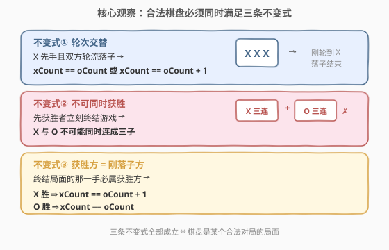
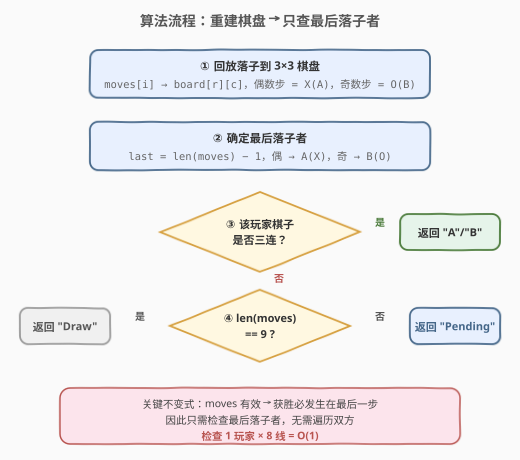
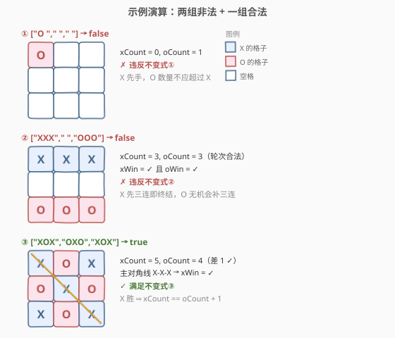

# LeetCode 找出井字棋的获胜者 题解

## 1. 题目概述

- **标题 / 题号**：找出井字棋的获胜者（#1275，easy）
- **链接**：https://leetcode.cn/problems/find-winner-on-a-tic-tac-toe-game/
- **难度**：简单
- **标签**：数组、模拟、数学

**题意**：井字棋在 $3 \times 3$ 棋盘上进行：玩家 `A` 先手用 `'X'`，玩家 `B` 后手用 `'O'`，轮流落在空格。当 **3 个相同棋子排成一条直线**（行 / 列 / 对角线）时游戏结束并产生获胜者；若 9 格放满仍无人获胜则为平局。

给定落子序列 `moves`，`moves[i] = [rowi, coli]` 表示第 $i$ 步落子位置（$i$ 从 $0$ 开始，**偶数步为 `A`，奇数步为 `B`**）。返回：

- 若有获胜者 → `"A"` 或 `"B"`
- 若平局（棋盘满且无赢家）→ `"Draw"`
- 若游戏未结束（棋盘未满且无赢家）→ `"Pending"`

题目保证 `moves` 都有效（遵循井字棋规则：**一旦有人获胜就不再落子**）。

**示例 1**：

```text
输入：moves = [[0,0],[2,0],[1,1],[2,1],[2,2]]
输出："A"
解释：A 的第 3 步落在 (2,2)，主对角线 (0,0)-(1,1)-(2,2) 三连 X，A 获胜。
棋盘：
  X |   |  
    | X |  
  O | O | X
```

**示例 2**：

```text
输入：moves = [[0,0],[1,1],[0,1],[0,2],[1,0],[2,0]]
输出："B"
解释：B 的第 3 步落在 (2,0)，副对角线 (0,2)-(1,1)-(2,0) 三连 O，B 获胜。
棋盘：
  X | X | O
  X | O |  
  O |   |  
```

**示例 3**：

```text
输入：moves = [[0,0],[1,1],[2,0],[1,0],[1,2],[2,1],[0,1],[0,2],[2,2]]
输出："Draw"
解释：9 步落满，无三连，平局。
棋盘：
  X | X | O
  O | O | X
  X | O | X
```

**约束**：

- $1 \le \text{moves.length} \le 9$
- $\text{moves[i].length} = 2$
- $0 \le \text{moves[i][j]} \le 2$
- `moves` 里没有重复元素
- `moves` 遵循井字棋的规则

> 💡 **关键信号**：棋盘固定 $3 \times 3$，获胜线固定 8 条，`moves` 最多 9 步。直接模拟重建棋盘即可。但题目额外保证「moves 有效」——一旦有人获胜游戏立即停止，这提供了一个**只查最后落子者**的优化切入点。

## 2. 解题思路

### 2.1 暴力思路：重建棋盘 + 逐线检查双方

最直观的做法：开一个 $3 \times 3$ 棋盘，按 `moves` 顺序回放落子（偶数步填 `X`，奇数步填 `O`），然后遍历全部 **8 条获胜线**（3 行 + 3 列 + 2 对角线），先查 `A` 是否三连，再查 `B` 是否三连。若双方都未获胜，看 `moves` 长度是否为 $9$ 决定 `Draw` 或 `Pending`。

- 回放落子：$O(n)$，$n = \text{moves.length} \le 9$
- 检查 8 条线：$O(1)$（固定 8 条，每条 3 格）
- 总时间 $O(n)$，空间 $O(1)$（棋盘固定 $9$ 格）

数据规模极小，完全能过。但逐一检查双方略有冗余——题目已保证 moves 有效，可以更进一步。

### 2.2 核心观察：获胜者必为最后落子者



关键洞察来自题目约束「moves 遵循井字棋规则」：

> ⚠️ 井字棋规则规定——一旦有 3 子排成直线，**游戏立即结束，不能再落子**。因此 `moves` 序列中若存在获胜者，获胜的那一步**一定是最后一步**。

由此推出：

$$\text{获胜者} = \text{第 } (\text{len}(\text{moves}) - 1) \text{ 步的落子者}$$

最后一步下标 `last = len(moves) - 1`：

- `last` 为偶数 → 最后落子者是 `A`（`X`）→ 只需检查 `X` 是否三连
- `last` 为奇数 → 最后落子者是 `B`（`O`）→ 只需检查 `O` 是否三连

**无需检查另一位玩家**——因为如果对方早已三连，游戏早就结束了，不会有后续落子。

> 💡 **为何这个优化成立？** 本质是利用了「游戏状态机的单调性」：井字棋的合法状态序列中，获胜事件只可能发生在序列末尾。把「检查双方」简化为「检查一方」，是「**有效输入蕴含更强不变式**」的典型应用。面试中先讲暴力法建立直觉，再点出这个不变式，展示对题目约束的深度利用。

### 2.3 算法流程图



流程说明：

1. **回放落子**：遍历 `moves`，偶数步 `board[r][c] = 'X'`，奇数步 `board[r][c] = 'O'`
2. **确定最后落子者**：`last = len(moves) - 1`，偶数 → `A`/`X`，奇数 → `B`/`O`
3. **检查该玩家三连**：遍历 8 条获胜线，看是否全为该玩家棋子
4. **判定结果**：
   - 三连成立 → 返回该玩家（`"A"` / `"B"`）
   - 否则 → `len(moves) == 9` ? `"Draw"` : `"Pending"`

### 2.4 示例演算



以示例 1 `moves = [[0,0],[2,0],[1,1],[2,1],[2,2]]` 为例：

| 步骤 | 落子者 | 位置 | 棋子 | 棋盘状态 | 说明 |
|------|--------|------|------|----------|------|
| 0 | A | (0,0) | X | `X _ _ / _ _ _ / _ _ _` | A 首手占角 |
| 1 | B | (2,0) | O | `X _ _ / _ _ _ / O _ _` | B 占底边角 |
| 2 | A | (1,1) | X | `X _ _ / _ X _ / O _ _` | A 占中心，埋对角线 |
| 3 | B | (2,1) | O | `X _ _ / _ X _ / O O _` | B 底行连二 |
| 4 | A | (2,2) | X | `X _ _ / _ X _ / O O X` | A 落 (2,2)，主对角线三连 → **A 胜** |

最后一步 `last = 4`（偶数）→ 落子者为 `A`。检查 `X` 的三连：主对角线 $(0,0)$-$(1,1)$-$(2,2)$ 全为 `X` ✓ → 返回 `"A"`。

> 💡 注意第 3 步后 B 的底行已有两连 `(2,0)`-$(2,1)$，A 必须在 (2,2) 既完成自己的对角线三连、又封堵 B 的底行——这一步同时是**制胜步**。若 A 没走 (2,2) 而走别处，B 下一步就能在 (2,2) 三连获胜。

## 3. 参考代码

### 方法一：重建棋盘 + 只查最后落子者（推荐）

### C++

```cpp
class Solution {
  public:
    string tictactoe(vector<vector<int>>& moves) {
        vector<string> g(3, string(3, ' '));
        for (int i = 0; i < (int)moves.size(); ++i)
            g[moves[i][0]][moves[i][1]] = (i % 2 == 0) ? 'X' : 'O';

        int last = (int)moves.size() - 1;
        char c = (last % 2 == 0) ? 'X' : 'O';
        if (win(g, c)) return (c == 'X') ? "A" : "B";
        return (int)moves.size() == 9 ? "Draw" : "Pending";
    }
  private:
    bool win(const vector<string>& g, char c) {
        for (int i = 0; i < 3; ++i) {
            if (g[i][0] == c && g[i][1] == c && g[i][2] == c) return true;
            if (g[0][i] == c && g[1][i] == c && g[2][i] == c) return true;
        }
        if (g[0][0] == c && g[1][1] == c && g[2][2] == c) return true;
        if (g[0][2] == c && g[1][1] == c && g[2][0] == c) return true;
        return false;
    }
};
```

### Python

```python
class Solution:
    def tictactoe(self, moves: List[List[int]]) -> str:
        g = [[' '] * 3 for _ in range(3)]
        for i, (r, c) in enumerate(moves):
            g[r][c] = 'X' if i % 2 == 0 else 'O'

        last = len(moves) - 1
        c = 'X' if last % 2 == 0 else 'O'
        if self._win(g, c):
            return 'A' if c == 'X' else 'B'
        return 'Draw' if len(moves) == 9 else 'Pending'

    def _win(self, g, c):
        for i in range(3):
            if g[i][0] == g[i][1] == g[i][2] == c:
                return True
            if g[0][i] == g[1][i] == g[2][i] == c:
                return True
        if g[0][0] == g[1][1] == g[2][2] == c:
            return True
        if g[0][2] == g[1][1] == g[2][0] == c:
            return True
        return False
```

> 💡 **核心要点**：回放棋盘后只检查最后落子者，利用「moves 有效 → 获胜必在末步」这一不变式，把双玩家检查简化为单玩家检查。

### 方法二：重建棋盘 + 逐线检查双方（通用，不依赖 moves 有效性假设）

### C++

```cpp
class Solution {
  public:
    string tictactoe(vector<vector<int>>& moves) {
        vector<string> g(3, string(3, ' '));
        for (int i = 0; i < (int)moves.size(); ++i)
            g[moves[i][0]][moves[i][1]] = (i % 2 == 0) ? 'X' : 'O';

        if (win(g, 'X')) return "A";
        if (win(g, 'O')) return "B";
        return (int)moves.size() == 9 ? "Draw" : "Pending";
    }
  private:
    bool win(const vector<string>& g, char c) {
        for (int i = 0; i < 3; ++i) {
            if (g[i][0] == c && g[i][1] == c && g[i][2] == c) return true;
            if (g[0][i] == c && g[1][i] == c && g[2][i] == c) return true;
        }
        if (g[0][0] == c && g[1][1] == c && g[2][2] == c) return true;
        if (g[0][2] == c && g[1][1] == c && g[2][0] == c) return true;
        return false;
    }
};
```

### Python

```python
class Solution:
    def tictactoe(self, moves: List[List[int]]) -> str:
        g = [[' '] * 3 for _ in range(3)]
        for i, (r, c) in enumerate(moves):
            g[r][c] = 'X' if i % 2 == 0 else 'O'

        if self._win(g, 'X'):
            return 'A'
        if self._win(g, 'O'):
            return 'B'
        return 'Draw' if len(moves) == 9 else 'Pending'

    def _win(self, g, c):
        for i in range(3):
            if g[i][0] == g[i][1] == g[i][2] == c:
                return True
            if g[0][i] == g[1][i] == g[2][i] == c:
                return True
        if g[0][0] == g[1][1] == g[2][2] == c:
            return True
        if g[0][2] == g[1][1] == g[2][0] == c:
            return True
        return False
```

> ⚠️ 方法二不依赖「moves 有效」的假设，对任意棋盘都能正确判定。若输入可能含非法序列（如对方早已获胜却继续落子），方法二仍能返回先获胜者，而方法一会误判。本题保证 moves 有效，两法等价。

## 4. 复杂度分析

| 维度 | 方法一（只查最后落子者） | 方法二（逐线查双方） |
|------|-------------------------|----------------------|
| 时间复杂度 | $O(n)$ | $O(n)$ |
| 空间复杂度 | $O(1)$ | $O(1)$ |

其中 $n = \text{moves.length} \le 9$。

- **回放落子**：两法均遍历 `moves` 一次，$O(n)$。
- **胜负检查**：棋盘固定 $3 \times 3$，获胜线固定 8 条。方法一检查 1 个玩家（最多 8 条线），方法二检查 2 个玩家（最多 16 条线），均为 $O(1)$。
- **空间**：棋盘 $3 \times 3 = 9$ 格，常数空间。

> 💡 本题 $n \le 9$，两种方法都是纳秒级。方法一的优势不在性能而在**思维**——展示如何利用题目约束（moves 有效）提炼不变式，简化判定逻辑。

## 5. 扩展：不建棋盘，直接用坐标集合判定

重建 $3 \times 3$ 棋盘已是 $O(1)$ 空间，但若追求**零额外结构**，可直接在 `moves` 上判定最后落子者是否三连：

1. 收集最后落子者的所有坐标（下标同奇偶的那些 `moves[i]`）
2. 预定义 8 条获胜线的坐标集合
3. 检查是否有某条获胜线是该玩家坐标集合的子集

```cpp
class Solution {
  public:
    string tictactoe(vector<vector<int>>& moves) {
        int n = moves.size();
        int last = n - 1;
        // 收集最后落子者的所有坐标
        set<pair<int,int>> pts;
        for (int i = last % 2; i < n; i += 2)
            pts.insert({moves[i][0], moves[i][1]});

        // 8 条获胜线
        vector<vector<pair<int,int>>> lines = {
            {{0,0},{0,1},{0,2}}, {{1,0},{1,1},{1,2}}, {{2,0},{2,1},{2,2}},
            {{0,0},{1,0},{2,0}}, {{0,1},{1,1},{2,1}}, {{0,2},{1,2},{2,2}},
            {{0,0},{1,1},{2,2}}, {{0,2},{1,1},{2,0}}
        };
        for (auto& ln : lines) {
            bool ok = true;
            for (auto& p : ln) if (!pts.count(p)) { ok = false; break; }
            if (ok) return (last % 2 == 0) ? "A" : "B";
        }
        return n == 9 ? "Draw" : "Pending";
    }
};
```

> ⚠️ 此法用 `set` 反而比建棋盘多 $O(\log n)$ 查找开销，仅作思路展示。实际比赛中建棋盘最简洁。这种「坐标集合 ⊇ 获胜线集合」的判定方式可推广到 [348. 设计井字棋](https://leetcode.cn/problems/design-tic-tac-toe/) 的 $n \times n$ 变体。

## 6. 面试要点

1. **为什么只需检查最后落子者？**

   题目保证 `moves` 遵循井字棋规则——一旦有人获胜游戏立即停止。所以若存在获胜者，获胜的那一步必为 `moves` 的最后一步。最后一步下标 `last = len(moves) - 1`，奇偶性决定落子者（偶→A，奇→B），只需检查该玩家是否三连。

2. **8 条获胜线如何枚举？**

   3 行（每行 3 格横向）+ 3 列（每列 3 格纵向）+ 2 对角线（主对角 $(0,0)$-$(1,1)$-$(2,2)$、副对角 $(0,2)$-$(1,1)$-$(2,0)$），共 8 条。代码中可用两层循环处理行列，再单独写两条对角线，或预定义坐标数组统一遍历。

3. **如何区分 Draw 和 Pending？**

   无人获胜时，看 `moves` 长度：等于 $9$ 说明棋盘已满 → `"Draw"`；小于 $9$ 说明仍有空格 → `"Pending"`。注意题目保证 moves 有效，所以不会出现「棋盘满却有人刚获胜」的矛盾状态。

4. **方法一和方法二的适用边界？**

   方法一依赖「moves 有效」的假设——若输入可能含非法序列（对方早已获胜却继续落子），方法一可能误判（最后落子者未获胜，但先前的玩家已获胜却被忽略）。方法二检查双方，对任意棋盘都正确。本题保证 moves 有效，两法等价；面试中可先讲方法二（稳健），再优化到方法一（利用约束）。

5. **如果棋盘扩展到 $n \times n$（$n$ 连获胜）怎么做？**

   见 [348. 设计井字棋](https://leetcode.cn/problems/design-tic-tac-toe/)：不必每次遍历整条线，而是为每行 / 每列 / 每条对角维护**计数器**（玩家 A 的棋子数减 B 的棋子数），每次落子更新对应行、列、两条对角的计数，达到 $\pm n$ 即判定胜负。单次 `move` 判定 $O(1)$，空间 $O(n)$。

## 同类练习题

| # | 题目 | 与本题的关联 |
|---|------|-------------|
| 794 | [有效的井字棋状态](https://leetcode.cn/problems/valid-tic-tac-toe-state/) | 判断给定棋盘是否为合法井字棋状态（X/O 计数差校验 + 获胜互斥校验），本题的逆向验证 |
| 348 | [设计井字棋](https://leetcode.cn/problems/design-tic-tac-toe/) | $n \times n$ 井字棋设计题，每次 `move` 后即时判定胜负（行/列/对角计数器，单次 $O(1)$） |
| 36 | [有效的数独](https://leetcode.cn/problems/valid-sudoku/) | 网格合法性校验（行/列/宫三维度去重），与井字棋获胜线检查同属「固定维度枚举校验」范式 |
| 1603 | [设计停车系统](https://leetcode.cn/problems/design-parking-system/) | 另一种小型状态机模拟设计，对照「固定小规模状态 + 简单计数」的设计模式 |
