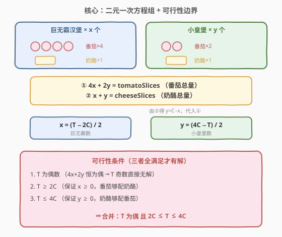
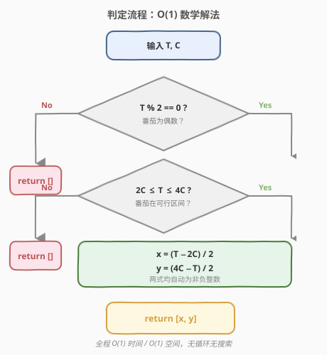
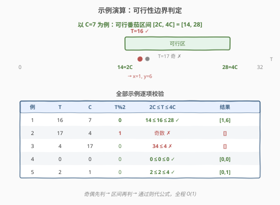

# LeetCode 不浪费原料的汉堡制作方案 题解

## 1. 题目概述

- **标题 / 题号**：不浪费原料的汉堡制作方案（#1276，medium）
- **链接**：https://leetcode.cn/problems/number-of-burgers-with-no-waste-of-ingredients/
- **难度**：中等
- **标签**：数学

**题意**：给定两个整数 `tomatoSlices`（番茄片数）和 `cheeseSlices`（奶酪片数），两种汉堡的原料配比为：

- **巨无霸汉堡**：4 片番茄 + 1 片奶酪
- **小皇堡**：2 片番茄 + 1 片奶酪

要求以 `[巨无霸数, 小皇堡数]` 的格式返回一种制作方案，使番茄与奶酪**恰好全部用完**（剩余均为 0）；若无法做到则返回 `[]`。

**示例 1**：

```text
输入：tomatoSlices = 16, cheeseSlices = 7
输出：[1,6]
解释：1 个巨无霸 + 6 个小皇堡 = 4×1 + 2×6 = 16 片番茄，1 + 6 = 7 片奶酪，恰好用完。
```

**示例 2**：

```text
输入：tomatoSlices = 17, cheeseSlices = 4
输出：[]
解释：番茄为奇数，而每种汉堡的番茄用量都是偶数，不可能凑出奇数。
```

**示例 3**：

```text
输入：tomatoSlices = 4, cheeseSlices = 17
输出：[]
解释：17 片奶酪至少需要 2×17 = 34 片番茄，番茄远远不够。
```

**约束**：

- `0 <= tomatoSlices <= 10^7`
- `0 <= cheeseSlices <= 10^7`

> 💡 **两种汉堡、两种原料、恰好用完**——这是典型的「二元一次方程组」结构：2 个未知数 + 2 个独立约束，存在唯一解，只需判定解是否为非负整数。

## 2. 解题思路

### 2.1 暴力思路

枚举巨无霸个数 $x$ 从 $0$ 到 $cheeseSlices$（汉堡总数不超过奶酪片数），对每个 $x$ 令 $y = cheeseSlices - x$，验证 $4x + 2y$ 是否等于 $tomatoSlices$。时间 $O(C)$，$C$ 可达 $10^7$，虽勉强可过，但完全没必要——这其实是一个可直接求解的线性方程组。

### 2.2 核心观察：列方程直接求解



设巨无霸 $x$ 个、小皇堡 $y$ 个，由原料配比得方程组（记 $T = tomatoSlices$，$C = cheeseSlices$）：

$$
\begin{cases}
4x + 2y = T \quad \text{（番茄总量）}\\
x + y = C \quad \text{（奶酪总量）}
\end{cases}
$$

由②得 $y = C - x$，代入①：

$$
4x + 2(C - x) = T \;\Rightarrow\; 2x = T - 2C \;\Rightarrow\; x = \frac{T - 2C}{2}
$$

$$
y = C - x = \frac{4C - T}{2}
$$

**可行性条件**（$x$、$y$ 必须是非负整数）：

1. **$T$ 为偶数**：$4x + 2y$ 恒为偶数，故 $T$ 为奇数必无解；
2. **$T \ge 2C$**：保证 $x \ge 0$（每个奶酪至少配 2 片番茄）；
3. **$T \le 4C$**：保证 $y \ge 0$（每个奶酪至多配 4 片番茄）。

> 💡 **区间直觉**：每个奶酪片**至少**消耗 2 片番茄（全做小皇堡）、**至多**消耗 4 片番茄（全做巨无霸），所以番茄总数必须落在 $[2C, 4C]$ 内；又因番茄总是成对消耗，$T$ 还须为偶数。三条合并即「$T$ 为偶 且 $2C \le T \le 4C$」。

> ⚠️ **整数性已隐含**：$2C$ 恒为偶数，故 $T - 2C$ 与 $T$ 同奇偶；$T$ 为偶数时 $x$、$y$ 自动为整数，无需单独判定。

### 2.3 算法流程图



1. 若 `T % 2 != 0`，返回 `[]`
2. 若不满足 `2 * C <= T <= 4 * C`，返回 `[]`
3. 计算 `x = (T - 2 * C) // 2`，`y = (4 * C - T) // 2`
4. 返回 `[x, y]`

### 2.4 示例演算



| 示例 | T | C | T%2 | 2C≤T≤4C | 结果 |
|------|---|---|-----|---------|------|
| 1 | 16 | 7 | 0 | 14≤16≤28 ✓ | [1,6] |
| 2 | 17 | 4 | 1 | 奇数 ✗ | [] |
| 3 | 4 | 17 | 0 | 34≤4 ✗ | [] |
| 4 | 0 | 0 | 0 | 0≤0≤0 ✓ | [0,0] |
| 5 | 2 | 1 | 0 | 2≤2≤4 ✓ | [0,1] |

> 💡 示例 2 中 $T=17$ 为奇数，第一个判定即被拦下；示例 3 中番茄太少（$4 < 2\times17=34$），连全做小皇堡所需的最低番茄量都达不到，故无解。

## 3. 参考代码

### C++

```cpp
class Solution {
  public:
    vector<int> numOfBurgers(int tomatoSlices, int cheeseSlices) {
        if (tomatoSlices % 2 != 0) return {};
        if (tomatoSlices < 2 * cheeseSlices) return {};
        if (tomatoSlices > 4 * cheeseSlices) return {};
        int x = (tomatoSlices - 2 * cheeseSlices) / 2;
        int y = (4 * cheeseSlices - tomatoSlices) / 2;
        return {x, y};
    }
};
```

### Python

```python
class Solution:
    def numOfBurgers(self, tomatoSlices: int, cheeseSlices: int) -> List[int]:
        if tomatoSlices % 2 != 0:
            return []
        if not (2 * cheeseSlices <= tomatoSlices <= 4 * cheeseSlices):
            return []
        x = (tomatoSlices - 2 * cheeseSlices) // 2
        y = (4 * cheeseSlices - tomatoSlices) // 2
        return [x, y]
```

## 4. 复杂度分析

| 维度 | 复杂度 | 说明 |
|------|--------|------|
| 时间 | $O(1)$ | 仅几次算术运算与比较，无循环无搜索 |
| 空间 | $O(1)$ | 只用常数个变量 |

> 💡 暴力枚举为 $O(C)$，数学解法将其降到 $O(1)$，且 $C = 10^7$ 时差距显著。

## 5. 扩展：为什么枚举会退化到 O(C)？

暴力枚举 $x \in [0, C]$ 之所以能 AC，是因为忽略了「两个约束恰好确定唯一解」这一结构。本题是**约束恰足**的典型：2 个未知数 + 2 个独立方程 → 唯一解，只需判定解的合法性（非负整数）。

- 若原料种类增加到 $k$ 种、汉堡种类仍为 2，则方程数变为 $k$ 个（超定），通常无解，需判定相容性；
- 若汉堡种类增加到 $k$ 种、原料仍为 2 种，则方程数少于未知数（欠定），存在多解，需配合优化目标（如最大化某汉堡数）才能定解，此时才需枚举或 DP。

只有当**方程数等于未知数**且方程独立时，才可直接闭式求解——本题正属此列。

## 6. 面试要点

1. **如何想到列方程而不是枚举？**

   - 看到「两种物品 + 两种总量约束 + 恰好用完」即可识别为二元一次方程组。每多一种原料就多一个方程，约束数等于未知数时直接解，无需搜索。

2. **三个判定条件的直观含义？**

   - $T$ 偶数 ↔ 番茄成对消耗；$T \ge 2C$ ↔ 全做小皇堡也用得完番茄（$x \ge 0$）；$T \le 4C$ ↔ 全做巨无霸也不缺番茄（$y \ge 0$）。

3. **$T$ 为偶数是否等价于 $x$、$y$ 为整数？**

   - 是。因 $2C$ 恒为偶数，$T - 2C$ 的奇偶性等于 $T$；$T$ 偶 $\Rightarrow$ $T - 2C$ 偶 $\Rightarrow$ $x$、$y$ 均为整数，无需额外取整判定。

4. **判定顺序能否调整？**

   - 三条条件互相独立，顺序不影响正确性。先判奇偶是因为它最廉价（一次取模）且能早早拦下如 $T=17$ 这类用例。

5. **边界用例有哪些？**

   - $T=C=0 \to [0,0]$；$T=2,C=1 \to [0,1]$（全小皇堡）；$T=4,C=1 \to [1,0]$（全巨无霸）；$C=0$ 但 $T>0 \to []$（无奶酪却有多余番茄）。

## 同类练习题

| # | 题目 | 与本题的关联 |
|---|------|-------------|
| 1253 | [重构 2 行二进制矩阵](https://leetcode.cn/problems/reconstruct-a-2-row-binary-matrix/)（[题解](../1201-1300/1253_重构2行二进制矩阵.md)） | 同为「给定列总和与上下界，求一组合法解，无解返回 `[]`」，可行性 + 边界判定的姊妹题 |
| 1247 | [交换字符使得字符串相同](https://leetcode.cn/problems/minimum-swaps-to-make-strings-equal/)（[题解](../1201-1300/1247_交换字符使得字符串相同.md)） | 先做奇偶性可行性判定，无解返回 −1，有解再算最小操作数，同属「数学性质定可行性」 |
| 1250 | [检查好数组](https://leetcode.cn/problems/check-if-it-is-a-good-array/)（[题解](../1201-1300/1250_检查好数组.md)） | 数论可行性判定（裴蜀定理，整体 gcd 是否为 1），对照「用数学不变量判可行」 |
| 1262 | [可被三整除的最大和](https://leetcode.cn/problems/greatest-sum-divisible-by-three/)（[题解](../1201-1300/1262_可被三整除的最大和.md)） | 以模 3 不变量为核心，可行性 + 最值，对照「用模运算性质剪枝」 |
