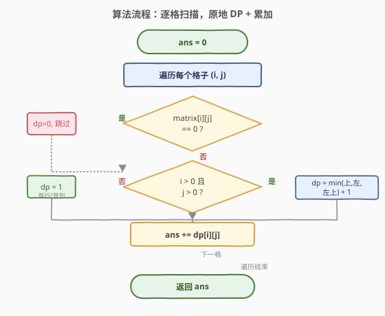
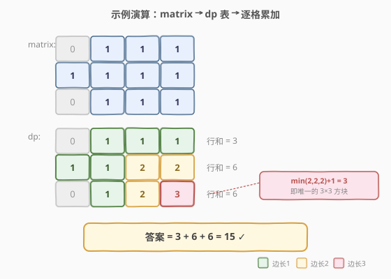

# LeetCode 统计全为 1 的正方形子矩阵 题解

## 1. 题目概述

- **标题 / 题号**：统计全为 1 的正方形子矩阵（#1277，medium）
- **链接**：https://leetcode.cn/problems/count-square-submatrices-with-all-ones/
- **难度**：中等
- **标签**：数组、动态规划、矩阵

**题意**：给你一个 `m * n` 的矩阵，矩阵中的元素不是 `0` 就是 `1`，请你统计并返回其中**完全由 `1` 组成的正方形子矩阵**的个数。

**示例 1**：

```text
输入：matrix =
[
  [0,1,1,1],
  [1,1,1,1],
  [0,1,1,1]
]
输出：15
解释：
边长为 1 的正方形有 10 个。
边长为 2 的正方形有 4 个。
边长为 3 的正方形有 1 个。
总数 = 10 + 4 + 1 = 15。
```

**示例 2**：

```text
输入：matrix =
[
  [1,0,1],
  [1,1,0],
  [1,1,0]
]
输出：7
解释：
边长为 1 的正方形有 6 个。
边长为 2 的正方形有 1 个。
总数 = 6 + 1 = 7。
```

**约束**：

- `1 <= m, n <= 300`
- `matrix[i][j]` 为 `0` 或 `1`

> 💡 **正方形 = 边长 × 边长**：子矩阵必须长宽相等才叫「正方形」。所以问题不是「数全 1 矩形」（那是 1504），而是按边长 $k=1,2,\dots,\min(m,n)$ 分别统计全 1 的 $k \times k$ 方块再求和。

## 2. 解题思路

### 2.1 暴力思路

枚举所有正方形：固定左上角 $(i,j)$，再枚举边长 $k=1,2,\dots$，每次检查 $k \times k$ 区域是否全为 1。检查本身 `O(k²)`，总复杂度 `O(m·n·min(m,n)²)`，在 `300×300` 下约 $8\times10^9$，超时。

加前缀和优化可把「区域是否全 1」降到 `O(1)`，总复杂度 `O(m·n·min(m,n))`，仍可能到 $2.7\times10^7$，勉强可过但不够优雅。

### 2.2 核心观察：以右下角为锚的 DP

![核心观察：dp[i][j] = 以 (i,j) 为右下角的全 1 正方形个数](../images/countsquares_concept.svg)

定义 `dp[i][j]` 为**以 `(i,j)` 为右下角的全 1 正方形的最大边长**。这与 [221. 最大正方形](https://leetcode.cn/problems/maximal-square/) 的状态定义完全一致，转移方程也相同：

$$
\texttt{dp}[i][j] = \begin{cases} 0 & \text{若 } \texttt{matrix}[i][j] = 0 \\ \min(\texttt{dp}[i-1][j],\ \texttt{dp}[i][j-1],\ \texttt{dp}[i-1][j-1]) + 1 & \text{若 } \texttt{matrix}[i][j] = 1 \end{cases}
$$

> 💡 **为什么取三者最小值 +1？** 要让以 `(i,j)` 为右下角的 $k \times k$ 方块全 1，它的三个「邻居方块」必须都至少是 $k-1$ 大：**上方** `(i-1,j)`、**左方** `(i,j-1)`、**左上** `(i-1,j-1)` 分别能撑起边长 $k-1$ 的全 1 正方形。三者取最小就是「三者共同能保证的最大 $k-1$」，再加 1（把 `(i,j)` 自己这一格拼上去）。

**本题的关键一步——把「最大边长」复用为「个数」**：

> ⚠️ **核心转化**：若 `dp[i][j] = t`，则以 `(i,j)` 为右下角的**全 1 正方形恰好有 $t$ 个**——边长分别为 $1, 2, \dots, t$。

道理很直观：既然最大能撑到边长 $t$，那么边长 $1, 2, \dots, t$ 的正方形都「包含在」这个最大方块里，必然全 1。所以：

$$
\text{答案} = \sum_{i,j} \texttt{dp}[i][j]
$$

一次遍历边算边累加即可，无需再按边长分类计数。

### 2.3 算法流程图



1. 初始化 `ans = 0`，`dp` 与 `matrix` 同形（首行首列直接等于 `matrix[i][j]`）。
2. 遍历每个格子 `(i, j)`：
   - 若 `matrix[i][j] == 0`：`dp[i][j] = 0`。
   - 否则（在范围内）`dp[i][j] = min(dp[i-1][j], dp[i][j-1], dp[i-1][j-1]) + 1`；首行或首列 `dp[i][j] = 1`。
   - `ans += dp[i][j]`。
3. 返回 `ans`。

### 2.4 示例演算

以示例 1 的矩阵演示 `dp` 表与累加过程：



`matrix` 与 `dp` 表对照（`dp[i][j]` 即该格贡献的正方形个数）：

| matrix 行 | matrix | → | dp | dp 求和 |
|-----------|--------|---|----|---------|
| 第 0 行 | `[0,1,1,1]` | → | `[0,1,1,1]` | 3 |
| 第 1 行 | `[1,1,1,1]` | → | `[1,1,2,2]` | 6 |
| 第 2 行 | `[0,1,1,1]` | → | `[0,1,2,3]` | 6 |

逐格累加 `dp`：$3 + 6 + 6 = 15$，与示例一致。

> 💡 **看第 2 行第 3 列**：`matrix[2][3]=1`，三个邻居 `dp[1][3]=2`、`dp[2][2]=2`、`dp[1][2]=2`，取最小 2 再 +1 = 3，表示以该格为右下角有 3 个正方形（边长 1/2/3）。这就是那个唯一的 $3\times3$ 方块。

## 3. 参考代码

### C++

```cpp
class Solution {
  public:
    int countSquares(vector<vector<int>>& matrix) {
        int m = matrix.size(), n = matrix[0].size();
        int ans = 0;
        for (int i = 0; i < m; ++i) {
            for (int j = 0; j < n; ++j) {
                if (matrix[i][j] == 0) {
                    continue; // dp[i][j] 保持 0，不贡献
                }
                if (i > 0 && j > 0) {
                    matrix[i][j] = min({matrix[i - 1][j], matrix[i][j - 1],
                                        matrix[i - 1][j - 1]}) + 1;
                }
                ans += matrix[i][j];
            }
        }
        return ans;
    }
};
```

### Python

```python
class Solution:
    def countSquares(self, matrix: List[List[int]]) -> int:
        m, n = len(matrix), len(matrix[0])
        ans = 0
        for i in range(m):
            for j in range(n):
                if matrix[i][j] == 0:
                    continue
                if i > 0 and j > 0:
                    matrix[i][j] = min(matrix[i - 1][j], matrix[i][j - 1],
                                       matrix[i - 1][j - 1]) + 1
                ans += matrix[i][j]
        return ans
```

> ⚠️ **原地修改**：上面代码直接把 `matrix` 当作 `dp` 表复用——`matrix[i][j]==0` 时跳过保持 0，`==1` 时覆写为 `dp` 值。因为 `dp` 只依赖左、上、左上三个已处理格子，覆写不影响后续读取。若要求保留原矩阵，另开 `dp` 数组即可，空间 `O(m·n)`。

## 4. 复杂度分析

| 方法 | 时间复杂度 | 空间复杂度 | 说明 |
|------|-----------|-----------|------|
| 暴力 + 前缀和 | `O(m·n·min(m,n))` | `O(m·n)` | 按边长枚举，前缀和查区域和 |
| DP（原地） | `O(m·n)` | `O(1)` | 一次遍历，原地复用 matrix |
| DP（另开表） | `O(m·n)` | `O(m·n)` | 不破坏原矩阵，逻辑更清晰 |

> 💡 DP 法把「按边长分类统计」压缩成「一次扫描累加」，时间从立方级降到平方级，是本题的最优解。

## 5. 扩展：与 221 最大正方形的关系

[221. 最大正方形](https://leetcode.cn/problems/maximal-square/) 与本题共享同一个 `dp` 状态和转移方程，区别仅在**聚合方式**：

| 题目 | 状态 `dp[i][j]` | 答案 |
|------|-----------------|------|
| 221 最大正方形 | 以 `(i,j)` 为右下角的最大全 1 正方形边长 | $\max_{i,j} \texttt{dp}[i][j]$（再平方得面积） |
| 1277 统计正方形 | 同上 | $\sum_{i,j} \texttt{dp}[i][j]$ |

即 221 取 `max`，1277 取 `sum`。掌握 221 后，1277 只需把「取最大」换成「逐格累加」即可。

> 💡 **为什么 `dp[i][j]=t` 恰好等于以该格为右下角的正方形个数？** 因为「最大边长 $t$」隐含了边长 $1\sim t$ 的方块都全 1（小方块是大方块的子区域）。这是一种**「最大值即计数」**的技巧，在「统计某种形状的子结构个数」类 DP 中常见——定义「以某点为端点的最大合法结构大小」，该值同时就是「以该点为端点的合法结构个数」。

## 6. 面试要点

1. **为什么 `dp[i][j]` 等于以该格为右下角的正方形个数？**

   - `dp[i][j] = t` 表示最大全 1 正方形边长为 $t$。那么边长 $1, 2, \dots, t$ 的正方形都嵌在其中、必然全 1，共 $t$ 个。所以「最大边长」天然等于「个数」，无需额外按边长分类计数。

2. **转移方程为什么取三个邻居的最小值？**

   - 要拼出边长 $k$ 的正方形，需保证上、左、左上三个方向都能撑起边长 $k-1$ 的全 1 方块。三者最小值就是「共同保证」的上限，加 1 得到 $k$。若任一邻居不足 $k-1$，该方向就会漏出 0，方块断裂。

3. **首行首列如何处理？**

   - 首行 `i=0` 或首列 `j=0` 的格子没有左/上/左上邻居，`dp[i][j] = matrix[i][j]`（本身是 1 则最大边长 1，是 0 则 0）。代码中用 `if (i>0 && j>0)` 判断，否则直接取原值 1 参与累加。

4. **能否原地修改 `matrix`？安全吗？**

   - 可以。`dp[i][j]` 只依赖 `dp[i-1][j]`、`dp[i][j-1]`、`dp[i-1][j-1]`，这三格在扫描到 `(i,j)` 时已计算完毕，覆写 `matrix[i][j]` 不会影响后续读取。注意 `matrix[i][j]==0` 时跳过（保持 0），只在 `==1` 时覆写。

5. **本题与 221 最大正方形的区别？**

   - 状态与转移完全相同，区别只在答案聚合：221 取 `max(dp)` 再平方得面积，1277 取 `sum(dp)` 得个数。面试中常把两题放一起问，考察对同一 DP 模型不同聚合方式的理解。

## 同类练习题

| # | 题目 | 与本题的关联 |
|---|------|-------------|
| 221 | [最大正方形](https://leetcode.cn/problems/maximal-square/) | 与 1277 共享同一 `dp` 状态转移，区别仅在取 `max` vs 取 `sum`，掌握一个即掌握两个 |
| 1139 | [最大的以 1 为边界的正方形](https://leetcode.cn/problems/largest-1-bordered-square/) | 变体——正方形边界为 1（内部可 0），需用前缀和查边框，与 1277 的「全 1 内部」对照 |
| 1504 | [统计全 1 子矩形](https://leetcode.cn/problems/count-submatrices-with-all-ones/) | 统计全 1 **矩形**（非正方形），用单调栈按行枚举高度，是 1277 的「矩形版」进阶 |
| 1727 | [重新排列后的最大子矩阵](https://leetcode.cn/problems/largest-submatrix-with-rearrangements/) | 允许重排列，按高度排序后贪心枚举，与 1504 的单调栈思路呼应 |
| 62 | [不同路径](https://leetcode.cn/problems/unique-paths/)（[题解](../0001-0100/62_不同路径.md)） | 同为二维网格 DP，转移依赖上方与左方，对照「二维 DP 从邻居聚合」的基本范式 |
