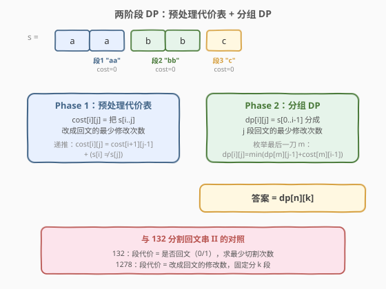
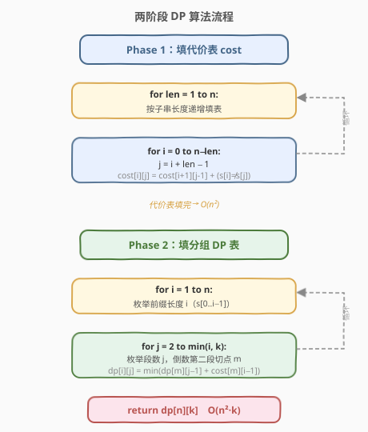
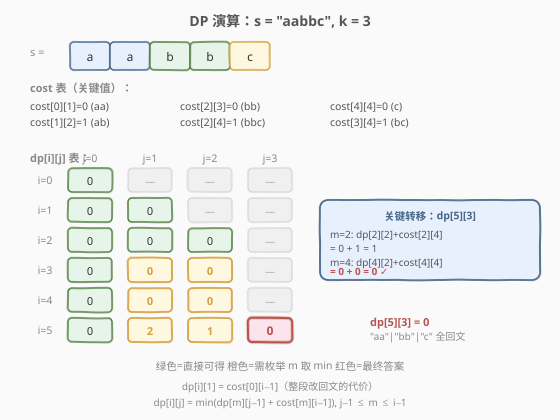

# LeetCode 分割回文串 III 题解

## 1. 题目概述

- **标题 / 题号**：分割回文串 III（#1278，hard）
- **链接**：https://leetcode.cn/problems/palindrome-partitioning-iii/
- **难度**：困难
- **标签**：字符串、动态规划、区间 DP

**题意**：给你一个由小写字母组成的字符串 `s`，和一个整数 `k`。你可以将 `s` 中的部分字符修改为其他小写英文字母，然后需要把 `s` 分割成 `k` 个非空且不相交的子串，并且**每个子串都是回文串**。请返回以这种方式分割字符串所需**修改的最少字符数**。

**示例 1**：

```text
输入：s = "abc", k = 2
输出：1
解释：把字符串分割成 "ab" 和 "c"，并修改 "ab" 中的 1 个字符（如 a→b 得 "bb"），将它变成回文串。
```

**示例 2**：

```text
输入：s = "aabbc", k = 3
输出：0
解释：把字符串分割成 "aa"、"bb" 和 "c"，它们都是回文串，无需修改。
```

**示例 3**：

```text
输入：s = "leetcode", k = 8
输出：0
解释：每个字符单独成段，长度为 1 的串天然回文，无需修改。
```

**约束**：

- `1 <= k <= s.length <= 100`
- `s` 中只含有小写英文字母

> 💡 **与 132 分割回文串 II 的关系**：132 求最少**切割次数**使每段回文（不修改字符）；1278 允许**修改字符**使每段回文，且**段数固定为 k**，求最少修改次数。两者都是「预处理 + 分组 DP」范式，但代价函数不同——132 的段代价是 0/1（是否回文），1278 的段代价是**改成回文的最少修改数**。

## 2. 解题思路

### 2.1 暴力思路：枚举所有分割 + 逐段求修改数

长度为 $n$ 的字符串有 $\binom{n-1}{k-1}$ 种分成 $k$ 段的方案（在 $n-1$ 个间隙中选 $k-1$ 个切点）。对每种方案，逐段双指针计算改成回文的最少修改次数。当 $n = 100, k = 50$ 时，组合数 $\binom{99}{49}$ 天文数字，完全不可行。

### 2.2 核心观察：两阶段 DP（预处理代价表 + 分组 DP）



本题与 [132. 分割回文串 II](../0101-0200/132_分割回文串II.md) 同属「**预处理 + 分组 DP**」范式，关键在于把问题拆成两个独立子问题：

> 💡 **核心洞察**：把任意子串 `s[i..j]` 改成回文的最少修改次数，是一个只与 `i, j` 有关的**区间性质**，与如何分割无关。因此可以预处理成表，之后 $O(1)$ 查询。

**Phase 1：预处理代价表** `cost[i][j]`

定义 `cost[i][j]` 为把 `s[i..j]` 改成回文串的最少字符修改次数。递推式：

$$
\text{cost}[i][j] = \text{cost}[i+1][j-1] + \begin{cases} 0 & \text{若 } s[i] = s[j] \\ 1 & \text{若 } s[i] \neq s[j] \end{cases}
$$

- 当 $i \geq j$（单字符或空串）：`cost[i][j] = 0`，天然回文。
- 当 $i < j$：两端字符配对，若相同则无需修改，若不同则修改其一（改 `s[i]` 或 `s[j]` 均可，代价 1），然后递归处理内部子串 `s[i+1..j-1]`。

![代价表 cost[i][j]](../images/palpart3_cost_table.svg)

> ⚠️ **填表顺序**：`cost[i][j]` 依赖 `cost[i+1][j-1]`（更短的子串），因此必须**按子串长度从小到大**填表。代码中可用 $i$ 从 $n-1$ 到 $0$、$j$ 从 $i$ 到 $n-1$ 的双重循环，等价于按长度递增。

**Phase 2：分组 DP** `dp[i][j]`

定义 `dp[i][j]` 为把 `s[0..i-1]` 分成 $j$ 段回文串的**最少修改次数**。转移方程（枚举最后一刀的位置 $m$，使 `s[m..i-1]` 成为第 $j$ 段）：

$$
\text{dp}[i][j] = \min_{j-1 \leq m \leq i-1} \left( \text{dp}[m][j-1] + \text{cost}[m][i-1] \right)
$$

- **基准**：`dp[i][1] = cost[0][i-1]`（整段不切，直接改成回文）。
- **转移**：前 $m$ 个字符分成 $j-1$ 段（`dp[m][j-1]`），剩余 `s[m..i-1]` 作为第 $j$ 段（代价 `cost[m][i-1]`）。
- **答案**：`dp[n][k]`。

> 💡 **为什么「按最后一刀切」？** 这是划分型 DP 的通式——前缀是规模更小的同构子问题（前 $m$ 个分 $j-1$ 组），状态天然归约。与 [132. 分割回文串 II](../0101-0200/132_分割回文串II.md)、[813. 最大平均值和的分组](../0801-0900/813_最大平均值和的分组.md)、[410. 分割数组的最大值](../0401-0500/410_分割数组的最大值.md) 一脉相承。

### 2.3 算法流程图



**Phase 1**（填代价表）：外层按子串长度 `len` 从 1 到 $n$，内层枚举起点 $i$，令 $j = i + \text{len} - 1$，按递推式填 `cost[i][j]`。

**Phase 2**（填分组 DP 表）：外层枚举前缀长度 $i$ 从 1 到 $n$，内层枚举段数 $j$ 从 2 到 $\min(i, k)$，再枚举切点 $m$ 从 $j-1$ 到 $i-1$，取 `dp[m][j-1] + cost[m][i-1]` 的最小值。

### 2.4 示例演算

以 `s = "aabbc", k = 3` 为例，展示完整 DP 填表过程：



**Phase 1** 关键代价值：

| 子串 | cost | 说明 |
|------|------|------|
| `s[0..1]` = "aa" | 0 | 已是回文 |
| `s[1..2]` = "ab" | 1 | a≠b，改其一 |
| `s[2..3]` = "bb" | 0 | 已是回文 |
| `s[3..4]` = "bc" | 1 | b≠c，改其一 |
| `s[2..4]` = "bbc" | 1 | b≠c，内部 cost[3][3]=0 |
| `s[0..4]` = "aabbc" | 2 | a≠c，内部 cost[1][3]=1 |

**Phase 2** 填表（只展示关键行）：

| i | dp[i][1] | dp[i][2] | dp[i][3] | 说明 |
|---|----------|----------|----------|------|
| 1 | 0 | 0 | — | "a" 一段；两段 "a"+"a" 无需改 |
| 2 | 0 | 0 | 0 | "aa" 回文；"a"+"a"；"a"+"a"+"−" |
| 3 | 1 | 0 | — | "aab" 改 1；"aa"+"b"(cost 0) |
| 4 | 2 | 0 | — | "aabb" 改 2；"aa"+"bb"(cost 0) |
| 5 | 2 | 1 | **0** | "aabbc" 改 2；最优两段改 1；最优三段改 0 |

**关键转移** `dp[5][3]`：枚举 $m$（最后一刀的位置）：

| m | dp[m][2] | cost[m][4] | 合计 | 子串分配 |
|---|----------|------------|------|----------|
| 2 | 0 | 1 | 1 | "aa"(0) + "bbc"(1) |
| 3 | 0 | 1 | 1 | "aab"(0→"aa"+"b") + "bc"(1) |
| 4 | 0 | 0 | **0** ✓ | "aabb"(0→"aa"+"bb") + "c"(0) |

$m=4$ 时最优：`dp[4][2] + cost[4][4] = 0 + 0 = 0`，即 `"aa" | "bb" | "c"`，三段全回文，零修改。

$$
\text{答案} = \text{dp}[5][3] = 0 \quad \checkmark
$$

## 3. 参考代码

### C++

```cpp
class Solution {
public:
    int palindromePartition(string s, int k) {
        int n = s.size();
        // Phase 1: 预处理代价表 cost[i][j]
        vector<vector<int>> cost(n, vector<int>(n, 0));
        for (int len = 2; len <= n; ++len) {
            for (int i = 0; i + len - 1 < n; ++i) {
                int j = i + len - 1;
                cost[i][j] = cost[i + 1][j - 1] + (s[i] != s[j] ? 1 : 0);
            }
        }
        // Phase 2: 分组 DP
        vector<vector<int>> dp(n + 1, vector<int>(k + 1, INT_MAX));
        dp[0][0] = 0;
        for (int i = 1; i <= n; ++i) {
            dp[i][1] = cost[0][i - 1];  // 整段不切
            for (int j = 2; j <= min(i, k); ++j) {
                for (int m = j - 1; m <= i - 1; ++m) {
                    dp[i][j] = min(dp[i][j], dp[m][j - 1] + cost[m][i - 1]);
                }
            }
        }
        return dp[n][k];
    }
};
```

### Python

```python
class Solution:
    def palindromePartition(self, s: str, k: int) -> int:
        n = len(s)
        # Phase 1: 预处理代价表
        cost = [[0] * n for _ in range(n)]
        for length in range(2, n + 1):
            for i in range(n - length + 1):
                j = i + length - 1
                cost[i][j] = cost[i + 1][j - 1] + (s[i] != s[j])

        # Phase 2: 分组 DP
        dp = [[float('inf')] * (k + 1) for _ in range(n + 1)]
        dp[0][0] = 0
        for i in range(1, n + 1):
            dp[i][1] = cost[0][i - 1]
            for j in range(2, min(i, k) + 1):
                for m in range(j - 1, i):
                    dp[i][j] = min(dp[i][j], dp[m][j - 1] + cost[m][i - 1])
        return dp[n][k]
```

> 💡 **初始化技巧**：`dp[0][0] = 0` 表示空前缀分成 0 段的代价为 0，是所有转移的逻辑起点。`dp[i][1] = cost[0][i-1]` 直接用代价表填基准，无需额外循环。内层 `m` 从 `j-1` 开始，因为前 $j-1$ 段至少需要 $j-1$ 个字符。

## 4. 复杂度分析

| 维度 | 复杂度 | 说明 |
|------|--------|------|
| 时间复杂度 | $O(n^2 + n^2 \cdot k)$ | Phase 1 填代价表 $O(n^2)$；Phase 2 三重循环 $O(n^2 \cdot k)$ |
| 空间复杂度 | $O(n^2 + n \cdot k)$ | 代价表 `cost` 占 $O(n^2)$；DP 表 `dp` 占 $O(n \cdot k)$ |

> 💡 本题数据范围 $n, k \leq 100$，$O(n^2 \cdot k) \leq 10^6$，完全在时限内。若 $k$ 很大（接近 $n$），时间接近 $O(n^3)$，但 $n \leq 100$ 仍可接受。

## 5. 扩展：分割回文串系列对比

力扣上有四道「分割回文串」系列题，操作语义各不相同但共用回文预处理思想：

| 题号 | 题目 | 目标 | 段数 | 核心方法 |
|------|------|------|------|----------|
| 131 | 分割回文串 | 枚举所有方案 | 任意 | 回溯 + 回文判定 |
| 132 | 分割回文串 II | 最少切割次数 | 任意 | 预处理回文表 + 一维 DP |
| 1278 | 分割回文串 III | 最少修改字符 | 固定 k | 预处理代价表 + 二维分组 DP |
| 1745 | 分割回文串 IV | 能否分成 3 段 | 固定 3 | 预处理回文表 + 双重枚举切点 |

> 💡 **从 132 到 1278 的升级**：132 的段代价是布尔型（`isPal[j][i]` 为 true 即可，代价 0），状态只需一维 `dp[i]`；1278 的段代价是**整型**（改成回文的最少修改数），且段数固定为 $k$，状态升级为二维 `dp[i][j]`。这正是从「分割型 DP」到「分组型 DP」的自然推广——增加了「分成几组」这一维度。

## 6. 面试要点

1. **`cost[i][j]` 的递推式是什么？为什么两端不同时只加 1 而不加 2？**

   - `cost[i][j] = cost[i+1][j-1] + (s[i] != s[j])`。两端不同时，只需修改 `s[i]` 或 `s[j]` **其中一个**使其配对（如 `s[i]` 改成 `s[j]`），代价为 1。不需要两端都改。

2. **`dp[i][j]` 的状态定义和转移方程是什么？**

   - `dp[i][j]` = 把 `s[0..i-1]` 分成 $j$ 段回文串的最少修改次数。
   - 转移：`dp[i][j] = min(dp[m][j-1] + cost[m][i-1])`，$m$ 从 $j-1$ 到 $i-1$。表示前 $m$ 个字符分 $j-1$ 段，`s[m..i-1]` 作为第 $j$ 段。
   - 基准：`dp[i][1] = cost[0][i-1]`。

3. **为什么 $m$ 的下界是 $j-1$ 而不是 0？**

   - 前 $m$ 个字符要分成 $j-1$ 段，每段至少 1 个字符，所以 $m \geq j-1$。同理 $m \leq i-1$（第 $j$ 段至少 1 个字符）。这既是逻辑约束，也起到了剪枝作用。

4. **本题与 132 分割回文串 II 的核心区别是什么？**

   - **段代价**：132 是 0/1（是否回文），1278 是改成回文的最少修改数（区间 DP 预处理）。
   - **段数**：132 段数任意（求最少切割次数），1278 段数固定为 $k$，因此 DP 多一维。
   - **状态**：132 用一维 `dp[i]`，1278 用二维 `dp[i][j]`。

5. **能否把 Phase 2 的空间优化到 $O(n)$？**

   - 可以用滚动数组：`dp[j]` 只依赖 `dp[j-1]`（上一段数），因此可以倒序遍历 $j$ 来复用一维数组。但 $n, k \leq 100$ 时 $O(n \cdot k)$ 空间仅 $10^4$，优化收益不大，面试中保留二维写法更清晰。

## 同类练习题

| # | 题目 | 与本题的关联 |
|---|------|-------------|
| 132 | [分割回文串 II](https://leetcode.cn/problems/palindrome-partitioning-ii/)（[题解](../0101-0200/132_分割回文串II.md)） | 同族母题，预处理回文表 + 一维 DP 求最少切割次数，1278 是其「固定段数 + 允许修改」升级版 |
| 131 | [分割回文串](https://leetcode.cn/problems/palindrome-partitioning/)（[题解](../0101-0200/131_分割回文串.md)） | 回溯枚举所有回文分割方案，与 1278/132 共用回文判定基础 |
| 813 | [最大平均值和的分组](https://leetcode.cn/problems/largest-sum-of-averages/)（[题解](../0801-0900/813_最大平均值和的分组.md)） | 分组型 DP 招牌题，`dp[i][j] = min/max(dp[m][j-1] + cost)` 结构完全同构，段代价换成「段内平均值」 |
| 1745 | [分割回文串 IV](https://leetcode.cn/problems/palindrome-partitioning-iv/) | 判断能否恰好分成 3 段回文，预处理回文表 + 双重枚举切点 |
| 410 | [分割数组的最大值](https://leetcode.cn/problems/split-array-largest-sum/)（[题解](../0401-0500/410_分割数组的最大值.md)） | 分组型 DP + 二分答案，段代价 = 段内元素和的最大值 |
