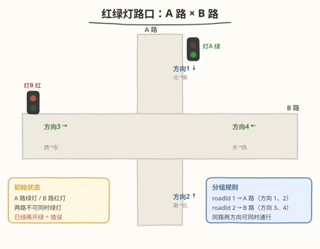
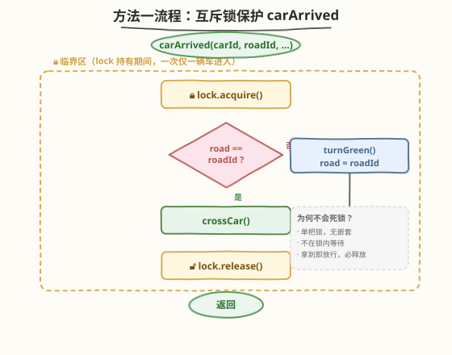
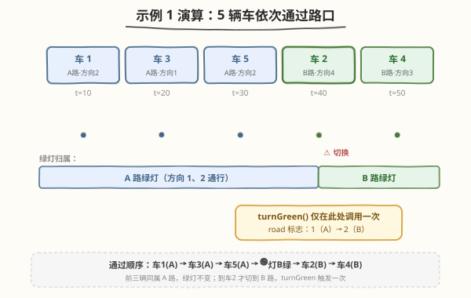

# 红绿灯路口

- **题目名称**：红绿灯路口
- **链接**：[1279. 红绿灯路口](https://leetcode.cn/problems/traffic-light-controlled-intersection/)
- **难度**：简单
- **标签**：并发、互斥锁、线程同步、条件变量

## 1. 题目概述

两条路在一个十字路口相交。**A 路**纵向，车辆可沿 **1 号方向**（北→南）或 **2 号方向**（南→北）行驶；**B 路**横向，车辆可沿 **3 号方向**（西→东）或 **4 号方向**（东→西）行驶。每条路在路口前各有一组红绿灯。



规则：

- **绿灯**：该路两个方向的车辆都可通行；**红灯**：该路两个方向的车辆都必须等待。
- **两条路的灯不可同时为绿**——A 绿则 B 红，B 绿则 A 红。
- **初始**：A 路绿灯、B 路红灯。
- 一条路绿灯亮起时，该路所有方向的车辆都能通过，直到另一条路亮绿灯。**不同路的车辆不可同时通过路口。**
- 设计一个**无死锁**的红绿灯控制系统，实现：

```cpp
void carArrived(int carId,                // 车辆编号
                int roadId,               // 车辆所在道路：1 = A 路，2 = B 路
                int direction,            // 行进方向 1~4
                function<void()> turnGreen, // 调用后当前道路绿灯亮
                function<void()> crossCar); // 调用后允许该车通过路口
```

> ⚠️ **两条判定红线**：
> 1. **无死锁**——所有车辆最终都能通过；
> 2. **路口已亮绿灯时仍调用 `turnGreen` 会被判错误**——即同一方向连续来车时，不能重复"开灯"。

**示例 1**：

```text
输入：cars = [1,3,5,2,4], directions = [2,1,2,4,3], arrivalTimes = [10,20,30,40,50]
输出：
  Car 1 Has Passed Road A In Direction 2    // A 路绿灯，1 号车直接通过
  Car 3 Has Passed Road A In Direction 1    // 灯仍绿，3 号车通过
  Car 5 Has Passed Road A In Direction 2    // 灯仍绿，5 号车通过
  Traffic Light On Road B Is Green          // 2 号车在 B 路，请求切灯
  Car 2 Has Passed Road B In Direction 4    // B 路绿灯亮，2 号车通过
  Car 4 Has Passed Road B In Direction 3    // 灯仍绿，4 号车通过
```

**示例 2**：

```text
输入：cars = [1,2,3,4,5], directions = [2,4,3,3,1], arrivalTimes = [10,20,30,40,40]
输出：
  Car 1 Has Passed Road A In Direction 2    // A 绿，1 号车通过
  Traffic Light On Road B Is Green          // 2 号车在 B 路，切灯
  Car 2 Has Passed Road B In Direction 4
  Car 3 Has Passed Road B In Direction 3
  Traffic Light On Road A Is Green          // 5 号车在 A 路，切灯
  Car 5 Has Passed Road A In Direction 1
  Traffic Light On Road B Is Green          // 4 号车在 B 路，等 5 号通过后切灯
  Car 4 Has Passed Road B In Direction 3
```

> 💡 示例 2 中 4 号车与 5 号车同一时刻到达（t=40）。先让 5 号（A 路）过、再切灯让 4 号（B 路）过是正确方案；反过来先让 4 号过也可接受——判题只要求**无死锁、不重复开灯**，不规定同时刻多车的严格次序。

**约束条件**：

- `1 <= cars.length <= 20`
- `cars.length == directions.length == arrivalTimes.length`
- `cars` 中所有值唯一
- `1 <= directions[i] <= 4`
- `arrivalTimes` 非递减

---

## 2. 解题思路

### 2.1 暴力思路：不加同步直接放行

最直白的写法：每辆车到达后，直接判断"当前绿灯是不是我这条路"，不是就 `turnGreen()`，然后 `crossCar()`，全程不加锁。

```python
def carArrived(self, carId, roadId, direction, turnGreen, crossCar):
    if self.road != roadId:
        self.road = roadId
        turnGreen()
    crossCar()
```

这在单线程下完全正确，但题目里**每辆车是一个独立线程**，并发调用 `carArrived`，于是两类竞态立刻浮现：

1. **重复开灯（判错）**：A 路绿灯时，两辆 A 路车几乎同时到达。T1 读到 `road==1`（A）跳过开灯；T2 在 T1 还没把状态"锁住"的窗口里也读到 `road==1` 跳过——这倒没事。真正出问题的是切灯瞬间：A 绿时一辆 B 车到达，读到 `road!=2`，准备 `turnGreen`；与此同时另一辆 B 车也读到 `road!=2`，**两人都调了 `turnGreen`** → 同一方向重复开灯，被判错误。
2. **异向同时通过（违规）**：A 车读到绿灯正在 `crossCar`，B 车在同一间隙把灯切成绿并 `crossCar`，两辆**不同路**的车同时出现在路口——违反"不同路车辆不可同时通过"。

根源是经典的 **check-then-act** 竞态：`if road != roadId`（check）和 `road = roadId; turnGreen()`（act）之间没有原子性保护，多线程交错就会出错。

### 2.2 核心观察：互斥锁 + 单方向标志



解法朴素却直击要害：**用一把互斥锁把"判灯 + 切灯 + 放行"三步打包成一个临界区**，再用一个 `int road` 标志记住"当前哪条路是绿灯"。

| 共享状态 | 含义 | 初值 |
|----------|------|------|
| `road` | 当前绿灯所在道路（1 = A，2 = B） | `1`（A 路初始绿灯） |
| `mtx` | 互斥锁，保护 `road` 与整个放行过程 | — |

`carArrived` 的逻辑只有三行核心：

1. **加锁**进入临界区（同一时刻只有一辆车的逻辑在跑）；
2. 若 `road != roadId`：说明当前绿灯不在本车这条路 → 调 `turnGreen()` 并更新 `road = roadId`；若 `road == roadId`：绿灯已在，**什么都不做**（避免重复开灯）；
3. 调 `crossCar()` 让车通过，**释放锁**。

> 💡 **为什么这样就能同时化解两类竞态？**
> - **重复开灯**：`turnGreen` 只在 `road != roadId` 分支里调用，且整个判断—切换在锁内原子完成。第二辆同路车进入临界区时，`road` 已被第一辆更新成自己的路，`road == roadId` 成立，直接跳过开灯。
> - **异向同时通过**：`crossCar` 也在锁内调用，意味着**任意时刻只有一辆车在通过路口**——不同路的车自然不可能同时通过。代价是同路的车也被串行化了，但判题不要求同路并发，正确性优先（见第 5 节的并发优化版）。

> ⚠️ **初始值必须是 `road = 1`**：题目规定 A 路初始绿灯。若误设为 `0` 或 `2`，第一辆 A 路车会错误地触发一次 `turnGreen`（因为 `road != 1`），被判"已绿再开灯"错误。

### 2.3 算法流程图

上图（`traffic_light_flow.svg`）展示了完整决策流：

- 菱形 `road == roadId ?` 是分水岭：**是**→ 直奔 `crossCar`；**否**→ 先 `turnGreen` 再合并到 `crossCar`。
- 虚线框标注的**临界区**从 `lock.acquire()` 到 `lock.release()`，把 `turnGreen` 与 `crossCar` 都圈在内——这正是"一次仅一辆车"的保证。
- 右下角注释解释了无死锁的三条理由：单锁无嵌套、锁内不等待、拿到必释放。

### 2.4 示例演算

以**示例 1** 为例（`cars = [1,3,5,2,4]`，方向 `[2,1,2,4,3]`，到达时刻 `[10,20,30,40,50]`），重点看 `turnGreen` 触发的时机：



| 时刻 | 车辆 | roadId | 当前 road | 动作 | turnGreen? |
|------|------|--------|-----------|------|-----------|
| t=10 | 车 1 | 1 (A) | 1 | road==roadId → crossCar | 否 |
| t=20 | 车 3 | 1 (A) | 1 | road==roadId → crossCar | 否 |
| t=30 | 车 5 | 1 (A) | 1 | road==roadId → crossCar | 否 |
| t=40 | 车 2 | 2 (B) | 1 | road!=roadId → turnGreen + crossCar | **是（唯一一次）** |
| t=50 | 车 4 | 2 (B) | 2 | road==roadId → crossCar | 否 |

关键瞬间在 **t=40**：前三辆车都属 A 路，`road` 始终为 1，`turnGreen` 一次都没调用。直到车 2（B 路）到达，`road(1) != roadId(2)`，才触发唯一的 `turnGreen`，把 `road` 翻成 2。此后车 4 又是 B 路，直接通过。整轮**只开了一次灯**，满足"不重复开灯"。

> 💡 若用方法一（串行），5 辆车按 t=10→20→30→40→50 顺序一辆辆过；若用第 5 节的并发版，前三辆 A 路车可同时通过、后两辆 B 路车可同时通过，总耗时更短——但 `turnGreen` 的触发次数与时刻完全一致。

---

## 3. 参考代码

### 方法一：互斥锁（推荐，最简且一定正确）

### C++

```cpp
#include <functional>
#include <mutex>

class TrafficLight {
    std::mutex mtx;
    int road = 1;  // 当前绿灯道路：1 = A 路，2 = B 路（初始 A 绿）

  public:
    TrafficLight() {}

    void carArrived(int carId, int roadId, int direction,
                    std::function<void()> turnGreen,
                    std::function<void()> crossCar) {
        std::lock_guard<std::mutex> lk(mtx);
        if (road != roadId) {   // 绿灯不在本路 → 切灯
            road = roadId;
            turnGreen();
        }
        crossCar();             // 已是绿灯，放行
    }
};
```

### Python

```python
from threading import Lock


class TrafficLight:
    def __init__(self):
        self.lock = Lock()
        self.road = 1  # 当前绿灯道路：1 = A 路，2 = B 路（初始 A 绿）

    def carArrived(
        self,
        carId: int,
        roadId: int,        # 1 = A 路，2 = B 路
        direction: int,
        turnGreen: 'Callable[[], None]',
        crossCar: 'Callable[[], None]',
    ) -> None:
        with self.lock:
            if self.road != roadId:
                self.road = roadId
                turnGreen()
            crossCar()
```

> 💡 **Java 等价写法**：直接给 `carArrived` 加 `synchronized` 关键字，方法体里同样 `if (roadId != road) { turnGreen.run(); road = roadId; } crossCar.run();`——`synchronized` 等价于方法级互斥锁，最是简洁。

---

## 4. 复杂度分析

| 维度 | 复杂度 | 说明 |
|------|--------|------|
| 时间复杂度 | $O(1)$ 每次 `carArrived` | 临界区内只有一次比较、最多一次 `turnGreen` 和一次 `crossCar`，与车辆总数无关；等待时间取决于前车通过耗时，非算法本身开销 |
| 空间复杂度 | $O(1)$ | 一把锁 + 一个 `int` 标志，常数空间 |
| 并发度 | $1$（方法一） | `crossCar` 在锁内 → 所有车辆串行通过；同路车辆也无法并发，但满足判题要求 |
| 死锁 | 无 | 单锁、无嵌套加锁、锁内无阻塞等待——Coffman 四条件之"循环等待"不成立 |

> ⚠️ 本题是**并发正确性**题，核心指标不是传统算法复杂度，而是：**互斥性**（异向不同行）、**无死锁**、**不重复开灯**。方法一三者皆满足。

---

## 5. 扩展：允许同向并发的条件变量解法

方法一把 `crossCar` 放在锁内，导致同路车辆也被串行——这在判题中没问题，但在真实高并发路口会浪费通行能力。题目其实允许"一条路绿灯时，该路所有方向车辆都能通过"，即**同路车辆可并发**。


### 5.1 思路：把 `crossCar` 移到锁外

关键改动：**慢操作 `crossCar` 放锁外，快操作"判灯/切灯/计数"放锁内**（与 [1242 多线程爬虫](../1201-1300/1242_多线程网络爬虫.md) 把 `getUrls` 放锁外是同一思想）。新增一个计数器 `passing` 记录"当前正在通过路口的车辆数"，用条件变量协调异向互斥：

| 共享状态 | 含义 | 初值 |
|----------|------|------|
| `green` | 当前绿灯道路 | `1` |
| `passing` | 正在通过路口的车辆数 | `0` |
| `cv` | 条件变量，异向车在此等待 | — |

### 5.2 算法

```text
carArrived(roadId):
    加锁
    while green != roadId and passing > 0:   // 别路有车在过，等
        cv.wait()
    if green != roadId:                       // 路口空了且本路没绿 → 切灯
        green = roadId
        turnGreen()
    passing += 1                              // 登记进入路口
    解锁

    crossCar()                                 // ← 锁外！同路车可同时执行

    加锁
    passing -= 1
    if passing == 0:                           // 最后一辆离开 → 唤醒等灯的对向车
        cv.notify_all()
    解锁
```

**为什么 `while green != roadId and passing > 0` 是正确的等待条件？**

- `green != roadId`（别路是绿灯）**且** `passing > 0`（别路有车正在过）→ 必须等。
- 一旦 `passing == 0`（路口空了），即便 `green` 还指着别路，当前车也能**主动切灯**——因为没人占着路口，切灯不会撞车。
- 一旦 `green == roadId`（本路已绿），无论 `passing` 多少都能直接加入（同路车可并发）。

> 💡 **计数器 `passing` 的作用**：它区分了"绿灯指向别路但有车在过"（必须等）和"绿灯指向别路但路口已空"（可切灯）。没有它，要么误等（路口空了还傻等别人切灯），要么误切（别路车还在路口里就抢着切灯撞车）。这与 [1242](../1201-1300/1242_多线程网络爬虫.md) 的 `working` 计数器异曲同工：队列空不等于全部完成，必须用计数器追踪"在途任务"。

### 5.3 参考代码

### C++

```cpp
#include <functional>
#include <mutex>
#include <condition_variable>

class TrafficLight {
    std::mutex mtx;
    std::condition_variable cv;
    int green = 1;     // 当前绿灯道路
    int passing = 0;   // 正在通过路口的车辆数

  public:
    void carArrived(int carId, int roadId, int direction,
                    std::function<void()> turnGreen,
                    std::function<void()> crossCar) {
        std::unique_lock<std::mutex> lk(mtx);
        cv.wait(lk, [&] { return green == roadId || passing == 0; });
        if (green != roadId) {     // 路口空闲且本路未绿 → 切灯
            green = roadId;
            turnGreen();
        }
        ++passing;                 // 登记进入路口
        lk.unlock();

        crossCar();                // 锁外通过，同路车辆可并发

        lk.lock();
        --passing;
        if (passing == 0)          // 最后一辆离开，唤醒等待的对向车
            cv.notify_all();
    }
};
```

### Python

```python
import threading


class TrafficLight:
    def __init__(self):
        self.cond = threading.Condition()
        self.green = 1    # 当前绿灯道路
        self.passing = 0  # 正在通过路口的车辆数

    def carArrived(self, carId, roadId, direction, turnGreen, crossCar):
        with self.cond:
            while self.green != roadId and self.passing > 0:
                self.cond.wait()
            if self.green != roadId:
                self.green = roadId
                turnGreen()
            self.passing += 1

        crossCar()                       # 锁外，同路车辆可并发通过

        with self.cond:
            self.passing -= 1
            if self.passing == 0:
                self.cond.notify_all()
```

> ⚠️ **防虚假唤醒**：C++ 用 `cv.wait(lk, 谓词)` 形式、Python 用 `while 谓词: cv.wait()`，被唤醒后都会**重新检查谓词**，避免在状态尚未真正满足时贸然切灯或进入路口。

> ⚠️ **公平性**：本解法不保证严格公平——若 A 路车持续到达，B 路车可能等待较久。但题目 `arrivalTimes` 有限（≤ 20 辆），不会永久饥饿，满足"无死锁"。真实系统如需公平可改用 FIFO 等待队列。

---

## 6. 面试要点

1. **为什么一把互斥锁 + 一个 `road` 标志就够了？**

   题目本质是"两组（A 路 / B 路）之间的互斥"——同组可共存、异组必互斥。一个 `road` 标志记录当前持有绿灯的组，一把锁把"判组—切组—放行"原子化即可。无需信号量或读写锁：因为同路并发是优化项而非必需，串行方案已满足全部判题要求。

2. **为什么不会死锁？**

   方法一只有一把锁，且**锁内没有任何阻塞等待**（不 `wait`、不嵌套加锁），拿到锁后必执行到 `release` 才返回。Coffman 死锁四条件中的"循环等待"无从形成，故无死锁。

3. **"已绿再开灯"为什么算错误？代码如何避免？**

   题目要求灯已在绿时不能再"开灯"（否则输出里会出现多余的 `Traffic Light On Road X Is Green`）。代码用 `if (road != roadId)` 守卫 `turnGreen`：只有当前绿灯**不在**本路时才切灯；同路连续来车时 `road == roadId` 直接跳过，绝不重复调用。

4. **初始状态为什么是 `road = 1`？**

   题目规定 A 路初始绿灯。`road` 初值设 1，使第一辆 A 路车命中 `road == roadId` 而跳过 `turnGreen`，与"A 路本就绿灯"的事实一致。若误设为 0 或 2，第一辆 A 路车会触发一次多余的 `turnGreen`，被判错误。

5. **方法二如何允许同向并发？`passing` 计数器解决什么？**

   把 `crossCar` 移到锁外，同路多辆车就能同时执行 `crossCar`（并发通过）。但异向车必须等路口清空才能切灯——`passing` 计数器精确表达"路口里还有几辆车"：`passing > 0` 时别路车在 `cv.wait` 上等；`passing == 0` 时最后离开的车 `notify_all` 唤醒等灯者。没有它，无法区分"绿灯指别路但路口已空（可切）"与"别路有车正在过（必等）"。

---

## 7. 同类练习题

- [1226. 哲学家进餐](https://leetcode.cn/problems/the-dining-philosophers/)（[题解](../1201-1300/1226_哲学家进餐.md)）：并发互斥与死锁避免的经典，深入理解 Coffman 四条件与管程/条件变量
- [1114. 按序打印](https://leetcode.cn/problems/print-in-order/)：并发入门题，互斥锁/条件变量协调三线程顺序，理解 `Condition.wait` 基本用法
- [1115. 交替打印 FooBar](https://leetcode.cn/problems/print-foobar-alternately/)：两线程交替执行，互斥与唤醒配合的练习
- [1242. 多线程网络爬虫](https://leetcode.cn/problems/web-crawler-multithreaded/)（[题解](../1201-1300/1242_多线程网络爬虫.md)）：同样把慢操作放锁外、用计数器 + 条件变量协调终止，与本题方法二同构
- [1195. 交替打印字符串](https://leetcode.cn/problems/fizz-buzz-multithreaded/)：多线程角色分工打印，条件变量综合练习
