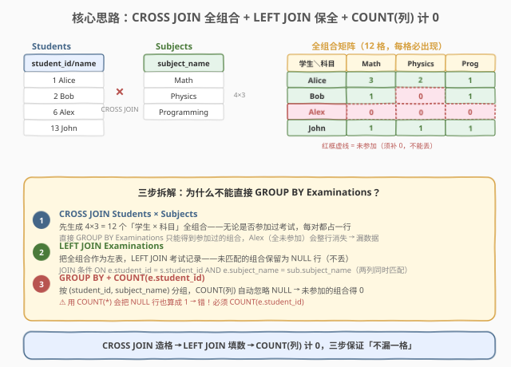
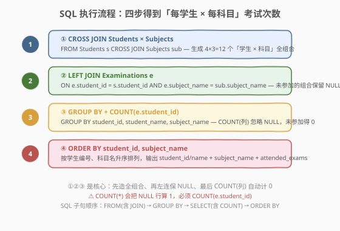
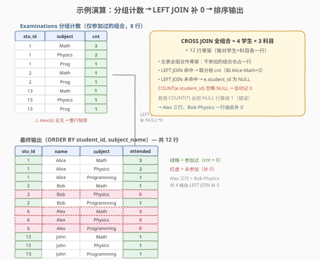

# 学生们参加各科测试的次数

- **题目名称**：学生们参加各科测试的次数
- **链接**：[1280. 学生们参加各科测试的次数](https://leetcode.cn/problems/students-and-examinations/)
- **难度**：简单
- **标签**：数据库、SQL、CROSS JOIN、LEFT JOIN、GROUP BY、COUNT

## 1. 题目概述

给定三张表：`Students`（学生）、`Subjects`（科目）、`Examinations`（考试记录）。编写 SQL 查询，统计**每个学生参加每个科目考试的次数**。结果须按 `student_id`、`subject_name` 升序排列。

⚠️ **关键要求**：即使某学生从未参加某科目（甚至从未参加任何科目）的考试，结果中也必须出现该「学生 × 科目」组合，`attended_exams` 记为 `0`。

**表结构**：

```text
Table: Students
+---------------+---------+
| Column Name   | Type    |
+---------------+---------+
| student_id    | int     |  ← 主键
| student_name  | varchar |
+---------------+---------+

Table: Subjects
+--------------+---------+
| Column Name  | Type    |
+--------------+---------+
| subject_name | varchar |  ← 主键
+--------------+---------+

Table: Examinations
+--------------+---------+
| Column Name  | Type    |
+--------------+---------+
| student_id   | int     |
| subject_name | varchar |
+--------------+---------+
（无主键，可有重复行；每行表示一次考试参加记录）
```

**示例 1**：

```text
输入：
Students 表：
+------------+--------------+
| student_id | student_name |
+------------+--------------+
| 1          | Alice        |
| 2          | Bob          |
| 13         | John         |
| 6          | Alex         |
+------------+--------------+
Subjects 表：
+--------------+
| subject_name |
+--------------+
| Math         |
| Physics      |
| Programming  |
+--------------+
Examinations 表：
+------------+--------------+
| student_id | subject_name |
+------------+--------------+
| 1          | Math         |
| 1          | Physics      |
| 1          | Programming  |
| 2          | Programming  |
| 1          | Physics      |
| 1          | Math         |
| 13         | Math         |
| 13         | Programming  |
| 13         | Physics      |
| 2          | Math         |
| 1          | Math         |
+------------+--------------+

输出：
+------------+--------------+--------------+----------------+
| student_id | student_name | subject_name | attended_exams |
+------------+--------------+--------------+----------------+
| 1          | Alice        | Math         | 3              |
| 1          | Alice        | Physics      | 2              |
| 1          | Alice        | Programming  | 1              |
| 2          | Bob          | Math         | 1              |
| 2          | Bob          | Physics      | 0              |
| 2          | Bob          | Programming  | 1              |
| 6          | Alex         | Math         | 0              |
| 6          | Alex         | Physics      | 0              |
| 6          | Alex         | Programming  | 0              |
| 13         | John         | Math         | 1              |
| 13         | John         | Physics      | 1              |
| 13         | John         | Programming  | 1              |
+------------+--------------+--------------+----------------+
```

**解释**：Alice 考了 3 次 Math、2 次 Physics、1 次 Programming；Bob 没考 Physics（记 0）；Alex 一次都没参加（三个科目全记 0）；John 每科各 1 次。输出共 4 × 3 = 12 行，缺一不可。

> 💡 本题是 SQL **「CROSS JOIN 造全组合 + LEFT JOIN 保全 + COUNT(列) 计 0」** 的招牌入门题。考点不在聚合本身，而在「如何让没参加的组合也出现在结果里」——这是 [580. 统计各专业学生人数](../0501-0600/580_统计各专业学生人数.md) 的二维泛化版：580 只需 LEFT JOIN 保留空部门，本题还要先 CROSS JOIN 造出「学生 × 科目」的完整骨架。

---

## 2. 解题思路

### 2.1 暴力思路：直接 GROUP BY Examinations

最直白的写法：对 `Examinations` 表按 `(student_id, subject_name)` 分组，`COUNT(*)` 统计次数，再 JOIN 上学生姓名与科目名：

```sql
SELECT e.student_id, s.student_name, e.subject_name, COUNT(*) AS attended_exams
FROM Examinations e
JOIN Students s ON s.student_id = e.student_id
GROUP BY e.student_id, s.student_name, e.subject_name
ORDER BY e.student_id, e.subject_name;
```

这在「只看参加过的组合」时是对的，但对照示例输出立刻暴露**两个致命缺陷**：

1. **未参加的组合整行消失**：Bob 没考 Physics，`Examinations` 里根本没有 `(2, Physics)` 行 → 分组结果里直接缺这一行，输出少一行（而非记 0）。
2. **全未参加的学生整段消失**：Alex（`student_id = 6`）一次考试都没参加，`Examinations` 里没有 `student_id = 6` 的任何行 → Alex 的三行全部缺失，输出少三行。

根源在于：`GROUP BY` 只能对**已存在的行**分组，它无法凭空「补」出缺失的组合。要解决，必须先有一张「所有学生 × 所有科目」的完整骨架表，再把考试记录挂上去。

### 2.2 核心观察：CROSS JOIN 造骨架 + LEFT JOIN 填数 + COUNT(列) 计 0



把问题拆成三步，每步解决一个「缺失」：

| 步骤 | 操作 | 解决的缺失 |
|------|------|-----------|
| ① **CROSS JOIN** `Students × Subjects` | 生成 $|S| \times |Sub|$ 个「学生 × 科目」全组合 | 学生×科目组合缺失 |
| ② **LEFT JOIN** `Examinations` | 用全组合作左表左连考试记录，未匹配的组合保留为 `NULL` 行 | 单个组合的考试记录缺失 |
| ③ **COUNT(e.student_id)** | 按 `(student_id, subject_name)` 分组计数，`COUNT(列)` 自动忽略 `NULL` → 未匹配得 `0` | 把 `NULL` 显示为 `0` |

> 💡 **为什么是 CROSS JOIN 而不是 INNER JOIN？** `Students` 与 `Subjects` 之间没有直接的外键关联（一个学生不属于某个科目），需要的是「每个学生配每个科目」的笛卡尔积——这正是 `CROSS JOIN` 的语义。`INNER JOIN ... ON 1=1` 或隐式逗号连接 `FROM Students, Subjects` 也等价，但 `CROSS JOIN` 语义最清晰。

> ⚠️ **COUNT(*) vs COUNT(列) 是本题最大的坑**：第 ②步 LEFT JOIN 后，未参加的组合会产生一行，且该行 `e.student_id` 为 `NULL`。
> - `COUNT(*)` 数**行**，会把这条 `NULL` 行算成 `1` → 未参加的科目被记成 1 次，错误。
> - `COUNT(e.student_id)` 数**非 NULL 值**，自动跳过 `NULL` 行 → 未参加的科目得 `0`，正确。
>
> 这是 SQL 中「`COUNT(*)` 与 `COUNT(列)` 的区别」最经典的考题场景。

### 2.3 算法流程图



完整步骤：

1. **CROSS JOIN Students × Subjects**：`FROM Students s CROSS JOIN Subjects sub`，得到 $|S| \times |Sub|$ 行全组合骨架。
2. **LEFT JOIN Examinations e**：`ON e.student_id = s.student_id AND e.subject_name = sub.subject_name`——**两列同时匹配**（一个学生参加某科考试，需学生号和科目名都对上）。未匹配的组合 `e.*` 全为 `NULL`。
3. **GROUP BY + COUNT(e.student_id)**：`GROUP BY s.student_id, s.student_name, sub.subject_name`，`COUNT(e.student_id) AS attended_exams`——`NULL` 不计入，未参加得 0。
4. **ORDER BY student_id, subject_name**：按学生号、科目名升序输出。

> 💡 **SQL 子句执行顺序**：`FROM`（含 `CROSS JOIN` / `LEFT JOIN`）→ `WHERE` → `GROUP BY` → `HAVING` → `SELECT`（含 `COUNT`）→ `ORDER BY`。JOIN 在最前先拼出大表，COUNT 在 SELECT 阶段对每个分组求值。

### 2.4 示例演算

以示例 1 数据为例，完整推演「分组计数 → LEFT JOIN 补 0 → 排序输出」的过程：



**第一步：Examinations 分组计数（仅参加过的组合，8 行）**

对 `Examinations` 按 `(student_id, subject_name)` 分组计数，得到 8 个「参加过」的组合：

| student_id | subject_name | cnt |
|------------|--------------|-----|
| 1 | Math | 3 |
| 1 | Physics | 2 |
| 1 | Programming | 1 |
| 2 | Math | 1 |
| 2 | Programming | 1 |
| 13 | Math | 1 |
| 13 | Physics | 1 |
| 13 | Programming | 1 |

> ⚠️ 注意 Alex（`student_id = 6`）整段缺席——他没参加过任何考试，分组结果里没有他的任何行。这正是「直接 GROUP BY」会漏数据的原因。

**第二步：CROSS JOIN 造 12 行骨架 + LEFT JOIN 挂计数**

`Students(4) × Subjects(3) = 12` 行骨架。LEFT JOIN 上第一步的计数：

- 命中的组合（8 个）→ 取 `cnt`；
- 未命中的组合（4 个：`Bob-Physics`、`Alex-Math`、`Alex-Physics`、`Alex-Programming`）→ `e.student_id` 为 `NULL`。

**第三步：COUNT(e.student_id) 计 0 + ORDER BY**

`COUNT(e.student_id)` 对 `NULL` 行不计入 → 4 个未命中组合得 `0`。按 `student_id, subject_name` 升序排列，得到 12 行最终输出，与预期完全一致。

> 💡 **验证**：12 行 = 4 学生 × 3 科目，无遗漏。其中 8 行 `attended_exams > 0`，4 行 `= 0`（Bob 缺 Physics，Alex 三科全缺）。

---

## 3. 参考代码

### MySQL（解法 A：CROSS JOIN + LEFT JOIN + COUNT(列)，推荐）

```sql
# 1280. 学生们参加各科测试的次数
# 思路：CROSS JOIN 造全组合骨架 → LEFT JOIN 挂考试记录 → COUNT(e.student_id) 计 0
SELECT
    s.student_id,
    s.student_name,
    sub.subject_name,
    COUNT(e.student_id) AS attended_exams
FROM Students s
CROSS JOIN Subjects sub
LEFT JOIN Examinations e
    ON e.student_id = s.student_id
    AND e.subject_name = sub.subject_name
GROUP BY s.student_id, s.student_name, sub.subject_name
ORDER BY s.student_id, sub.subject_name;
```

> 💡 **实现细节**：
> - **`CROSS JOIN Subjects sub`**：生成「学生 × 科目」全组合。等价写法 `FROM Students s, Subjects sub` 或 `INNER JOIN Subjects sub ON 1=1`，但 `CROSS JOIN` 语义最清晰。
> - **`LEFT JOIN ... ON 两列同时匹配`**：`student_id` 与 `subject_name` 都要对上才算「该学生参加了该科目」。若只用一列匹配会错配（如把 Alice 的 Math 记录挂到 Bob 的 Math 行上）。
> - **`COUNT(e.student_id)`**：数 `Examinations` 侧的非 NULL 值。未匹配的组合 `e.student_id` 为 NULL，不计入 → 自动得 0。**切勿用 `COUNT(*)`**。
> - **`GROUP BY` 三列**：`student_id`、`student_name`、`subject_name` 一起分组（`student_name` 由 `student_id` 决定，逻辑上可省，但标准 SQL 要求 SELECT 中非聚合列出现在 GROUP BY 中）。

### MySQL（解法 B：子查询先分组计数，再 LEFT JOIN）

```sql
SELECT
    s.student_id,
    s.student_name,
    sub.subject_name,
    COALESCE(ec.cnt, 0) AS attended_exams
FROM Students s
CROSS JOIN Subjects sub
LEFT JOIN (
    SELECT student_id, subject_name, COUNT(*) AS cnt
    FROM Examinations
    GROUP BY student_id, subject_name
) ec
    ON ec.student_id = s.student_id
    AND ec.subject_name = sub.subject_name
ORDER BY s.student_id, sub.subject_name;
```

> 💡 **与解法 A 的区别**：先把 `Examinations` 在子查询里分组计数（得到 8 行 `(student_id, subject_name, cnt)`），再 LEFT JOIN 到全组合骨架。未匹配的组合 `ec.cnt` 为 NULL，用 `COALESCE(ec.cnt, 0)` 转 0。
>
> 两种解法逻辑等价：
> - **解法 A**：先 LEFT JOIN 原始考试记录（一对多展开），再 GROUP BY + COUNT —— 一次聚合。
> - **解法 B**：先子查询聚合，再 LEFT JOIN 聚合结果 —— 两阶段，但无需在外层再 GROUP BY（因为骨架每行最多匹配一条计数记录）。
>
> 解法 A 更简洁（一条 GROUP BY 搞定），解法 B 更直观地展示了「先算计数再挂载」的思路，且外层无需 GROUP BY。性能上现代优化器通常将两者优化为相近的执行计划。

### Python（pandas）

```python
import pandas as pd

def students_and_examinations(
    students: pd.DataFrame,
    subjects: pd.DataFrame,
    examinations: pd.DataFrame,
) -> pd.DataFrame:
    # ① CROSS JOIN：学生 × 科目 全组合骨架
    combo = students.merge(subjects, how="cross")
    # ② 对考试记录按 (student_id, subject_name) 分组计数
    exam_cnt = (
        examinations.groupby(["student_id", "subject_name"])
        .size()
        .reset_index(name="attended_exams")
    )
    # ③ LEFT JOIN 计数到骨架，未匹配填 0
    result = combo.merge(
        exam_cnt, on=["student_id", "subject_name"], how="left"
    )
    result["attended_exams"] = result["attended_exams"].fillna(0).astype(int)
    # ④ 排序输出
    result = result.sort_values(["student_id", "subject_name"]).reset_index(drop=True)
    return result[["student_id", "student_name", "subject_name", "attended_exams"]]
```

> 💡 **pandas 对照**：
> - `students.merge(subjects, how="cross")` 对应 `CROSS JOIN`——pandas 1.2+ 支持的笛卡尔积连接，生成 $|S| \times |Sub|$ 行骨架。
> - `groupby([...]).size()` 对应 `GROUP BY ... COUNT(*)`——但只对**已存在的考试记录**分组，得到参加过的组合计数（8 行）。
> - `combo.merge(exam_cnt, how="left")` 对应 `LEFT JOIN`——以全组合骨架为左表，未匹配的组合 `attended_exams` 为 `NaN`。
> - `.fillna(0).astype(int)` 对应 `COUNT(e.student_id)` 的「NULL→0」语义——pandas 中 `NaN` 即 SQL 的 `NULL`，填 0 后转整型。
> - `sort_values(["student_id", "subject_name"])` 对应 `ORDER BY student_id, subject_name`。

---

## 4. 复杂度分析

| 维度 | 复杂度 | 说明 |
|------|--------|------|
| **时间** | $O(S \cdot Sub + E)$ | $S$ = 学生数，$Sub$ = 科目数，$E$ = 考试记录数。CROSS JOIN 生成 $S \cdot Sub$ 行骨架 $O(S \cdot Sub)$；LEFT JOIN 哈希匹配 $O(E)$；GROUP BY 聚合 $O(S \cdot Sub + E)$。总计线性于「骨架 + 记录」规模 |
| **空间** | $O(S \cdot Sub + E)$ | CROSS JOIN 物化 $S \cdot Sub$ 行中间结果，LEFT JOIN 后行数膨胀到 $O(S \cdot Sub + E)$（每个骨架行匹配多条记录时展开） |
| **输出规模** | $S \cdot Sub$ 行 | 固定为「学生数 × 科目数」，与考试记录数无关——这是 CROSS JOIN 骨架的本质 |

> ⚠️ 当学生数与科目数都很大时，CROSS JOIN 的 $O(S \cdot Sub)$ 骨架会成为主要开销（笛卡尔积膨胀）。本题约束下（学生、科目均为小表）可忽略；真实业务中若两表都大，应考虑是否真需要全组合，或用应用层分页生成。

---

## 5. 扩展：COUNT 的三种写法与 CROSS JOIN 的等价形式

### 5.1 COUNT(*) vs COUNT(列) vs COUNT(DISTINCT 列)

LEFT JOIN + 分组计数场景下，三种 COUNT 语义迥异，是本题最易错点：

| 写法 | 语义 | 未匹配行（`e.student_id` 为 NULL） | 本题是否正确 |
|------|------|-----------------------------------|-------------|
| `COUNT(*)` | 数所有行（含 NULL 行） | 算 **1** | ✗ 未参加被记 1 |
| `COUNT(e.student_id)` | 数 `e.student_id` 非 NULL 值 | 算 **0** | ✓ 未参加得 0 |
| `COUNT(DISTINCT e.student_id)` | 数 `e.student_id` 不同值数 | 算 **0** | △ 语义不同：同一学生参加同科多次只算 1 |

> 💡 **本题用 `COUNT(e.student_id)`**：因为 `Examinations` 可有重复行（同一学生多次参加同科考试），题目要的是「参加次数」而非「是否参加过」。`COUNT(DISTINCT ...)` 会把 Alice 的 3 次 Math 压成 1，不符合题意。只有当题目问「是否参加过」（去重计数）时才用 `COUNT(DISTINCT)`。

### 5.2 CROSS JOIN 的三种等价写法

```sql
-- 写法 1：显式 CROSS JOIN（推荐，语义最清晰）
FROM Students s CROSS JOIN Subjects sub

-- 写法 2：隐式逗号连接（最古老，SQL 标准支持）
FROM Students s, Subjects sub

-- 写法 3：INNER JOIN ON 恒真条件
FROM Students s INNER JOIN Subjects sub ON 1 = 1
```

三者执行计划完全相同（都生成笛卡尔积）。推荐写法 1：`CROSS JOIN` 关键字一眼表明「这是有意的全组合」，避免被误读成漏写 `ON` 条件的笔误。

### 5.3 与 580（统计各专业学生人数）的对比

| 维度 | 1280（本题） | [580](../0501-0600/580_统计各专业学生人数.md) |
|------|--------------|------|
| **骨架来源** | CROSS JOIN Students × Subjects（造二维全组合） | Department 表本身（一维，无需造骨架） |
| **保全手段** | LEFT JOIN Examinations 到全组合 | LEFT JOIN Student 到 Department |
| **计数列** | `COUNT(e.student_id)`（NULL→0） | `COUNT(s.student_id)`（NULL→0） |
| **空组形态** | 单个「学生×科目」组合为空（如 Bob-Physics） | 整个部门无学生（如 Law） |
| **维度** | 二维（学生 × 科目） | 一维（部门） |

> 💡 580 是本题的「一维退化版」：部门表天然就是骨架（每个部门一行），只需 LEFT JOIN 学生表计数。本题多了一步——学生与科目之间无直接关联，必须先 CROSS JOIN 造出二维骨架。掌握了本题的「造骨架 → 保全 → 计 0」三段式，580 只需去掉 CROSS JOIN 即可。

---

## 6. 面试要点

1. **为什么不能直接 GROUP BY Examinations？**

   > `GROUP BY` 只能对已存在的行分组。未参加的组合（如 Bob-Physics）和全未参加的学生（如 Alex）在 `Examinations` 里没有对应行，分组后整行/整段消失，输出会少于「学生数 × 科目数」。必须先用 CROSS JOIN 造出完整骨架，再用 LEFT JOIN 把考试记录挂上去，缺失的组合才能以 0 的形式保留。

2. **COUNT(*) 和 COUNT(e.student_id) 在本题有什么区别？**

   > LEFT JOIN 未匹配的组合会产生一行，但 `e.student_id` 为 NULL。`COUNT(*)` 数行，把这条 NULL 行算成 1 → 未参加被记 1 次（错）；`COUNT(e.student_id)` 数非 NULL 值，跳过 NULL 行 → 未参加得 0（对）。这是 SQL 中 `COUNT(*)` 与 `COUNT(列)` 区别最经典的考题场景：凡 LEFT JOIN 后计数，都要用 `COUNT(右表列)` 而非 `COUNT(*)`。

3. **为什么 LEFT JOIN 的 ON 条件要写两列？**

   > 一个学生参加某科考试，需 `student_id` 和 `subject_name` 同时对上。若只 `ON e.student_id = s.student_id`，会把 Alice 的 Math 记录也挂到 Alice-Physics 行上，导致 Physics 计数虚高。复合匹配条件 `ON e.student_id = s.student_id AND e.subject_name = sub.subject_name` 确保每条考试记录只挂到对应的「学生 × 科目」组合上。

4. **CROSS JOIN 和 INNER JOIN 有什么区别？本题为什么用 CROSS JOIN？**

   > `INNER JOIN` 需要 `ON` 条件做匹配，只保留两表能关联上的行；`CROSS JOIN` 无条件做笛卡尔积，生成两表所有行的两两组合。本题学生与科目之间没有关联条件，需要的是「每个学生配每个科目」的全组合，所以用 `CROSS JOIN`。等价的 `INNER JOIN ON 1=1` 或隐式 `FROM s, sub` 也能用，但 `CROSS JOIN` 语义最清晰。

5. **如果题目改成「统计每个学生参加了几种不同的科目」（去重计数），怎么改？**

   > 把 `COUNT(e.student_id)` 换成 `COUNT(DISTINCT e.subject_name)`。这样 Alice 的 3 次 Math 只算 1 种科目。注意此时未参加的组合仍得 0（`COUNT(DISTINCT NULL列)` 同样忽略 NULL）。本题问的是「次数」而非「种类数」，所以用普通 `COUNT`。

> 💡 **一句话总结**：1280 是 SQL **「CROSS JOIN 造骨架 + LEFT JOIN 保全 + COUNT(列) 计 0」招牌题**——核心三步：`CROSS JOIN Students × Subjects` 造出全组合骨架，`LEFT JOIN Examinations ON 两列匹配` 挂考试记录，`COUNT(e.student_id)` 让未匹配的组合自动得 0。最大的坑是用 `COUNT(*)` 而非 `COUNT(e.student_id)`——LEFT JOIN 后的 NULL 行只能靠数列来排除。

---

## 7. 同类练习题

- [580. 统计各专业学生人数](https://leetcode.cn/problems/count-student-number-in-departments/)（[站内题解](../0501-0600/580_统计各专业学生人数.md)）：本题的「一维退化版」——LEFT JOIN 学生到部门表，`COUNT(s.student_id)` 让空部门得 0，无需 CROSS JOIN 造骨架
- [1068. 产品销售分析 I](https://leetcode.cn/problems/product-sales-analysis-i/)（[站内题解](../1001-1100/1068_产品销售分析I.md)）：`JOIN` 两表关联基础题，Sales 关联 Product 取产品名，对照理解「有匹配才保留」的 INNER JOIN 与「全保留」的 LEFT JOIN 之别
- [570. 至少有 5 名直接下属的经理](https://leetcode.cn/problems/managers-with-at-least-5-direct-reports/)（[站内题解](../0501-0600/570_至少有5名直接下属的经理.md)）：`GROUP BY` + `COUNT` + `HAVING` 过滤，练习「分组计数后按阈值筛选」的聚合套路
- [1581. 访问店铺但未下单的顾客](https://leetcode.cn/problems/customer-who-visited-but-did-not-make-any-transactions/)：`LEFT JOIN` + `IS NULL` 找未匹配行，与本题「LEFT JOIN 后对 NULL 行计数」互为正反练习
- [1174. 即时食物配送 II](https://leetcode.cn/problems/immediate-food-delivery-ii/)（[站内题解](../1101-1200/1174_即时食物配送II.md)）：`LEFT JOIN` + 分组首单判定，进阶练习「左表全保留 + 按组聚合」的复合查询
