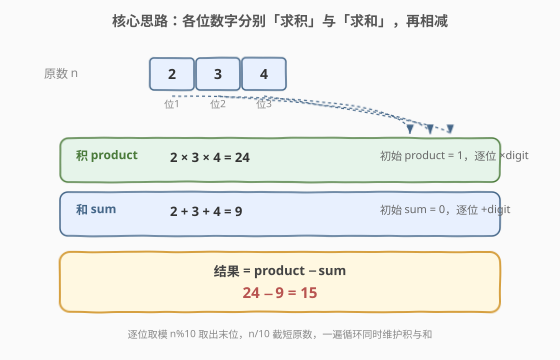
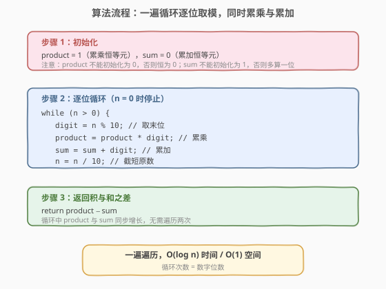
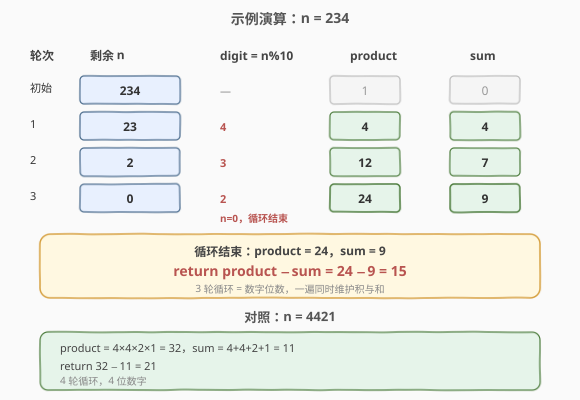

# LeetCode 整数的各位积和之差 题解

## 1. 题目概述

- **标题 / 题号**：整数的各位积和之差（#1281，easy）
- **链接**：https://leetcode.cn/problems/subtract-the-product-and-sum-of-digits-of-an-integer/
- **难度**：简单
- **标签**：数学

**题意**：给你一个整数 `n`，请你帮忙计算并返回它的**各位数字之积**与**各位数字之和**的差值。

**示例 1**：

```text
输入：n = 234
输出：15
解释：
各位数字之积 = 2 × 3 × 4 = 24
各位数字之和 = 2 + 3 + 4 = 9
结果 = 24 − 9 = 15
```

**示例 2**：

```text
输入：n = 4421
输出：21
解释：
各位数字之积 = 4 × 4 × 2 × 1 = 32
各位数字之和 = 4 + 4 + 2 + 1 = 11
结果 = 32 − 11 = 21
```

**约束**：

- $1 \le n \le 10^5$

## 2. 解题思路

### 2.1 暴力思路：转字符串逐位处理

最直观的做法是把整数转成字符串 `s`，再遍历每个字符还原成数字，分别累乘与累加：

```python
s = str(n)
product, sum_ = 1, 0
for ch in s:
    d = int(ch)
    product *= d
    sum_ += d
return product - sum_
```

写法直观，但需要 $O(n)$ 额外空间存放字符串（$n$ 为数字位数），且涉及整数↔字符的转换开销。

> 💡 工程中字符串法完全可接受，但面试官通常会追问「能不能不转字符串？」——下文的核心解法直接对数字本身做取模运算，无需任何字符串转换。

### 2.2 核心观察：逐位取模累乘与累加



不转字符串也能逐位取出数字：**反复对 10 取模取出末位，再整除 10 截短原数**。在一遍循环里同步维护两个累加器：

- **`product`**：累乘各位数字，初始为 $1$（乘法恒等元）；
- **`sum`**：累加各位数字，初始为 $0$（加法恒等元）。

> ⚠️ **初始化易错点**：`product` 必须初始化为 `1` 而非 `0`——任何数乘 0 恒为 0，会把乘积永远锁死为 0；`sum` 必须初始化为 `0` 而非 `1`，否则会凭空多算一位。这是本题最常见的低级错误。

> 💡 **一遍循环即可**：积与和的计算独立但同步，可以在同一次遍历中同时更新，无需遍历两次。

### 2.3 算法流程图



流程分三步：先初始化（`product=1`、`sum=0`），再循环「取末位 → 累乘 → 累加 → 截短」，最后返回 `product − sum`。循环条件为 `n > 0`，当原数被截到 0 时自然停止。

### 2.4 示例演算



以 `n = 234` 为例：

- **初始**：`n = 234`，`product = 1`，`sum = 0`；
- **第 1 轮**：`digit = 234 % 10 = 4`，`product = 1 × 4 = 4`，`sum = 0 + 4 = 4`，`n = 234 / 10 = 23`；
- **第 2 轮**：`digit = 23 % 10 = 3`，`product = 4 × 3 = 12`，`sum = 4 + 3 = 7`，`n = 23 / 10 = 2`；
- **第 3 轮**：`digit = 2 % 10 = 2`，`product = 12 × 2 = 24`，`sum = 7 + 2 = 9`，`n = 2 / 10 = 0`；
- **循环结束**（`n = 0`），返回 `product − sum = 24 − 9 = 15`。

对照 `n = 4421`（4 位数，4 轮循环）：`product = 4×4×2×1 = 32`，`sum = 4+4+2+1 = 11`，返回 $32 − 11 = 21$。

## 3. 参考代码

### C++

```cpp
class Solution {
  public:
    int subtractProductAndSum(int n) {
        int product = 1;
        int sum = 0;
        while (n > 0) {
            int digit = n % 10;
            product *= digit;
            sum += digit;
            n /= 10;
        }
        return product - sum;
    }
};
```

### Python

```python
class Solution:
    def subtractProductAndSum(self, n: int) -> int:
        product = 1
        sum_ = 0
        while n > 0:
            digit = n % 10
            product *= digit
            sum_ += digit
            n //= 10
        return product - sum_
```

> ⚠️ Python 中变量名避免与内置 `sum` 冲突，故用 `sum_`；整数除法务必用 `//`（地板除），用 `/` 会得到浮点数。

## 4. 复杂度分析

| 维度 | 复杂度 | 说明 |
|------|--------|------|
| 时间复杂度 | $O(\log_{10} n)$ | 循环次数为数字位数，即 $\lfloor\log_{10} n\rfloor + 1$，对 $n \le 10^5$ 最多 6 轮 |
| 空间复杂度 | $O(1)$ | 仅用 `product`、`sum`、`digit` 等常数个整型变量，未转字符串 |

## 5. 扩展：Python 一行解法

利用 Python 的函数式特性，可以用 `functools.reduce` 把逐位运算压缩成一行：

```python
from functools import reduce

class Solution:
    def subtractProductAndSum(self, n: int) -> int:
        digits = [int(c) for c in str(n)]
        return reduce(lambda a, b: a * b, digits) - sum(digits)
```

或者纯数字版（不转字符串）：

```python
class Solution:
    def subtractProductAndSum(self, n: int) -> int:
        from functools import reduce
        digits = []
        while n:
            digits.append(n % 10)
            n //= 10
        return reduce(int.__mul__, digits) - sum(digits)
```

> 💡 一行解法虽简洁，但 `reduce` 版本仍需 $O(\log n)$ 额外空间存列表，且可读性不如循环版。面试中推荐第 3 节的标准循环写法，清晰且零额外空间。

## 6. 面试要点

1. **为什么 `product` 初始化为 1 而不是 0？**

   - `product` 是累乘器，0 是乘法的「吸收元」——任何数乘 0 都等于 0，若初始化为 0 则乘积恒为 0。`1` 是乘法恒等元（$x \times 1 = x$），作为累乘起点不改变结果。同理 `sum` 初始化为 `0`（加法恒等元），不能初始化为 `1`。

2. **取模取末位的原理是什么？**

   - 十进制数 $n$ 的末位即 $n \bmod 10$（对 10 取余），去掉末位即 $n / 10$（整除 10，相当于右移一位）。例如 `234 % 10 = 4`、`234 / 10 = 23`。这与二进制中 `n & 1` 取最低位、`n >> 1` 右移是同一套思路的不同进制版。

3. **结果会不会是负数？**

   - 会。当某位数字为 `0` 时，`product` 变为 `0`，而 `sum` 为正，结果为负。例如 `n = 101`：`product = 1×0×1 = 0`，`sum = 1+0+1 = 2`，结果 $0 − 2 = -2$。约束里 $n \ge 1$，但中间位含 0 完全合法。

4. **转字符串和不转字符串有什么区别？**

   - 转字符串需要 $O(\log n)$ 额外空间存字符序列，且涉及整数↔字符的类型转换；直接取模运算纯整数操作，$O(1)$ 空间，且更贴合「数字本身」的语义。两者时间复杂度相同，面试中取模版更受青睐。

5. **能否只遍历一次同时算出积与和？**

   - 可以，本题核心解法即一遍循环同时更新 `product` 和 `sum`。两者计算相互独立，没有数据依赖，放在同一循环内天然正确，无需两次遍历。

## 同类练习题

| # | 题目 | 与本题的关联 |
|---|------|-------------|
| 9 | [回文数](https://leetcode.cn/problems/palindrome-number/)（[题解](../0001-0100/9_回文数.md)） | 逐位取模反转一半数字判定回文，同一套「`n%10` 取末位 / `n/10` 截短」机制 |
| 7 | [整数反转](https://leetcode.cn/problems/reverse-integer/) | 逐位弹出末位压入新数，本题取模技巧的基础模板，重点考察 32 位溢出处理 |
| 258 | [各位相加](https://leetcode.cn/problems/add-digits/) | 反复对各位求和直到一位数（数字根），本题累加逻辑的递归延伸，可结合模 9 性质 $O(1)$ 求解 |
| 231 | [2 的幂](https://leetcode.cn/problems/power-of-two/) | 位运算判幂，二进制版「逐位」思想的对照练习（`n & (n-1)` 消最低位 1） |
