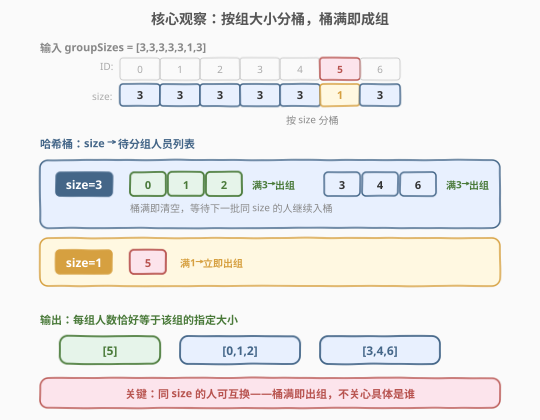
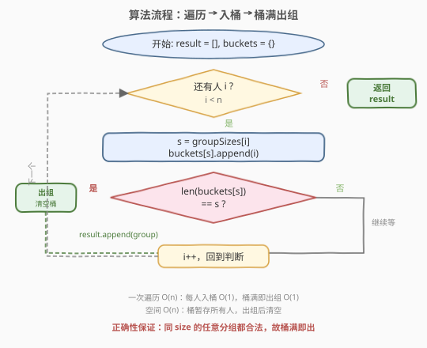
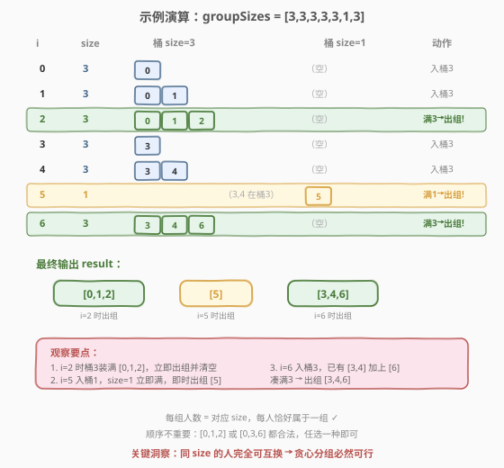

# 用户分组

- **题目名称**：用户分组
- **链接**：[1282. 用户分组](https://leetcode.cn/problems/group-the-people-given-the-group-size-they-belong-to/)
- **难度**：中等
- **标签**：贪心、哈希表、数组

## 1. 题目概述

有 `n` 个人，编号为 `0` 到 `n - 1`，每个人**恰好属于一个组**。给你一个数组 `groupSizes`，其中 `groupSizes[i]` 表示第 `i` 个人所在组的大小。请你返回一个分组方案——一个列表，其中每个子列表代表一个组，包含该组成员的 ID，且每个组的大小恰好等于该组成员在 `groupSizes` 中指定的组大小。

**示例 1**：

```text
输入：groupSizes = [3,3,3,3,3,1,3]
输出：[[5],[0,1,2],[3,4,6]]
解释：第 5 人在 size=1 的组（单独一组）；0,1,2 各需 size=3 凑成一组；3,4,6 各需 size=3 凑成另一组。
```

**示例 2**：

```text
输入：groupSizes = [2,1,3,3,3,2]
输出：[[1],[0,5],[2,3,4]]
解释：第 1 人单独一组（size=1）；0 和 5 各需 size=2 凑成一组；2,3,4 各需 size=3 凑成一组。
```

**约束条件**：

- `groupSizes.length == n`
- `1 <= n <= 500`
- `1 <= groupSizes[i] <= n`

> 💡 **题目保证有解**：由于 `groupSizes[i]` 描述的是合法分组方案，对每个组大小 `s`，需要 `s` 大小组的人数总和一定是 `s` 的倍数。因此贪心凑组一定能凑满，不会出现"差一人"的卡壳情况。

---

## 2. 解题思路

### 2.1 暴力思路：回溯搜索每种分组

把所有人看作待分配集合，逐个尝试将其放入已有组或新建组，用回溯枚举所有可能的分组方式，找到第一个合法解。最坏情况搜索空间巨大（类似集合划分问题，Bell 数级别），`n = 500` 时完全不可行。

问题在于：我们**不需要找某种特定的分组**，任意一种合法方案都行。题目只要求"每人所在组大小正确"，不关心同组内具体是谁——这给了我们贪心的空间。

### 2.2 核心观察：按组大小分桶，桶满即出组



关键洞察是**同一组大小的任意人员可以互换**：

- 如果两个人 `i` 和 `j` 的 `groupSizes[i] == groupSizes[j] == s`，那么把 `i` 和 `j` 放进同一个 size=`s` 的组是完全合法的——题目只约束组的大小，不约束组内成员。
- 因此，我们只需**按 `groupSizes[i]` 的值分桶**：把所有需要 size=`s` 的人收集到一个列表里，每当列表长度达到 `s`，就取出这 `s` 个人作为一个组加入答案，然后清空列表等待下一批。

> 💡 **为什么贪心一定可行？** 题目保证输入来自一个合法分组方案。对任意组大小 `s`，所有 `groupSizes[i] == s` 的人总数一定是 `s` 的倍数（因为他们原本就能被分成若干个 size=`s` 的组）。所以"装满 `s` 个就出组"的策略不会在最后留下零头——每装满一次就出一组，刚好分完。

> ⚠️ **不需要排序或挑选**：同 size 的人谁先进桶无所谓，因为题目不要求特定分组方案。只需按输入顺序遍历，遇到就入桶，满就出组。这是本题能用 `O(n)` 一次遍历完成的根本原因。

### 2.3 算法流程图



**完整步骤**：

1. **初始化**：`result = []`（存分组结果），`buckets = {}`（哈希表，`size → 当前待分组人员列表`）。
2. **遍历**每个人 `i`（`0` 到 `n-1`）：
   - 取 `s = groupSizes[i]`
   - 将 `i` 追加到 `buckets[s]`（若该 key 不存在则先初始化为空列表）
   - **判断**：若 `len(buckets[s]) == s`（桶满）：
     - 将 `buckets[s]` 作为一组加入 `result`
     - 清空 `buckets[s]`（设为空列表，等待下一批同 size 的人）
3. **返回** `result`。

> 💡 **清空 vs 删除**：桶满出组后清空（`buckets[s] = []`）而非删除 key（`del buckets[s]`），因为后续可能还有同 size 的人需要入桶。两种写法功能等价（删除后下次 `append` 会自动创建），但清空更直观地表达了"桶还在，只是空了"。

### 2.4 示例演算

以示例 1 `groupSizes = [3,3,3,3,3,1,3]` 为例，逐人展示桶状态变化：



| i | groupSizes[i] | 桶 size=3 | 桶 size=1 | 动作 |
|---|---------------|-----------|-----------|------|
| 0 | 3 | [0] | — | 入桶3 |
| 1 | 3 | [0,1] | — | 入桶3 |
| 2 | 3 | [0,1,2] → **满！** | — | 出组 [0,1,2]，清空桶3 |
| 3 | 3 | [3] | — | 入桶3 |
| 4 | 3 | [3,4] | — | 入桶3 |
| 5 | 1 | [3,4] | [5] → **满！** | 出组 [5]，清空桶1 |
| 6 | 3 | [3,4,6] → **满！** | — | 出组 [3,4,6]，清空桶3 |

最终 `result = [[0,1,2], [5], [3,4,6]]`。

> 💡 **注意 i=5 的穿插**：虽然桶3里还攒着 [3,4]，但 i=5 需要的是 size=1 的组，它走的是另一个桶（size=1），入桶即满即出组。两个桶互不干扰，这正是按 size 分桶的好处——不同组大小的人各行其道。

---

## 3. 参考代码

### C++

```cpp
class Solution {
public:
    vector<vector<int>> groupThePeople(vector<int>& groupSizes) {
        vector<vector<int>> result;
        unordered_map<int, vector<int>> buckets;
        for (int i = 0; i < groupSizes.size(); i++) {
            int s = groupSizes[i];
            buckets[s].push_back(i);
            if (buckets[s].size() == s) {
                result.push_back(buckets[s]);
                buckets[s].clear();
            }
        }
        return result;
    }
};
```

### Python

```python
class Solution:
    def groupThePeople(self, groupSizes: List[int]) -> List[List[int]]:
        result = []
        buckets = {}
        for i, s in enumerate(groupSizes):
            buckets.setdefault(s, []).append(i)
            if len(buckets[s]) == s:
                result.append(buckets[s])
                buckets[s] = []
        return result
```

> 💡 **`setdefault(s, [])` 的妙用**：当 key `s` 不存在时自动初始化为空列表并返回引用，存在时直接返回已有列表。一行完成"取桶 + 追加"，比 `if s not in buckets: buckets[s] = []` 更简洁。

---

## 4. 复杂度分析

| 维度 | 复杂度 | 说明 |
|------|--------|------|
| **时间** | `O(n)` | 每人恰好入桶一次 `O(1)`、出组一次 `O(1)`，总计 `O(n)` |
| **空间** | `O(n)` | 桶暂存所有尚未出组的人；最坏情况所有人在遍历结束前才出组，暂存 `O(n)`；结果列表也占 `O(n)` |

> ⚠️ **空间上界**：同一时刻各桶中暂存的人数总和不超过 `n`（每人只在某个桶里待到出组为止）。结果列表存了所有人的 ID，也是 `O(n)`。两者合计仍为 `O(n)`。

---

## 5. 扩展：为什么不需要回溯或匹配？

本题乍看像"匹配/分配"问题（类似二分图匹配或区间调度），但实际上是一个**伪分配**问题——约束只涉及组的大小，不涉及成员间的兼容性。这导致：

| 维度 | 真正的分配问题（如二分图匹配） | 本题（伪分配） |
|------|-------------------------------|----------------|
| **约束** | 成员间有兼容性约束（谁能和谁同组） | 只约束组大小，成员间无约束 |
| **策略** | 需搜索/匹配，可能回溯 | 贪心即可，同 size 任意组合 |
| **复杂度** | `O(n^2)` 或更高 | `O(n)` |

> 💡 **识别技巧**：当题目说"任意合法方案均可"且约束只涉及组的大小/容量而非成员间关系时，几乎一定可以贪心。把"谁和谁一组"的自由度利用起来，就能避免搜索。

---

## 6. 面试要点

1. **为什么贪心一定能凑满，不会卡在零头？**

   > 题目保证输入来自一个合法分组方案。对任意组大小 `s`，所有 `groupSizes[i] == s` 的人的总数一定是 `s` 的倍数——因为他们原本就被分成了若干个 size=`s` 的组。所以"装满 `s` 个就出组"的策略每次都能整除，不会留下余数。

2. **桶满后为什么是清空而不是删除 key？**

   > 功能上两者等价（删除后下次 `append` 会自动创建新列表）。但清空 `buckets[s] = []` 更直观地表达"桶还在，等待下一批"的语义，且避免了一次哈希表插入操作。代码可读性更好。

3. **如果题目不保证有解怎么办？**

   > 需在遍历结束后检查所有桶是否都已清空。若某个桶 `buckets[s]` 非空但 `len < s`，说明该 size 的人数不是 `s` 的倍数，无法完整分组，应返回空列表或报错。本题约束保证不会出现这种情况。

4. **能否不用哈希表，用排序代替？**

   > 可以：把 `(groupSizes[i], i)` 按 `groupSizes` 排序，然后连续截取相同 size 的段，每 `s` 个出组。时间 `O(n log n)`，空间 `O(n)`。但哈希表法 `O(n)` 更优，且不需要排序——因为同 size 的人任意组合都合法，输入顺序就够了。

5. **本题与 [49. 字母异位词分组](https://leetcode.cn/problems/group-anagrams/) 的区别？**

   > 49 题按"字母排序后的签名"分桶，桶内所有人共享同一签名但不需要凑满——直接整桶输出。本题按"组大小"分桶，桶满才出组、不满继续等——多了"容量约束"这一维度。两者都是"哈希分桶"范式，但出组时机不同。

> 💡 **一句话总结**：1282 的本质是"按容量分桶 + 桶满出组"——利用同 size 人员可互换的性质，把看似需要搜索的分组问题降为 `O(n)` 贪心。关键是识别"约束只涉及组大小"这一结构，从而避免回溯。

---

## 7. 同类练习题

- [49. 字母异位词分组](https://leetcode.cn/problems/group-anagrams/)：同范式"哈希分桶"，但桶内直接整组输出（无容量约束），对比出组时机差异
- [659. 分割数组为连续子序列](https://leetcode.cn/problems/split-array-into-consecutive-subsequences/)：同样贪心分组，但约束是"连续递增"而非"固定大小"，续接优先策略更复杂
- [1296. 划分数组为连续数字的集合](https://leetcode.cn/problems/divide-array-in-sets-of-k-consecutive-numbers/)：固定大小 `k` + 连续递增双重约束，哈希计数 + 逐个消解
- [1287. 有序数组中出现次数超过 25% 的元素](https://leetcode.cn/problems/element-appearing-more-than-25-in-sorted-array/)：同为 1280 区间的哈希/计数类题，对比不同计数场景
- [249. 移位字符串分组](https://leetcode.cn/problems/group-shifted-strings/)：按"移位签名"哈希分桶，同 49 的思路，桶内直接输出
