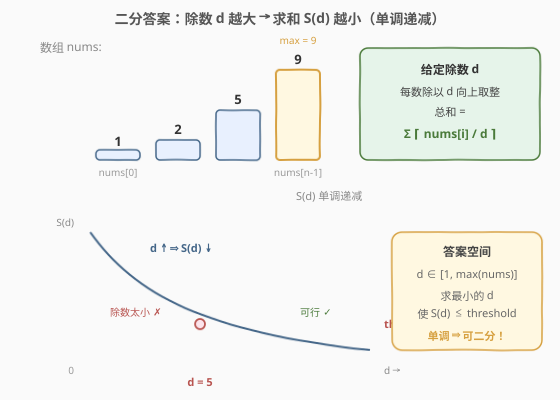
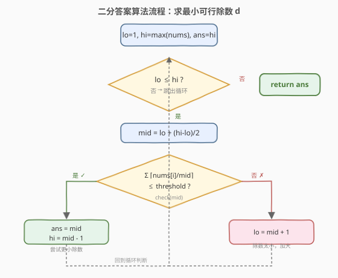

# LeetCode 使结果不超过阈值的最小除数 题解

## 1. 题目概述

- **标题 / 题号**：使结果不超过阈值的最小除数（#1283，medium）
- **链接**：https://leetcode.cn/problems/find-the-smallest-divisor-given-a-threshold/
- **难度**：中等
- **标签**：数组、二分查找

**题意**：给你一个整数数组 `nums` 和一个正整数 `threshold`，你需要选择一个正整数作为**除数**，然后将数组里每个数都除以它，并对除法结果**求和**（每个数除以除数后都**向上取整**）。

请你找出能够使上述和小于等于 `threshold` 的除数中**最小**的那个。题目保证一定有解。

**示例 1**：

```text
输入：nums = [1,2,5,9], threshold = 6
输出：5
解释：除数 = 1 时，和为 17（1+2+5+9）。
     除数 = 4 时，和为 7（1+1+2+3）。
     除数 = 5 时，和为 5（1+1+1+2）≤ 6，是最小的可行除数。
```

**示例 2**：

```text
输入：nums = [2,3,5,7,11], threshold = 11
输出：3
```

**示例 3**：

```text
输入：nums = [19], threshold = 5
输出：4
```

**约束**：

- `1 <= nums.length <= 5 * 10^4`
- `1 <= nums[i] <= 10^6`
- `nums.length <= threshold <= 10^6`

## 2. 解题思路

### 2.1 暴力思路

除数 `d` 的取值范围是 `[1, max(nums)]`（再大也没意义，见 2.2）。从 `d = 1` 开始逐个尝试，对每个 `d` 计算 $S(d) = \sum \lceil \text{nums}[i] / d \rceil$，第一个满足 $S(d) \le \text{threshold}$ 的 `d` 即为答案。验证单个 `d` 是 `O(n)`，整体 `O(n * max(nums))`，而 `max(nums)` 可达 `10^6`，必然超时。

### 2.2 核心观察：二分答案



关键直觉是：**求和 $S(d)$ 关于除数 $d$ 单调递减**。

- $d$ 越大，每个 $\lceil \text{nums}[i] / d \rceil$ 越小（或不变），总和越小。
- $d = 1$ 时最慢（$S = \sum \text{nums}[i]$，可能远超 `threshold`）；$d = \max(\text{nums})$ 时每项取整后均为 `1`，$S = n \le \text{threshold}$（题目保证 `threshold >= nums.length`），必然可行。

于是存在一个**分界点** $d^*$：

```text
d < d*  → S(d) > threshold   (除数太小，和超阈值)
d >= d* → S(d) <= threshold   (可行，和达标)
```

这正是二分查找所需的**二段性**。把「求最小可行 $d$」转化为：在有序区间 `[1, max(nums)]` 上二分，每次 `O(n)` 验证 `mid` 是否可行，可行则去左半找更小的，不可行则去右半加大除数。

> 💡 **识别信号**：题目求「最小的满足某单调条件值」，且能 `O(n)` 验证候选值是否合法 → 想「二分答案」。本题与 [875. 爱吃香蕉的珂珂](../0801-0900/875_爱吃香蕉的珂珂.md) 几乎同构：`d` 对应吃速 `k`，`threshold` 对应小时数 `h`，`check()` 都是 $\sum \lceil \text{nums}[i] / d \rceil$。

> ⚠️ **上界取 `max(nums)` 即可**：当 $d \ge \max(\text{nums})$，每个 $\lceil \text{nums}[i] / d \rceil$ 恒为 `1`，总和恒为 $n$，再增大 $d$ 不会更优。无需取更大的上界（如 `10^6`），可减少约 20 次无效二分。

### 2.3 算法流程图



注意判定为「可行」时**先记录 `ans = mid` 再收缩右界**（`hi = mid - 1`），保证最终保留的是「最小的可行值」。

### 2.4 示例演算

![示例演算：nums = [1,2,5,9], threshold = 6](../images/divisor_threshold_example_walkthrough.svg)

以 `nums = [1,2,5,9]`、`threshold = 6` 为例，`max=9`，答案区间 `[1, 9]`：

- **第 1 轮** `[1,9]`，`mid=5`，$S=1+1+1+2=5 \le 6$ ✓ → 可行，记 `ans=5`，去左半 `[1,4]`。
- **第 2 轮** `[1,4]`，`mid=2`，$S=1+1+3+5=10 > 6$ ✗ → 除数太小，去右半 `[3,4]`。
- **第 3 轮** `[3,4]`，`mid=3`，$S=1+1+2+3=7 > 6$ ✗ → 除数太小，去右半 `[4,4]`。
- **第 4 轮** `[4,4]`，`mid=4`，$S=1+1+2+3=7 > 6$ ✗ → 除数太小，`lo=5`。
- **第 5 轮** `lo=5 > hi=4`，循环结束，返回 `ans=5`。

## 3. 参考代码

### C++

```cpp
class Solution {
  public:
    int smallestDivisor(vector<int>& nums, int threshold) {
        int lo = 1;
        int hi = *max_element(nums.begin(), nums.end());
        int ans = hi;

        while (lo <= hi) {
            int mid = lo + (hi - lo) / 2;
            long sum = 0; // 防溢出：d=1 时 sum 可达 5e10
            for (int x : nums) {
                sum += (x + mid - 1) / mid; // 向上取整 ceil(x / mid)
            }
            if (sum <= threshold) {
                ans = mid;      // 可行，尝试更小除数
                hi = mid - 1;
            } else {
                lo = mid + 1;   // 除数太小，加大
            }
        }
        return ans;
    }
};
```

### Python

```python
class Solution:
    def smallestDivisor(self, nums: List[int], threshold: int) -> int:
        lo, hi = 1, max(nums)
        ans = hi

        while lo <= hi:
            mid = (lo + hi) // 2
            s = sum((x + mid - 1) // mid for x in nums)  # 向上取整
            if s <= threshold:
                ans = mid       # 可行，尝试更小除数
                hi = mid - 1
            else:
                lo = mid + 1    # 除数太小，加大
        return ans
```

> ⚠️ **两个易错点**：
> 1. **溢出**：`d=1` 时 $S = \sum \text{nums}[i]$，可达 $5 \times 10^4 \times 10^6 = 5 \times 10^{10}$，远超 32 位 `int` 上界（约 $2.1 \times 10^9$）。C++ 必须用 `long` 累加，否则溢出导致判定错误。Python 整数无上限无此问题。
> 2. **向上取整**：用整数运算 `(x + mid - 1) / mid`，避免浮点 `ceil((double)x / mid)` 的精度问题（`x` 可达 `10^6`，虽未到 `double` 精度极限，但整数公式更安全且统一）。

## 4. 复杂度分析

| 维度 | 复杂度 | 说明 |
|------|--------|------|
| 时间复杂度 | O(n log M) | `M = max(nums)`；二分 `O(log M)` 次，每次验证 `O(n)` |
| 空间复杂度 | O(1) | 仅用常数额外变量 |

> 💡 由于 `nums[i] <= 10^6`，`log M ≈ 20`，`n <= 5 * 10^4`，总运算量约 `10^6`，远低于时限。

## 5. 扩展：与 875 爱吃香蕉的珂珂的对照

本题与 [875. 爱吃香蕉的珂珂](../0801-0900/875_爱吃香蕉的珂珂.md) 骨架完全一致——都是「二分答案 + 单调性验证」。下表对照两题的关键要素：

| 要素 | 875 爱吃香蕉的珂珂 | 1283 最小除数 |
|------|---------------------|---------------|
| 待求变量 | 吃速 `k`（根/小时） | 除数 `d` |
| 上界依据 | `max(piles)`（每堆 1 小时） | `max(nums)`（每项取整为 1） |
| 阈值含义 | 总小时数 `h` | 总和 `threshold` |
| `check()` | $\sum \lceil \text{piles}[i] / k \rceil \le h$ | $\sum \lceil \text{nums}[i] / d \rceil \le \text{threshold}$ |
| 保证有解条件 | `h >= piles.length` | `threshold >= nums.length` |

两题的 `check()` 函数**逐字相同**（都是向上取整求和），只是变量名不同。掌握这套「**二分答案框架 + 自定义 check**」的范式，可秒杀一整类「最小化满足单调条件的值」题。

> 💡 **与 [1011. 在 D 天内送达包裹的能力](../1001-1100/1011_在D天内送达包裹的能力.md) 的差别**：1011 的 `check()` 是贪心模拟装船（状态机式累加，跨天重置 `cur`），而 875/1283 的 `check()` 是纯数学求和。同属二分答案家族，但 `check()` 的实现形态不同。

## 6. 面试要点

1. **为什么能二分？二段性体现在哪？**

   - $S(d)$ 随 $d$ 单调递减。存在分界点 $d^*$，使 $d < d^*$ 时和超阈值、$d \ge d^*$ 时和达标。这种「左不合法 / 右合法」的结构就是二段性，可用二分定位 $d^*$。

2. **上界为什么取 `max(nums)` 而不是更大的数？**

   - 当 $d \ge \max(\text{nums})$，每个 $\lceil \text{nums}[i] / d \rceil$ 恒为 `1`，总和恒为 $n$，再增大 $d$ 不再改变总和。又因题目保证 `threshold >= nums.length`，$d = \max(\text{nums})$ 必然可行，所以它就是合法上界，取更大的值只会浪费二分次数。

3. **`sum` 求和为什么会溢出？怎么处理？**

   - $d=1$ 时 $S = \sum \text{nums}[i]$，最大 $5 \times 10^4 \times 10^6 = 5 \times 10^{10}$，超过 32 位 `int` 上界（约 $2.1 \times 10^9$）。C++ 用 `long` 累加即可；Python 整数无上限无此问题。

4. **向上取整为什么用 `(x + mid - 1) / mid` 而非浮点？**

   - 整数公式 $(x + \text{mid} - 1) / \text{mid}$ 等价于 $\lceil x / \text{mid} \rceil$ 且无精度问题，与 [875](../0801-0900/875_爱吃香蕉的珂珂.md) 写法统一。浮点 `ceil((double)x / mid)` 虽在本题数据范围内未必出错，但整数公式更安全、更快。

5. **如果 `threshold == nums.length`，答案是什么？**

   - 此时每项取整后必须恰好为 `1`（否则总和会超过 $n$），即 $d \ge \max(\text{nums})$。又因上界就是 `max(nums)`，故答案即 `max(nums)`。可作为快速边界判断。

## 同类练习题

| # | 题目 | 与本题的关联 |
|---|------|-------------|
| 875 | [爱吃香蕉的珂珂](https://leetcode.cn/problems/koko-eating-bananas/) | 同模板，二分吃香蕉速度 `k`，`check` 用向上取整求和，求最小可行 `k`，与本题几乎同构 |
| 1011 | [在 D 天内送达包裹的能力](https://leetcode.cn/problems/capacity-to-ship-packages-within-d-days/) | 同模板，二分船的运载能力，`check` 用贪心按天装货 |
| 410 | [分割数组的最大值](https://leetcode.cn/problems/split-array-largest-sum/) | 二分「最大子数组和」上限，`check` 贪心划分子数组 |
| 2064 | [分配给商店的最小商品数量](https://leetcode.cn/problems/minimized-maximum-of-products-distributed-to-any-store/) | 最大化最小值的二分答案，`check` 统计所需商店数 |
