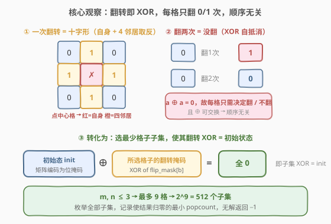
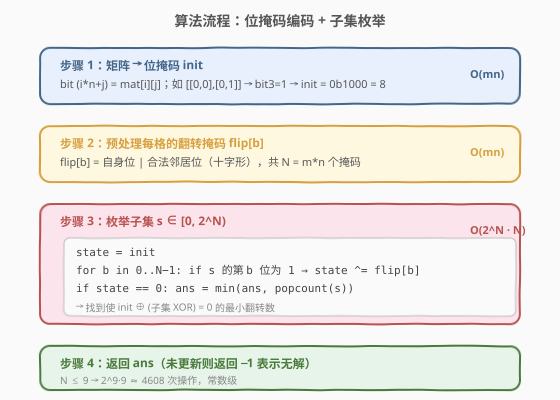
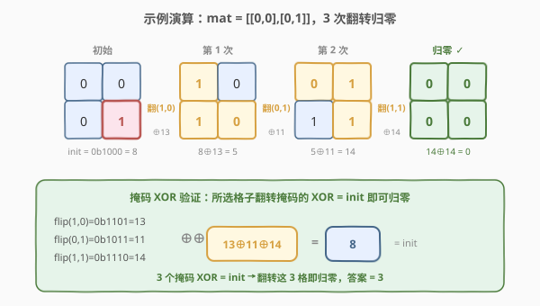

# LeetCode 转化为全零矩阵的最少反转次数 题解

## 1. 题目概述

- **标题 / 题号**：转化为全零矩阵的最少反转次数（#1284，hard）
- **链接**：https://leetcode.cn/problems/minimum-number-of-flips-to-convert-binary-matrix-to-zero-matrix/
- **难度**：困难
- **标签**：位运算、枚举、状态压缩、广度优先搜索

**题意**：给定一个 $m \times n$ 的二进制矩阵 `mat`。每一步你可以选择**一个**单元格将它反转（`0` 变 `1`，`1` 变 `0`），如果存在和它相邻（共享一条边）的单元格，那么**这些相邻的单元格也会被反转**。请返回将 `mat` 转化为**全零矩阵**的最少反转次数；若无法转化则返回 $-1$。

> ⚠️ **关键点**：一次操作翻转的是「**十字形**」——选中的格子本身 + 上下左右 4 个邻居（边界处邻居少）。这与 [319. 灯泡开关](https://leetcode.cn/problems/bulb-switcher/) 的全局翻转不同，是**局部**翻转。

**示例 1**：

```text
输入：mat = [[0,0],[0,1]]
输出：3
解释：一个可能的解是反转 (1, 0)，然后 (0, 1) ，最后是 (1, 1)。
```

**示例 2**：

```text
输入：mat = [[0]]
输出：0
解释：给出的矩阵已经是全零矩阵。
```

**示例 3**：

```text
输入：mat = [[1,0,0],[1,0,0]]
输出：-1
解释：该矩阵无法转变成全零矩阵。
```

**约束**：

- $m = \text{mat.length}$，$n = \text{mat}[i].\text{length}$
- $1 \le m \le 3$
- $1 \le n \le 3$
- $\text{mat}[i][j]$ 是 `0` 或 `1`

> 💡 **关键信号**：$m, n \le 3$ → 矩阵最多 $9$ 格。这是极小的规模，强烈暗示**状态压缩 + 暴力枚举**。$2^9 = 512$ 个子集，枚举绰绰有余。

## 2. 解题思路

### 2.1 暴力思路：BFS 模拟每次翻转

最直观的想法：把矩阵的每个状态编码成一个整数（位掩码），从初始状态出发做 **BFS**——每次枚举所有 $m \times n$ 个格子作为翻转点，计算翻转后的新状态，逐层扩展，第一次到达全零状态时的层数即为答案。

- 状态数最多 $2^9 = 512$，BFS 最多遍历 512 个状态
- 每个状态扩展 $9$ 条边（每个格子一次翻转）
- 总复杂度 $O(2^{mn} \cdot mn)$，完全可行

BFS 正确但稍重——它把「翻转序列」当成有顺序的路径来搜。实际上翻转操作有更深的代数性质可以利用。

### 2.2 核心观察：翻转即 XOR，转化为子集选择



关键洞察来自翻转操作的两个代数性质：

> 💡 **性质一（自反性）**：翻转同一个格子**两次**等于**没翻**。因为翻转 = 异或（XOR）一个掩码，而 $a \oplus a = 0$。所以每个格子**最终要么翻 0 次要么翻 1 次**——翻偶数次等价于 0 次，翻奇数次等价于 1 次。

> 💡 **性质二（交换律）**：翻转的**顺序不影响结果**。因为 XOR 满足交换律和结合律，无论以什么顺序翻转同一组格子，最终状态相同。

由这两条性质，问题发生**根本性简化**：

$$\text{不再问「翻转序列」，而是问「选哪个格子子集来翻转」}$$

设 `flip[b]` 表示翻转第 $b$ 个格子时会影响到的位掩码（自身 + 合法邻居，即十字形），`init` 为初始矩阵编码的位掩码。目标是选一个**最小**的格子子集 $S$，使得：

$$\text{init} \oplus \bigoplus_{b \in S} \text{flip}[b] = 0 \quad\Longleftrightarrow\quad \bigoplus_{b \in S} \text{flip}[b] = \text{init}$$

即**所选格子的翻转掩码 XOR 等于初始状态**。在「翻 / 不翻」的二选一里，求使等式成立的最小翻转数（$|S|$ 的最小值）。

> ⚠️ 这其实是一个 **GF(2) 上的线性方程组**（每个格子最终是否为 0 给出一个方程，未知数是该格是否翻转）。$m,n \le 3$ 时未知数最多 9 个，直接枚举 $2^9$ 个取值组合即可，无需高斯消元。

### 2.3 算法流程图



1. **编码**：把矩阵 `mat` 压成一个整数 `init`，第 $i \times n + j$ 位为 `mat[i][j]`
2. **预处理翻转掩码**：对每个格子 $b = (i, j)$，`flip[b]` = 自身位 `|` 所有合法邻居位（上下左右在界内的）
3. **枚举子集**：遍历 $s \in [0, 2^N)$（$N = m \cdot n$），对每个 $s$ 计算 `state = init ^ (flip[b] for b in s 的为 1 的位)`；若 `state == 0`，用 `popcount(s)` 更新答案
4. **返回**：答案未更新则返回 $-1$（无解），否则返回最小翻转数

### 2.4 示例演算

以示例 1 `mat = [[0,0],[0,1]]`（$m=n=2$，$N=4$）为例：



| 步骤 | 操作 | 影响格子 | 矩阵状态 | 掩码 state |
|------|------|----------|----------|-----------|
| 初始 | — | — | `[[0,0],[0,1]]` | `init = 0b1000 = 8` |
| 第 1 次 | 翻 $(1,0)$ | $(1,0),(0,0),(1,1)$ | `[[1,0],[1,0]]` | $8 \oplus 13 = 5$ |
| 第 2 次 | 翻 $(0,1)$ | $(0,1),(0,0),(1,1)$ | `[[0,1],[1,1]]` | $5 \oplus 11 = 14$ |
| 第 3 次 | 翻 $(1,1)$ | $(1,1),(0,1),(1,0)$ | `[[0,0],[0,0]]` ✓ | $14 \oplus 14 = 0$ |

各格翻转掩码（$b$ 按 $i \times n + j$ 编号）：

| 格子 | $b$ | 影响位 | flip 掩码 |
|------|-----|--------|----------|
| $(0,0)$ | 0 | 自身 + $(0,1)$ + $(1,0)$ | `0b0111 = 7` |
| $(0,1)$ | 1 | 自身 + $(0,0)$ + $(1,1)$ | `0b1011 = 11` |
| $(1,0)$ | 2 | 自身 + $(0,0)$ + $(1,1)$ | `0b1101 = 13` |
| $(1,1)$ | 3 | 自身 + $(0,1)$ + $(1,0)$ | `0b1110 = 14` |

验证：$13 \oplus 11 \oplus 14 = 8 = \text{init}$ ✓，翻转 3 格即归零，答案为 $3$。

> 💡 **顺序无关的体现**：无论先翻 $(1,0)$ 还是先翻 $(1,1)$，只要这 3 格各翻一次，最终都归零。BFS 会把 6 种排列都搜到，而子集枚举只看一个组合——这就是代数化简的收益。

## 3. 参考代码

### 方法一：位掩码 + 子集枚举（推荐）

### C++

```cpp
class Solution {
  public:
    int minFlips(vector<vector<int>>& mat) {
        int m = mat.size(), n = mat[0].size();
        int N = m * n;

        // 步骤 1：矩阵编码为位掩码
        int init = 0;
        for (int i = 0; i < m; ++i)
            for (int j = 0; j < n; ++j)
                if (mat[i][j]) init |= 1 << (i * n + j);

        // 步骤 2：预处理每格的翻转掩码（自身 + 合法邻居）
        int dx[4] = {0, 0, 1, -1};
        int dy[4] = {1, -1, 0, 0};
        int flip[9];
        for (int i = 0; i < m; ++i)
            for (int j = 0; j < n; ++j) {
                int mask = 1 << (i * n + j);
                for (int d = 0; d < 4; ++d) {
                    int ni = i + dx[d], nj = j + dy[d];
                    if (ni >= 0 && ni < m && nj >= 0 && nj < n)
                        mask |= 1 << (ni * n + nj);
                }
                flip[i * n + j] = mask;
            }

        // 步骤 3：枚举全部子集
        int ans = INT_MAX;
        for (int s = 0; s < (1 << N); ++s) {
            int state = init;
            for (int b = 0; b < N; ++b)
                if (s >> b & 1) state ^= flip[b];
            if (state == 0) ans = min(ans, __builtin_popcount(s));
        }
        return ans == INT_MAX ? -1 : ans;
    }
};
```

### Python

```python
class Solution:
    def minFlips(self, mat: List[List[int]]) -> int:
        m, n = len(mat), len(mat[0])
        N = m * n

        # 步骤 1：矩阵编码为位掩码
        init = 0
        for i in range(m):
            for j in range(n):
                if mat[i][j]:
                    init |= 1 << (i * n + j)

        # 步骤 2：预处理每格的翻转掩码（自身 + 合法邻居）
        dirs = [(0, 1), (0, -1), (1, 0), (-1, 0)]
        flip = [0] * N
        for i in range(m):
            for j in range(n):
                mask = 1 << (i * n + j)
                for di, dj in dirs:
                    ni, nj = i + di, j + dj
                    if 0 <= ni < m and 0 <= nj < n:
                        mask |= 1 << (ni * n + nj)
                flip[i * n + j] = mask

        # 步骤 3：枚举全部子集
        ans = float('inf')
        for s in range(1 << N):
            state = init
            for b in range(N):
                if s >> b & 1:
                    state ^= flip[b]
            if state == 0:
                ans = min(ans, bin(s).count('1'))
        return -1 if ans == float('inf') else ans
```

> 💡 **核心要点**：把「翻转序列」问题代数化为「子集 XOR = init」问题，利用 $m,n \le 3$ 的小规模直接枚举 $2^{mn}$ 个子集。`__builtin_popcount` / `bin(s).count('1')` 求 $|S|$。

## 4. 复杂度分析

| 维度 | 复杂度 | 说明 |
|------|--------|------|
| 时间复杂度 | $O(2^{mn} \cdot mn)$ | 枚举 $2^{mn}$ 个子集，每个子集最多 XOR $mn$ 个掩码；$mn \le 9$ 时约 $4608$ 次操作 |
| 空间复杂度 | $O(mn)$ | 存储 $mn$ 个翻转掩码 `flip[]` + 常数个变量 |

> 💡 本题 $mn \le 9$，$2^9 \cdot 9 \approx 4608$，常数级。即便 $mn = 16$（$4 \times 4$）也仅约 $10^6$ 量级，仍可接受。真正受限于 $2^{mn}$ 的指数增长——当 $mn \ge 20$ 时需改用 GF(2) 高斯消元（见第 5 节）。

## 5. 扩展：BFS 求最短路径 与 GF(2) 线性方程组

### 5.1 BFS 视角：把翻转当成状态图上的边

子集枚举利用了 XOR 的交换律直接跳过顺序；BFS 则保留「逐次翻转」的过程感，把问题建模为**无权图最短路**：节点 = 矩阵状态（位掩码），边 = 一次翻转。从 `init` 出发 BFS，首次到达 `0` 的层数即为最少翻转数。

```cpp
class Solution {
  public:
    int minFlips(vector<vector<int>>& mat) {
        int m = mat.size(), n = mat[0].size(), N = m * n;
        int dx[4] = {0, 0, 1, -1}, dy[4] = {1, -1, 0, 0};

        int init = 0;
        for (int i = 0; i < m; ++i)
            for (int j = 0; j < n; ++j)
                if (mat[i][j]) init |= 1 << (i * n + j);

        // 预处理翻转掩码
        int flip[9];
        for (int i = 0; i < m; ++i)
            for (int j = 0; j < n; ++j) {
                int mask = 1 << (i * n + j);
                for (int d = 0; d < 4; ++d) {
                    int ni = i + dx[d], nj = j + dy[d];
                    if (ni >= 0 && ni < m && nj >= 0 && nj < n)
                        mask |= 1 << (ni * n + nj);
                }
                flip[i * n + j] = mask;
            }

        if (init == 0) return 0;
        vector<int> dist(1 << N, -1);
        queue<int> q;
        q.push(init);
        dist[init] = 0;
        while (!q.empty()) {
            int u = q.front(); q.pop();
            for (int b = 0; b < N; ++b) {
                int v = u ^ flip[b];
                if (dist[v] == -1) {
                    dist[v] = dist[u] + 1;
                    if (v == 0) return dist[v];
                    q.push(v);
                }
            }
        }
        return -1;
    }
};
```

| 维度 | 子集枚举 | BFS |
|------|---------|-----|
| 思路 | 代数化：子集 XOR = init | 图论化：状态图最短路 |
| 时间 | $O(2^{mn} \cdot mn)$ | $O(2^{mn} \cdot mn)$ |
| 空间 | $O(mn)$ | $O(2^{mn})$（距离数组） |
| 优势 | 无需队列/距离表，空间更省 | 直观，天然求「最少步数」 |
| 推荐 | $mn$ 小时首选 | 思路清晰的对照解法 |

> 💡 两者时间同阶，但子集枚举空间 $O(mn)$ 远优于 BFS 的 $O(2^{mn})$。本题 $mn \le 9$ 差异不大，但体现「**用代数性质压缩搜索空间**」的思维。

### 5.2 GF(2) 线性方程组（大规模通用解）

当 $mn$ 较大（如 $20+$）时，$2^{mn}$ 枚举不可行。此时注意到：对每个格子 $(i,j)$，其最终值是否为 0 给出一个 GF(2) 上的方程——

$$\bigoplus_{(p,q) \in \text{十字}(i,j)} x_{p,q} = \text{mat}[i][j]$$

其中 $x_{p,q} \in \{0,1\}$ 表示是否翻转 $(p,q)$。这是 $mn$ 个方程、$mn$ 个未知数的 GF(2) 线性方程组，可用**高斯消元**在 $O((mn)^3)$ 内判定是否有解。若有解，自由变量取值使 $\sum x$ 最小（NP-hard 的子集选择在自由变量少时可枚举）。本题 $mn \le 9$ 无需此法，但这是「翻转类问题」的通用框架。

## 6. 面试要点

1. **为什么每个格子只需考虑翻 0 或 1 次？**

   翻转等价于 XOR 一个掩码，而 $a \oplus a = 0$（自反性）。翻同一格偶数次相互抵消等价于不翻，奇数次等价于翻一次。故只需决定每格「翻 / 不翻」。

2. **为什么翻转顺序不影响结果？**

   XOR 满足交换律和结合律。无论以何种顺序翻转同一组格子，最终状态 = 初始状态 $\oplus$（这组格子翻转掩码的 XOR），与顺序无关。这让问题从「序列搜索」降为「子集选择」。

3. **如何判断无解（返回 $-1$）？**

   枚举完所有 $2^{mn}$ 个子集后，若没有任何子集的翻转掩码 XOR 等于 `init`（即没有任何 `state == 0`），说明不存在翻转方案，返回 $-1$。这对应 GF(2) 方程组无解的情况（如示例 3）。

4. **子集枚举和 BFS 的本质区别是什么？**

   BFS 把翻转当成**有序路径**逐层搜索，会重复访问同一状态的多种到达方式（用 `dist` 去重）。子集枚举利用交换律直接枚举**组合**，跳过顺序冗余。两者时间同阶，但子集枚举空间 $O(mn)$ 远优于 BFS 的 $O(2^{mn})$。

5. **如果 $m, n$ 放大到 $20 \times 20$ 怎么办？**

   $2^{400}$ 枚举不可行。此时应建模为 GF(2) 线性方程组，用高斯消元 $O((mn)^3)$ 判定解的存在性。但求「最小翻转数」在自由变量存在时是 NP-hard，需结合具体结构（如本题十字形结构有特殊解法）。面试中点出这一上界即可。

## 同类练习题

| # | 题目 | 与本题的关联 |
|---|------|-------------|
| 319 | [灯泡开关](https://leetcode.cn/problems/bulb-switcher/) | 翻转类问题的入门，全局开关灯泡，数学求完全平方数个数 |
| 1375 | [灯泡开关 IV](https://leetcode.cn/problems/bulb-switcher-iv/) | 位掩码 + 贪心翻转，从高位到低位逐位消解差异 |
| 995 | [K 连续位的最小翻转次数](https://leetcode.cn/problems/minimum-number-of-k-consecutive-bit-flips/) | 滑动窗口 + 贪心翻转，差分数组维护翻转次数，本题的「区间翻转」变体 |
| 861 | [翻转矩阵后的得分](https://leetcode.cn/problems/score-after-flipping-matrix/) | 矩阵行/列翻转 + 贪心最大化二进制得分，行翻锁最高位、列翻各列独立 |
| 782 | [变为棋盘](https://leetcode.cn/problems/transform-to-chessboard/) | 矩阵行列翻转判定能否变为棋盘，GF(2) 思想与行列计数校验 |
