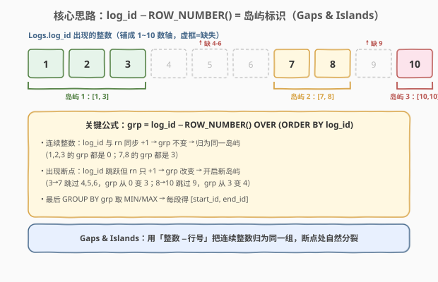
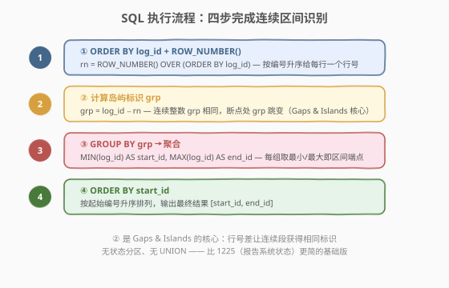
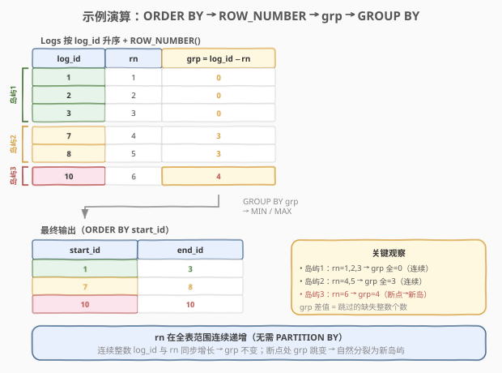

# 找到连续区间的开始和结束数字

- **题目名称**：找到连续区间的开始和结束数字
- **链接**：[1285. 找到连续区间的开始和结束数字](https://leetcode.cn/problems/find-the-start-and-end-number-of-continuous-ranges/)
- **难度**：中等
- **标签**：数据库、SQL、窗口函数、Gaps & Islands、GROUP BY

## 1. 题目概述

给定一张 `Logs` 表，只有一个整数列 `log_id`（主键）。编写 SQL 查询，找出 `log_id` 中所有**连续区间**的起始编号 `start_id` 和结束编号 `end_id`，结果按 `start_id` 升序排列。

**表结构**：

```text
Table: Logs
+-------------+---------+
| Column Name | Type    |
+-------------+---------+
| log_id      | int     |  ← 主键
+-------------+---------+
```

**示例 1**：

```text
输入：
Logs 表：
+--------+
| log_id |
+--------+
| 1      |
| 2      |
| 3      |
| 7      |
| 8      |
| 10     |
+--------+

输出：
+----------+--------+
| start_id | end_id |
+----------+--------+
| 1        | 3      |
| 7        | 8      |
| 10       | 10     |
+----------+--------+
```

**解释**：`1,2,3` 连续 → `[1, 3]`；`7,8` 连续 → `[7, 8]`；`10` 单独成段 → `[10, 10]`。中间缺失的 `4,5,6` 和 `9` 把序列切分成三段。

> 💡 本题是 **Gaps & Islands（间隙与岛屿）** 的最纯粹形式——单列整数、无状态标签、无分区。核心技巧是用窗口函数 `ROW_NUMBER()` 与 `log_id` 做差，让连续整数获得相同的「岛屿标识」，再用 `GROUP BY` 聚合取 `MIN/MAX`。它是 [1225. 报告系统状态的连续日期](1225_报告系统状态的连续日期.md) 的「无状态分区」基础版。

---

## 2. 解题思路

### 2.1 暴力思路：自连接找断点

直觉思路：把 `Logs` 与自身按 `log_id` 排序后逐行对比——如果当前行 `log_id` 比上一行大 1，则属于同一段；否则开始新段。每段记录起始和结束编号。

但「看上一行」在纯 SQL 里需要换成集合式表达。常见暴力写法是**自连接 + 找每段的起点**：

- 起点 `start_id`：该 `log_id` 在表中**不存在前驱**（即 `log_id - 1` 不在表中）。
- 终点 `end_id`：该 `log_id` 在表中**不存在后继**（即 `log_id + 1` 不在表中）。
- 再把起点和终点按顺序配对。

这种写法需要两趟 `LEFT JOIN`（找前驱/后继）外加配对逻辑，嵌套层级多、可读性差，且配对时容易出错。更优雅的方案是经典的 **Gaps & Islands** 模式——一趟窗口函数搞定。

### 2.2 核心观察：log_id − ROW_NUMBER() = 岛屿标识



**关键洞察**：对 `Logs` 按 `log_id` 升序排列后，用 `ROW_NUMBER() OVER (ORDER BY log_id)` 给每行编号 `rn`。此时：

$$
\text{grp} = \text{log\_id} - \text{rn}
$$

**为什么这个差值能识别连续段？**

- **连续整数**：`log_id` 每行递增 1，行号 `rn` 也递增 1 → $\text{log\_id} - \text{rn}$ **不变** → 同一岛屿
- **出现断点**：`log_id` 跳跃（如从 3 跳到 7），但 `rn` 只递增 1 → $\text{log\_id} - \text{rn}$ **改变** → 新岛屿

以示例数据为例：

| log_id | rn | grp = log_id − rn |
|--------|-----|-------------------|
| 1 | 1 | 0 |
| 2 | 2 | 0 |
| 3 | 3 | 0 |
| 7 | 4 | 3 |
| 8 | 5 | 3 |
| 10 | 6 | 4 |

前三行 `1,2,3` 的 `grp` 都是 `0`（同一岛屿）；`7,8` 的 `grp` 都是 `3`（同一岛屿）；`10` 的 `grp` 变成 `4`（新岛屿）。

> 💡 **grp 的差值 = 跳过的缺失整数个数**：从岛屿 1（grp=0）到岛屿 2（grp=3），差 3，正好是缺失的 `4,5,6` 三个数；从岛屿 2（grp=3）到岛屿 3（grp=4），差 1，正好是缺失的 `9` 一个数。这是因为每缺失一个整数，`log_id` 多跳 1 而 `rn` 不跳，`grp` 就多增 1。

> ⚠️ **为什么本题不需要 `PARTITION BY`？** [1225](1225_报告系统状态的连续日期.md) 需要按状态 `st` 分区，因为 succeeded/failed 是两套独立的日期序列混在一起。本题只有一列整数、无状态标签，所有行在同一条时间线上，直接在全表范围内编号即可。这是本题比 1225 更简单的根本原因。

### 2.3 算法流程图



**完整步骤**：

1. **ORDER BY log_id + ROW_NUMBER()**：`rn = ROW_NUMBER() OVER (ORDER BY log_id)`，按编号升序给每行一个行号
2. **计算岛屿标识 grp**：`grp = log_id - rn`，连续整数 grp 相同，断点处 grp 跳变
3. **GROUP BY grp → 聚合**：`MIN(log_id) AS start_id`、`MAX(log_id) AS end_id`，每组取最小/最大即区间端点
4. **ORDER BY start_id**：按起始编号升序输出

> 💡 **SQL 子句执行顺序**：`FROM` → 窗口函数（`SELECT` 中的 `OVER`）→ `GROUP BY` → `HAVING` → `SELECT` → `ORDER BY`。步骤 ①② 的窗口函数在 `GROUP BY` 之前执行，必须包在子查询/CTE 中，外层再做 `GROUP BY`。

### 2.4 示例演算

以示例 1 数据为例，完整的排序 → 行号 → grp → 分组聚合过程如下：



**第一步：ORDER BY log_id + ROW_NUMBER()**

`Logs` 本身已按 `log_id` 升序（主键有序），`ROW_NUMBER()` 编号 `rn = 1..6`：

| log_id | rn |
|--------|-----|
| 1 | 1 |
| 2 | 2 |
| 3 | 3 |
| 7 | 4 |
| 8 | 5 |
| 10 | 6 |

> ⚠️ 注意 `rn` 在**全表范围**内连续递增——`7` 的 rn=**4**（不是 1），因为它接续前面三行编号。这正是检测断点的关键：`3→7` 之间隔了 `4,5,6`，rn 只增加了 1（从 3 到 4），而 `log_id` 增加了 4，所以 `grp` 从 `0` 跳到 `3`。

**第二步：计算 grp = log_id − rn**

| log_id | rn | grp |
|--------|-----|-----|
| 1 | 1 | **0** |
| 2 | 2 | **0** |
| 3 | 3 | **0** |
| 7 | 4 | **3** |
| 8 | 5 | **3** |
| 10 | 6 | **4** |

**第三步：GROUP BY grp → MIN/MAX**

| 分组 grp | 行 | start_id = MIN(log_id) | end_id = MAX(log_id) |
|----------|-----|------------------------|----------------------|
| 0 | 1, 2, 3 | 1 | 3 |
| 3 | 7, 8 | 7 | 8 |
| 4 | 10 | 10 | 10 |

**第四步：ORDER BY start_id** → 最终输出 3 行，与预期一致。

> 💡 **10 为什么单独成岛？** 它的 `grp=4`，与前面 `7,8` 的 `grp=3` 不同，说明 `8→10` 之间有断点（缺失 `9`），因此 `10` 开启新的一段。即使只有一个数，也是一个合法的「连续区间」。

---

## 3. 参考代码

### MySQL（解法 A：CTE + ROW_NUMBER，推荐）

```sql
# 1285. 找到连续区间的开始和结束数字
# 思路：ROW_NUMBER 按 log_id 编号 → log_id − rn = 岛屿标识 → GROUP BY 取 MIN/MAX
WITH Ranked AS (
    SELECT
        log_id,
        ROW_NUMBER() OVER (ORDER BY log_id) AS rn
    FROM Logs
)
SELECT
    MIN(log_id) AS start_id,
    MAX(log_id) AS end_id
FROM Ranked
GROUP BY log_id - rn
ORDER BY start_id;
```

> 💡 **实现细节**：
> - **`ROW_NUMBER() OVER (ORDER BY log_id)`**：按 `log_id` 升序编号。无需 `PARTITION BY`，因为本题只有一条整数序列。
> - **`GROUP BY log_id - rn`**：直接在 `GROUP BY` 中计算岛屿标识，无需额外列。`Ranked` 子查询已暴露 `log_id` 和 `rn` 两列，外层可直接引用做差。
> - **`MIN/MAX`**：每组取最小值即 `start_id`，最大值即 `end_id`。因为组内 `log_id` 连续，`MIN/MAX` 恰好是端点。
> - **`ORDER BY start_id`**：题目要求按起始编号排序。

### MySQL（解法 B：子查询紧凑写法）

```sql
SELECT
    MIN(log_id) AS start_id,
    MAX(log_id) AS end_id
FROM (
    SELECT log_id,
           log_id - ROW_NUMBER() OVER (ORDER BY log_id) AS grp
    FROM Logs
) t
GROUP BY grp
ORDER BY start_id;
```

> 💡 **与解法 A 的区别**：把行号计算与 grp 计算合并到同一个子查询里，少一层 CTE。`grp` 作为子查询的具名列，外层 `GROUP BY grp` 直接引用。逻辑完全等价，写法更紧凑，适合简单查询；解法 A 的 CTE 命名更清晰，适合复杂场景分步调试。

### Python（pandas）

```python
import pandas as pd

def find_continuous_ranges(logs: pd.DataFrame) -> pd.DataFrame:
    df = logs.sort_values('log_id').reset_index(drop=True)
    df['rn'] = df.index + 1
    df['grp'] = df['log_id'] - df['rn']
    result = df.groupby('grp').agg(
        start_id=('log_id', 'min'),
        end_id=('log_id', 'max')
    ).reset_index(drop=True)
    return result.sort_values('start_id').reset_index(drop=True)[['start_id', 'end_id']]
```

> 💡 **pandas 对照**：
> - `sort_values('log_id')` 对应 `ORDER BY log_id`。
> - `df.index + 1` 对应 `ROW_NUMBER() OVER (ORDER BY log_id)`——排序并重置索引后，`index` 从 0 起，`+1` 即得 1-based 行号。
> - `df['log_id'] - df['rn']` 对应 `log_id - rn` 的岛屿标识。
> - `groupby('grp').agg(min, max)` 对应 `GROUP BY grp` + `MIN/MAX`。

---

## 4. 复杂度分析

| 维度 | 复杂度 | 说明 |
|------|--------|------|
| **时间** | $O(N \log N)$ | $N$ = `Logs` 表行数；窗口函数 `ROW_NUMBER` 需要按 `log_id` 排序 $O(N \log N)$，`GROUP BY` 聚合 $O(N)$，总计 $O(N \log N)$ |
| **空间** | $O(N)$ | CTE/子查询物化中间结果（`log_id` + `rn` 两列），大小为表行数 |
| **排序开销** | $O(N \log N)$ | 窗口函数的 `ORDER BY log_id` 是主要开销；`log_id` 为主键，有索引时可降为 $O(N)$ |

> ⚠️ `log_id` 是主键，数据库通常在其上建聚簇索引/唯一索引，数据按 `log_id` 有序存储。MySQL 8.x 的窗口函数实现即便如此通常仍需显式排序，但实际开销接近线性扫描。

---

## 5. 扩展：Gaps & Islands 模式与变体

### 5.1 Gaps & Islands 的通用模板

Gaps & Islands 是 SQL 中处理「连续段识别」的经典范式，整数列版本模板如下：

```sql
-- 通用模板：识别连续整数段
WITH Ranked AS (
    SELECT
        <值列>,
        ROW_NUMBER() OVER (ORDER BY <值列>) AS rn
    FROM <表>
    WHERE <过滤条件>
)
SELECT
    MIN(<值列>) AS start_val,
    MAX(<值列>) AS end_val
FROM Ranked
GROUP BY <值列> - rn   -- 差值作为岛屿标识
ORDER BY start_val;
```

**适用场景**：
- 连续整数 ID 段识别（本题）
- 连续日期/时间戳段识别（`DATE_SUB(dt, INTERVAL rn DAY)`）
- 连续登录天数统计
- 座位分配中的连续空位查找

> 💡 **核心不变量**：当 `<值列>` 是等差数列（步长恒定，如整数步长 1、日期步长 1 天）时，`<值列> - rn` 在连续段内恒定。一旦出现间隔，差值改变，自然分裂为新段。

### 5.2 与 1225（报告系统状态的连续日期）的对比

| 维度 | 1285（本题） | 1225 |
|------|--------------|------|
| **值列类型** | 整数 `log_id` | 日期 `dt` |
| **状态标签** | 无 | `failed` / `succeeded` |
| **是否分区** | 不需要 `PARTITION BY` | `PARTITION BY st`（按状态分区） |
| **数据合并** | 单表 | `Failed` ∪ `Succeeded`（`UNION ALL`） |
| **岛屿标识** | `log_id - rn` | `DATE_SUB(dt, INTERVAL rn DAY)` |
| **过滤** | 无 | `BETWEEN '2019-01-01' AND '2019-12-31'` |
| **难度** | 中等（基础版） | 困难（多状态 + 合并 + 过滤） |

> 💡 1225 是本题的「完全升级版」：多了状态标签（需 `PARTITION BY`）、双表合并（需 `UNION ALL`）、日期过滤。掌握了本题的 `值列 - rn` 核心思想，1225 只需在窗口函数上加 `PARTITION BY st`、在外层加 `UNION ALL` 与 `WHERE` 即可。

### 5.3 LAG() 替代方案

除 `ROW_NUMBER()` 差值法外，也可用 `LAG()` 窗口函数逐行检测断点：

```sql
WITH Lagged AS (
    SELECT
        log_id,
        LAG(log_id) OVER (ORDER BY log_id) AS prev_id
    FROM Logs
),
Marked AS (
    SELECT
        log_id,
        SUM(CASE WHEN prev_id IS NULL OR log_id - prev_id = 1 THEN 0 ELSE 1 END)
            OVER (ORDER BY log_id) AS island_id
    FROM Lagged
)
SELECT
    MIN(log_id) AS start_id,
    MAX(log_id) AS end_id
FROM Marked
GROUP BY island_id
ORDER BY start_id;
```

> ⚠️ `LAG()` 方案逻辑更直观（「与前一行比，差 1→同段，否则新段」），但需要两层嵌套（`LAG` + 累计 `SUM`），代码量更大。`ROW_NUMBER()` 差值法只需一层窗口函数，更简洁，是 Gaps & Islands 的标准选择。

### 5.4 不同类型值列的岛屿标识

| 场景 | 值列类型 | 岛屿标识 | 示例题 |
|------|---------|---------|--------|
| 连续整数（本题） | int | `log_id - rn` | 1285 |
| 连续日期 | date | `DATE_SUB(dt, INTERVAL rn DAY)` | [1225. 报告系统状态的连续日期](1225_报告系统状态的连续日期.md) |
| 连续登录天数 | timestamp | `DATE_SUB(login_date, INTERVAL rn DAY)` | [1454. 活跃用户](https://leetcode.cn/problems/active-users/) |
| 连续相同值 | int + 值 | `id - rn`（按值分区） | [180. 连续出现的数字](https://leetcode.cn/problems/consecutive-numbers/) |

> 💡 无论值列是整数、日期还是时间戳，只要满足「连续 = 步长恒定」的前提，`值列 - rn` 都能识别岛屿。

---

## 6. 面试要点

1. **为什么 `log_id - ROW_NUMBER()` 能识别连续整数段？**

   > 对于按 `log_id` 排序的序列，`ROW_NUMBER()` 每行递增 1。如果 `log_id` 也每行递增 1（连续），则 `log_id - rn` 保持不变——因为两者同步增长。一旦出现间隔（`log_id` 跳跃但 rn 只 +1），差值改变，标志新段开始。同一差值的行属于同一连续段。

2. **本题为什么不需要 `PARTITION BY`，而 1225 需要？**

   > 本题只有一列整数，所有行在同一条数轴上，直接全表编号即可。1225 有 succeeded/failed 两种状态混在一起，如果不按状态分区，failed 的行会打断 succeeded 的连续编号，导致差值失真。分区后每种状态在各自的时间线上独立编号。本题无状态标签，自然不需要分区——这是它比 1225 简单的根本原因。

3. **`grp` 的差值有什么物理意义？**

   > 两个相邻岛屿的 `grp` 差值，等于它们之间跳过的缺失整数个数。例如岛屿 1（grp=0）到岛屿 2（grp=3）差 3，正好是缺失的 `4,5,6` 三个数。因为每缺失一个整数，`log_id` 多跳 1 而 `rn` 不跳，`grp` 就多增 1。这也可用于反推验证结果是否正确。

4. **为什么用 `MIN/MAX` 而不是 `FIRST/LAST` 取端点？**

   > 组内 `log_id` 是该岛屿的所有整数，连续且升序。`MIN` 取最小即起点 `start_id`，`MAX` 取最大即终点 `end_id`。这与「连续」的前提强绑定——若组内不连续（说明分组错误），`MIN/MAX` 之间会有空洞，结果就会出错。因此 `MIN/MAX` 取端点同时隐含了对分组正确性的验证。

5. **如果要统计每段的整数个数，怎么做？**

   > 在最终 `SELECT` 中加一列 `COUNT(*) AS cnt`。因为段内每个整数占一行，行数即为该段整数个数。也可用 `MAX(log_id) - MIN(log_id) + 1`——对连续段而言两者相等；若不等则说明分组有误（存在空洞），可据此做数据质量校验。

> 💡 **一句话总结**：1285 是 SQL **Gaps & Islands 基础招牌题**——一句 `ROW_NUMBER() OVER (ORDER BY log_id)` 编号，`log_id - rn` 算岛屿标识，`GROUP BY` 取 `MIN/MAX` 即得每段 `[start_id, end_id]`。核心不变量：连续整数 `log_id - rn` 不变，断点处跳变。无状态分区、无 UNION，是 1225 的最简基础版。

---

## 7. 同类练习题

- [1225. 报告系统状态的连续日期](https://leetcode.cn/problems/report-contiguous-dates/)（[站内题解](1225_报告系统状态的连续日期.md)）：Gaps & Islands 困难版，双表 `UNION ALL` + `PARTITION BY st` 状态分区 + 日期过滤，是本题的完全升级版
- [180. 连续出现的数字](https://leetcode.cn/problems/consecutive-numbers/)：连续相同值检测，可用 `LAG()` 或自连接，是 Gaps & Islands 的入门版（按值分区识别连续相同值）
- [601. 体育馆的人流量](https://leetcode.cn/problems/human-traffic-of-stadium/)：连续天数检测，`LAG()` 方案的典型题，与本题的 `ROW_NUMBER()` 方案互为参照
- [1454. 活跃用户](https://leetcode.cn/problems/active-users/)：连续登录天数判定，`DATE_SUB(login_date, INTERVAL rn DAY)` 检测连续登录，与本题完全同模板（日期版）
- [603. 连续空余座位](https://leetcode.cn/problems/consecutive-available-seats/)：连续相同状态（空座）检测，`seat_id - rn` 按状态分区识别连续空位，整数列版直接对应本题
