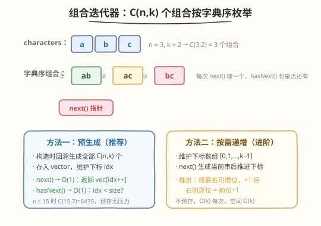
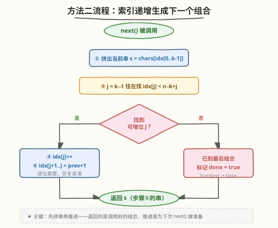
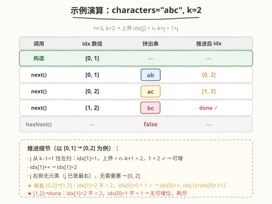

# 字母组合迭代器

- **题目名称**：字母组合迭代器
- **链接**：[1286. 字母组合迭代器](https://leetcode.cn/problems/iterator-for-combination/)
- **难度**：中等
- **标签**：设计、回溯、组合枚举、字符串

## 1. 题目概述

设计一个 `CombinationIterator` 类，用于按**字典序**逐一枚举字符串 `characters` 中长度为 `combinationLength` 的所有**组合**（不分排列顺序，即 `{a,b}` 与 `{b,a}` 视为同一组合）。

```text
CombinationIterator(string characters, int combinationLength)
    // 用「排序好的、互不相同的」小写字母串 characters 与长度 combinationLength 初始化
string next()      // 返回下一个字典序的组合
bool hasNext()     // 是否还存在下一个组合
```

> ⚠️ `characters` 已**排序且字母互异**——这意味着字典序组合天然有序，无需额外排序。组合与排列的区别：组合只关心"选了哪些"，不关心顺序。

**示例 1**：

```text
输入：
  CombinationIterator itr = new CombinationIterator("abc", 2);
  itr.next();      // 返回 "ab"
  itr.hasNext();   // 返回 true
  itr.next();      // 返回 "ac"
  itr.hasNext();   // 返回 true
  itr.next();      // 返回 "bc"
  itr.hasNext();   // 返回 false
```

**解释**：`"abc"` 取 2 个字母的所有组合按字典序为 `"ab"` → `"ac"` → `"bc"`，共 $C(3,2) = 3$ 个。

**约束条件**：

- `1 <= combinationLength <= characters.length <= 15`
- `characters` 中所有字母**互不相同**且已**按字典序排列**
- `next` 和 `hasNext` 的调用总次数最多 $10^4$

> 💡 关键约束是 `characters.length <= 15`。组合数上限为 $C(15, 7) = 6435$，预生成全部组合完全可行——这是方法一（预生成）成立的基础。若 $n$ 更大（如 $n = 60$），则需方法二（按需递增）避免爆内存。

---

## 2. 解题思路

### 2.1 暴力思路：每次调用都全量搜索

最直觉的写法：每次 `next()` 调用时，从当前组合出发，做一次 DFS/BFS 找到"下一个字典序组合"。但这有两个问题：

1. **重复计算**：每次都从零搜索，没有利用上一次的结果，`next()` 退化为 $O(C(n,k) \cdot k)$，$10^4$ 次调用最坏 $O(10^8)$，效率低下。
2. **状态丢失**：`next()` 需要"记住"上次返回到哪了，若不持久化游标，要么重复返回同一组合，要么跳号。

根源在于**没有把"组合序列"与"游标"分离**——组合序列是静态的（构造时就确定了），游标是动态的（随 `next()` 移动）。把它们分开，就是方法一的思路。

### 2.2 核心观察：组合序列是确定的，只需一个游标



**关键洞察**：`characters` 已排序且字母互异，长度为 $k$ 的所有组合构成一个**确定且有序的序列**，序列长度为 $C(n, k)$。迭代器的本质只是"在这个有序序列上维护一个游标 `idx`"：

- **`next()`**：返回 `combos[idx]`，然后 `idx++`
- **`hasNext()`**：`idx < combos.size()`

**方法一（预生成）**：构造时用回溯一次性生成全部 $C(n, k)$ 个组合存入数组。`next()` / `hasNext()` 都是 $O(1)$。

> 💡 **为什么预生成可行？** $n \le 15$，$C(15,7) = 6435$，每个组合长度 $\le 15$，总存储 $\le 6435 \times 15 \approx 10^5$ 字符，完全在内存安全范围内。回溯生成的时间也是 $O(C(n,k) \cdot k)$，构造时一次性付出，后续调用零成本。

**方法二（按需递增）**：不预存全部组合，只维护一个**下标数组** `idx[0..k-1]`（初始 `[0, 1, ..., k-1]`），代表当前组合在 `characters` 中的位置。`next()` 时先拼出当前串，再把下标数组"推进"到下一个组合。

> 💡 **下标递增的原理**与 [31. 下一个排列](https://leetcode.cn/problems/next-permutation/) 同源——都是"找一个序列的下一个字典序状态"。组合的下一个 = 找最右一个还能前进的下标，前进一步，右侧重置为最小值。

### 2.3 算法流程图



**方法一（预生成）流程**：

1. **构造时回溯**：`dfs(start)`，从 `start` 开始枚举选/不选，路径长度达到 `k` 时记录一个组合
2. **`next()`**：`return combos[idx++]`
3. **`hasNext()`**：`return idx < combos.size()`

**方法二（按需递增）流程**（见上图）：

1. `next()` 被调用时，先用当前 `idx[]` 拼出字符串 `s`（这是要返回的）
2. 从右往左找第一个满足 `idx[j] < n - k + j` 的位置 `j`（上界 `n-k+j` 保证右侧有足够位置放剩余元素）
3. **找到**：`idx[j]++`，然后把 `idx[j+1..]` 重置为 `idx[j]+1, idx[j]+2, ...`（恢复紧凑排列）
4. **没找到**：说明已到最后一个组合（`[n-k, n-k+1, ..., n-1]`），标记 `done = true`
5. 返回步骤 ①拼好的 `s`

> ⚠️ **顺序很重要**：先拼串、再推进。`next()` 返回的是**调用前**的组合，推进是为**下一次** `next()` 准备。这与 [31. 下一个排列](https://leetcode.cn/problems/next-permutation/) 的"先取当前再前进"一致。

### 2.4 示例演算

以 `characters = "abc"`, `combinationLength = 2` 为例（$n=3$, $k=2$，上界 `idx[j] < n-k+j = 1+j`）：



| 调用 | idx 数组（调用前） | 拼出串 | 推进后 idx | 说明 |
|------|-------------------|--------|-----------|------|
| 构造 | `[0, 1]` | — | — | 初始化为最小组合 |
| `next()` | `[0, 1]` | `"ab"` | `[0, 2]` | idx[1]=1 < 2 → idx[1]++ |
| `next()` | `[0, 2]` | `"ac"` | `[1, 2]` | idx[1]=2 不<2；idx[0]=0<1 → idx[0]++, idx[1]=idx[0]+1=2 |
| `next()` | `[1, 2]` | `"bc"` | `done` | idx[1]=2 不<2；idx[0]=1 不<1 → 无可增位，标记耗尽 |
| `hasNext()` | — | `false` | — | `done` 为真 |

三次 `next()` 依次返回 `"ab"` → `"ac"` → `"bc"`，与字典序完全一致。

> 💡 **推进的直觉**：下标数组永远保持**严格递增**——这是组合（不重复选、不分顺序）的不变量。推进时找到最右可增位加 1，右侧重置为紧贴的前位 +1，正是维持这一不变量的最小步进。

---

## 3. 参考代码

### 方法一：预生成 + 游标（推荐，最简）

### C++

```cpp
class CombinationIterator {
    vector<string> combos;
    int idx = 0;

    void dfs(const string &chars, int k, int start, string &path) {
        if ((int)path.size() == k) {
            combos.push_back(path);
            return;
        }
        for (int i = start; i < (int)chars.size(); ++i) {
            path.push_back(chars[i]);
            dfs(chars, k, i + 1, path);
            path.pop_back();
        }
    }

  public:
    CombinationIterator(string characters, int combinationLength) {
        string path;
        dfs(characters, combinationLength, 0, path);
    }

    string next() {
        return combos[idx++];
    }

    bool hasNext() {
        return idx < (int)combos.size();
    }
};
```

### Python

```python
class CombinationIterator:
    def __init__(self, characters: str, combinationLength: int):
        self.combos: list[str] = []
        self.idx = 0

        def dfs(start: int, path: list[str]) -> None:
            if len(path) == combinationLength:
                self.combos.append(''.join(path))
                return
            for i in range(start, len(characters)):
                path.append(characters[i])
                dfs(i + 1, path)
                path.pop()

        dfs(0, [])

    def next(self) -> str:
        ans = self.combos[self.idx]
        self.idx += 1
        return ans

    def hasNext(self) -> bool:
        return self.idx < len(self.combos)
```

> 💡 **回溯模板**与 [77. 组合](https://leetcode.cn/problems/combinations/) 完全一致：`for i in range(start, n)` 枚举当前位置选谁，`i+1` 保证不回头（组合 vs 排列的区别就在这——排列从 0 开始、组合从 `start` 开始）。因为 `characters` 已排序，按 `start` 递增枚举自然得到字典序。

---

### 方法二：下标递增按需生成（进阶，O(k) 空间）

### C++

```cpp
class CombinationIterator {
    string chars;
    int n, k;
    vector<int> idx;   // 当前组合的下标数组
    bool done = false;

  public:
    CombinationIterator(string characters, int combinationLength)
        : chars(move(characters)), n(chars.size()), k(combinationLength) {
        idx.resize(k);
        for (int i = 0; i < k; ++i) idx[i] = i;   // 初始 [0,1,...,k-1]
    }

    string next() {
        string s;
        for (int j = 0; j < k; ++j) s += chars[idx[j]];   // 先拼出当前串

        // 推进到下一个组合
        int j = k - 1;
        while (j >= 0 && idx[j] == n - k + j) --j;        // 找最右可增位
        if (j < 0) {
            done = true;                                   // 已到最后
        } else {
            ++idx[j];
            for (int t = j + 1; t < k; ++t) idx[t] = idx[t - 1] + 1;
        }
        return s;
    }

    bool hasNext() {
        return !done;
    }
};
```

### Python

```python
class CombinationIterator:
    def __init__(self, characters: str, combinationLength: int):
        self.chars = characters
        self.n = len(characters)
        self.k = combinationLength
        self.idx = list(range(combinationLength))  # [0, 1, ..., k-1]
        self.done = False

    def next(self) -> str:
        s = ''.join(self.chars[i] for i in self.idx)  # 先拼串

        # 推进到下一个组合
        j = self.k - 1
        while j >= 0 and self.idx[j] == self.n - self.k + j:
            j -= 1
        if j < 0:
            self.done = True
        else:
            self.idx[j] += 1
            for t in range(j + 1, self.k):
                self.idx[t] = self.idx[t - 1] + 1
        return s

    def hasNext(self) -> bool:
        return not self.done
```

> 💡 **上界 `n - k + j` 的含义**：位置 `j` 的下标最大不能超过 `n - k + j`，否则它右侧的 `k - 1 - j` 个位置无法放下严格递增的整数（最右位最大只能是 `n - 1`）。当 `idx[j] == n - k + j` 时，位置 `j` 已到顶，必须向左找更早的位置推进。

---

## 4. 复杂度分析

| 维度 | 方法一（预生成） | 方法二（按需递增） | 说明 |
|------|------------------|-------------------|------|
| **构造时间** | $O(C(n,k) \cdot k)$ | $O(k)$ | 方法一构造时回溯生成全部组合；方法二只初始化下标数组 |
| **next() 时间** | $O(1)$ | $O(k)$ | 方法一直接取数组元素；方法二拼串 $O(k)$ + 推进 $O(k)$ |
| **hasNext() 时间** | $O(1)$ | $O(1)$ | 两者都只比较游标/标志 |
| **空间** | $O(C(n,k) \cdot k)$ | $O(k)$ | 方法一存全部组合串；方法二只存下标数组 |

> ⚠️ $n \le 15$ 时两种方法都轻松通过。方法一以空间换时间，构造后调用极快；方法二空间更省，适合 $n$ 较大、组合数爆炸的场景。本题约束下方法一更简洁可读，是推荐选择。

---

## 5. 扩展：位运算解法（Gosper's hack）

当 `characters.length <= 15` 时，一个组合可以用一个 **15 位整数** 的位掩码表示：位 `i` 为 1 表示选 `characters[i]`。长度为 $k$ 的组合对应恰好有 $k$ 个 1 的掩码。

**Gosper's hack** 能在 $O(1)$ 内求出"恰好有 $k$ 个 1 的下一个掩码"：

```cpp
// 给定 mask（恰好 k 个 1），返回字典序下一个有 k 个 1 的掩码
int gosper(int mask) {
    int c = mask & (-mask);          // 最低位的 1
    int r = mask + c;                // 进位翻转
    return (((r ^ mask) >> 2) / c) | r;
}
```

初始掩码为 `(1 << k) - 1`（最低 $k$ 位为 1，对应 `[0,1,...,k-1]`）。每次 `next()` 用掩码拼出串后调 `gosper` 推进，掩码超过 `(1 << n) - (1 << (n-k))`（即最高 $k$ 位为 1）时耗尽。

> 💡 Gosper's hack 本质与方法二的"找最右可增位 + 进位 + 右侧重置"完全同构，只是用位运算把三步合并成一条公式。它是组合枚举位运算解法的招牌技巧，也是 [78. 子集](https://leetcode.cn/problems/subsets/) 位运算法的进阶应用。

---

## 6. 面试要点

1. **方法一和方法二各自的适用场景？**

   > 方法一预生成全部组合，`next()`/`hasNext()` 为 $O(1)$，但空间 $O(C(n,k) \cdot k)$。适合 $n$ 小、组合数可控（如本题 $n \le 15$）。方法二按需递增，空间 $O(k)$，但每次 `next()` 为 $O(k)$。适合 $n$ 较大、组合数可能爆炸（如 $n = 60$）或只需取前几个组合的场景。面试中先问清 $n$ 的范围再选。

2. **下标递增时，为什么上界是 `n - k + j`？**

   > 位置 `j` 后面还有 `k - 1 - j` 个位置需要放严格递增的整数，最右位最大只能是 `n - 1`。因此位置 `j` 最大为 `n - 1 - (k - 1 - j) = n - k + j`。超过这个值，右侧就放不下足够多的递增整数了，组合不合法。

3. **为什么 `next()` 要先拼串再推进，而不是先推进再拼串？**

   > `next()` 返回的应该是"当前"组合，即调用前的状态。如果先推进再拼串，第一次 `next()` 就会跳过初始组合 `[0,1,...,k-1]` 直接返回第二个。这与迭代器语义一致：`hasNext()` 为真时，`next()` 返回的就是"下一个待取"的元素，取完后游标才前进。

4. **回溯生成组合时，为什么 `for` 循环从 `start` 而非 `0` 开始？**

   > 从 `start` 开始保证每个字母只选一次且不回头，这正是**组合**（不分顺序）与**排列**（分顺序）的区别。排列用 `used[]` 标记去重、从 `0` 开始；组合用 `start` 天然避免重复。因为 `characters` 已排序，`start` 递增枚举自然产出字典序。

5. **Gosper's hack 与方法二的下标递增有何关系？**

   > 二者同构。Gosper 的 `c = mask & -mask` 找最低位 1（对应最右可增位），`mask + c` 进位翻转（对应 `idx[j]++`），`((r ^ mask) >> 2) / c` 计算右侧需要补的 1 的个数并重置（对应右侧 `idx[t] = idx[t-1] + 1`）。位运算把三步压缩成一条公式，是组合枚举的优雅极致。

> 💡 **一句话总结**：1286 是**组合枚举 + 迭代器设计**的招牌题——核心是把"组合序列"与"游标"分离。$n \le 15$ 时预生成最简（回溯模板同 77 题），$n$ 大时用下标递增按需生成（同 31 下一个排列思想），位运算 Gosper's hack 则是极致优雅的进阶。

---

## 7. 同类练习题

- [77. 组合](https://leetcode.cn/problems/combinations/)：回溯生成组合的母题，本题方法一的回溯模板直接来源于此（`start` 枚举保证组合不分顺序）
- [31. 下一个排列](https://leetcode.cn/problems/next-permutation/)：「找最右可增位 + 进位 + 右侧重置」思想的源头，本题方法二的下标递增与其同构
- [78. 子集](https://leetcode.cn/problems/subsets/)：子集枚举，位运算法（掩码 $0$ 到 $2^n-1$）是 Gosper's hack 的基础，本题扩展位运算解法的入门
- [208. 实现 Trie](https://leetcode.cn/problems/implement-trie-prefix-tree/)：另一道经典设计题，对照「构造时预处理 vs 查询时计算」的设计取舍
- [284. 窥视迭代器](https://leetcode.cn/problems/peeking-iterator/)：迭代器设计进阶，需支持 `peek()` 预读但不推进游标，与本题的游标管理思想互补
