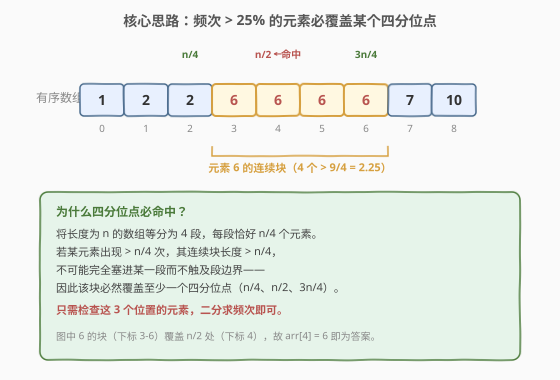
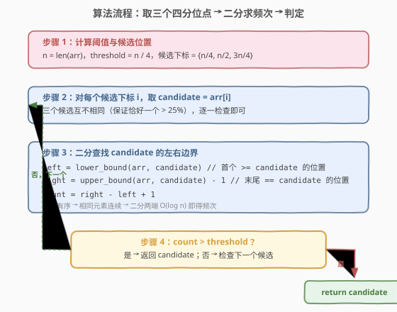
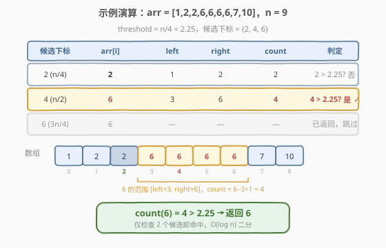

# LeetCode 有序数组中出现次数超过25%的元素 题解

## 1. 题目概述

- **标题 / 题号**：有序数组中出现次数超过25%的元素（#1287，easy）
- **链接**：https://leetcode.cn/problems/element-appearing-more-than-25-in-sorted-array/
- **难度**：简单
- **标签**：数组、二分查找

**题意**：给你一个**非递减有序**整数数组 `arr`，已知数组中**恰好有一个**整数，它的出现次数**超过**数组元素总数的 25%。请找到并返回这个整数。

**示例 1**：

```text
输入：arr = [1,2,2,6,6,6,6,7,10]
输出：6
解释：数组长度 n = 9，25% 阈值 = 2.25。元素 6 出现 4 次，4 > 2.25，故返回 6。
```

**示例 2**：

```text
输入：arr = [1,1]
输出：1
解释：n = 2，阈值 = 0.5。元素 1 出现 2 次，2 > 0.5，返回 1。
```

**约束**：

- $1 \le \text{arr.length} \le 10^4$
- $0 \le \text{arr}[i] \le 10^5$

> 💡 本题的两个关键前提：①数组**有序**（非递减），相同元素因此连续排列；②**恰好一个**元素频次 > 25%。这两条约束共同决定了存在 $O(\log n)$ 的最优解法——利用「四分位点」性质将候选缩小到至多 3 个，再二分求频次。

## 2. 解题思路

### 2.1 暴力思路：哈希计数 / 线性扫描

最直观的做法是用哈希表统计每个元素的出现次数，再找频次 > $n/4$ 的那个：

```python
from collections import Counter
count = Counter(arr)
threshold = len(arr) / 4
for val, cnt in count.items():
    if cnt > threshold:
        return val
```

时间 $O(n)$、空间 $O(n)$。但本题数组有序，相同元素连续排列，因此无需哈希表——线性扫描统计连续段长度即可，空间降为 $O(1)$：

```python
n = len(arr)
threshold = n / 4
cnt = 1
for i in range(1, n):
    if arr[i] == arr[i - 1]:
        cnt += 1
        if cnt > threshold:
            return arr[i]
    else:
        cnt = 1
return arr[0]  # n == 1 的边界
```

> 💡 线性扫描法 $O(n)$ 时间 / $O(1)$ 空间已经不错，但面试官会追问：「数组有序这个条件，你用满了吗？」——下文的核心解法把有序性利用到极致，做到 $O(\log n)$。

### 2.2 核心观察：四分位点 + 二分求频次



**关键洞察**：将长度为 $n$ 的数组等分为 4 段，每段恰好 $n/4$ 个元素。若某元素出现 $> n/4$ 次，其连续块长度 $> n/4$，**不可能完全塞进某一段而不触及段边界**——因此该块必然覆盖至少一个四分位点。

三个四分位点的下标为：

$$
\left\lfloor \frac{n}{4} \right\rfloor, \quad \left\lfloor \frac{n}{2} \right\rfloor, \quad \left\lfloor \frac{3n}{4} \right\rfloor
$$

> ⚠️ **为什么是 3 个而不是 4 个？** 4 段之间有 3 个内部分界点（第 1 段末/第 2 段初、第 2 段末/第 3 段初、第 3 段末/第 4 段初）。一个长度 $> n/4$ 的连续块无法同时避开全部 3 个分界点——否则它被夹在某一段内，长度 $\le n/4$，矛盾。

对于每个候选位置 `i`，取 `candidate = arr[i]`，用**二分查找**求出 `candidate` 在有序数组中的左右边界：

- `left = lower_bound(arr, candidate)`：首个 $\ge$ `candidate` 的位置
- `right = upper_bound(arr, candidate) - 1`：末尾 $==$ `candidate` 的位置
- `count = right - left + 1`

若 `count > n/4`（等价于 `count * 4 > n`，避免浮点运算），则 `candidate` 即为答案。

> 💡 **数组有序是二分的前提**：相同元素在有序数组中连续排列，因此 `lower_bound` / `upper_bound` 能在 $O(\log n)$ 内定位 candidate 的完整范围。无序数组只能用哈希计数。

### 2.3 算法流程图



**完整步骤**：

1. **计算阈值与候选**：`n = len(arr)`，候选下标 = `{n/4, n/2, 3n/4}`
2. **遍历候选**：对每个候选下标 `i`，取 `candidate = arr[i]`
3. **二分求边界**：`left = lower_bound(arr, candidate)`，`right = upper_bound(arr, candidate) - 1`，`count = right - left + 1`
4. **判定**：`count * 4 > n`？是 → 返回 `candidate`；否 → 检查下一个候选

> 💡 由于题目保证恰好一个元素频次 > 25%，三个候选中必有一个命中，无需担心全部落空。

### 2.4 示例演算

以 `arr = [1,2,2,6,6,6,6,7,10]`，`n = 9` 为例：



**预处理**：`threshold = 9/4 = 2.25`，候选下标 = `{2, 4, 6}`

| 候选下标 | arr[i] | left (lower_bound) | right (upper_bound−1) | count | count > 2.25? |
|----------|--------|--------------------|-----------------------|-------|---------------|
| 2 (n/4) | 2 | 1 | 2 | 2 | 否 |
| 4 (n/2) | **6** | 3 | 6 | **4** | **是 ✓** |
| 6 (3n/4) | 6 | — | — | — | 已返回，跳过 |

**第一步**：检查下标 2，`arr[2] = 2`。二分得 `left = 1`（首个 2 的位置）、`right = 2`（末个 2 的位置），`count = 2`。$2 \le 2.25$，未命中。

**第二步**：检查下标 4，`arr[4] = 6`。二分得 `left = 3`（首个 6 的位置）、`right = 6`（末个 6 的位置），`count = 6 - 3 + 1 = 4`。$4 > 2.25$，命中！返回 6。

> 💡 下标 6（3n/4）虽然也指向 6，但第二个候选已命中，无需检查第三个。最坏情况下才需检查全部 3 个候选。

## 3. 参考代码

### C++

```cpp
class Solution {
  public:
    int findSpecialInteger(vector<int>& arr) {
        int n = arr.size();
        int candidates[3] = {n / 4, n / 2, 3 * n / 4};
        for (int idx : candidates) {
            int candidate = arr[idx];
            int left = lower_bound(arr.begin(), arr.end(), candidate) - arr.begin();
            int right = upper_bound(arr.begin(), arr.end(), candidate) - arr.begin() - 1;
            int count = right - left + 1;
            if (count * 4 > n) {
                return candidate;
            }
        }
        return -1;
    }
};
```

> 💡 **实现细节**：
> - **`lower_bound` / `upper_bound`**：C++ STL 自带，返回迭代器，减去 `begin()` 得下标。`lower_bound` 找首个 $\ge$ candidate 的位置，`upper_bound` 找首个 $>$ candidate 的位置，两者之差即为 candidate 的频次。
> - **`count * 4 > n`**：用整数乘法代替浮点除法 `count > n / 4.0`，避免精度问题。等价于 $4 \cdot \text{count} > n$，即 $\text{count} > n/4$。
> - **`return -1`**：理论上不可达（题目保证恰好一个元素满足条件），仅为编译器要求返回值。

### Python

```python
import bisect

class Solution:
    def findSpecialInteger(self, arr: List[int]) -> int:
        n = len(arr)
        for idx in (n // 4, n // 2, 3 * n // 4):
            candidate = arr[idx]
            left = bisect.bisect_left(arr, candidate)
            right = bisect.bisect_right(arr, candidate) - 1
            count = right - left + 1
            if count * 4 > n:
                return candidate
        return -1
```

> ⚠️ Python 使用 `bisect` 模块：`bisect_left` 对应 `lower_bound`（首个 $\ge$ target 的插入点），`bisect_right` 对应 `upper_bound`（首个 $>$ target 的插入点）。两者均为 $O(\log n)$。

## 4. 复杂度分析

| 维度 | 复杂度 | 说明 |
|------|--------|------|
| **时间** | $O(\log n)$ | 至多 3 个候选，每个做两次二分（`lower_bound` + `upper_bound`），每次 $O(\log n)$，总计 $O(\log n)$ |
| **空间** | $O(1)$ | 仅用常数个整型变量（`candidate`、`left`、`right`、`count`），无额外数据结构 |
| **对比暴力** | — | 哈希计数 $O(n)$ / $O(n)$；线性扫描 $O(n)$ / $O(1)$；本解法 $O(\log n)$ / $O(1)$，全面优于两者 |

> 💡 当 $n = 10^4$ 时，$O(\log n) \approx 14$ 次比较，远优于线性扫描的 $10^4$ 次。虽然本题数据规模不大，三种解法都能 AC，但 $O(\log n)$ 体现了对「有序」性质的充分利用。

## 5. 扩展：四分位点的推广——1/k 频次问题

### 5.1 通用模板

本题的核心思想可推广为：**在有序数组中找出现次数超过 $1/k$ 的元素，只需检查 $k-1$ 个等分位点。**

| 参数 | 频次阈值 | 候选位置数 | 候选下标 |
|------|---------|-----------|---------|
| $k = 2$ | $> 50\%$（多数元素） | 1 | $n/2$ |
| $k = 3$ | $> 33.3\%$ | 2 | $n/3,\ 2n/3$ |
| $k = 4$（本题） | $> 25\%$ | 3 | $n/4,\ n/2,\ 3n/4$ |
| $k = 5$ | $> 20\%$ | 4 | $n/5,\ 2n/5,\ 3n/5,\ 4n/5$ |

> 💡 **原理**：$k$ 段等分有 $k-1$ 个内部分界点。一个长度 $> n/k$ 的连续块无法同时避开全部 $k-1$ 个分界点，否则被夹在某一段内，长度 $\le n/k$，矛盾。

### 5.2 与 169（多数元素）的对比

| 维度 | 169（多数元素 > 50%） | 1287（本题 > 25%） |
|------|----------------------|---------------------|
| **频次阈值** | $> n/2$ | $> n/4$ |
| **数组是否有序** | 无序 | 有序 |
| **最优解法** | Boyer-Moore 投票 $O(n)$ / $O(1)$ | 四分位点 + 二分 $O(\log n)$ / $O(1)$ |
| **候选数** | 1（投票过程中的候选） | 3（$n/4, n/2, 3n/4$） |
| **利用有序性** | 否（投票法不需要有序） | 是（二分求频次依赖有序） |

> ⚠️ 169 的 Boyer-Moore 投票法**不需要数组有序**，通过「计数抵消」在 $O(n)$ 内找到多数元素。若 169 的数组也有序，则可套用本题的 $k=2$ 版本：只检查 `arr[n/2]`，再二分验证——但 $O(n)$ 投票法已足够，无需二分。

## 6. 面试要点

1. **为什么频次 > 25% 的元素必覆盖某个四分位点？**

   > 将数组等分为 4 段，每段 $n/4$ 个元素，段间有 3 个分界点。若某元素的连续块长度 $> n/4$，它不可能完全落在某一段内部（段容量只有 $n/4$），因此必然跨越至少一个分界点——即覆盖 $n/4$、$n/2$ 或 $3n/4$ 处的下标。

2. **为什么用 `count * 4 > n` 而不是 `count > n / 4`？**

   > 避免浮点运算和整数除法的精度问题。C++ 中 `n / 4` 是整数除法（截断），对 $n = 9$ 得 2，`count > 2` 与 `count > 2.25` 在整数下等价（都要求 count ≥ 3），但语义不直观。`count * 4 > n` 是纯整数运算，无歧义，且不会溢出（$n \le 10^4$，`count * 4` 最大 $4 \times 10^4$，远在 int 范围内）。

3. **三个候选会不会都指向同一个元素导致漏解？**

   > 不会。题目保证恰好一个元素频次 > 25%，该元素的连续块必然覆盖至少一个四分位点。即使三个候选中有两个指向同一个值（如本题下标 4 和 6 都是 6），也至少有一个命中目标。最坏情况是前两个候选都未命中、第三个命中，但不会全部落空。

4. **能否不用二分，直接检查候选值出现次数？**

   > 可以，但会退化为 $O(n)$。对每个候选值线性扫描数组数频次，3 个候选共 $O(3n) = O(n)$。二分将单次频次计算从 $O(n)$ 降到 $O(\log n)$，总复杂度从 $O(n)$ 降到 $O(\log n)$——这才是利用「有序」性质的价值所在。

5. **如果数组无序，还能用这个方法吗？**

   > 不能。四分位点方法依赖两个前提：①有序（相同元素连续，二分能定位边界）；②恰好一个超频元素。无序数组中相同元素分散，`lower_bound` / `upper_bound` 无法定位完整范围，只能退回哈希计数 $O(n)$ / $O(n)$。若需 $O(1)$ 空间，无序数组的 > 50% 问题可用 Boyer-Moore 投票（169），但 > 25% 无类似投票法。

> 💡 **一句话总结**：1287 是「有序数组 + 定频次」的招牌题——利用四分位点将候选缩到 3 个，二分求频次 $O(\log n)$ 搞定。核心不变量：长度 $> n/k$ 的连续块必覆盖某个 $k$ 等分点。

## 同类练习题

| # | 题目 | 与本题的关联 |
|---|------|-------------|
| 34 | [在排序数组中查找元素的第一个和最后一个位置](https://leetcode.cn/problems/find-first-and-last-position-of-element-in-sorted-array/) | `lower_bound` / `upper_bound` 二分找左右边界的母题，本题核心技巧的直接来源 |
| 704 | [二分查找](https://leetcode.cn/problems/binary-search/)（[站内题解](../0701-0800/704_二分查找.md)） | 二分查找基础模板，一切二分题的起点 |
| 169 | [多数元素](https://leetcode.cn/problems/majority-element/) | 无序数组找 > 50% 频次元素，Boyre-Moore 投票法 $O(n)$ / $O(1)$，与本题的「有序 + 二分」形成对照（有序→二分，无序→投票） |
| 35 | [搜索插入位置](https://leetcode.cn/problems/search-insert-position/)（[站内题解](../0001-0100/35_搜索插入位置.md)） | `lower_bound` 找下界的标准模板，本题 `left` 的计算方式即源于此 |
| 278 | [第一个错误的版本](https://leetcode.cn/problems/first-bad-version/)（[站内题解](../0201-0300/278_第一个错误的版本.md)） | 单调布尔序列二分找首个 true，与 `lower_bound` 思想同构 |
