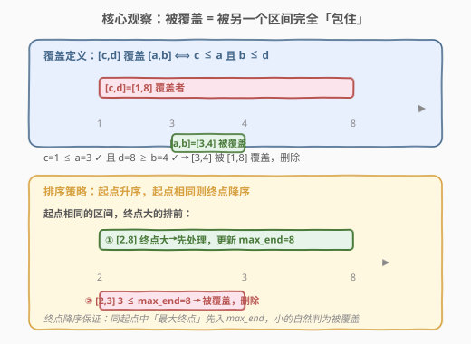
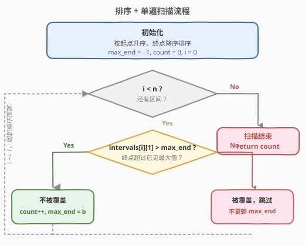
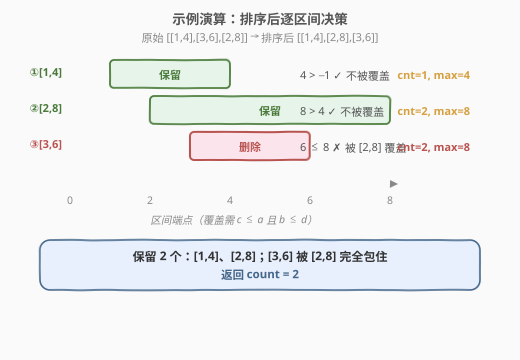

# 删除被覆盖区间

- **题目名称**：删除被覆盖区间
- **链接**：[1288. 删除被覆盖区间](https://leetcode.cn/problems/remove-covered-intervals/)
- **难度**：中等
- **标签**：数组、排序、贪心、区间

## 1. 题目概述

给你一个区间列表 `intervals`，其中 `intervals[i] = [a_i, b_i]`。区间 $[a, b]$ 被 $[c, d]$ **覆盖**，当且仅当 $c \le a$ 且 $b \le d$（即 $[c,d]$ 把 $[a,b]$ 完全「包住」）。返回**不被任何其他区间覆盖**的区间数量。

**示例 1**：

```text
输入：intervals = [[1,4],[3,6],[2,8]]
输出：2
解释：[3,6] 被 [2,8] 覆盖（2 ≤ 3 且 6 ≤ 8），删除；[1,4]、[2,8] 不被覆盖，保留 2 个。
```

**示例 2**：

```text
输入：intervals = [[1,4],[2,3]]
输出：1
解释：[2,3] 被 [1,4] 覆盖（1 ≤ 2 且 3 ≤ 4），删除；保留 1 个。
```

**约束条件**：

- $1 \le \text{intervals.length} \le 1000$
- $\text{intervals}[i].\text{length} = 2$
- $0 \le a_i < b_i \le 10^5$

> 💡 **关键信号**：「被覆盖」是**包含关系**而非「相交」。这区别于 [435. 无重叠区间](https://leetcode.cn/problems/non-overlapping-intervals/)（相交即删）与 [56. 合并区间](https://leetcode.cn/problems/merge-intervals/)（相交即并）。包含关系的判定是**两个不等式** $c \le a$ 且 $b \le d$，排序后可用一次扫描完成。

---

## 2. 解题思路

### 2.1 暴力思路：两两比较

对每个区间 $[a_i, b_i]$，遍历所有其他区间 $[c, d]$，若存在 $c \le a_i$ 且 $b_i \le d$，则 $[a_i, b_i]$ 被覆盖。统计不被覆盖的数量。复杂度 $O(n^2)$，$n=1000$ 时 $10^6$ 次比较勉强可过，但未利用区间结构。

> 💡 暴力的浪费在于：每个区间独立判断「是否存在覆盖者」，重复扫描。若把区间**排序**，则「覆盖者」必出现在被覆盖者的**前面或同起点中**，可单趟完成。

### 2.2 核心观察：排序 + 维护已见最大终点



**覆盖的定义**：$[c,d]$ 覆盖 $[a,b]$ $\iff$ $c \le a$ 且 $b \le d$。

把区间按以下规则排序：

1. **起点升序**：保证处理 $[a,b]$ 时，所有起点 $\le a$ 的区间都已扫过；
2. **起点相同时，终点降序**：保证同起点区间中「终点最大者」先被处理，先入 `max_end`，后续同起点但终点更小者自然判为被覆盖。

扫描时维护 `max_end` = **已扫过区间的最大终点**。对当前 $[a,b]$：

- 若 $b > \text{max\_end}$：没有任何已扫区间能包住它（终点都不够大）→ **不被覆盖**，`count++`，更新 `max_end = b`；
- 若 $b \le \text{max\_end}$：存在某个起点 $\le a$、终点 $\ge b$ 的区间 → **被覆盖**，跳过。

> 💡 **为何终点降序？** 考虑同起点的 $[2,8]$ 与 $[2,3]$：若终点升序，会先处理 $[2,3]$ 把 `max_end` 设为 3，再处理 $[2,8]$ 时 $8 > 3$ 判「不被覆盖」并更新 `max_end=8`——结果两个都计数，**漏删了** $[2,3]$。终点降序让 $[2,8]$ 先入 `max_end=8`，$[2,3]$ 随后 $3 \le 8$ 被正确判为覆盖。

> ⚠️ **正确性要点**：判断 $b > \text{max\_end}$ 用**严格大于**。若用 $\ge$，则与 `max_end` 相等的终点会被误判为「被覆盖」——而实际上覆盖要求 $b \le d$ 即可，相等也算覆盖，故 $b = \text{max\_end}$ 时确实被覆盖（被那个终点等于 `max_end`、起点 $\le a$ 的区间包住），此时应跳过。因此条件写作「$b > \text{max\_end}$ 才计数」等价于「$b \le \text{max\_end}$ 则被覆盖」，正确。

### 2.3 算法流程图



流程说明：

1. 按「起点升序、终点降序」排序
2. 初始化 `max_end = -1`、`count = 0`
3. 遍历每个区间 $[a, b]$：
   - 若 $b > \text{max\_end}$：`count++`，`max_end = b`
   - 否则：跳过（被覆盖）
4. 返回 `count`

### 2.4 示例演算

以 `intervals = [[1,4],[3,6],[2,8]]` 为例，排序后为 `[[1,4],[2,8],[3,6]]`：



| 步骤 | 区间 | $b$ 与 $\text{max\_end}$ 比较 | 决策 | max_end 更新 | count |
|------|------|------------------------------|------|--------------|-------|
| 0 | $[1,4]$ | $4 > -1$ ✓ | 保留 | 4 | 1 |
| 1 | $[2,8]$ | $8 > 4$ ✓ | 保留 | 8 | 2 |
| 2 | $[3,6]$ | $6 \le 8$ ✗ | 被覆盖，跳过 | 8（不变） | 2 |

最终 `count = 2`，返回 2 ✓。$[3,6]$ 被 $[2,8]$ 完全包住（$2 \le 3$ 且 $6 \le 8$）。

> 验证示例 2：`[[1,4],[2,3]]` 已按起点升序（终点降序对单元素无影响）。$[1,4]$：$4 > -1$ → count=1, max_end=4；$[2,3]$：$3 \le 4$ → 被覆盖跳过。返回 1 ✓。

---

## 3. 参考代码

### C++

```cpp
class Solution {
  public:
    int removeCoveredIntervals(vector<vector<int>>& intervals) {
        // 起点升序；起点相同则终点降序
        sort(intervals.begin(), intervals.end(),
             [](const auto& a, const auto& b) {
                 return a[0] != b[0] ? a[0] < b[0] : a[1] > b[1];
             });
        int maxEnd = -1, count = 0;
        for (const auto& e : intervals) {
            if (e[1] > maxEnd) {
                ++count;
                maxEnd = e[1];
            }
        }
        return count;
    }
};
```

### Python

```python
class Solution:
    def removeCoveredIntervals(self, intervals: List[List[int]]) -> int:
        # 起点升序；起点相同则终点降序
        intervals.sort(key=lambda x: (x[0], -x[1]))
        max_end = -1
        count = 0
        for a, b in intervals:
            if b > max_end:
                count += 1
                max_end = b
        return count
```

> 💡 **核心要点**：排序键 `(x[0], -x[1])` 一行搞定「起点升序 + 终点降序」。扫描只需维护一个 `max_end`，每个区间一次比较定去留，是「排序 + 单遍扫描」区间题的最小模板。

---

## 4. 复杂度分析

| 维度 | 复杂度 | 说明 |
|------|--------|------|
| 时间复杂度 | $O(n \log n)$ | 排序主导；扫描部分为 $O(n)$ |
| 空间复杂度 | $O(\log n)$ | 排序递归调用栈；额外仅常数变量 |

> 💡 $n \le 1000$，$O(n \log n)$ 毫无压力。即便 $n$ 扩到 $10^5$，本算法依然是最优解——排序下界 $O(n \log n)$ 已无法突破。

---

## 5. 扩展：暴力法与正确性证明

### 5.1 暴力 $O(n^2)$

```cpp
int removeCoveredIntervals(vector<vector<int>>& intervals) {
    int n = intervals.size(), count = 0;
    for (int i = 0; i < n; ++i) {
        bool covered = false;
        for (int j = 0; j < n; ++j) {
            if (i != j && intervals[j][0] <= intervals[i][0]
                       && intervals[i][1] <= intervals[j][1]) {
                covered = true;
                break;
            }
        }
        if (!covered) ++count;
    }
    return count;
}
```

$n=1000$ 时 $10^6$ 次比较可过，但不优雅，且无法扩展到更大规模。

### 5.2 贪心正确性证明

需证明：**排序后，$[a_i, b_i]$ 被覆盖 $\iff$ $b_i \le \text{max\_end}_i$**（$\text{max\_end}_i$ 为处理到 $i$ 时已见最大终点）。

- **充分性**（$\Leftarrow$）：若 $b_i \le \text{max\_end}_i$，设 `max_end` 由某区间 $[c, d]$ 贡献（$d = \text{max\_end}_i \ge b_i$）。因 $[c,d]$ 排在 $[a_i,b_i]$ 之前，由排序规则 $c \le a_i$（起点升序；若 $c = a_i$ 则终点降序保证 $d \ge b_i$ 时 $[c,d]$ 先处理）。故 $c \le a_i$ 且 $b_i \le d$，$[a_i,b_i]$ 被 $[c,d]$ 覆盖 ✓
- **必要性**（$\Rightarrow$）：若 $[a_i,b_i]$ 被某 $[c,d]$ 覆盖（$c \le a_i, b_i \le d$）。由排序，$[c,d]$ 排在 $[a_i,b_i]$ 之前（$c < a_i$ 显然在前；$c = a_i$ 时终点降序使 $d \ge b_i$ 的 $[c,d]$ 先处理）。故处理到 $i$ 时 `max_end` $\ge d \ge b_i$，即 $b_i \le \text{max\_end}_i$ ✓

> 💡 关键依赖排序的「**同起点终点降序**」——它排除了「$c = a_i$ 但 $d < b_i$ 的区间排在 $[a_i,b_i]$ 前面却不能覆盖」的歧义，让 `max_end` 恰好等于「所有可能覆盖者的终点上确界」。

---

## 6. 面试要点

1. **为什么起点相同时要按终点降序？**

   若终点升序，同起点的 $[2,3]$ 会先于 $[2,8]$ 处理，把 `max_end` 设为 3；随后 $[2,8]$ 因 $8 > 3$ 被误判「不被覆盖」并更新 `max_end=8`。结果两个都计数，漏删了本应被 $[2,8]$ 覆盖的 $[2,3]$。终点降序让大终点先入 `max_end`，小终点随后被正确判为覆盖。

2. **判断条件为什么是 `b > max_end` 而非 `b >= max_end`？**

   覆盖定义允许 $b = d$（$b \le d$ 即可）。当 $b = \text{max\_end}$，说明已存在终点等于 `max_end`、起点 $\le a$ 的区间，它覆盖了当前区间。故 $b \le \text{max\_end}$ 即被覆盖，只有**严格大于**才不被覆盖。

3. **这题和 [435. 无重叠区间](https://leetcode.cn/problems/non-overlapping-intervals/) 的区别？**

   435 判「**相交**」（端点相触不算），按右端点排序贪心保留最多互不重叠区间；本题判「**包含**」（$c \le a$ 且 $b \le d$），按起点升序、终点降序，维护最大终点判定被覆盖。两者同属「排序 + 单遍扫描」区间家族，但目标与排序键不同。

4. **`max_end` 初始化为 $-1$ 安全吗？**

   安全。约束 $0 \le a_i < b_i$，故终点 $b_i \ge 1 > -1$，首个区间必满足 $b > \text{max\_end}$ 被计入。若端点可能为负，初始化为 `INT_MIN` 更稳妥。

5. **重复区间 $[a,b]$ 出现两次如何处理？**

   排序后两者相邻（起点相同、终点相同）。第一个：$b > \text{max\_end}$ → 计数，`max_end = b`；第二个：$b \le \text{max\_end}$（$b \le b$）→ 被覆盖跳过。最终只计一个，符合题意（后者被前者覆盖）。

---

## 7. 同类练习题

- [435. 无重叠区间](https://leetcode.cn/problems/non-overlapping-intervals/)（[站内题解](../0401-0500/435_无重叠区间.md)）：同为「排序 + 单遍扫描」区间贪心，对比「相交即删」与「包含即删」的排序键差异
- [56. 合并区间](https://leetcode.cn/problems/merge-intervals/)（[站内题解](../0001-0100/56_合并区间.md)）：区间排序后合并相交段，按左端点升序，对比本题的终点降序技巧
- [1272. 删除区间](https://leetcode.cn/problems/remove-interval/)（[站内题解](1272_删除区间.md)）：单区间从区间列表中做减法，同为区间关系的分类判定
- [986. 区间列表的交集](https://leetcode.cn/problems/interval-list-intersections/)（[站内题解](../0901-1000/986_区间列表的交集.md)）：双指针求两有序区间列表交集，与本题的「包含关系判定」对照
- [252. 会议室](https://leetcode.cn/problems/meeting-rooms/)：判断区间是否两两不相交，区间排序后比较相邻终点，与本题同源扫描思路
