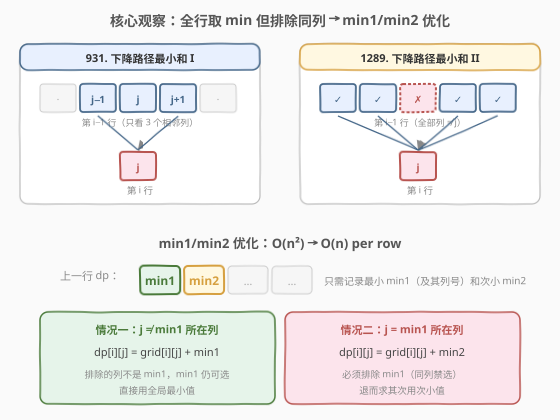
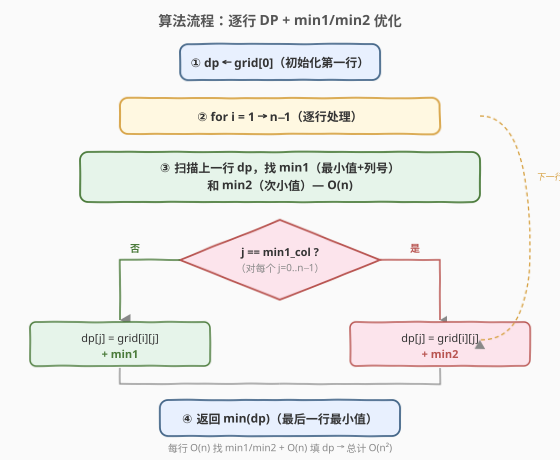
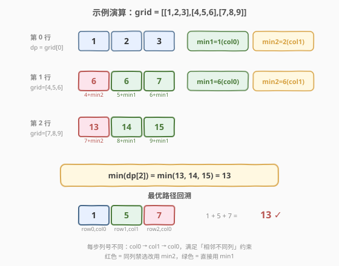

# 下降路径最小和 II

- **题目名称**：下降路径最小和 II
- **链接**：[1289. 下降路径最小和 II](https://leetcode.cn/problems/minimum-falling-path-sum-ii/)
- **难度**：困难
- **标签**：数组、动态规划、网格 DP

## 1. 题目概述

给你一个 `n x n` 整数矩阵 `grid`，请你返回**非零偏移下降路径**数字和的最小值。

**非零偏移下降路径**定义为：从 `grid` 数组中的每一行选择一个数字，且按顺序选出来的数字中，**相邻数字不在原数组的同一列**。

> ⚠️ 与 [931. 下降路径最小和](../0901-1000/931_下降路径最小和.md) 的关键区别：931 每步只能走到下一行**相邻三列**（`j-1`、`j`、`j+1`）；本题可以走到下一行**任意列**，但**禁止同列**。约束从「限制范围」变成了「排除单点」。

**示例 1**：

```text
输入：grid = [[1,2,3],[4,5,6],[7,8,9]]
输出：13
解释：最小路径为 1 → 5 → 7，和为 13。
路径中相邻元素的列号依次为 0 → 1 → 0，均不同列。
```

**示例 2**：

```text
输入：grid = [[7]]
输出：7
```

**约束条件**：

- `n == grid.length == grid[i].length`
- `1 <= n <= 200`
- `-99 <= grid[i][j] <= 99`

> 💡 本题是 931 的升级版：931 每格只有 3 个父格（相邻列），直接取 `min(左上, 正上, 右上)` 即可；本题每格的父格是**上一行除同列外的所有格子**，暴力取 `min` 会退化到 $O(n^3)$，需要 min1/min2 优化到 $O(n^2)$。

---

## 2. 解题思路

### 2.1 暴力思路

设 $dp[i][j]$ 表示从第一行走到 $(i, j)$ 的最小下降路径和。转移时需要从上一行**所有列**中取最小值，但要排除同列：

$$
dp[i][j] = \min_{k \neq j} dp[i-1][k] + \text{grid}[i][j]
$$

对每个 $(i, j)$ 扫一遍上一行 $n$ 个格子找 $\min$，总复杂度 $O(n^3)$。$n = 200$ 时 $8 \times 10^6$，虽然能过，但不够优雅。

### 2.2 核心观察：min1/min2 优化



暴力 $O(n^3)$ 的瓶颈在于「对每个 $j$ 都扫一遍上一行」。但上一行的最小值和次小值是**全局信息**，只需算一次：

- **min1**：上一行 $dp$ 的最小值，记其列号为 $min1\_col$；
- **min2**：上一行 $dp$ 的次小值。

对当前行的每个 $j$：

- 若 $j \neq min1\_col$：排除的列不是 min1 所在列，min1 仍然可选 → $dp[j] = \text{grid}[i][j] + \text{min1}$；
- 若 $j = min1\_col$：必须排除 min1 所在列，退而求其次 → $dp[j] = \text{grid}[i][j] + \text{min2}$。

> 💡 **为什么 min2 一定来自不同的列？** 若上一行有多个格子等于 min1（即 min1 == min2），那么即使 $j = min1\_col$，用 min2（值相同但来自不同列）也合法。若 min1 < min2，则 min2 必然来自 $\neq min1\_col$ 的某列，同样合法。因此 min1/min2 方案**始终正确**。

> ⚠️ **与 931 的对比**：931 每格 3 个父格，转移 $O(1)$，总计 $O(n^2)$；1289 每格 $n-1$ 个父格，朴素 $O(n)$/格，但用 min1/min2 把「每格取 min」也降到 $O(1)$，总计仍 $O(n^2)$。本质是**把逐列扫描替换为预计算全局最值**。

### 2.3 算法流程图



1. `dp = grid[0]`（初始化第一行）。
2. 行 `i` 从 `1` 到 `n-1`：
   - 扫描上一行 `dp`，找出 `min1`（最小值 + 列号 `min1_col`）和 `min2`（次小值）— $O(n)$。
   - 列 `j` 从 `0` 到 `n-1`：
     - 若 `j == min1_col`：`new_dp[j] = grid[i][j] + min2`
     - 否则：`new_dp[j] = grid[i][j] + min1`
   - `dp = new_dp`
3. 返回 `min(dp)`（最后一行的最小值）。

> 💡 **空间优化**：每行只依赖上一行，用两个一维数组 `dp` 和 `new_dp` 交替即可，空间 $O(n)$。甚至可以原地更新——但需注意 `min1`/`min2` 来自旧 `dp`，必须先算好再覆盖。

### 2.4 示例演算

以 `grid = [[1,2,3],[4,5,6],[7,8,9]]` 为例，逐行填 dp 表：



| 行 i | grid[i] | dp[0] | dp[1] | dp[2] | min1 | min2 | 说明 |
|------|---------|-------|-------|-------|------|------|------|
| 0 | [1,2,3] | 1 | 2 | 3 | 1(col0) | 2(col1) | 初始化 = grid[0] |
| 1 | [4,5,6] | 6 | 6 | 7 | 6(col0) | 6(col1) | j=0 用 min2=2; j=1,2 用 min1=1 |
| 2 | [7,8,9] | 13 | 14 | 15 | — | — | j=0 用 min2=6; j=1,2 用 min1=6 |

最终 `min(13, 14, 15) = 13`，最优路径为 `1(col0) → 5(col1) → 7(col0)`。

> 💡 **第 1 行的 min1 与 min2 相等**（都为 6，分别在 col0 和 col1）。此时 $j=0 = min1\_col$ 用 min2=6（来自 col1，合法），$j=1$ 用 min1=6（来自 col0，合法）——值虽相同但来源列不同，约束始终满足。

---

## 3. 参考代码

### C++（min1/min2 优化，$O(n)$ 空间）

```cpp
class Solution {
  public:
    int minFallingPathSum(vector<vector<int>>& grid) {
        int n = grid.size();
        vector<int> dp(grid[0]);                         // dp ← 第一行
        for (int i = 1; i < n; ++i) {
            // 找上一行的 min1（最小）和 min2（次小）
            int min1 = INT_MAX, min2 = INT_MAX, min1_col = 0;
            for (int j = 0; j < n; ++j) {
                if (dp[j] < min1) {
                    min2 = min1;
                    min1 = dp[j];
                    min1_col = j;
                } else if (dp[j] < min2) {
                    min2 = dp[j];
                }
            }
            // 填当前行
            vector<int> new_dp(n);
            for (int j = 0; j < n; ++j) {
                new_dp[j] = grid[i][j] + (j == min1_col ? min2 : min1);
            }
            dp = move(new_dp);
        }
        return *min_element(dp.begin(), dp.end());
    }
};
```

### Python

```python
class Solution:
    def minFallingPathSum(self, grid: List[List[int]]) -> int:
        n = len(grid)
        dp = grid[0][:]                           # dp ← 第一行（拷贝）
        for i in range(1, n):
            # 找上一行的 min1（最小）和 min2（次小）
            min1 = min2 = float('inf')
            min1_col = 0
            for j in range(n):
                if dp[j] < min1:
                    min2 = min1
                    min1 = dp[j]
                    min1_col = j
                elif dp[j] < min2:
                    min2 = dp[j]
            # 填当前行
            new_dp = [0] * n
            for j in range(n):
                new_dp[j] = grid[i][j] + (min2 if j == min1_col else min1)
            dp = new_dp
        return min(dp)
```

> ⚠️ **找 min1/min2 的单趟扫描**：遍历上一行时维护两个最小值。遇到比 min1 更小的值，先把旧 min1 降级为 min2，再更新 min1；遇到介于 min1 和 min2 之间的值，只更新 min2。这是一趟 $O(n)$ 扫描，比排序后取前两个（$O(n \log n)$）更高效。

---

## 4. 复杂度分析

| 方法 | 时间复杂度 | 空间复杂度 | 说明 |
|------|-----------|-----------|------|
| 暴力 DP | $O(n^3)$ | $O(n)$ | 每格扫一遍上一行 $n$ 个元素 |
| min1/min2 优化 | $O(n^2)$ | $O(n)$ | 每行一趟 $O(n)$ 找 min1/min2 + 一趟 $O(n)$ 填 dp |

> 💡 min1/min2 优化把每格的 $O(n)$ 取 min 降为 $O(1)$ 查表（只需比较 $j$ 与 $min1\_col$），总计从 $O(n^3)$ 降到 $O(n^2)$，与 931 同阶。

---

## 5. 扩展：原地修改

若允许修改输入，可直接在 `grid` 上累加，空间降到 $O(1)$：

```cpp
class Solution {
  public:
    int minFallingPathSum(vector<vector<int>>& grid) {
        int n = grid.size();
        for (int i = 1; i < n; ++i) {
            int min1 = INT_MAX, min2 = INT_MAX, min1_col = 0;
            for (int j = 0; j < n; ++j) {
                if (grid[i - 1][j] < min1) {
                    min2 = min1;
                    min1 = grid[i - 1][j];
                    min1_col = j;
                } else if (grid[i - 1][j] < min2) {
                    min2 = grid[i - 1][j];
                }
            }
            for (int j = 0; j < n; ++j) {
                grid[i][j] += (j == min1_col ? min2 : min1);
            }
        }
        return *min_element(grid[n - 1].begin(), grid[n - 1].end());
    }
};
```

> ⚠️ 原地法会破坏原始数据，**面试需主动询问「能否修改输入」**。

---

## 6. 面试要点

1. **本题与 [931. 下降路径最小和](../0901-1000/931_下降路径最小和.md) 的核心区别是什么？**

   931 限制每步只能走到**相邻三列**（$j-1, j, j+1$），转移 $O(1)$ 取三父 min；1289 允许走到**任意列**但**禁止同列**，朴素转移需 $O(n)$ 扫全行取 min。两者同为网格下降 DP，但转移范围不同导致优化方向不同。

2. **为什么 min1/min2 优化是正确的？**

   对当前行列 $j$，需要 $\min_{k \neq j} dp[i\text{-}1][k]$。若 $j \neq min1\_col$，排除的不是最小值所在列，min1 仍可选；若 $j = min1\_col$，必须排除最小值，次小值 min2 恰好是排除 min1 后的全局最小。无论 min1 是否有重复值，min2 都来自不同列，方案始终合法。

3. **min1 和 min2 相等时会有问题吗？**

   不会。若上一行有多个格子等于 min1（即 min1 == min2），它们位于不同列。当 $j = min1\_col$ 时用 min2（值相同但列不同），完全合法。代码中 `elif dp[j] < min2` 用严格小于，保证 min2 记录的是**不同列**的次小值——即使值相等。

4. **为什么找 min1/min2 只需一趟扫描？**

   维护两个变量 `min1`/`min2` 和 `min1_col`。遍历时：比 min1 小 → 旧 min1 降级为 min2，更新 min1；介于两者之间 → 只更新 min2。这是一趟 $O(n)$，无需排序或两趟扫描。

5. **如果题目改为「相邻两行列号差不超过 k」怎么做？**

   这退化回 931 的变体：每格从上一行 $[j-k, j+k]$ 范围取 min。可用**单调队列**维护滑动窗口最小值，每行 $O(n)$，总计 $O(n^2)$。min1/min2 技巧不再适用，因为排除的不是单点而是范围外的所有列。

---

## 7. 同类练习题

- [931. 下降路径最小和](https://leetcode.cn/problems/minimum-falling-path-sum/)（[题解](../0901-1000/931_下降路径最小和.md)）：本题的前传，每步只能走到相邻三列，三父取 min 的网格 DP 入门版
- [120. 三角形最小路径和](https://leetcode.cn/problems/triangle/)（[题解](../0101-0200/120_三角形最小路径和.md)）：2 子下降 DP，自底向上零边界，下降路径 DP 的母题
- [64. 最小路径和](https://leetcode.cn/problems/minimum-path-sum/)（[题解](../0001-0100/64_最小路径和.md)）：网格 2 父（上/左）DP，对比转移方向与边界处理
- [410. 分割数组的最大值](https://leetcode.cn/problems/split-array-largest-sum/)（[题解](../0401-0500/410_分割数组的最大值.md)）：同为「每步取 min 但需排除前一步」的结构，用二分答案 + 贪心验证
- [174. 地下城游戏](https://leetcode.cn/problems/dungeon-game/)（[题解](../0101-0200/174_地下城游戏.md)）：网格 DP 反向（从终点推起点）+ 负数，强化「方向选择」与边界处理
