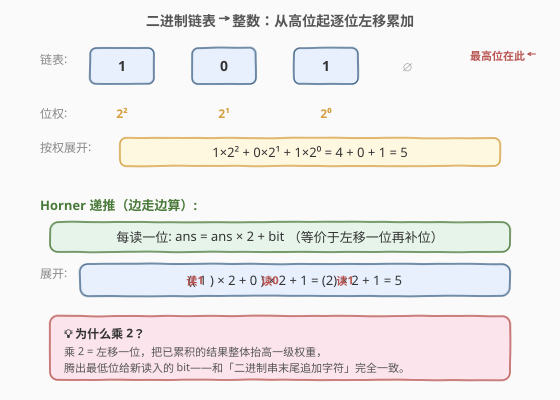
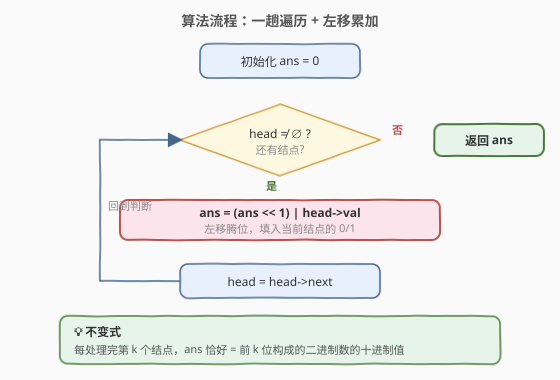
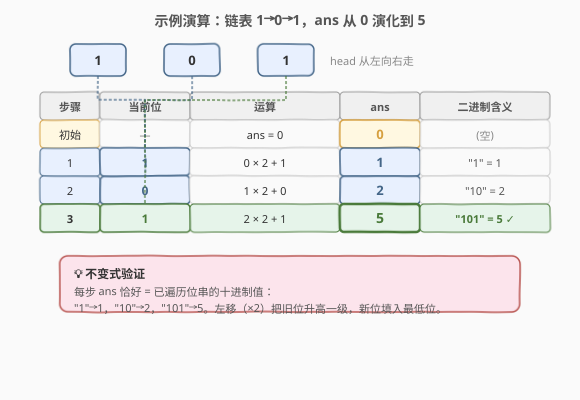

# LeetCode 二进制链表转整数 题解

## 1. 题目概述

- **标题 / 题号**：二进制链表转整数（#1290，easy）
- **链接**：https://leetcode.cn/problems/convert-binary-number-in-a-linked-list-to-integer/
- **难度**：简单
- **标签**：链表、位运算、数学

**题意**：给你一个单链表的引用结点 `head`。链表中每个结点的值不是 `0` 就是 `1`。已知此链表是一个整数数字的**二进制表示形式**。请你返回该链表所表示数字的 **十进制值**。**最高位**在链表的头部。

**示例 1**：

```text
输入：head = [1,0,1]
输出：5
解释：二进制数 (101) 转化为十进制数 (5)
```

**示例 2**：

```text
输入：head = [0]
输出：0
```

**约束**：

- 链表不为空。
- 链表的结点总数不超过 `30`。
- 每个结点的值不是 `0` 就是 `1`。

> 💡 关键约束在于「**最高位在头部**」——这意味着我们从链表头向尾遍历时，遇到的是从高到低的二进制位，正好对应**从左到右解析二进制串**的过程，无需先反转链表或先收集再倒序处理。

## 2. 解题思路

### 2.1 暴力思路：收集位再按权展开

最直觉的做法是先遍历链表，把每个结点的 `0/1` 值存入数组（或字符串），再用「按权展开」求和：

$$\text{ans} = \sum_{i=0}^{n-1} \text{bit}_i \times 2^{i}$$

其中 $\text{bit}_0$ 是最低位（链表尾部）。这能得出正确答案，但有两个缺点：

- 需要 `O(n)` 额外空间存数组。
- 还要额外算 $2^i$（无论是用循环乘 2 还是预计算幂表），代码绕了一圈。

能不能**边遍历边累加**，一趟搞定？

### 2.2 核心观察：Horner 递推（边走边算）



关键观察来自 **Horner 法（秦九韶算法）**。一个 $n$ 位二进制数 $b_{n-1}b_{n-2}\cdots b_1b_0$（$b_{n-1}$ 在头部，是最高位）的十进制值可改写为：

$$\text{ans} = (\cdots((b_{n-1}) \times 2 + b_{n-2}) \times 2 + b_{n-3}) \times 2 + \cdots) \times 2 + b_0$$

也就是说，**从最高位起，每读入一个新位，就把已累积的结果乘以 2（左移一位腾出最低位），再加上当前位**。用递推式表达：

$$\text{ans} \leftarrow \text{ans} \times 2 + \text{bit}$$

等价的位运算写法是 `ans = (ans << 1) | bit`（因为 `bit` 只取 0/1，`+` 与 `|` 等价）。这样只需**一趟遍历、一个累加变量**，无需数组、无需幂运算。

> 💡 **为什么乘 2？** 乘 2 等价于把已有结果**整体左移一位**，腾出最低位给新读入的位。每读入一位，之前所有位的权重都升高一级（$2^0 \to 2^1 \to \cdots$），这与「在二进制串末尾追加一个字符」的语义完全一致。

> 💡 **Horner 法的普适性**：这和解析十进制串（[8. atoi](https://leetcode.cn/problems/string-to-integer-atoi/)，`ans = ans * 10 + digit`）、26 进制（[171. Excel 表列序号](https://leetcode.cn/problems/excel-sheet-column-number/)，`ans = ans * 26 + digit`）完全同构——只要「从高位到低位、基数为 $r$」，统一套 `ans = ans * r + digit`。本题只是 $r = 2$ 的特例。

### 2.3 算法流程图



流程极简：初始化 `ans = 0`，从头遍历链表，对每个结点执行 `ans = ans * 2 + node->val`，遍历结束后 `ans` 即为答案。整个过程中 `ans` 始终是「已遍历部分」所表示的二进制数的十进制值——这是一个不变式：每处理完第 $k$ 个结点，`ans` 恰好等于前 $k$ 位构成的二进制数值。

### 2.4 示例演算

以 `head = [1, 0, 1]` 为例，逐位累加过程如下：



| 步骤 | 当前结点值 | 运算 | ans 变化 | 二进制含义 |
|------|-----------|------|----------|-----------|
| 初始 | — | `ans = 0` | 0 | （空） |
| 1 | 1 | $0 \times 2 + 1$ | **1** | `"1"` = 1 |
| 2 | 0 | $1 \times 2 + 0$ | **2** | `"10"` = 2 |
| 3 | 1 | $2 \times 2 + 1$ | **5** | `"101"` = 5 ✓ |

可以看到，每一步 `ans` 恰好等于「已遍历位串」的十进制值：`"1"`→1，`"10"`→2，`"101"`→5。这就是 Horner 递推不变式的直观体现。

## 3. 参考代码

### C++（位运算写法，推荐）

```cpp
/**
 * Definition for singly-linked list.
 * struct ListNode {
 *     int val;
 *     ListNode *next;
 *     ListNode() : val(0), next(nullptr) {}
 *     ListNode(int x) : val(x), next(nullptr) {}
 *     ListNode(int x, ListNode *next) : val(x), next(next) {}
 * };
 */
class Solution {
  public:
    int getDecimalValue(ListNode* head) {
        int ans = 0;
        while (head != nullptr) {
            ans = (ans << 1) | head->val; // 左移腾位 + 填入当前位
            head = head->next;
        }
        return ans;
    }
};
```

### Python（算术写法）

```python
class Solution:
    def getDecimalValue(self, head: Optional[ListNode]) -> int:
        ans = 0
        while head:
            ans = ans * 2 + head.val  # 等价于 (ans << 1) | head.val
            head = head.next
        return ans
```

> 💡 `ans << 1` 与 `ans * 2` 完全等价（对非负整数）；`| head->val` 与 `+ head->val` 在 `val` 只取 0/1 时也等价。两种写法任选其一，位运算版更贴合「二进制」语境，算术版更直白易懂。

## 4. 复杂度分析

| 维度 | 复杂度 | 说明 |
|------|--------|------|
| 时间复杂度 | O(n) | 遍历链表一次，每个结点做一次左移+或运算 |
| 空间复杂度 | O(1) | 只用一个累加变量 `ans`，无额外数组 |

## 5. 扩展：位串很长时怎么办

本题约束结点数 $\le 30$，`ans` 用 32 位 `int`（最大 $2^{30}-1 < 2^{31}$）即可容纳。若位串长度超过 30（如几百位），`int` 会溢出，需要改用**大整数**：

- **C++**：用 `std::string` 存二进制串，或借助大数库；也可边遍历边模拟「大数左移+加法」，但代码量大。
- **Python**：`int` 天生支持任意精度，`ans = ans * 2 + head.val` 直接可用，无需改动。

> ⚠️ 这与 [67. 二进制求和](https://leetcode.cn/problems/add-binary/) 的处境类似：当二进制串长度 $\le 63$ 时内置整型够用，超过后必须回到逐位模拟。区别在于 67 题是「加法（有进位）」、本题是「单串解析（无进位）」，复杂度低得多。

## 6. 面试要点

1. **为什么从头部开始遍历就能直接累加，不需要先反转链表？**

   - 因为「最高位在头部」恰好对应「从左到右解析二进制串」。Horner 法天然支持从高位到低位：每读一位就 `ans = ans * 2 + bit`，等价于把已有结果左移再补最低位。若题目改成「最低位在头部」，则需先反转链表或先收集再按权展开。

2. **`ans = (ans << 1) | bit` 和 `ans = ans * 2 + bit` 有区别吗？**

   - 对非负整数完全等价。`<< 1` 就是乘 2；`val` 只取 0/1 时 `|` 和 `+` 结果相同（0|0=0+0，0|1=0+1，1|0=1+0，1|1 本题不会出现，因为 ans 左移后最低位必为 0）。位运算版更贴合二进制语境。

3. **Horner 法为什么能省掉幂运算？**

   - 传统按权展开要对每一位算 $2^i$，而 Horner 法把 $2^i$ 的计算「摊」进了递推：每一步的 `* 2` 让之前所有位的权重同步升高一级，到处理第 $k$ 位时，最高位已经被乘了 $k-1$ 次 2，恰好等于 $2^{k-1}$。无需显式存幂。

4. **这题和「Excel 表列序号」「atoi」有什么共同点？**

   - 都是「从高位到低位解析进制定长串」，统一套 `ans = ans * base + digit`。本题 `base=2`，171 题 `base=26`，atoi `base=10`。掌握 Horner 法这一通用范式，这类题一通百通。

5. **如果链表每个结点存的是一个 0–9 的十进制数字，表示一个大整数，怎么求值？**

   - 完全同理：`ans = ans * 10 + head->val`。这就是把链表当成「十进制串」来解析，与 [8. atoi](https://leetcode.cn/problems/string-to-integer-atoi/) 中逐字符累加的逻辑一致，只是数据源从字符串换成了链表。

## 同类练习题

| # | 题目 | 与本题的关联 |
|---|------|-------------|
| 171 | [Excel 表列序号](https://leetcode.cn/problems/excel-sheet-column-number/) | 26 进制版 Horner（`ans = ans * 26 + digit`），与本题 $r=2$ 同构 |
| 8 | [字符串转换整数 (atoi)](https://leetcode.cn/problems/string-to-integer-atoi/) | 10 进制版逐位累加（`ans = ans * 10 + digit`），数据源从链表换成字符串 |
| 67 | [二进制求和](https://leetcode.cn/problems/add-binary/) | 二进制加法（有进位版），对照本题无进位的单串解析 |
| 129 | [求根节点到叶节点数字之和](https://leetcode.cn/problems/sum-root-to-leaf-numbers/) | 树版 Horner（路径上 `ans = ans * 10 + node.val`），从链表升级为树路径 |
