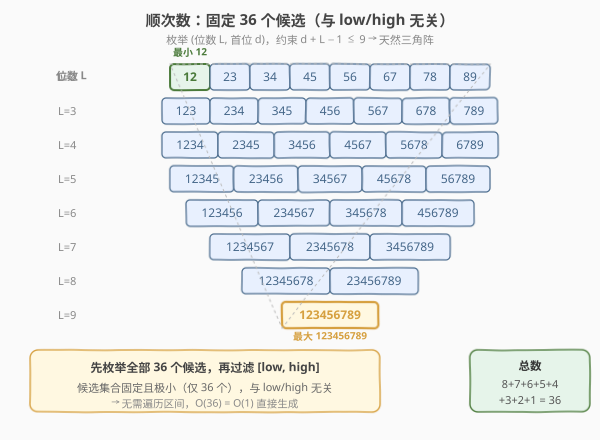
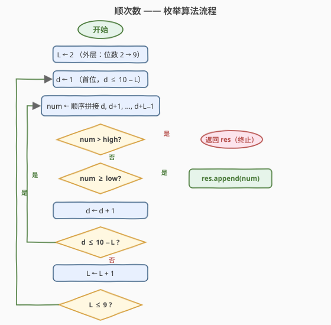
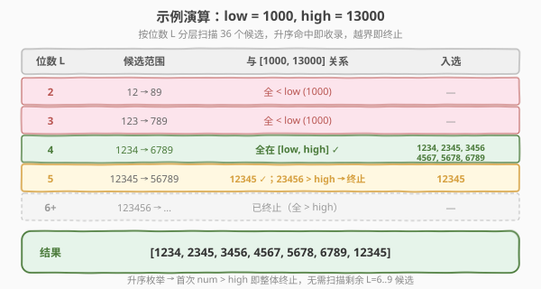

# 顺次数

- **题目名称**：顺次数
- **链接**：[1291. 顺次数](https://leetcode.cn/problems/sequential-digits/)
- **难度**：中等
- **标签**：数学、枚举、数位构造

## 1. 题目概述

我们定义「**顺次数**」（Sequential Digits）为：**每一位上的数字都比前一位上的数字大 `1`** 的整数。例如 `123`、`234`、`1234`、`123456789` 都是顺次数，而 `124`、`321`、`135` 不是。

请你返回由 $[\text{low}, \text{high}]$ 范围内**所有顺次数**组成的**升序**列表。

**示例 1**：

```text
输入：low = 100, high = 300
输出：[123,234]
```

**示例 2**：

```text
输入：low = 1000, high = 13000
输出：[1234,2345,3456,4567,5678,6789,12345]
```

**约束条件**：

- $10 \leq \text{low} \leq \text{high} \leq 10^9$

> 💡 注意 $\text{high}$ 可达 $10^9$，区间宽度最大约 $10^9$。「逐个检验」的暴力法会超时。关键洞察是：**顺次数极其稀疏**——$10^9$ 以内总共只有 **36 个**顺次数，因此应当**直接枚举构造**这 36 个候选，再过滤区间，而不是遍历 $[\text{low}, \text{high}]$ 去检验。

---

## 2. 解题思路

### 2.1 暴力思路：逐个检验

遍历 $[\text{low}, \text{high}]$ 中每个数 $x$，逐位检查是否每位都比前一位大 $1$。检验单个数需 $O(\log x)$，总时间 $O((\text{high}-\text{low}+1) \cdot \log \text{high})$。当 $\text{high}-\text{low} \approx 10^9$ 时约 $10^{10}$ 次操作，**必然超时**。

> ⚠️ 暴力法的根本问题在于：它把绝大部分时间花在**检验非顺次数**上，而几乎所有的数都不是顺次数——这是纯粹的浪费。正解的思路是**构造而非检验**。

### 2.2 核心观察：枚举全部 36 个候选



**关键性质**：顺次数的各位构成一个**公差为 1 的等差数列**，因此一个 $L$ 位顺次数**完全由「首位 $d$」和「位数 $L$」唯一确定**：

$$\text{num} = \overline{d\,(d{+}1)\,(d{+}2)\,\cdots\,(d{+}L{-}1)}$$

其中末位为 $d+L-1$，必须满足 $d + L - 1 \leq 9$（数字不能超过 $9$），即 $d \leq 10 - L$。

由此可算出顺次数的**总数**：

| 位数 $L$ | 首位 $d$ 范围 | 个数 |
|----------|--------------|------|
| 2 | $1 \sim 8$ | 8 |
| 3 | $1 \sim 7$ | 7 |
| 4 | $1 \sim 6$ | 6 |
| 5 | $1 \sim 5$ | 5 |
| 6 | $1 \sim 4$ | 4 |
| 7 | $1 \sim 3$ | 3 |
| 8 | $1 \sim 2$ | 2 |
| 9 | $1 \sim 1$ | 1 |

总数 $= 8+7+6+5+4+3+2+1 = \boxed{36}$，与 $\text{low}$、$\text{high}$ **完全无关**。

> 💡 **为什么最小位数是 2？** 题目约束 $\text{low} \geq 10$，而一位数（$0 \sim 9$）均 $< 10$，不可能落入区间，故无需考虑 $L=1$。最小的顺次数是 $12$，最大是 $123456789$。

**算法**：双重循环枚举 $(L, d)$，构造对应的顺次数 $\text{num}$，若 $\text{num} \in [\text{low}, \text{high}]$ 则加入结果。

### 2.3 算法流程图



**升序性与提前终止**：按 $L$ 从小到大、$d$ 从小到大枚举时，生成的顺次数**天然升序**——

- 所有 $L$ 位数都小于所有 $L+1$ 位数（如 $89 < 123$）；
- 同位数内，$d$ 越大数越大（如 $12 < 23 < \cdots < 89$）。

因此一旦发现 $\text{num} > \text{high}$，**后续所有候选必然更大**，可直接 `return` 整体终止，无需继续枚举。这是比逐个 `break` 更强的剪枝。

### 2.4 示例演算

以 $\text{low}=1000, \text{high}=13000$ 为例：



| 位数 $L$ | 候选范围 | 与 $[1000, 13000]$ 关系 | 入选 |
|----------|---------|------------------------|------|
| 2 | $12 \sim 89$ | 全 $< 1000$ | — |
| 3 | $123 \sim 789$ | 全 $< 1000$ | — |
| 4 | $1234 \sim 6789$ | 全在区间内 | $1234, 2345, 3456, 4567, 5678, 6789$ |
| 5 | $12345 \sim 56789$ | $12345 \leq 13000$ ✓；$23456 > 13000$ → 终止 | $12345$ |
| 6+ | $\geq 123456$ | 已终止（全 $> \text{high}$） | — |

最终结果 $[1234, 2345, 3456, 4567, 5678, 6789, 12345]$，与示例一致。

> 💡 观察第 5 行：枚举到 $12345$ 时命中区间（收录），继续枚举 $23456$ 时发现 $> 13000$，立即 `return`。$L=6 \sim 9$ 的候选全部跳过，这正是「升序 + 提前终止」的剪枝收益。

---

## 3. 参考代码

### C++

```cpp
class Solution {
public:
    vector<int> sequentialDigits(int low, int high) {
        vector<int> res;
        for (int L = 2; L <= 9; ++L) {              // 位数 2..9
            for (int d = 1; d + L - 1 <= 9; ++d) {   // 首位 d，末位 d+L-1 ≤ 9
                int num = 0;
                for (int i = 0; i < L; ++i)
                    num = num * 10 + (d + i);
                if (num > high) return res;          // 升序：后续必更大，整体终止
                if (num >= low) res.push_back(num);
            }
        }
        return res;
    }
};
```

### Python

```python
class Solution:
    def sequentialDigits(self, low: int, high: int) -> List[int]:
        res = []
        for L in range(2, 10):                       # 位数 2..9
            for d in range(1, 10 - L + 1):           # 首位 d，末位 d+L-1 ≤ 9
                num = 0
                for i in range(L):
                    num = num * 10 + (d + i)
                if num > high:                       # 升序：后续必更大，整体终止
                    return res
                if num >= low:
                    res.append(num)
        return res
```

> 💡 **Python 简化写法**：利用字符串切片可直接截取「123456789」的子串，省去算术构造：
> ```python
> s = "123456789"
> num = int(s[d - 1 : d - 1 + L])
> ```
> 两者等价，算术版与 C++ 统一、便于面试白板书写；字符串版更 Pythonic。

> ⚠️ **溢出说明**：最大候选 $123456789 < 2^{31}-1 \approx 2.147 \times 10^9$，未溢出 32 位 `int`，C++ 中 `num` 可安全用 `int` 存储（与 [1215 步进数](../1201-1300/1215_步进数.md) 不同，后者 $\text{high} \leq 2 \times 10^9$ 需 `long long`）。

---

## 4. 复杂度分析

| 维度 | 枚举构造 | 暴力检验 |
|------|----------|----------|
| **时间** | $O(36) = O(1)$ | $O((\text{high}-\text{low}) \log \text{high})$ |
| **空间** | $O(1)$（不计输出，输出 $\leq 36$） | $O(1)$ |
| **是否剪枝** | ✓（$\text{num} > \text{high}$ 即整体终止） | ✗ |
| **是否需排序** | ✗（天然升序） | ✗（按遍历序） |

> 💡 **时间为何是 $O(1)$？** 双重循环最多枚举 36 个候选（$8+7+\cdots+1$），每个候选的构造为 $O(L) \leq O(9)$ 次乘加。总操作数 $\leq 36 \times 9 \approx 324$，与 $\text{low}$、$\text{high}$ 的规模无关，是常数时间。实际由于提前终止，往往远少于 36 次。

---

## 5. 扩展：DFS 逐位构造（对照 1215 步进数）

顺次数也可用 DFS/BFS **逐位生长**：从一位数种子出发，每次在末尾追加「末位 $+1$」。这与 [1215. 步进数](../1201-1300/1215_步进数.md) 的 BFS 构造同源，区别在于**分支数**：

| 题目 | 追加规则 | 分支数 | 候选总数 |
|------|----------|--------|----------|
| 1215 步进数 | 末位 $d$ → 追加 $d-1$ 或 $d+1$ | 2 分支 | $\sim 3.6 \times 10^4$ |
| 1291 顺次数 | 末位 $d$ → 只追加 $d+1$ | 1 分支 | $36$ |

```python
class Solution:
    def sequentialDigits(self, low: int, high: int) -> List[int]:
        res = []
        def dfs(num: int):
            if num > high:
                return
            if num >= low:
                res.append(num)
            last = num % 10
            if last < 9:                         # 只能追加 last+1（单分支）
                dfs(num * 10 + last + 1)
        for i in range(1, 10):                   # 种子 1..9（low ≥ 10，不含 0）
            dfs(i)
        res.sort()                               # DFS 不保序，需排序
        return res
```

> 💡 **DFS vs 枚举取舍**：顺次数只有 36 个且结构简单（等差数列），「双重循环枚举 $(L, d)$」是最直接、最易写的方式，且天然升序免排序。DFS 逐位构造更通用（可推广到其他数位约束），但需排序且无法提前整体终止（只能逐分支回溯）。本题首选枚举法。

> ⚠️ 顺次数的 DFS 是**单链**（每个节点最多一个子节点），递归深度 $\leq 9$，无栈溢出风险。步进数的 DFS 则是二叉树（每个节点最多两个子节点）。

---

## 6. 面试要点

1. **为什么不能逐个检验区间里的数？**

   > $\text{high} \leq 10^9$，区间宽度最大 $10^9$，逐个检验 $O((\text{high}-\text{low}) \log \text{high}) \approx 10^{10}$，必然超时。根本原因是顺次数极稀疏（$10^9$ 内仅 36 个），检验大量非顺次数是纯浪费。

2. **为什么顺次数只有 36 个？怎么算的？**

   > $L$ 位顺次数由首位 $d$ 和位数 $L$ 唯一确定，约束 $d + L - 1 \leq 9$ 即 $d \leq 10 - L$。$L=2$ 时 $d$ 有 8 个取值，$L=3$ 时 7 个……$L=9$ 时 1 个。总数 $= 8+7+6+5+4+3+2+1 = 36$，与输入无关。

3. **为什么枚举结果是升序的？可以提前终止吗？**

   > 按 $L$ 升序、$d$ 升序枚举：所有 $L$ 位数 $< $ 所有 $L+1$ 位数（位数决定量级）；同 $L$ 内 $d$ 越大数越大。故输出天然升序。一旦 $\text{num} > \text{high}$，后续候选必然更大，可直接 `return` 整体终止。

4. **内层循环条件为什么是 `d + L - 1 <= 9` 而不是 `d <= 9`？**

   > 顺次数的末位是 $d + L - 1$，必须 $\leq 9$（数字不超过 9）。若只写 `d <= 9`，会生成 $d + L - 1 > 9$ 的非法候选（如 $L=3, d=9$ 会生成 $9,10,11$，不是合法数位）。等价写法是 `d <= 10 - L`。

5. **与 1215 步进数的核心区别是什么？**

   > 两个差异：① **分支数**——步进数末位可接 $d \pm 1$（两分支），顺次数只能接 $d+1$（单分支）；② **候选规模**——步进数 $\sim 3.6 \times 10^4$ 个需 BFS/DFS 构造，顺次数仅 36 个可直接双重循环枚举。两者共享「**构造而非检验**」的范式：当目标集合远稀疏于全集时，直接生成目标比遍历全集过滤更高效。

> 💡 **一句话总结**：顺次数 = 双重循环枚举 $(L, d)$ 构造 36 个固定候选 + 过滤区间 + 升序提前终止，$O(1)/O(1)$。核心范式是「**构造而非检验**」——候选集合固定且极小时，直接枚举全部候选再过滤，远优于遍历区间逐个检验。

---

## 7. 同类练习题

- [1215. 步进数](https://leetcode.cn/problems/stepping-numbers/)：相邻位差绝对值为 1，BFS 逐位构造（末位可接 $d \pm 1$，两分支），候选 $\sim 3.6 \times 10^4$，与本题共享「数位构造」范式
- [258. 各位相加](https://leetcode.cn/problems/add-digits/)：对数字的数位做反复求和处理，数学规律 $O(1)$，对照本题的数位思维
- [400. 第 N 位数字](https://leetcode.cn/problems/nth-digit/)：按位数分层定位，同样是「构造/定位」而非遍历，承接数位分层思想
- [357. 统计各位数字都不同的数字个数](https://leetcode.cn/problems/count-numbers-with-unique-digits/)：构造各位互不相同的数（排列计数），数位构造 + 组合计数，本题的「计数」版
- [2376. 统计特殊整数](https://leetcode.cn/problems/count-special-integers/)：数位 DP 统计各位互不相同且不超过 $n$ 的数个数，357 的「带上界」升级版，与本题共享「数位约束直接构造」范式
