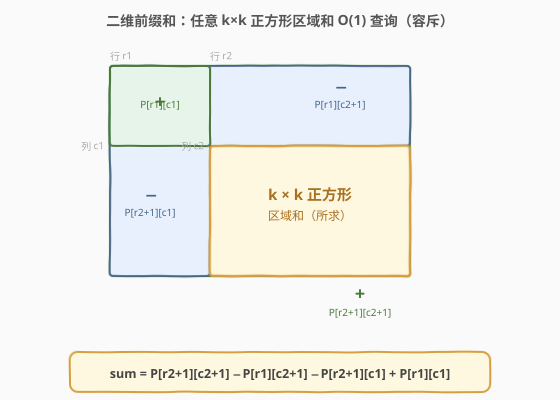
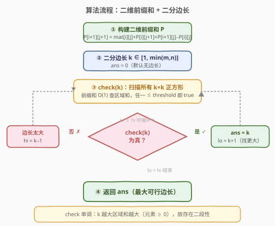
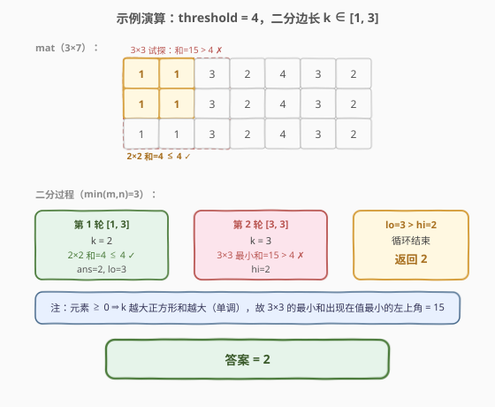

# 元素和小于等于阈值的正方形的最大边长

- **题目名称**：元素和小于等于阈值的正方形的最大边长
- **链接**：[1292. 元素和小于等于阈值的正方形的最大边长](https://leetcode.cn/problems/maximum-side-length-of-a-square-with-sum-less-than-or-equal-to-threshold/)
- **难度**：中等
- **标签**：数组、二分查找、矩阵、前缀和

## 1. 题目概述

给你一个大小为 $m \times n$ 的矩阵 `mat` 和一个整数阈值 `threshold`。请你返回元素总和**小于或等于**阈值的**正方形区域**的**最大边长**；如果没有这样的正方形区域，则返回 `0`。

**示例 1**：

```text
输入：mat = [[1,1,3,2,4,3,2],[1,1,3,2,4,3,2],[1,1,3,2,4,3,2]], threshold = 4
输出：2
解释：总和小于或等于 4 的正方形的最大边长为 2（左上角 2×2 全 1，和为 4）。
```

**示例 2**：

```text
输入：mat = [[2,2,2,2,2],[2,2,2,2,2],[2,2,2,2,2],[2,2,2,2,2],[2,2,2,2,2]], threshold = 1
输出：0
解释：即便 1×1 的格子元素和也为 2 > 1，无可行正方形。
```

**约束条件**：

- `m == mat.length`
- `n == mat[i].length`
- `1 <= m, n <= 300`
- `0 <= mat[i][j] <= 10^4`
- `0 <= threshold <= 10^5`

> 💡 **两个关键词决定解法骨架**：「正方形」⇒ 候选边长 $k \in [1, \min(m,n)]$，只需在一维上搜索；「区域和」⇒ 二维前缀和把任意 $k \times k$ 区域求和降到 $O(1)$。两者组合即得 $O(m \cdot n \cdot \log \min(m,n))$ 的二分答案解法。

---

## 2. 解题思路

### 2.1 暴力思路

枚举所有正方形：固定左上角 $(i,j)$，再枚举边长 $k=1,2,\dots,\min(m,n)$，每次对 $k \times k$ 区域逐格求和判断是否 $\le \text{threshold}$。单次求和 $O(k^2)$，总复杂度 $O(m \cdot n \cdot \min(m,n)^2)$，在 $300 \times 300$ 下约 $8 \times 10^9$，超时。

即便用二维前缀和把「区域求和」降到 $O(1)$，仍需对每个 $(i,j)$ 遍历所有 $k$，总复杂度 $O(m \cdot n \cdot \min(m,n))$，约 $2.7 \times 10^7$，可过但不够优雅——忽略了「边长可行性」的单调性。

### 2.2 核心观察：二维前缀和 + 二分边长

先解决「任意 $k \times k$ 区域和 $O(1)$ 查询」。



构建二维前缀和 $P$，其中 $P[i+1][j+1]$ 表示 `mat` 中左上角 $(0,0)$ 到 $(i,j)$ 的矩形元素和（采用 1-indexed 前缀避免边界判断）：

$$
P[i+1][j+1] = \texttt{mat}[i][j] + P[i][j+1] + P[i+1][j] - P[i][j]
$$

于是左上角 $(r_1, c_1)$、右下角 $(r_2, c_2)$ 的矩形元素和（**容斥原理**）为：

$$
\text{sum} = P[r_2+1][c_2+1] - P[r_1][c_2+1] - P[r_2+1][c_1] + P[r_1][c_1]
$$

> 💡 **容斥口诀**：大矩形减上方条、减左方条、补回左上角（被减了两次）。对应图中的「$+$ $-$ $-$ $+$」四块。

有了 $O(1)$ 区域和查询，再来观察**边长的单调性**：

> ⚠️ **核心性质**：`mat[i][j] >= 0`，所以固定一个位置的正方形，**边长越大区域和越大**。因此若存在边长 $k$ 的可行正方形（和 $\le \text{threshold}$），则边长 $1 \dots k$ 都可行；若 $k$ 不可行，则 $k+1, k+2, \dots$ 都不可行。

把「是否存在边长 $k$ 的可行正方形」记为 $\text{check}(k)$，则 $\text{check}$ 关于 $k$ 单调递减（$k$ 越大越难满足），存在分界点 $k^*$：

```text
k <= k* → check(k) = true   (存在可行正方形)
k >  k* → check(k) = false  (边长太大，全超阈值)
```

这正是**二段性**——把「求最大可行边长」转化为在 $[1, \min(m,n)]$ 上二分，每次 $O(m \cdot n)$ 验证 $\text{check}(\text{mid})$，可行则去右半找更大的，不可行则去左半缩小。

> 💡 **识别信号**：求「最大的满足某单调条件的值」+ 能 $O(m \cdot n)$ 验证候选值 ⇒ 想「二分答案」。与同目录的 [1283. 使结果不超过阈值的最小除数](../1201-1300/1283_使结果不超过阈值的最小除数.md) 是镜像关系：1283 求「最小可行除数」（合法在右，二分往左压），1292 求「最大可行边长」（合法在左，二分往右扩）。

### 2.3 算法流程图



1. 构建 $(m+1) \times (n+1)$ 的前缀和 $P$，$O(m \cdot n)$。
2. 在 $k \in [1, \min(m,n)]$ 上二分，`ans = 0`。
3. $\text{check}(k)$：扫描所有以 $(i,j)$ 为**右下角**的 $k \times k$ 正方形（$i \in [k-1, m-1]$，$j \in [k-1, n-1]$），前缀和 $O(1)$ 查区域和，任一 $\le \text{threshold}$ 即返回 `true`。
4. `true` → `ans = k`，`lo = k+1`（找更大）；`false` → `hi = k-1`（缩小）。
5. 循环结束返回 `ans`。

### 2.4 示例演算

以示例 1 `mat = [[1,1,3,2,4,3,2],[1,1,3,2,4,3,2],[1,1,3,2,4,3,2]]`、`threshold = 4` 为例，$m=3, n=7, \min=3$：



- **第 1 轮** $[1,3]$，$k=2$：左上角 $2 \times 2$ 全 1，和 $=1+1+1+1=4 \le 4$ ✓ → 可行，记 `ans=2`，去右半 `[3,3]`。
- **第 2 轮** $[3,3]$，$k=3$：所有 $3 \times 3$ 正方形中，元素最小的左上角 $3 \times 3$ 和 $=1+1+3+1+1+3+1+1+3=15 > 4$ ✗ → 边长太大，`hi=2`。
- **结束** `lo=3 > hi=2`，返回 `ans=2`。

> 💡 **为何只看左上角 $3 \times 3$？** 因为 `mat` 每行相同且非递减趋势，左上角是值最小的 $3 \times 3$ 区域。由单调性，最小的都超阈值，其余必然更超。实际 $\text{check}$ 会扫描全部，这里仅为快速心算。

---

## 3. 参考代码

### C++

```cpp
class Solution {
  public:
    int maxSideLength(vector<vector<int>>& mat, int threshold) {
        int m = mat.size(), n = mat[0].size();
        // 1. 二维前缀和（多一行一列做哨兵，省边界判断）
        vector<vector<long>> P(m + 1, vector<long>(n + 1, 0));
        for (int i = 0; i < m; ++i) {
            for (int j = 0; j < n; ++j) {
                P[i + 1][j + 1] = mat[i][j] + P[i][j + 1]
                                  + P[i + 1][j] - P[i][j];
            }
        }

        // O(1) 查询左上 (r1,c1) 到右下 (r2,c2) 的矩形和
        auto rectSum = [&](int r1, int c1, int r2, int c2) -> long {
            return P[r2 + 1][c2 + 1] - P[r1][c2 + 1]
                 - P[r2 + 1][c1] + P[r1][c1];
        };

        // 2. check(k)：是否存在边长 k 的正方形和 <= threshold
        auto check = [&](int k) -> bool {
            for (int i = k - 1; i < m; ++i) {
                for (int j = k - 1; j < n; ++j) {
                    if (rectSum(i - k + 1, j - k + 1, i, j) <= threshold) {
                        return true;
                    }
                }
            }
            return false;
        };

        // 3. 二分最大可行边长
        int lo = 1, hi = min(m, n), ans = 0;
        while (lo <= hi) {
            int mid = lo + (hi - lo) / 2;
            if (check(mid)) {
                ans = mid;       // 可行，尝试更大边长
                lo = mid + 1;
            } else {
                hi = mid - 1;    // 边长太大，缩小
            }
        }
        return ans;
    }
};
```

### Python

```python
class Solution:
    def maxSideLength(self, mat: List[List[int]], threshold: int) -> int:
        m, n = len(mat), len(mat[0])
        # 1. 二维前缀和（哨兵行列省边界判断）
        P = [[0] * (n + 1) for _ in range(m + 1)]
        for i in range(m):
            for j in range(n):
                P[i + 1][j + 1] = (mat[i][j] + P[i][j + 1]
                                   + P[i + 1][j] - P[i][j])

        # O(1) 查询矩形和
        def rect_sum(r1, c1, r2, c2):
            return (P[r2 + 1][c2 + 1] - P[r1][c2 + 1]
                    - P[r2 + 1][c1] + P[r1][c1])

        # 2. check(k)
        def check(k):
            for i in range(k - 1, m):
                for j in range(k - 1, n):
                    if rect_sum(i - k + 1, j - k + 1, i, j) <= threshold:
                        return True
            return False

        # 3. 二分最大可行边长
        lo, hi, ans = 1, min(m, n), 0
        while lo <= hi:
            mid = (lo + hi) // 2
            if check(mid):
                ans = mid        # 可行，尝试更大边长
                lo = mid + 1
            else:
                hi = mid - 1     # 边长太大，缩小
        return ans
```

> ⚠️ **两个易错点**：
> 1. **溢出**：`mat[i][j]` 可达 $10^4$，$300 \times 300$ 区域和最大约 $9 \times 10^7$，未超 32 位 `int`（约 $2.1 \times 10^9$）。但前缀和累加过程中 `P[i+1][j+1]` 最大也在此量级，C++ 用 `int` 本题可过；为稳妥起见代码用 `long`。Python 整数无上限无此问题。
> 2. **哨兵行列**：前缀和 $P$ 开 $(m+1) \times (n+1)$，第 0 行第 0 列全 0，使 `rectSum` 无需对 $r_1=0$、$c_1=0$ 特判。若不开哨兵，需在查询时写一串 `if` 处理边界，既丑又易错。

---

## 4. 复杂度分析

| 维度 | 复杂度 | 说明 |
|------|--------|------|
| 时间复杂度 | $O(m \cdot n \cdot \log \min(m,n))$ | 构建前缀和 $O(m \cdot n)$；二分 $O(\log \min(m,n))$ 次，每次 $\text{check}$ 扫描 $O(m \cdot n)$ |
| 空间复杂度 | $O(m \cdot n)$ | 二维前缀和数组 $P$ |

> 💡 $m, n \le 300$，$\log \min \approx 9$，总运算量约 $300 \times 300 \times 9 \approx 8 \times 10^5$，远低于时限。瓶颈在 $\text{check}$ 的双层扫描，前缀和把内层求和从 $O(k^2)$ 降到 $O(1)$ 是关键。

---

## 5. 扩展：O(m·n) 单调延展法

二分答案的 $O(m \cdot n \cdot \log \min)$ 已足够快，但利用「**右下角固定时边长与区域和同向单调**」可进一步优化到 $O(m \cdot n)$。

**思路**：按行优先序遍历每个格子 $(i,j)$ 作为正方形**右下角**，维护全局最优 `ans`。对每个 $(i,j)$ 只需检查边长 `ans+1` 的正方形是否可行：

- 可行 → `ans++`（继续尝试 `ans+1`，因为可能更大也行）；
- 不可行 → 跳过（由单调性，以 $(i,j)$ 为右下角的更大边长必然更不可行）。

**正确性**：固定右下角 $(i,j)$ 时，边长越大区域和越大（元素 $\ge 0$）。所以若边长 `ans+1` 不可行，`ans+2, ...` 都不可行；而边长 $\le \text{ans}$ 的即便可行也无法改进答案。因此每个格子只需探测 `ans+1` 一次。

**复杂度**：`ans` 最多自增 $\min(m,n)$ 次，故 `check` 调用总次数 $O(\min(m,n))$；加上遍历本身的 $O(m \cdot n)$，总计 $O(m \cdot n)$。

```cpp
int maxSideLength(vector<vector<int>>& mat, int threshold) {
    int m = mat.size(), n = mat[0].size();
    vector<vector<long>> P(m + 1, vector<long>(n + 1, 0));
    for (int i = 0; i < m; ++i)
        for (int j = 0; j < n; ++j)
            P[i + 1][j + 1] = mat[i][j] + P[i][j + 1]
                              + P[i + 1][j] - P[i][j];

    int ans = 0;
    for (int i = 0; i < m; ++i) {
        for (int j = 0; j < n; ++j) {
            // 只探测 ans+1：以 (i,j) 为右下角、边长 ans+1 的正方形
            int k = ans + 1;
            if (i - k + 1 >= 0 && j - k + 1 >= 0 &&
                P[i + 1][j + 1] - P[i - k + 1][j + 1]
                - P[i + 1][j - k + 1] + P[i - k + 1][j - k + 1]
                <= threshold) {
                ++ans;
            }
        }
    }
    return ans;
}
```

> ⚠️ 此法虽更优，但**正确性论证较隐蔽**（依赖「右下角固定 + 行优先序 + 只看 ans+1」三重条件耦合），面试中二分答案版更易讲清。建议先写二分版拿稳，再口头提此优化展示深度。

---

## 6. 面试要点

1. **为什么能二分？二段性体现在哪？**

   - `mat[i][j] >= 0` 保证固定位置的正方形「边长越大，区域和越大」。因此 `check(k)`（是否存在边长 $k$ 的可行正方形）关于 $k$ 单调递减：$k \le k^*$ 时可行、$k > k^*$ 时不可行。这种「左可行 / 右不可行」的结构即二段性，可二分定位 $k^*$。

2. **二维前缀和的容斥公式怎么推？**

   - $P[i+1][j+1]$ 是左上到 $(i,j)$ 的矩形和。要查 $(r_1,c_1)$ 到 $(r_2,c_2)$ 的子矩形：用「大矩形 $P[r_2+1][c_2+1]$」减去「上方条 $P[r_1][c_2+1]$」和「左方条 $P[r_2+1][c_1]$」，但左上角 $P[r_1][c_1]$ 被减了两次，需加回。即 $P[r_2+1][c_2+1] - P[r_1][c_2+1] - P[r_2+1][c_1] + P[r_1][c_1]$。

3. **前缀和为什么要多开一行一列（哨兵）？**

   - 第 0 行第 0 列全 0，使查询时 $r_1=0$ 或 $c_1=0$ 无需特判——公式直接退化成 $P[r_2+1][c_2+1] - P[r_2+1][c_1]$ 或 $P[r_2+1][c_2+1] - P[r_1][c_2+1]$。省去边界 `if`，代码更简洁不易错。

4. **check(k) 为什么扫描右下角而不是左上角？**

   - 两种写法等价。用右下角 $(i,j)$ 遍历时 $i \in [k-1, m-1]$、$j \in [k-1, n-1]$，对应的左上角为 $(i-k+1, j-k+1)$，自然保证非负。用左上角遍历则需保证 $i+k-1 < m$、$j+k-1 < n$。两者区域和公式相同，习惯而已。

5. **二分版与 O(m·n) 单调延展版的取舍？**

   - 二分版 $O(m \cdot n \cdot \log \min)$ 思路直白、与「二分答案」家族模板一致，易写易讲，推荐面试首选。单调延展版 $O(m \cdot n)$ 更优但正确性依赖「右下角固定 + 只看 ans+1」的耦合论证，适合作为追问时的进阶展示。

---

## 7. 同类练习题

- [304. 二维区域和检索 - 数组不可变](https://leetcode.cn/problems/range-sum-query-2d-immutable/)：二维前缀和的母题，掌握容斥公式 $+/−/−/+$ 四块，是 1292 的基建
- [1283. 使结果不超过阈值的最小除数](../1201-1300/1283_使结果不超过阈值的最小除数.md)：同目录二分答案镜像题——1292 求「最大可行边长」（合法在左），1283 求「最小可行除数」（合法在右），对照两种二分方向
- [221. 最大正方形](https://leetcode.cn/problems/maximal-square/)：同为「矩阵中找最大正方形」，但条件是「全 1」用 DP，1292 条件是「和 ≤ 阈值」用前缀和+二分，对照不同约束下的正方形问题
- [1277. 统计全为 1 的正方形子矩阵](../1201-1300/1277_统计全为1的正方形子矩阵.md)：与 221 共享 DP 状态，1292 则用前缀和处理「数值和」而非「全 1」，三条线串联起「矩阵正方形」题族
- [875. 爱吃香蕉的珂珂](https://leetcode.cn/problems/koko-eating-bananas/)：一维二分答案经典，`check` 单调验证范式，与 1292 的「二分 + O(n) 验证」骨架同源
