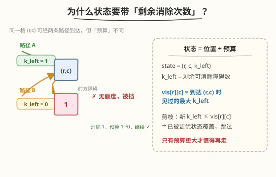
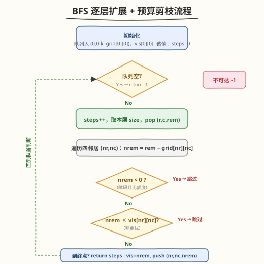
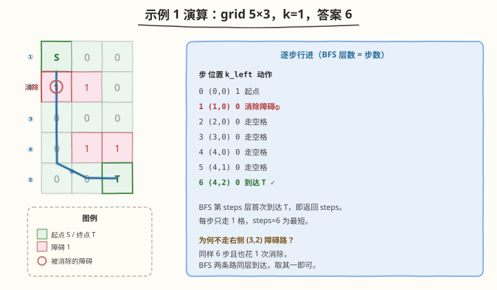

# LeetCode 网格中的最短路径 题解

## 1. 题目概述

- **标题 / 题号**：网格中的最短路径（#1293，hard）
- **链接**：https://leetcode.cn/problems/shortest-path-in-a-grid-with-obstacles-elimination/
- **难度**：困难
- **标签**：广度优先搜索、矩阵、最短路径、状态压缩

**题意**：给定一个 `m × n` 的网格 `grid`，每个格子为 `0`（空）或 `1`（障碍）。从左上角 `(0,0)` 出发走到右下角 `(m-1, n-1)`，每步可走到上下左右相邻格子。你**最多可以消除 `k` 个障碍**（把经过的 `1` 当成 `0` 走过，每个障碍只能消除一次）。求到达终点的**最少步数**；若无法到达返回 `-1`。

**示例 1**：

```text
输入：grid = [[0,0,0],[1,1,0],[0,0,0],[0,1,1],[0,0,0]], k = 1
输出：6
解释：沿第 0 列向下，消除 (1,0) 处的障碍，再沿底行走到右下角，共 6 步。
```

**示例 2**：

```text
输入：grid = [[0,1,1],[1,1,1],[1,0,0]], k = 1
输出：-1
解释：无论消除哪个障碍，都被剩余障碍挡住，无法到达右下角。
```

**约束**：

- `m == grid.length`
- `n == grid[i].length`
- `1 <= m, n <= 40`
- `1 <= k <= m * n`
- `grid[i][j]` 仅为 `0` 或 `1`

## 2. 解题思路

### 2.1 暴力思路：DFS 回溯枚举路径

枚举所有从起点到终点的路径，每遇到障碍决定「消除」或「回头」，维护已用消除次数不超过 `k`，记录最短步数。问题在于路径数量随网格大小**指数爆炸**，且同一格子会被反复访问，`m, n ≤ 40` 时完全不可行。

> ⚠️ 关键误区：若像普通迷宫最短路那样只用 `vis[r][c]` 布尔标记「是否走过」，会**丢掉信息**——同一格子可以经不同路径到达，且携带的「剩余消除预算」不同，预算多的状态严格更强。下面正是围绕这一点展开。

### 2.2 核心观察：BFS + 状态增维



本题在普通网格 BFS 之上只需做一件事：**把状态从 `(r, c)` 扩成 `(r, c, k_left)`**，其中 `k_left` 是到达该格时**剩余**的可消除次数。

- **为什么必须带 `k_left`？** 同一个 `(r,c)` 可能被两条路径到达：一条绕远但没消除障碍（`k_left` 大），一条抄近但花了消除（`k_left` 小）。前者能继续穿过前方的障碍，后者可能被卡住——它们是**不同的状态**，不能互相替代。
- **单调性剪枝**：对同一格 `(r,c)`，`k_left` 越大越强（能去的地方是 `k_left` 小者的超集）。因此用 `vis[r][c]` 记录**到达该格时见过的最大 `k_left`**，仅当新状态的 `k_left > vis[r][c]` 时才入队，否则必被更优状态覆盖，直接跳过。
- **BFS 保最短**：所有边权为 1，BFS 按层扩展，**首次到达终点**的层数即为最少步数。

> 💡 这个「vis 存最大剩余预算、只放更优状态入队」的剪枝，把朴素 `O(m·n·k)` 的三维 BFS 在实践中压到接近 `O(m·n)`——因为每个格子的 `vis` 单调递增、被更新次数极少。

### 2.3 算法流程图



文字版步骤：

1. 特判 `m==1 && n==1` 直接返回 `0`。
2. 初始化队列，放入 `(0, 0, k - grid[0][0])`（起点若为障碍先扣一次预算）；`vis[0][0]` 设为该预算；`steps = 0`。
3. BFS 循环：
   - 队列空 → 返回 `-1`。
   - `steps++`，取当前层大小 `size`，逐个 `pop (r, c, rem)`。
   - 对四邻居 `(nr, nc)`：算 `nrem = rem - grid[nr][nc]`。
     - `nrem < 0`：障碍且无额度，跳过。
     - `nrem <= vis[nr][nc]`：非更优状态，跳过。
     - `(nr, nc)` 是终点：返回 `steps`。
     - 否则更新 `vis[nr][nc] = nrem`，入队 `(nr, nc, nrem)`。

### 2.4 示例演算



以示例 1 为例，`k=1`。沿第 0 列直下、消除 `(1,0)` 这一个障碍，再沿底行右行到终点：

| 步 | 位置 | k_left | 动作 |
|----|------|--------|------|
| 0 | (0,0) | 1 | 起点 |
| 1 | (1,0) | 0 | 消除障碍 |
| 2 | (2,0) | 0 | 走空格 |
| 3 | (3,0) | 0 | 走空格 |
| 4 | (4,0) | 0 | 走空格 |
| 5 | (4,1) | 0 | 走空格 |
| 6 | (4,2) | 0 | 到达终点 |

BFS 第 6 层首次抵达 `(4,2)`，返回 `6`。注意右侧经 `(3,2)` 消除障碍的路径同样 6 步、同层到达——BFS 任取其一即可，不影响答案。

## 3. 参考代码

### C++

```cpp
class Solution {
  public:
    int shortestPath(vector<vector<int>>& grid, int k) {
        int m = grid.size(), n = grid[0].size();
        if (m == 1 && n == 1) return 0;

        // vis[r][c] = 到达 (r,c) 时见过的最大剩余消除次数
        vector<vector<int>> vis(m, vector<int>(n, -1));
        queue<tuple<int, int, int>> q;

        int startRem = k - grid[0][0];
        if (startRem < 0) return -1;          // 起点即障碍且无额度
        q.push({0, 0, startRem});
        vis[0][0] = startRem;

        int dirs[4][2] = {{0, 1}, {0, -1}, {1, 0}, {-1, 0}};
        int steps = 0;

        while (!q.empty()) {
            int size = q.size();
            steps++;
            for (int i = 0; i < size; i++) {
                auto [r, c, rem] = q.front(); q.pop();
                for (auto& d : dirs) {
                    int nr = r + d[0], nc = c + d[1];
                    if (nr < 0 || nr >= m || nc < 0 || nc >= n) continue;
                    int nrem = rem - grid[nr][nc];
                    if (nrem < 0) continue;             // 障碍且无可消除额度
                    if (nrem <= vis[nr][nc]) continue;  // 非更优状态，剪枝
                    if (nr == m - 1 && nc == n - 1) return steps;
                    vis[nr][nc] = nrem;
                    q.push({nr, nc, nrem});
                }
            }
        }
        return -1;
    }
};
```

### Python

```python
class Solution:
    def shortestPath(self, grid: List[List[int]], k: int) -> int:
        m, n = len(grid), len(grid[0])
        if m == 1 and n == 1:
            return 0

        # vis[r][c] = 到达 (r,c) 时见过的最大剩余消除次数
        vis = [[-1] * n for _ in range(m)]
        from collections import deque
        q = deque()

        start_rem = k - grid[0][0]
        if start_rem < 0:
            return -1                       # 起点即障碍且无额度
        q.append((0, 0, start_rem))
        vis[0][0] = start_rem

        dirs = [(0, 1), (0, -1), (1, 0), (-1, 0)]
        steps = 0

        while q:
            steps += 1
            for _ in range(len(q)):          # 当前 BFS 层
                r, c, rem = q.popleft()
                for dr, dc in dirs:
                    nr, nc = r + dr, c + dc
                    if 0 <= nr < m and 0 <= nc < n:
                        nrem = rem - grid[nr][nc]
                        if nrem < 0:
                            continue         # 障碍且无可消除额度
                        if nrem <= vis[nr][nc]:
                            continue         # 非更优状态，剪枝
                        if nr == m - 1 and nc == n - 1:
                            return steps
                        vis[nr][nc] = nrem
                        q.append((nr, nc, nrem))
        return -1
```

> 💡 终点判断放在**更新 `vis` 之前**：首次到达即返回，无需入队，省一次扩展。若把终点也当普通格子入队，则在 `pop` 时按层数返回亦可，但会多走一层、需要额外处理。

## 4. 复杂度分析

| 维度 | 复杂度 | 说明 |
|------|--------|------|
| 时间复杂度 | $O(m \cdot n \cdot k)$（最坏）/ 接近 $O(m \cdot n)$（实践） | 每格的 `vis` 单调递增、至多被更新 $k+1$ 次；剪枝后实际更新极少 |
| 空间复杂度 | $O(m \cdot n)$ | `vis` 为二维数组存最大剩余预算；队列最坏存 $O(m \cdot n)$ 个状态 |

> ⚠️ 注意复杂度是 $O(m \cdot n \cdot k)$ 而非 $O(m \cdot n)$：理论上同一格可被多次以递增 `k_left` 入队。但 `vis[r][c]` 严格递增且上界为 `k`，配合 BFS 层序，绝大多数状态在首次访问时即被剪掉，实测远低于理论上界。若追求严格 $O(m \cdot n)$，可用 0-1 BFS / A* 配曼哈顿启发式（见第 5 节）。

## 5. 扩展：A\* 与 0-1 BFS 变体

- **A\* 加速**：把 BFS 队列换成优先队列，以 `已走步数 + 曼哈顿距离(r,c → 终点)` 为启发式 `f`。当 `k` 充足时能更快逼近终点，最坏复杂度不变但平均更优。注意 `k_left` 仍需进状态与 `vis`。
- **0-1 BFS 不适用**：本题消除障碍并非「边权为 1」，消除只是改变预算而非增加步数，所有边权仍为 1，因此用普通 BFS 即可，无需双端队列。
- **k 足够大时**：若 $k \ge m + n - 2$（任意路径最多这么多障碍），相当于无障碍迷宫，BFS 必能在 $m+n-2$ 步内到达，可提前返回。

## 6. 面试要点

1. **为什么 `vis` 不能用布尔数组？**

   - 同一格可经不同路径到达，携带的剩余消除预算不同；预算多的状态严格更强。布尔标记会把「绕远但预算多」的好状态误判为已访问而丢弃，导致漏掉正解。

2. **`vis[r][c]` 存什么？剪枝条件是什么？**

   - 存**到达该格时见过的最大剩余消除次数**。剪枝：`nrem <= vis[nr][nc]` 时跳过——新状态不比历史最优强，必被覆盖。仅 `nrem > vis[nr][nc]` 才入队并更新。

3. **为什么 BFS 首次到终点就是最短步数？**

   - 所有边权为 1，BFS 按层扩展，第 `steps` 层首次抵达终点，意味着不存在更短路径。返回当前层数即可。

4. **起点 / 终点本身是障碍怎么办？**

   - 起点为障碍：初始化时 `startRem = k - grid[0][0]`，若 `< 0` 直接返回 `-1`。终点为障碍：邻居计算 `nrem = rem - grid[nr][nc]` 自然扣减，预算足够即可踏入并在终点判断处返回。

5. **时间复杂度到底是 $O(m \cdot n)$ 还是 $O(m \cdot n \cdot k)$？**

   - 理论上界 $O(m \cdot n \cdot k)$：同一格 `vis` 至多递增 $k+1$ 次。但剪枝使实际更新极少，工程上接近 $O(m \cdot n)$。面试回答应给出上界并解释剪枝的均摊效果。

## 同类练习题

| # | 题目 | 与本题的关联 |
|---|------|-------------|
| 994 | [腐烂的橘子](https://leetcode.cn/problems/rotting-oranges/)（[题解](../0901-1000/994_腐烂的橘子.md)） | 多源 BFS 求最短时间，同「按层扩展 = 步数」骨架 |
| 200 | [岛屿数量](https://leetcode.cn/problems/number-of-islands/)（[题解](../0101-0200/200_岛屿数量.md)） | 网格 BFS/DFS 基础，对照本题的状态增维 |
| 1926 | [网格图中递增路径的数目](https://leetcode.cn/problems/number-of-increasing-paths-in-a-grid/) | 网格 DFS + 记忆化，对比 BFS 求最短路 |
| 864 | [获取所有钥匙的最短路径](https://leetcode.cn/problems/shortest-path-to-get-all-keys/) | 状态压缩 BFS（钥匙位掩码进状态），与本题「预算进状态」同思想 |
| 542 | [01 矩阵](https://leetcode.cn/problems/01-matrix/) | 多源 BFS 求到最近 0 的距离，BFS 模板巩固 |
