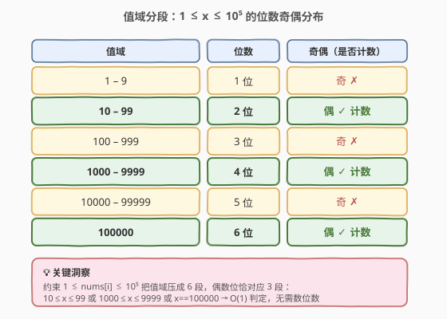
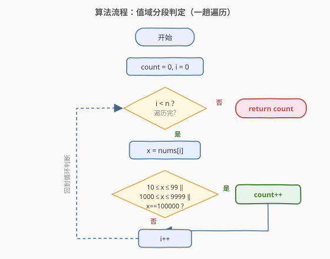
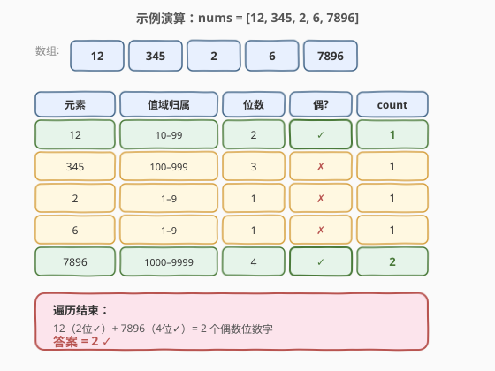

# LeetCode 统计位数为偶数的数字 题解

## 1. 题目概述

- **标题 / 题号**：统计位数为偶数的数字（#1295，easy）
- **链接**：https://leetcode.cn/problems/find-numbers-with-even-number-of-digits/
- **难度**：简单
- **标签**：数组、数学

**题意**：给定一个整数数组 `nums`，返回其中**包含偶数个数字**的元素个数。即统计 `nums[i]` 的十进制位数（如 `12` 是 $2$ 位、`345` 是 $3$ 位）为偶数的元素数目。

**示例 1**：

```text
输入：nums = [12,345,2,6,7896]
输出：2
解释：
  12   → 2 位（偶）✓
  345  → 3 位（奇）
  2    → 1 位（奇）
  6    → 1 位（奇）
  7896 → 4 位（偶）✓
偶数位的数字共 2 个。
```

**示例 2**：

```text
输入：nums = [555,901,482,1771]
输出：1
解释：只有 1771 是 4 位（偶），其余 555/901/482 均为 3 位（奇）。
```

**约束**：

- $1 \le \text{nums.length} \le 500$
- $1 \le \text{nums[i]} \le 10^5$

> 💡 **关键信号**：约束把每个元素压在 $[1, 10^5]$ 内——这意味着位数最多 $6$ 位，且值域被切成有限几段。题目只问「位数是否为偶」，不问具体位数，这正是利用**值域分段**做 $O(1)$ 判定的信号。

## 2. 解题思路

### 2.1 暴力思路：转字符串 / 除法数位数

最直觉的做法是对每个 `nums[i]` 求出位数，再判断奇偶。求位数有两种常见写法：

- **转字符串**：`to_string(x).size()`，位数即字符串长度。
- **除法计数**：反复 `x /= 10` 直到为 $0$，计数器即为位数。

两者都能得到正确答案，时间 $O(n \cdot d)$（$d$ 为最大位数，本题 $d \le 6$），空间 $O(\log x)$（字符串版）或 $O(1)$（除法版）。但它们都**先求出具体位数再判奇偶**——而题目只需要「是否偶数位」这一布尔信息，求出完整位数是多余的。

> ⚠️ 还有一种常见写法 `log10(x)` 取整加一：`int digits = log10(x) + 1;`。但浮点精度在边界（如 $x = 10^k$）容易出错，需谨慎加误差修正，面试中不推荐作为首选。

### 2.2 核心观察：值域分段判定



关键洞察来自约束 $1 \le \text{nums[i]} \le 10^5$。这个区间按位数自然分成 $6$ 段：

| 值域 | 位数 | 奇偶 |
|------|------|------|
| $[1, 9]$ | $1$ | 奇 |
| $[10, 99]$ | $2$ | **偶** ✓ |
| $[100, 999]$ | $3$ | 奇 |
| $[1000, 9999]$ | $4$ | **偶** ✓ |
| $[10000, 99999]$ | $5$ | 奇 |
| $[100000]$ | $6$ | **偶** ✓ |

偶数位的元素**恰对应三段**：$[10, 99]$、$[1000, 9999]$、$[100000]$。因此无需计算位数，直接判断 `x` 落在哪一段即可：

$$\text{even} = (10 \le x \le 99) \;\lor\; (1000 \le x \le 9999) \;\lor\; (x = 100000)$$

> 💡 **为什么值域分段有效？** 位数 $d(x)$ 是关于 $x$ 的阶梯函数：$x$ 每跨过 $10^k$，位数加一。在 $[1, 10^5]$ 内只有 $5$ 个跨点（$10, 100, 1000, 10000, 100000$），把值域切成 $6$ 段，每段位数固定。约束把上界卡在 $10^5$，使分段数有限且可枚举——这是把「计算问题」降为「查表问题」的典型机会。

> 💡 **与对数法对比**：$d(x) = \lfloor \log_{10} x \rfloor + 1$ 本质上也是在分段——$\log_{10}$ 的整数部分把值域切成同样的 $6$ 段。值域分段法是「手工展开」对数法的分段结果，规避了浮点精度问题，且只需整数比较。

### 2.3 算法流程图



流程说明：

1. 初始化计数器 `count = 0`，下标 `i = 0`
2. 遍历数组：对每个 `x = nums[i]`，判断是否满足三段条件之一
3. 满足则 `count++`，不满足则跳过
4. `i++` 继续下一元素，遍历结束返回 `count`

整个算法是**单趟遍历 + $O(1)$ 判定**，无嵌套循环、无额外空间。

### 2.4 示例演算

以 `nums = [12, 345, 2, 6, 7896]` 为例：



| 步骤 | 元素 | 值域归属 | 位数 | 偶? | count |
|------|------|----------|------|-----|-------|
| 1 | 12 | $[10, 99]$ | 2 | ✓ | 1 |
| 2 | 345 | $[100, 999]$ | 3 | ✗ | 1 |
| 3 | 2 | $[1, 9]$ | 1 | ✗ | 1 |
| 4 | 6 | $[1, 9]$ | 1 | ✗ | 1 |
| 5 | 7896 | $[1000, 9999]$ | 4 | ✓ | 2 |

遍历结束，`count = 2`，即 $12$ 和 $7896$ 两个偶数位数字。

## 3. 参考代码

### 方法一：值域分段判定（推荐，$O(1)$ 判定）

### C++

```cpp
class Solution {
  public:
    int findNumbers(vector<int>& nums) {
        int count = 0;
        for (int x : nums) {
            if ((10 <= x && x <= 99) ||
                (1000 <= x && x <= 9999) ||
                (x == 100000)) {
                ++count;
            }
        }
        return count;
    }
};
```

### Python

```python
class Solution:
    def findNumbers(self, nums: List[int]) -> int:
        count = 0
        for x in nums:
            if (10 <= x <= 99) or (1000 <= x <= 9999) or (x == 100000):
                count += 1
        return count
```

> 💡 **核心要点**：利用约束 $1 \le x \le 10^5$ 把值域切成 $6$ 段，偶数位恰对应 $3$ 段，用整数比较替代位数计算，判定 $O(1)$ 且无浮点误差。

### 方法二：除法数位数（通用，不依赖值域上界）

### C++

```cpp
class Solution {
  public:
    int findNumbers(vector<int>& nums) {
        int count = 0;
        for (int x : nums) {
            int digits = 0;
            while (x > 0) {
                x /= 10;
                ++digits;
            }
            if (digits % 2 == 0) ++count;
        }
        return count;
    }
};
```

### Python

```python
class Solution:
    def findNumbers(self, nums: List[int]) -> int:
        count = 0
        for x in nums:
            digits = 0
            while x > 0:
                x //= 10
                digits += 1
            if digits % 2 == 0:
                count += 1
        return count
```

> 💡 此法不依赖约束上界，当 `nums[i]` 范围未知或很大（如 $\le 10^9$）时仍然适用。Python 也可用 `len(str(x))` 一行求位数，但底层实现等价于除法。

### 方法三：转字符串（最直观）

### C++

```cpp
class Solution {
  public:
    int findNumbers(vector<int>& nums) {
        int count = 0;
        for (int x : nums) {
            if (to_string(x).size() % 2 == 0) ++count;
        }
        return count;
    }
};
```

### Python

```python
class Solution:
    def findNumbers(self, nums: List[int]) -> int:
        return sum(1 for x in nums if len(str(x)) % 2 == 0)
```

## 4. 复杂度分析

| 维度 | 方法一（值域分段） | 方法二（除法数位） | 方法三（转字符串） |
|------|---------------------|---------------------|---------------------|
| 时间复杂度 | $O(n)$ | $O(n \cdot d)$ | $O(n \cdot d)$ |
| 空间复杂度 | $O(1)$ | $O(1)$ | $O(d)$ |

其中 $n = \text{nums.length}$，$d$ 为最大位数（本题 $d \le 6$）。

- **方法一**：每个元素仅做常数次整数比较，$O(1)$ 判定，总 $O(n)$。
- **方法二**：每个元素最多除 $d$ 次（$d \le 6$），总 $O(nd) \approx O(n)$。
- **方法三**：转字符串需分配 $O(d)$ 临时空间，但 $d \le 6$ 实际开销极小。

> 💡 三种方法在 $n \le 500$、$d \le 6$ 的约束下都是毫秒级通过。面试中**先讲方法三建立直觉，再讲方法二展示通用性，最后用方法一收尾**——展示「利用约束优化」的思维。方法一的关键不是「更快」，而是「把计算问题降为查表问题」的思路本身。

## 5. 扩展：无分支位数计数与负数处理

### 5.1 比较链无分支位数计数

方法二用循环数位数，方法一用分段判定。还有一种**比较链（comparison chain）**写法，既通用又无循环、无分支预测惩罚：

```cpp
int digits = (x >= 10) + (x >= 100) + (x >= 1000) + (x >= 10000) + (x >= 100000) + 1;
```

每个布尔比较结果为 `0`/`1`，累加后加 $1$（个位数始终至少 $1$ 位）。例如 $x = 7896$：`x>=10`✓`x>=100`✓`x>=1000`✓`x>=10000`✗`x>=100000`✗ → $1+1+1+0+0+1 = 4$ 位。然后判 `digits % 2 == 0`。

> 💡 这种写法在值域已知上界时（本题 $\le 10^5$，需 $5$ 个比较）非常高效，且无循环、无字符串分配。本质是把循环展开成比较链，与方法一的分段判定同源——都是利用有限值域把迭代降为常数比较。

### 5.2 负数与更大值域

本题约束 $1 \le \text{nums[i]}$，无负数。若题目允许负数，需先取绝对值再判定：`x = abs(x)`。若值域扩大到 $10^9$（$10$ 位），方法一的比较式需扩展到覆盖 $[10^8, 10^9 - 1]$（$9$ 位奇）和 $[10^9, 10^9]$（$10$ 位偶）等更多段，此时方法二（除法计数）反而更简洁通用。

> ⚠️ 处理负数时注意 `INT_MIN` 的绝对值溢出（`abs(INT_MIN)` 未定义行为），需先转 `long long` 再取绝对值。

## 6. 面试要点

1. **为什么值域分段法比除法数位数更优？**

   两者时间复杂度在本题约束下都是 $O(n)$，但值域分段法把每个元素的判定从「循环除 $d$ 次」降为「常数次整数比较」，常数更小、无循环开销、无浮点误差。更重要的是，它体现了**利用约束把计算问题降为查表问题**的思维——这是面试中展示洞察力的关键。

2. **值域分段法的三个条件是怎么来的？**

   $[1, 10^5]$ 按位数切成 $6$ 段：$1$ 位（$[1,9]$）、$2$ 位（$[10,99]$）、$3$ 位（$[100,999]$）、$4$ 位（$[1000,9999]$）、$5$ 位（$[10000,99999]$）、$6$ 位（$[100000]$）。偶数位是 $2, 4, 6$ 位，对应 $[10,99]$、$[1000,9999]$、$[100000]$ 三段。注意 $100000$ 是单点（$10^5$ 恰好 $6$ 位），需单独用 `==` 判定。

3. **`log10(x) + 1` 求位数有什么坑？**

   浮点精度问题。当 $x = 10^k$（如 $x = 1000$）时，`log10(1000)` 理论上等于 $3$，但浮点运算可能得到 $2.9999\ldots$，取整后变成 $2$，少算一位。需加误差修正 `int(log10(x) + 1e-9) + 1`。面试中不推荐此法，整数除法或值域分段更稳妥。

4. **如果约束改为 $1 \le \text{nums[i]} \le 10^9$，方法一还适用吗？**

   仍适用但条件式变长：$10^9$ 内有 $9$ 个偶数位段（$2, 4, 6, 8, 10$ 位对应 $5$ 段区间 + 边界点）。写起来繁琐且易错，此时方法二（除法计数，最多 $10$ 次除法）更简洁通用。**方法一的优势在值域上界较小时才明显**。

5. **这题和「整数反转」「回文数」等位数提取题有什么联系？**

   都涉及逐位提取十进制数字。本题只需位数奇偶，是这类题中最轻量的——不关心各位数字的具体值，只关心位数。整数反转（[7](https://leetcode.cn/problems/reverse-integer/)）需要各位数字重新组合，回文数（[9](https://leetcode.cn/problems/palindrome-number/)）需要比较前后半段数字。掌握「逐位除法」这一基础操作，这类题一通百通。

## 同类练习题

| # | 题目 | 与本题的关联 |
|---|------|-------------|
| 2520 | [统计能整除数字的位数](https://leetcode.cn/problems/count-the-digits-that-divide-a-number/) | 逐位提取数字并判定整除，同样是除法数位的基础应用 |
| 2119 | [反转两次的数字](https://leetcode.cn/problems/a-number-after-a-double-reversal/) | 反转数字后是否等于原数，等价于判断末尾是否有 $0$（即位数边界处理） |
| 7 | [整数反转](https://leetcode.cn/problems/reverse-integer/) | 逐位提取 + 重新组合 + 溢出处理，位数提取题的进阶版 |
| 9 | [回文数](https://leetcode.cn/problems/palindrome-number/) | 反转一半数字比较，利用位数对称性，与本题的位数奇偶判定对照 |
