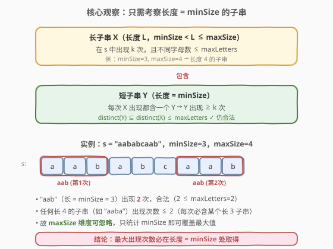
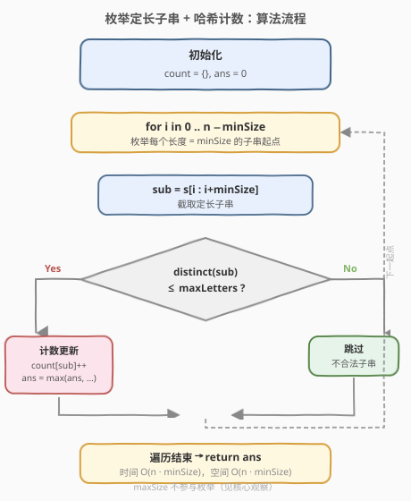
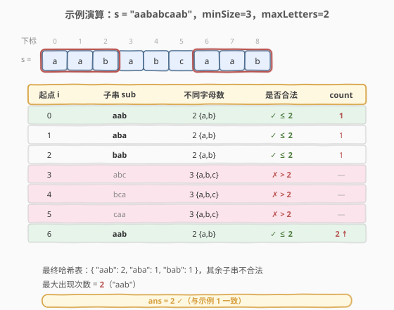

# 子串的最大出现次数

- **题目名称**：子串的最大出现次数
- **链接**：[1297. 子串的最大出现次数](https://leetcode.cn/problems/maximum-number-of-occurrences-of-a-substring/)
- **难度**：中等
- **标签**：字符串、滑动窗口、哈希表、位运算

## 1. 题目概述

给你一个字符串 `s`，返回满足以下条件且**出现次数最大**的任意子串的出现次数：

- 子串中**不同字母**的数目 ≤ `maxLetters`；
- 子串长度 ∈ [`minSize`, `maxSize`]。

**示例 1**：

```text
输入：s = "aababcaab", maxLetters = 2, minSize = 3, maxSize = 4
输出：2
解释：子串 "aab" 出现 2 次，含 2 个不同字母、长度 3，满足所有条件。
```

**示例 2**：

```text
输入：s = "aaaa", maxLetters = 1, minSize = 3, maxSize = 3
输出：2
解释：子串 "aaa" 出现 2 次（允许重叠）。
```

**示例 3**：

```text
输入：s = "aabcabcab", maxLetters = 2, minSize = 2, maxSize = 3
输出：3
```

**示例 4**：

```text
输入：s = "abcde", maxLetters = 2, minSize = 3, maxSize = 3
输出：0
```

**约束条件**：

- `1 <= s.length <= 10^5`
- `1 <= maxLetters <= 26`
- `1 <= minSize <= maxSize <= min(26, s.length)`
- `s` 只包含小写英文字母

> 💡 **重叠是允许的**：示例 2 中两个 `"aaa"` 分别位于下标 0-2 和 1-3，位置可重叠，只要内容相同就累计计数。

---

## 2. 解题思路

### 2.1 暴力思路

枚举所有长度 ∈ [`minSize`, `maxSize`] 的子串，对每个子串检查不同字母数是否 ≤ `maxLetters`，合法者用哈希表累计出现次数，最后取最大值。

子串长度范围最多 26 种（`maxSize - minSize + 1 ≤ 26`），起点 `n` 个，共约 `26n` 个子串；每个子串统计字母需 `O(maxSize)`。总体 `O(26n · maxSize)`，在 `n = 10^5` 时约 `6.7 × 10^7`，偏慢且实现啰嗦。

### 2.2 核心观察：只需考察长度 = `minSize` 的子串



这是本题的关键。`maxSize` 看似需要枚举多种长度，但**完全可以忽略**，理由如下：

> 💡 **越长越难出现**：设长子串 `X`（长度 `L > minSize`）在 `s` 中出现 `k` 次。`X` 的任一长度为 `minSize` 的子串 `Y` 在 `X` 的每次出现中都对应出现一次，因此 `Y` 的出现次数 **≥ `k`**（可能更多，因为 `Y` 还可能在不属于任何 `X` 的位置出现）。

同时，`Y` 是 `X` 的子串，故 `Y` 的字符集合是 `X` 的子集：

$$
\text{distinct}(Y) \subseteq \text{distinct}(X) \le \text{maxLetters}
$$

即 `Y` **仍然合法**。综合两点：

- 长子串能贡献的最大次数，必被某个 `minSize` 长子串**至少**覆盖；
- 故全局最大出现次数一定在长度 = `minSize` 的子串中取得。

> ⚠️ **注意区分**：这里说的是「最大出现次数」必在 `minSize` 取得，不是说 `minSize` 子串一定比 `maxSize` 子串出现得多——而是「≥」。求最大值时，只看 `minSize` 已足够，不会被遗漏。

### 2.3 算法流程图



基于上述观察，算法退化为「枚举定长子串 + 哈希计数」：

1. 初始化哈希表 `count`、答案 `ans = 0`
2. 遍历起点 `i` 从 `0` 到 `n - minSize`：
   - 截取 `sub = s[i : i + minSize]`
   - 计算 `sub` 的不同字母数（可用位掩码 `O(minSize)`，或哈希集合）
   - 若 ≤ `maxLetters`：`count[sub]++`，更新 `ans = max(ans, count[sub])`
3. 返回 `ans`

> 💡 **位掩码统计字母**：`s` 只含小写字母，用 26 位整数 `mask` 记录出现的字母，`mask |= 1 << (c - 'a')`；最后用 `__builtin_popcount(mask)`（C++）或 `bin(mask).count('1')`（Python）得到不同字母数，比哈希集合更轻量。

### 2.4 示例演算

以 `s = "aababcaab", maxLetters = 2, minSize = 3, maxSize = 4` 为例，枚举所有长度 3 的子串：



| 起点 i | 子串 sub | 不同字母 | 合法？ | count 变化 |
|--------|----------|----------|--------|-----------|
| 0 | aab | 2 {a,b} | ✓ | count["aab"] = 1 |
| 1 | aba | 2 {a,b} | ✓ | count["aba"] = 1 |
| 2 | bab | 2 {a,b} | ✓ | count["bab"] = 1 |
| 3 | abc | 3 {a,b,c} | ✗ | 跳过 |
| 4 | bca | 3 {a,b,c} | ✗ | 跳过 |
| 5 | caa | 3 {a,b,c} | ✗ | 跳过 |
| 6 | aab | 2 {a,b} | ✓ | count["aab"] = 2 ↑ |

最终哈希表：`{ "aab": 2, "aba": 1, "bab": 1 }`，最大出现次数 `ans = 2`，与示例 1 一致。

> 💡 注意下标 0-2 和 6-8 的两个 `"aab"` 在原图中用红框标出——它们位置不重叠，但即便重叠（如示例 2 的 `"aaa"`）也照常计数。

---

## 3. 参考代码

### C++

```cpp
class Solution {
  public:
    int maxFreq(string s, int maxLetters, int minSize, int maxSize) {
        unordered_map<string, int> count;
        int n = s.size(), ans = 0;
        for (int i = 0; i + minSize <= n; i++) {
            string sub = s.substr(i, minSize);
            int mask = 0;
            for (char c : sub) mask |= 1 << (c - 'a');
            if (__builtin_popcount(mask) <= maxLetters) {
                ans = max(ans, ++count[sub]);
            }
        }
        return ans;
    }
};
```

### Python

```python
class Solution:
    def maxFreq(self, s: str, maxLetters: int, minSize: int, maxSize: int) -> int:
        count = {}
        n = len(s)
        ans = 0
        for i in range(n - minSize + 1):
            sub = s[i:i + minSize]
            if len(set(sub)) <= maxLetters:
                cnt = count.get(sub, 0) + 1
                count[sub] = cnt
                ans = max(ans, cnt)
        return ans
```

> 💡 Python 中 `len(set(sub))` 简洁直观；若追求常数优化可用位掩码 `mask` 累加后 `bin(mask).count('1')`，但 `minSize ≤ 26`，差异可忽略。

---

## 4. 复杂度分析

| 维度 | 复杂度 | 说明 |
|------|--------|------|
| **时间** | `O(n · minSize)` | 枚举 `n - minSize + 1` 个起点，每个子串截取 + 统计字母为 `O(minSize)`；`maxSize` 不参与枚举 |
| **空间** | `O(n · minSize)` | 最坏情况下所有 `minSize` 子串都合法且互不相同，哈希表存 `O(n)` 个键，每键长 `minSize` |

> ⚠️ **`maxSize` 在复杂度中消失**：正是核心观察的功劳——把 `O(26n · maxSize)` 降到 `O(n · minSize)`。由于 `minSize ≤ 26`，实际约为 `O(26n)`，在 `n = 10^5` 下完全可接受。

---

## 5. 扩展：滑动窗口解法（不推荐但可了解）

也可用滑动窗口维护「窗口内不同字母数 ≤ `maxLetters`」的不变式，对每个合法窗口内的所有 `minSize` 长子串计数。但因窗口长度上界为 `maxSize`（≤ 26），收益有限，且实现比定长枚举更复杂，故本题**定长枚举 + 哈希**为首选。

> 💡 滑动窗口的优势在于「窗口内某种量的最值/计数」问题（如 [3. 无重复字符的最长子串](../0001-0100/3_无重复字符的最长子串.md)、[340. 至多包含 K 个不同字符的最长子串](https://leetcode.cn/problems/longest-substring-with-at-most-k-distinct-characters/)）。本题「枚举定长子串 + 计数」更适合直接枚举，因为目标长度已被 `minSize` 锁定。

---

## 6. 面试要点

1. **为什么可以忽略 `maxSize`？**

   - 长度 `L > minSize` 的子串 `X` 出现 `k` 次时，其任一 `minSize` 长子串 `Y` 出现次数 ≥ `k`，且 `distinct(Y) ⊆ distinct(X) ≤ maxLetters` 仍合法。故最大值必在 `minSize` 处取得，`maxSize` 维度冗余。

2. **「最大出现次数必在 `minSize` 取得」和「`minSize` 子串一定出现得更多」有何区别？**

   - 前者是求最大值时的覆盖性论证：最优解在 `minSize` 集合中存在即可；后者是逐对比较，不成立（`minSize` 子串出现次数仅 `≥` 对应长子串，并非对所有子串都更大）。

3. **位掩码统计字母数为什么可行？**

   - `s` 只含 26 个小写字母，用 `int` 的 26 位即可表示字符集合。`mask |= 1 << (c - 'a')` 累加，`__builtin_popcount` 数 1 的个数即不同字母数，比哈希集合常数更小。

4. **哈希表存子串字符串会不会有内存问题？**

   - 最坏 `O(n)` 个键、每键长 `minSize ≤ 26`，总内存 `O(26n)` 字节量级，`n = 10^5` 时约几 MB，完全可接受。若极致优化可对子串做滚动哈希（参考 [187. 重复的 DNA 序列](../0181-0200/187_重复的DNA序列.md) 的 2 位编码思路），但本题无此必要。

5. **重叠子串是否计数？**

   - 是。题目按「内容」统计出现次数，不要求位置互不重叠。示例 2 的 `"aaa"` 出现于下标 0-2 与 1-3，重叠仍计 2 次。

---

## 7. 同类练习题

- [3. 无重复字符的最长子串](https://leetcode.cn/problems/longest-substring-without-repeating-characters/)（[题解](../0001-0100/3_无重复字符的最长子串.md)）：滑动窗口 + 字符频率判重的母题，本题字母约束的思路源头
- [187. 重复的 DNA 序列](https://leetcode.cn/problems/repeated-dna-sequences/)（[题解](../0101-0200/187_重复的DNA序列.md)）：定长子串 + 哈希计数的同构题，可对照滚动哈希优化
- [340. 至多包含 K 个不同字符的最长子串](https://leetcode.cn/problems/longest-substring-with-at-most-k-distinct-characters/)：「子串不同字母数 ≤ K」的滑动窗口经典，对照本题的字母数约束
- [395. 至少有 K 个重复字符的最长子串](https://leetcode.cn/problems/longest-substring-with-at-least-k-repeating-characters/)（[题解](../0301-0400/395_至少有K个重复字符的最长子串.md)）：子串 + 字符频次约束，分治/滑窗两种视角
- [828. 统计子串中的唯一字符](https://leetcode.cn/problems/count-substrings-with-only-one-distinct-letter/)：子串计数问题，按字符贡献拆解的另一种计数范式
