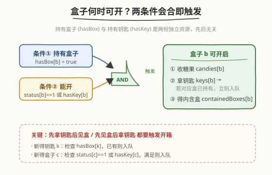
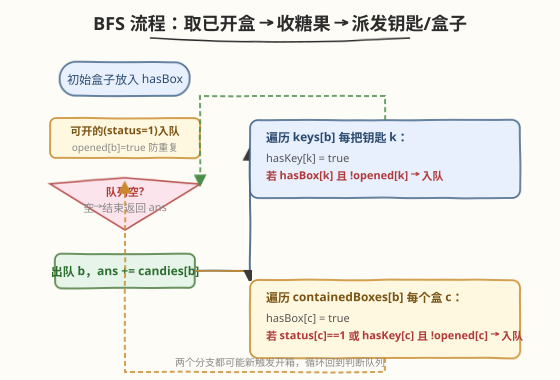
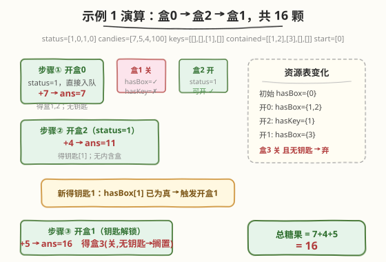

# LeetCode 你能从盒子里获得的最大糖果数 题解

## 1. 题目概述

- **标题 / 题号**：你能从盒子里获得的最大糖果数（#1298，hard）
- **链接**：https://leetcode.cn/problems/maximum-candies-you-can-get-from-boxes/
- **难度**：困难
- **标签**：广度优先搜索、图、状态传播、队列

**题意**：给定 $n$ 个盒子，每个盒子的格式为 `[status, candies, keys, containedBoxes]`：

- `status[i]`：`1` 表示盒子 `i` 初始就是开的，`0` 表示关着的。
- `candies[i]`：盒子 `i` 里的糖果数。
- `keys[i]`：打开盒子 `i` 后能获得的钥匙列表，每把钥匙是某个盒子的下标。
- `containedBoxes[i]`：盒子 `i` 内部装着的其他盒子下标列表。

再给你 `initialBoxes`：一开始就持有的盒子下标。规则是：

1. 只能拿走**已打开盒子**里的糖果；
2. 打开一个盒子后，可用其中钥匙去开别的盒子，也可取出其中内含的盒子继续使用。

求能获得的糖果**最大数目**。

**示例 1**：

```text
输入：status = [1,0,1,0], candies = [7,5,4,100],
      keys = [[],[],[1],[]], containedBoxes = [[1,2],[3],[],[]],
      initialBoxes = [0]
输出：16
解释：开盒0 得 7 颗 + 盒1、盒2。盒1 关且无钥匙，先开盒2 得 4 颗 + 盒1 钥匙。
      用钥匙开盒1 得 5 颗 + 盒3。盒3 关且无钥匙，搁置。共 7+4+5=16。
```

**示例 2**：

```text
输入：status = [1,0,0,0,0,0], candies = [1,1,1,1,1,1],
      keys = [[1,2,3,4,5],[],[],[],[],[]], containedBoxes = [[1,2,3,4,5],[],[],[],[],[]],
      initialBoxes = [0]
输出：6
解释：开盒0 一次性得到盒1~5 及其全部钥匙，依次全开，共 6 颗。
```

**示例 3**：

```text
输入：status = [1,1,1], candies = [100,1,100], keys = [[],[0,2],[]],
      containedBoxes = [[],[],[]], initialBoxes = [1]
输出：1
解释：只持有盒1，开它得 1 颗 + 盒0、盒2 的钥匙，但不持有这两个盒子，钥匙无用。共 1。
```

**约束**：

- $1 \le \text{status.length} \le 1000$
- `status.length == candies.length == keys.length == containedBoxes.length`
- `status[i]` 为 `0` 或 `1`；$1 \le \text{candies}[i] \le 1000$
- `keys[i]` / `containedBoxes[i]` 内值互不相同且在 $[0, n)$ 内
- 每个盒子最多被一个盒子包含；`initialBoxes` 中下标互不相同

> 💡 本题是 **「资源会合触发」型 BFS** 的招牌题：一个盒子能否开，取决于两份独立资源——**持有该盒**与**能开它**（本身是开的或持有其钥匙）——是否同时满足。两者到手的先后无关，谁后到谁负责「触发开箱」。

## 2. 解题思路

### 2.1 暴力思路：反复扫描直到无变化

最直觉的做法：维护「已持有盒子集」和「已持有钥匙集」，然后**多轮扫描**所有持有的盒子——只要发现某个盒子现在可开（持有且能开），就开它、收集糖果、把新钥匙和新盒子并入集合；重复多轮直到某一轮没有任何新盒子被打开。

```text
repeat:
    changed = false
    for each held box b not yet opened:
        if hasBox[b] and (status[b]==1 or hasKey[b]):
            open b; collect candies; gain keys & contained boxes
            changed = true
until not changed
```

正确性没问题，但每轮都要遍历全部持有盒子，最坏 $O(n^2)$。其实「开盒」这一动作天然是**事件驱动**的：只有当某个盒子**新变为可开**时才需要处理它，用队列把「新可开的盒子」排成一条流水线即可。

### 2.2 核心观察：两条件会合即触发



把开盒条件拆成两条独立资源：

- **条件① 持有盒子** `hasBox[b]`：要么来自 `initialBoxes`，要么来自某个已开盒子的 `containedBoxes`。
- **条件② 能开** `status[b]==1 或 hasKey[b]`：`status` 是盒子固有属性；`hasKey[b]` 来自某个已开盒子的 `keys`。

当两个条件**首次同时为真**时，盒子 $b$ 变为可开，立即入队处理。关键在于「谁后到谁触发」——必须**双向检查**：

> ⚠️ **常见 bug**：只在「拿到盒子」时判断能否开，遗漏了「先有盒子后拿钥匙」的情形。例如示例 1 中盒1 先被持有（关着、无钥匙），直到开盒2 才拿到盒1 的钥匙——此刻必须回头检查「盒1 是否已持有」并触发开箱。对称地，拿到钥匙时要查 `hasBox`，拿到盒子时要查 `status/hasKey`。

用一个 `opened[b]` 标记「是否已入队/已处理」，保证每盒糖果只收一次。BFS 队列里装的全是「确定可开、待处理」的盒子，逐个出队即可。

> 💡 本题**不是最短路**（无需按层计数），所以用普通 FIFO 队列甚至栈都行——只要把「新可开的盒子」排成待处理序列，处理顺序不影响糖果总数。BFS 的本质是**传播**：开一个盒子 → 释放新钥匙/新盒子 → 可能触发更多盒子可开，直到队列空。

### 2.3 算法流程图



文字版步骤：

1. 初始化 `hasBox`、`hasKey`、`opened` 三个布尔数组（长度 $n$）。
2. 把 `initialBoxes` 全部标记 `hasBox=true`。
3. 扫描初始持有的盒子：若 `status[b]==1`（此时还没钥匙，等价于条件②成立），标记 `opened[b]=true` 并入队。
4. BFS 主循环：
   - 队列空 → 结束，返回 `ans`。
   - 出队 `b`：`ans += candies[b]`。
   - 遍历 `keys[b]` 每把钥匙 `k`：置 `hasKey[k]=true`；若 `hasBox[k] && !opened[k]`，则 `opened[k]=true` 并入队 `k`。
   - 遍历 `containedBoxes[b]` 每个盒 `c`：置 `hasBox[c]=true`；若 `!opened[c] && (status[c]==1 || hasKey[c])`，则 `opened[c]=true` 并入队 `c`。

### 2.4 示例演算

以示例 1 为例，`status=[1,0,1,0]`，`candies=[7,5,4,100]`，`keys=[[],[],[1],[]]`，`containedBoxes=[[1,2],[3],[],[]]`，`initialBoxes=[0]`：



| 步骤 | 出队盒 | 动作 | 糖果累加 | 资源变化 |
|------|--------|------|----------|----------|
| ① | 盒0 | `status=1` 直接入队；收糖果 | `ans=7` | 得盒1、盒2；盒1 关且无钥匙→搁置，盒2 `status=1`→入队 |
| ② | 盒2 | 收糖果 | `ans=11` | 得钥匙1；查 `hasBox[1]=true` → 触发开盒1，入队 |
| ③ | 盒1 | 钥匙解锁；收糖果 | `ans=16` | 得盒3；盒3 关且无钥匙→搁置 |

队列为空，返回 `16`。盒3 因永远凑不齐条件②而最终未开——这正是双向检查保证「不漏开任何凑齐条件的盒」的体现。

## 3. 参考代码

### C++

```cpp
class Solution {
  public:
    int maxCandies(vector<int>& status, vector<int>& candies,
                   vector<vector<int>>& keys, vector<vector<int>>& containedBoxes,
                   vector<int>& initialBoxes) {
        int n = status.size();
        vector<char> hasBox(n, 0), hasKey(n, 0), opened(n, 0);
        queue<int> q;

        for (int b : initialBoxes) hasBox[b] = 1;
        for (int b : initialBoxes) {
            if (status[b] == 1) {          // 初始就能开（此刻尚无钥匙）
                opened[b] = 1;
                q.push(b);
            }
        }

        int ans = 0;
        while (!q.empty()) {
            int b = q.front(); q.pop();
            ans += candies[b];
            for (int k : keys[b]) {
                hasKey[k] = 1;
                if (hasBox[k] && !opened[k]) {      // 先有盒后拿钥匙：触发开箱
                    opened[k] = 1;
                    q.push(k);
                }
            }
            for (int c : containedBoxes[b]) {
                hasBox[c] = 1;
                if (!opened[c] && (status[c] == 1 || hasKey[c])) {  // 先有钥匙后见盒：触发开箱
                    opened[c] = 1;
                    q.push(c);
                }
            }
        }
        return ans;
    }
};
```

### Python

```python
from collections import deque

class Solution:
    def maxCandies(self, status: List[int], candies: List[int],
                   keys: List[List[int]], containedBoxes: List[List[int]],
                   initialBoxes: List[int]) -> int:
        n = len(status)
        has_box = [False] * n
        has_key = [False] * n
        opened = [False] * n
        q = deque()

        for b in initialBoxes:
            has_box[b] = True
        for b in initialBoxes:
            if status[b] == 1:                  # 初始就能开
                opened[b] = True
                q.append(b)

        ans = 0
        while q:
            b = q.popleft()
            ans += candies[b]
            for k in keys[b]:
                has_key[k] = True
                if has_box[k] and not opened[k]:            # 先有盒后拿钥匙
                    opened[k] = True
                    q.append(k)
            for c in containedBoxes[b]:
                has_box[c] = True
                if not opened[c] and (status[c] == 1 or has_key[c]):  # 先有钥匙后见盒
                    opened[c] = True
                    q.append(c)
        return ans
```

> 💡 **`opened` 的双重职责**：既防重复入队，又保证每盒糖果只收一次。标记时机选在**入队时**而非出队时——这样同一盒子在被钥匙/盒子两个分支同时触发时只会入队一次。若改成出队时才标记，可能在同层被两次入队（虽不影响正确性，但多一次处理）。

> ⚠️ **不要修改 `status` 数组代替 `hasKey`**：一种偷懒写法是拿到钥匙后把 `status[k]=1`。逻辑等价且能省一个数组，但破坏了输入、语义不清（分不清「原本就开」和「钥匙开的」），面试中不推荐。这里用独立 `hasKey` 表达更清晰。

## 4. 复杂度分析

| 维度 | 复杂度 | 说明 |
|------|--------|------|
| **时间** | $O(n + K + C)$ | 每个盒子至多入队一次（出队处理一次）；$K = \sum|\text{keys}[i]|$ 为钥匙总数，$C = \sum|\text{containedBoxes}[i]|$ 为内含关系总数，遍历各一次 |
| **空间** | $O(n)$ | 三个布尔数组 `hasBox`/`hasKey`/`opened` 各 $O(n)$；队列最坏存 $O(n)$ 个盒子 |

> 💡 由于每个盒子只被开一次、每把钥匙/每条内含关系只被处理一次，总工作量线性于「盒子数 + 钥匙数 + 内含边数」。约束里每盒的 `keys`/`containedBoxes` 内值互不相同且每盒最多被一个盒子包含，故 $K, C = O(n^2)$ 上界宽松但实际远小，整体仍是线性级遍历。

## 5. 扩展：为何不是最短路 / 状态压缩

- **不需要按层计数**：本题求糖果总数而非最少步数，队列里只是「待开盒子」的待办列表，处理顺序不影响结果。因此无需记录层数，普通队列即可；甚至用栈（DFS 式）也对。这与 [1293. 网格中的最短路径](1293_网格中的最短路径.md)（必须 BFS 按层求最短步数）形成对照。
- **不需要状态压缩**：本题的「资源」是两份集合（盒子、钥匙），但**不需要枚举所有组合**——每个盒子是否可开只取决于自身两个布尔值，互相独立。对比 [864. 获取所有钥匙的最短路径](https://leetcode.cn/problems/shortest-path-to-get-all-keys/)：那里位置 + 钥匙持有子集耦合在一起决定可达性，必须用位掩码进状态做 BFS；本题的「会合触发」更简单，事件驱动即可。
- **图视角**：把「开盒」看作节点激活，钥匙和内含关系看作有向边，本题本质是在一张依赖图上做**拓扑式传播**——只要入度条件（持有 + 能开）凑齐就激活，类似 [207. 课程表](../0201-0300/207_课程表.md) 的拓扑排序中「入度归零即入队」。

## 6. 面试要点

1. **为什么必须双向检查（拿钥匙查盒子、拿盒子查钥匙）？**

   > 因为两份资源到手的先后不确定。若只在「拿到盒子」时判断能否开，会漏掉「先持有关着的盒子、后从别处拿到钥匙」的情形（示例 1 的盒1 正是此路）。对称地，拿到钥匙时也要查对应盒子是否已在手上。任一资源后到时触发开箱，才能不漏。

2. **`opened` 标记为什么在入队时设、而非出队时设？**

   > 防止同一盒子被钥匙分支和盒子分支在同层重复入队。入队即标记，后续另一分支看到 `opened=true` 直接跳过，保证每盒只入队一次、糖果只收一次。出队时才标记的话，虽不影响最终答案，但可能多一次冗余入队与处理。

3. **初始盒子是关着的、且永远拿不到钥匙，会怎样？**

   > 它会留在 `hasBox=true` 但 `opened` 始终为 `false`，从不入队，糖果不计入。这正是正确行为——凑不齐条件②的盒子不该开。示例 1 的盒3、示例 3 中拿到钥匙却不持有的盒0/盒2 都属此类。

4. **能否用 DFS（栈）代替 BFS（队列）？**

   > 可以。本题只求糖果总数，处理顺序不影响结果，栈和队列都只是「待开盒子」的待办容器，差别仅在顺序。习惯上用队列更贴近「传播」语义，且与同类图遍历题一致。

5. **时间复杂度为什么是线性级？**

   > 每个盒子至多入队一次，出队时遍历它的 `keys` 和 `containedBoxes` 各一次；每把钥匙、每条内含关系全局只被遍历一次（归属在唯一一个盒子里）。故总工作量正比于盒子数加钥匙数加内含边数，是线性级遍历，非平方。

> 💡 **一句话总结**：1298 是 **「资源会合触发」型 BFS**——把开盒条件拆成「持有盒子」与「能开它」两份独立资源，谁后到谁触发开箱，队列里只装确定可开的盒子逐个处理。记住双向检查（拿钥匙查 `hasBox`、拿盒子查 `status/hasKey`），就能不漏开任何凑齐条件的盒子。

## 同类练习题

| # | 题目 | 与本题的关联 |
|---|------|-------------|
| 1293 | [网格中的最短路径](https://leetcode.cn/problems/shortest-path-in-a-grid-with-obstacles-elimination/)（[题解](1293_网格中的最短路径.md)） | 状态增维 BFS，对照本题「无需状态压缩、事件驱动即可」的差异 |
| 864 | [获取所有钥匙的最短路径](https://leetcode.cn/problems/shortest-path-to-get-all-keys/) | 钥匙位掩码进状态的 BFS，对照本题「钥匙只需布尔、无需枚举子集」的简化 |
| 207 | [课程表](https://leetcode.cn/problems/course-schedule/)（[题解](../0201-0300/207_课程表.md)） | 拓扑排序「入度归零即入队」的传播范式，与本题「条件会合即入队」同构 |
| 994 | [腐烂的橘子](https://leetcode.cn/problems/rotting-oranges/)（[题解](../0901-1000/994_腐烂的橘子.md)） | 多源 BFS 传播，对照本题「单源事件驱动」与「多源按层扩散」的异同 |
| 690 | [员工的重要性](https://leetcode.cn/problems/employee-importance/) | BFS/DFS 遍历下属并累加值，与本题「开盒累加糖果 + 释放子盒」结构相近 |
